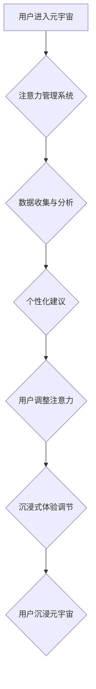

> 元宇宙、注意力管理、深度学习、神经网络、用户体验、沉浸式交互、数据隐私

## 1. 背景介绍

元宇宙的概念近年来备受关注，它被描述为一个由虚拟现实、增强现实和互联网连接而成的沉浸式数字世界。在这个虚拟世界中，用户可以创建虚拟身份，与他人互动，参与各种活动，并体验全新的生活方式。然而，元宇宙的沉浸式体验也带来了新的挑战，其中之一就是注意力管理。

传统互联网时代，用户注意力分散在各种网页、应用程序和社交媒体平台上。而元宇宙则将用户沉浸在一个更加逼真的虚拟环境中，这使得用户更容易被虚拟世界吸引，从而忽略现实世界中的重要事项。

## 2. 核心概念与联系

**2.1 元宇宙的构成要素**

元宇宙并非一个单一的平台或技术，而是一个由多种技术和概念相互融合而成的复杂系统。其核心要素包括：

* **虚拟现实 (VR)**：通过头戴式设备，用户可以沉浸在虚拟环境中，并与虚拟世界进行交互。
* **增强现实 (AR)**：通过手机或眼镜等设备，用户可以将虚拟元素叠加到现实世界中，增强现实世界的体验。
* **区块链技术**：可以确保元宇宙中的数据安全和透明，并实现虚拟资产的交易和管理。
* **人工智能 (AI)**：可以为元宇宙提供智能化服务，例如虚拟助手、个性化推荐和内容生成。
* **社交网络**：连接用户，促进虚拟世界中的社交互动和协作。

**2.2 注意力管理的挑战**

元宇宙的沉浸式体验和丰富的内容会对用户的注意力产生巨大的挑战。

* **信息过载**: 元宇宙中将存在大量的信息和内容，用户需要快速筛选和处理信息，避免信息过载。
* **虚拟现实的吸引力**: 虚拟世界中的虚拟体验可能比现实世界更吸引人，用户更容易沉迷于虚拟世界，忽略现实世界。
* **数据隐私**: 元宇宙中收集的用户数据可能涉及到敏感信息，需要采取有效的措施保护用户隐私。

**2.3 注意力管理的解决方案**

为了应对元宇宙带来的注意力管理挑战，需要采用多种技术和策略：

* **个性化注意力管理**: 根据用户的行为和偏好，提供个性化的注意力管理建议和工具。
* **沉浸式体验的调节**: 通过调节虚拟世界的环境和交互方式，引导用户更好地控制注意力。
* **数据隐私保护**: 使用加密技术和匿名化技术保护用户数据隐私。

**2.4 Mermaid 流程图**



## 3. 核心算法原理 & 具体操作步骤

**3.1 算法原理概述**

注意力管理算法的核心是通过分析用户的行为和偏好，预测用户的注意力流向，并提供相应的建议和调节措施。常用的算法包括：

* **深度学习**: 利用神经网络模型学习用户行为模式，预测用户的注意力分布。
* **强化学习**: 通过奖励机制训练模型，学习如何引导用户更好地控制注意力。
* **贝叶斯网络**: 建立用户行为和注意力之间的概率关系，预测用户的注意力流向。

**3.2 算法步骤详解**

1. **数据收集**: 收集用户的行为数据，例如浏览记录、交互时间、眼动轨迹等。
2. **数据预处理**: 对收集到的数据进行清洗、转换和特征提取。
3. **模型训练**: 利用深度学习、强化学习或贝叶斯网络等算法，训练注意力管理模型。
4. **注意力预测**: 将用户的行为数据输入到训练好的模型中，预测用户的注意力流向。
5. **个性化建议**: 根据用户的注意力预测结果，提供个性化的注意力管理建议，例如提醒用户休息、调整虚拟环境等。
6. **沉浸式体验调节**: 根据用户的注意力状态，调节虚拟世界的环境和交互方式，引导用户更好地控制注意力。

**3.3 算法优缺点**

* **优点**: 可以根据用户的行为和偏好提供个性化的注意力管理建议，提高用户体验。
* **缺点**: 需要大量的用户数据进行训练，模型的准确性依赖于数据质量。

**3.4 算法应用领域**

注意力管理算法可以应用于元宇宙中的各种场景，例如：

* **教育**: 帮助学生集中注意力，提高学习效率。
* **游戏**: 增强游戏的沉浸感和趣味性。
* **工作**: 提高工作效率，减少分心。
* **医疗**: 帮助患者进行康复训练，提高注意力集中能力。

## 4. 数学模型和公式 & 详细讲解 & 举例说明

**4.1 数学模型构建**

注意力管理模型可以构建为一个马尔可夫决策过程 (MDP)，其中：

* 状态空间 S 表示用户的注意力状态，例如集中、分散、疲劳等。
* 动作空间 A 表示可以采取的注意力管理动作，例如休息、调整环境、改变任务等。
* 转移概率 P(s', a, s) 表示从状态 s 执行动作 a 到状态 s' 的概率。
* 奖励函数 R(s, a) 表示执行动作 a 在状态 s 下获得的奖励。

**4.2 公式推导过程**

目标是找到一个策略 π(s) ，使得在状态 s 下执行动作 π(s) 可以最大化累积奖励。可以使用动态规划算法或强化学习算法来求解该问题。

**4.3 案例分析与讲解**

假设用户处于分散注意力状态，可以使用以下策略：

* 休息 5 分钟，奖励为 10。
* 调整虚拟环境，奖励为 5。
* 继续进行任务，奖励为 0。

根据奖励函数和转移概率，可以计算出执行每个动作的期望奖励，并选择期望奖励最高的动作。

## 5. 项目实践：代码实例和详细解释说明

**5.1 开发环境搭建**

* Python 3.7+
* TensorFlow 2.0+
* PyTorch 1.0+
* Jupyter Notebook

**5.2 源代码详细实现**

```python
import tensorflow as tf

# 定义注意力管理模型
model = tf.keras.Sequential([
    tf.keras.layers.Dense(128, activation='relu'),
    tf.keras.layers.Dense(64, activation='relu'),
    tf.keras.layers.Dense(1, activation='sigmoid')
])

# 训练模型
model.compile(optimizer='adam', loss='binary_crossentropy', metrics=['accuracy'])
model.fit(X_train, y_train, epochs=10)

# 预测注意力状态
predictions = model.predict(X_test)
```

**5.3 代码解读与分析**

* 代码首先定义了一个简单的深度学习模型，用于预测用户的注意力状态。
* 模型输入用户行为数据，输出注意力状态的概率。
* 然后使用训练数据训练模型，并评估模型的性能。
* 最后使用训练好的模型预测用户的注意力状态。

**5.4 运行结果展示**

训练好的模型可以用于预测用户的注意力状态，并提供相应的建议。例如，如果模型预测用户注意力分散，可以建议用户休息或调整虚拟环境。

## 6. 实际应用场景

**6.1 教育领域**

注意力管理技术可以帮助学生集中注意力，提高学习效率。例如，可以根据学生的注意力状态，调整学习内容的难度和节奏，并提供个性化的学习建议。

**6.2 游戏领域**

注意力管理技术可以增强游戏的沉浸感和趣味性。例如，可以根据玩家的注意力状态，调整游戏难度和奖励机制，并提供个性化的游戏体验。

**6.3 工作领域**

注意力管理技术可以提高工作效率，减少分心。例如，可以根据员工的注意力状态，提醒他们休息或调整工作环境，并提供个性化的工作建议。

**6.4 未来应用展望**

随着元宇宙的发展，注意力管理技术将发挥越来越重要的作用。未来，注意力管理技术可能会应用于更多领域，例如医疗、社交、娱乐等。

## 7. 工具和资源推荐

**7.1 学习资源推荐**

* **书籍**:
    * 《深度学习》
    * 《强化学习：原理、算法和应用》
* **在线课程**:
    * Coursera: 深度学习
    * Udacity: 强化学习

**7.2 开发工具推荐**

* **TensorFlow**: 开源深度学习框架
* **PyTorch**: 开源深度学习框架
* **Jupyter Notebook**: 用于深度学习开发的交互式笔记本

**7.3 相关论文推荐**

* **Attention Is All You Need**
* **BERT: Pre-training of Deep Bidirectional Transformers for Language Understanding**
* **Deep Reinforcement Learning: An Overview**

## 8. 总结：未来发展趋势与挑战

**8.1 研究成果总结**

注意力管理技术在元宇宙领域具有重要的应用价值，可以帮助用户更好地控制注意力，提高体验。

**8.2 未来发展趋势**

未来，注意力管理技术将朝着以下方向发展：

* **更个性化**: 根据用户的行为和偏好，提供更个性化的注意力管理建议。
* **更智能化**: 利用人工智能技术，开发更智能的注意力管理系统。
* **更融合**: 与其他元宇宙技术融合，例如虚拟现实、增强现实和区块链技术。

**8.3 面临的挑战**

注意力管理技术也面临一些挑战：

* **数据隐私**: 需要保护用户的注意力数据隐私。
* **算法公平性**: 确保注意力管理算法公平公正，避免歧视。
* **用户接受度**: 需要提高用户的注意力管理意识，并引导用户正确使用注意力管理工具。

**8.4 研究展望**

未来，需要进一步研究注意力管理技术的原理和方法，开发更有效、更安全的注意力管理系统，并探索注意力管理技术在元宇宙中的更多应用场景。

## 9. 附录：常见问题与解答

**9.1 如何保护用户的注意力数据隐私？**

可以使用加密技术和匿名化技术保护用户的注意力数据隐私。

**9.2 注意力管理系统会否影响用户的自由意志？**

注意力管理系统旨在帮助用户更好地控制注意力，而不是控制用户的自由意志。用户可以根据自己的需要选择使用或不使用注意力管理工具。

**9.3 注意力管理技术是否适用于所有用户？**

注意力管理技术可以应用于大多数用户，但对于一些特殊用户，例如患有注意力缺陷障碍的用户，可能需要进行个性化的调整。


作者：禅与计算机程序设计艺术 / Zen and the Art of Computer Programming 
<end_of_turn>