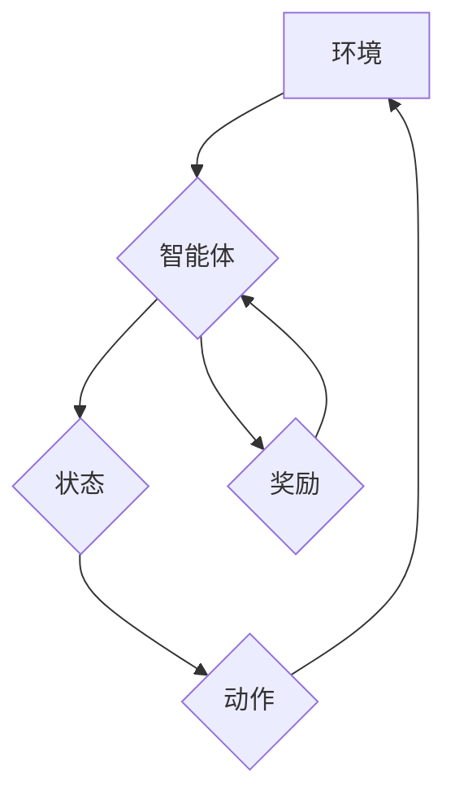

> 深度强化学习，深度神经网络，强化学习，Q学习，价值函数，策略梯度，环境交互，代码实例

## 1. 背景介绍

深度强化学习 (Deep Reinforcement Learning, DRL) 作为人工智能领域的一支新兴力量，近年来取得了令人瞩目的成就。它将深度学习和强化学习相结合，赋予智能体学习复杂环境、做出最佳决策的能力。

强化学习 (Reinforcement Learning, RL) 是一种机器学习范式，其中智能体通过与环境交互，学习策略以最大化累积奖励。深度学习 (Deep Learning) 则利用多层神经网络，能够学习复杂、非线性映射关系。

DRL 的核心思想是训练一个深度神经网络作为智能体的策略或价值函数，通过与环境的交互，不断调整网络参数，使其能够在环境中取得最佳的回报。

DRL 在许多领域展现出巨大的潜力，例如：

* **游戏 AI:** AlphaGo、AlphaStar 等程序通过 DRL 击败了人类世界冠军，展现了其强大的决策能力。
* **机器人控制:** DRL 可以训练机器人完成复杂的任务，例如导航、抓取、组装等。
* **自动驾驶:** DRL 可以帮助自动驾驶汽车学习驾驶规则，并做出安全、高效的决策。
* **医疗保健:** DRL 可以用于辅助诊断、个性化治疗方案推荐等。

## 2. 核心概念与联系

**2.1 强化学习核心概念**

* **智能体 (Agent):** 与环境交互并做出决策的实体。
* **环境 (Environment):** 智能体所处的外部世界，提供状态信息和奖励信号。
* **状态 (State):** 环境的当前情况，描述环境的特征。
* **动作 (Action):** 智能体可以采取的行动，改变环境状态。
* **奖励 (Reward):** 环境对智能体动作的反馈，可以是正向或负向。
* **策略 (Policy):** 智能体根据当前状态选择动作的规则。
* **价值函数 (Value Function):** 评估某个状态或状态-动作对的长期回报。

**2.2 深度强化学习核心概念**

* **深度神经网络 (Deep Neural Network):** 用于表示策略或价值函数的复杂模型。
* **监督学习 (Supervised Learning):** 使用标注数据训练深度神经网络。
* **无监督学习 (Unsupervised Learning):** 从未标注数据中学习模式和结构。
* **强化学习 (Reinforcement Learning):** 通过与环境交互，学习策略以最大化累积奖励。

**2.3 DRL 架构**



## 3. 核心算法原理 & 具体操作步骤

### 3.1 算法原理概述

DRL 算法的核心是通过训练一个深度神经网络来学习策略或价值函数。常用的 DRL 算法包括：

* **Q 学习 (Q-Learning):** 学习一个 Q 表，表示每个状态-动作对的期望回报。
* **策略梯度 (Policy Gradient):** 直接优化策略参数，使其能够最大化累积奖励。
* **深度 Q 网络 (DQN):** 将 Q 学习与深度神经网络结合，能够学习复杂环境中的策略。
* **双深度 Q 网络 (Double DQN):** 缓解 DQN 中的过估计问题。
* **优先经验回放 (Prioritized Experience Replay):** 优先回放重要经验，加速学习过程。

### 3.2 算法步骤详解

以 Q 学习为例，其基本步骤如下：

1. 初始化 Q 表，将所有状态-动作对的 Q 值设置为 0。
2. 在环境中与智能体交互，收集状态、动作、奖励和下一个状态的信息。
3. 使用 Bellman 方程更新 Q 值：

```
Q(s, a) = Q(s, a) + α [r + γ max Q(s', a') - Q(s, a)]
```

其中：

* α 是学习率，控制学习速度。
* γ 是折扣因子，控制未来奖励的权重。
* r 是当前奖励。
* s' 是下一个状态。
* a' 是下一个状态的动作。

4. 重复步骤 2 和 3，直到 Q 表收敛。

### 3.3 算法优缺点

**优点:**

* 能够学习复杂环境中的策略。
* 能够处理连续动作空间。
* 能够利用经验回放加速学习。

**缺点:**

* 训练过程可能很慢。
* 需要大量的训练数据。
* 容易陷入局部最优解。

### 3.4 算法应用领域

* 游戏 AI
* 机器人控制
* 自动驾驶
* 医疗保健
* 金融投资

## 4. 数学模型和公式 & 详细讲解 & 举例说明

### 4.1 数学模型构建

DRL 的核心数学模型是价值函数和策略函数。

* **价值函数 (Value Function):** 评估某个状态或状态-动作对的长期回报。

* **策略函数 (Policy Function):** 根据当前状态选择动作的概率分布。

### 4.2 公式推导过程

**4.2.1 Bellman 方程:**

Bellman 方程是强化学习的核心公式，用于更新价值函数。

```
V(s) = max_a [R(s, a) + γ V(s')]
```

其中：

* V(s) 是状态 s 的价值函数。
* R(s, a) 是状态 s 下采取动作 a 的奖励。
* γ 是折扣因子。
* V(s') 是下一个状态 s' 的价值函数。

**4.2.2 策略梯度公式:**

策略梯度算法的目标是最大化累积奖励，可以通过梯度上升法更新策略参数。

```
θ = θ + α ∇θ J(θ)
```

其中：

* θ 是策略参数。
* α 是学习率。
* J(θ) 是策略函数的奖励函数。
* ∇θ J(θ) 是奖励函数对策略参数的梯度。

### 4.3 案例分析与讲解

**4.3.1 CartPole 环境:**

CartPole 环境是一个经典的强化学习环境，其中一个车在轨道上移动，需要通过控制车轮的角度来保持平衡。

在 CartPole 环境中，智能体可以采取两个动作：向左转动车轮或向右转动车轮。奖励函数为：

* 当车保持平衡时，奖励为 1。
* 当车失去平衡时，奖励为 0。

通过训练 DQN 算法，智能体可以学习到保持平衡的策略。

## 5. 项目实践：代码实例和详细解释说明

### 5.1 开发环境搭建

* Python 3.x
* TensorFlow 或 PyTorch
* OpenAI Gym

### 5.2 源代码详细实现

```python
import gym
import tensorflow as tf

# 定义 DQN 网络
class DQN(tf.keras.Model):
    def __init__(self, state_size, action_size):
        super(DQN, self).__init__()
        self.dense1 = tf.keras.layers.Dense(64, activation='relu')
        self.dense2 = tf.keras.layers.Dense(64, activation='relu')
        self.output = tf.keras.layers.Dense(action_size)

    def call(self, state):
        x = self.dense1(state)
        x = self.dense2(x)
        return self.output(x)

# 创建 DQN 实例
model = DQN(state_size=4, action_size=2)

# 定义损失函数和优化器
loss_fn = tf.keras.losses.MeanSquaredError()
optimizer = tf.keras.optimizers.Adam(learning_rate=0.001)

# 训练循环
for episode in range(1000):
    state = env.reset()
    done = False
    total_reward = 0

    while not done:
        # 选择动作
        action = tf.argmax(model(tf.expand_dims(state, axis=0))).numpy()[0]

        # 执行动作并获取奖励和下一个状态
        next_state, reward, done, _ = env.step(action)

        # 更新 Q 值
        with tf.GradientTape() as tape:
            target_q = reward + gamma * tf.reduce_max(model(tf.expand_dims(next_state, axis=0)))
            q_value = model(tf.expand_dims(state, axis=0))
            loss = loss_fn(target_q, q_value)

        # 反向传播并更新参数
        gradients = tape.gradient(loss, model.trainable_variables)
        optimizer.apply_gradients(zip(gradients, model.trainable_variables))

        # 更新状态
        state = next_state

        # 更新总奖励
        total_reward += reward

    print(f"Episode {episode+1}, Total Reward: {total_reward}")

```

### 5.3 代码解读与分析

* **DQN 网络:** 定义了一个简单的深度神经网络，用于估计状态-动作对的 Q 值。
* **损失函数:** 使用均方误差作为损失函数，最小化预测 Q 值与目标 Q 值之间的差异。
* **优化器:** 使用 Adam 优化器更新网络参数。
* **训练循环:** 训练循环中，智能体与环境交互，收集经验，并更新 Q 值。

### 5.4 运行结果展示

训练完成后，智能体能够在 CartPole 环境中保持平衡，并获得较高的奖励。

## 6. 实际应用场景

### 6.1 游戏 AI

* AlphaGo、AlphaStar 等程序通过 DRL 击败了人类世界冠军，展现了其强大的决策能力。

### 6.2 机器人控制

* DRL 可以训练机器人完成复杂的任务，例如导航、抓取、组装等。

### 6.3 自动驾驶

* DRL 可以帮助自动驾驶汽车学习驾驶规则，并做出安全、高效的决策。

### 6.4 医疗保健

* DRL 可以用于辅助诊断、个性化治疗方案推荐等。

### 6.5 金融投资

* DRL 可以用于股票预测、风险管理等。

## 7. 工具和资源推荐

### 7.1 学习资源推荐

* **书籍:**
    * Deep Reinforcement Learning Hands-On
    * Reinforcement Learning: An Introduction
* **课程:**
    * Deep Reinforcement Learning Specialization (Coursera)
    * Reinforcement Learning (Udacity)
* **博客:**
    * OpenAI Blog
    * DeepMind Blog

### 7.2 开发工具推荐

* **TensorFlow:** 深度学习框架
* **PyTorch:** 深度学习框架
* **OpenAI Gym:** 强化学习环境库

### 7.3 相关论文推荐

* Deep Q-Network (DQN)
* Double Deep Q-Network (Double DQN)
* Prioritized Experience Replay
* Policy Gradient Methods for Reinforcement Learning

## 8. 总结：未来发展趋势与挑战

### 8.1 研究成果总结

DRL 在过去几年取得了显著进展，在许多领域展现出巨大的潜力。

### 8.2 未来发展趋势

* **更强大的算法:** 研究更强大的 DRL 算法，能够学习更复杂的环境和任务。
* **更有效的训练方法:** 研究更有效的训练方法，例如迁移学习、联邦学习等。
* **更广泛的应用:** 将 DRL 应用到更多领域，例如医疗保健、教育、金融等。

### 8.3 面临的挑战

* **样本效率:** DRL 算法通常需要大量的训练数据，这在某些领域可能难以获得。
* **可解释性:** DRL 算法的决策过程往往难以解释，这可能