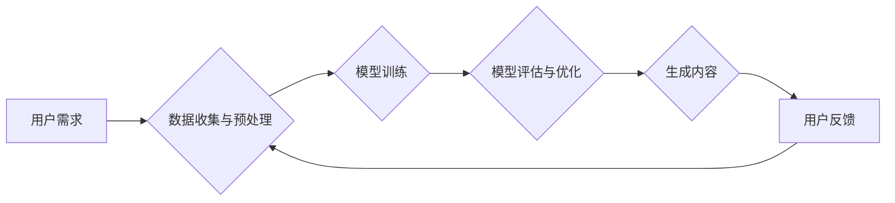

> 生成式AI, 
> 大模型, 
> 商业应用, 
> 价值评估, 
> 技术趋势

## 1. 背景介绍

近年来，生成式人工智能（Generative AI）技术蓬勃发展，以其强大的文本、图像、音频等多模态生成能力，引发了广泛的关注和热议。从ChatGPT的爆火到DALL-E 2的惊艳表现，生成式AI似乎一夜之间成为了科技界的宠儿，被誉为“第四次工业革命”的催化剂。然而，在兴奋与期待之外，也伴随着对该技术的质疑和担忧。

生成式AI究竟是颠覆性的创新，还是昙花一现的泡沫？其商业价值如何体现？未来发展趋势如何？这些问题迫切需要深入探讨。

本系列文章将从商业本质出发，深入分析生成式AI的技术原理、应用场景、价值评估以及未来发展趋势，帮助读者理清思路，洞悉生成式AI的本质，并为其在商业领域的应用提供参考。

## 2. 核心概念与联系

**2.1 生成式AI的概念**

生成式AI是指能够根据输入数据生成新数据的一种人工智能技术。它与传统的监督学习和无监督学习不同，不需要明确的标签或目标，而是通过学习数据中的模式和规律，生成类似的、全新的数据。

**2.2 生成式AI的核心技术**

生成式AI的核心技术是深度学习，特别是基于Transformer架构的模型，例如GPT-3、DALL-E 2、Stable Diffusion等。这些模型拥有强大的参数量和学习能力，能够捕捉数据中的复杂关系，生成高质量的生成内容。

**2.3 生成式AI与商业的联系**

生成式AI技术具有广泛的商业应用潜力，可以帮助企业提高效率、降低成本、创造新的价值。例如：

* **内容创作:** 自动生成文章、广告文案、社交媒体内容等，节省人力成本，提高创作效率。
* **产品设计:** 自动生成产品原型、设计草图等，加速产品开发周期，降低设计成本。
* **客户服务:** 自动回复客户咨询、处理简单问题，提高客户服务效率，降低人工成本。
* **个性化推荐:** 根据用户行为和偏好，自动生成个性化产品推荐、内容推荐等，提升用户体验，提高转化率。

**2.4 Mermaid 流程图**



## 3. 核心算法原理 & 具体操作步骤

### 3.1 算法原理概述

生成式AI的核心算法主要基于深度学习，特别是基于Transformer架构的模型。Transformer模型通过自注意力机制（Self-Attention）和多头注意力机制（Multi-Head Attention）学习数据中的长距离依赖关系，能够捕捉文本、图像等数据的复杂结构和语义信息。

### 3.2 算法步骤详解

1. **数据收集与预处理:** 收集大量相关数据，并进行清洗、格式化、编码等预处理操作，以便模型训练。
2. **模型构建:** 选择合适的Transformer模型架构，并根据任务需求进行参数调整。
3. **模型训练:** 使用训练数据训练模型，通过反向传播算法（Backpropagation）不断优化模型参数，使其能够生成高质量的生成内容。
4. **模型评估与优化:** 使用测试数据评估模型性能，并根据评估结果进行模型调优，例如调整超参数、增加训练数据等。
5. **生成内容:** 将训练好的模型应用于新的输入数据，生成新的文本、图像、音频等内容。

### 3.3 算法优缺点

**优点:**

* **生成质量高:** Transformer模型能够捕捉数据中的复杂关系，生成高质量的生成内容。
* **适应性强:** 可以应用于多种类型的数据，例如文本、图像、音频等。
* **可扩展性强:** 可以通过增加模型参数和训练数据，提高模型性能。

**缺点:**

* **训练成本高:** Transformer模型参数量大，训练需要大量的计算资源和时间。
* **数据依赖性强:** 模型性能取决于训练数据的质量和数量。
* **可解释性差:** Transformer模型的内部机制复杂，难以解释其生成内容的逻辑。

### 3.4 算法应用领域

* **自然语言处理:** 文本生成、机器翻译、对话系统、文本摘要等。
* **计算机视觉:** 图像生成、图像修复、图像风格迁移等。
* **音频处理:** 音频合成、语音识别、音乐创作等。
* **其他领域:** 代码生成、药物设计、金融预测等。

## 4. 数学模型和公式 & 详细讲解 & 举例说明

### 4.1 数学模型构建

生成式AI模型通常基于概率模型，例如变分自编码器（Variational Autoencoder）和生成对抗网络（Generative Adversarial Network）。

**4.1.1 变分自编码器 (VAE)**

VAE是一种无监督学习模型，用于学习数据的潜在表示。它由两个部分组成：编码器和解码器。

* **编码器:** 将输入数据映射到低维潜在空间。
* **解码器:** 将潜在空间中的向量映射回原始数据空间。

VAE的目标是学习一个潜在空间，使得解码器能够从潜在空间中生成与输入数据相似的样本。

**4.1.2 生成对抗网络 (GAN)**

GAN由两个部分组成：生成器和判别器。

* **生成器:** 生成新的数据样本。
* **判别器:** 区分真实数据和生成数据。

GAN的目标是训练生成器生成与真实数据相似的样本，同时训练判别器能够准确区分真实数据和生成数据。

### 4.2 公式推导过程

**4.2.1 VAE的损失函数**

VAE的损失函数由两个部分组成：重构损失和KL散度。

* **重构损失:** 衡量解码器生成的样本与真实样本之间的差异。
* **KL散度:** 衡量潜在空间的分布与标准正态分布之间的差异。

**4.2.2 GAN的损失函数**

GAN的损失函数由两个部分组成：生成器损失和判别器损失。

* **生成器损失:** 衡量判别器对生成样本的判别结果。
* **判别器损失:** 衡量判别器对真实样本和生成样本的判别结果。

### 4.3 案例分析与讲解

**4.3.1 图像生成**

使用GAN模型可以生成逼真的图像，例如人脸、风景、物体等。

**4.3.2 文本生成**

使用GPT-3等模型可以生成高质量的文本，例如文章、故事、诗歌等。

## 5. 项目实践：代码实例和详细解释说明

### 5.1 开发环境搭建

* **操作系统:** Linux/macOS/Windows
* **编程语言:** Python
* **深度学习框架:** TensorFlow/PyTorch
* **其他工具:** Git、Jupyter Notebook

### 5.2 源代码详细实现

```python
# 使用TensorFlow构建一个简单的VAE模型
import tensorflow as tf

# 定义编码器
encoder = tf.keras.Sequential([
    tf.keras.layers.Input(shape=(784,)),
    tf.keras.layers.Dense(128, activation='relu'),
    tf.keras.layers.Dense(64, activation='relu'),
    tf.keras.layers.Dense(latent_dim)
])

# 定义解码器
decoder = tf.keras.Sequential([
    tf.keras.layers.Input(shape=(latent_dim,)),
    tf.keras.layers.Dense(64, activation='relu'),
    tf.keras.layers.Dense(128, activation='relu'),
    tf.keras.layers.Dense(784, activation='sigmoid')
])

# 定义VAE模型
vae = tf.keras.Model(inputs=encoder.input, outputs=decoder(encoder.output))

# 定义损失函数
def vae_loss(x, x_recon):
    reconstruction_loss = tf.reduce_mean(tf.square(x - x_recon))
    kl_loss = -0.5 * tf.reduce_mean(1 + log_var - tf.square(mu) - tf.exp(log_var))
    return reconstruction_loss + kl_loss

# 训练VAE模型
vae.compile(optimizer='adam', loss=vae_loss)
vae.fit(x_train, x_train, epochs=10)

```

### 5.3 代码解读与分析

* **编码器:** 将输入数据映射到低维潜在空间。
* **解码器:** 将潜在空间中的向量映射回原始数据空间。
* **VAE模型:** 将编码器和解码器组合在一起，形成一个完整的VAE模型。
* **损失函数:** 衡量解码器生成的样本与真实样本之间的差异，以及潜在空间的分布与标准正态分布之间的差异。
* **训练过程:** 使用训练数据训练VAE模型，不断优化模型参数，使其能够生成与输入数据相似的样本。

### 5.4 运行结果展示

训练完成后，可以使用VAE模型生成新的样本，例如生成新的图像、文本等。

## 6. 实际应用场景

### 6.1 内容创作

* **自动生成新闻报道:** 根据新闻事件数据，自动生成新闻报道文本。
* **创作小说、诗歌:** 根据用户提供的主题和风格，自动生成小说、诗歌等创意内容。
* **生成营销文案:** 根据产品信息和目标客户群体，自动生成吸引人的营销文案。

### 6.2 产品设计

* **自动生成产品原型:** 根据用户需求和设计草图，自动生成产品原型，加速产品开发周期。
* **生成个性化产品设计:** 根据用户喜好和需求，自动生成个性化的产品设计方案。
* **生成3D模型:** 根据文字描述或草图，自动生成3D模型，用于产品设计、游戏开发等领域。

### 6.3 客户服务

* **自动回复客户咨询:** 根据客户咨询内容，自动回复常见问题，提高客户服务效率。
* **个性化客户服务:** 根据客户历史行为和偏好，提供个性化的产品推荐和服务建议。
* **自动生成客服脚本:** 根据常见客户问题，自动生成客服脚本，帮助客服人员快速处理问题。

### 6.4 未来应用展望

* **虚拟助手:** 更智能、更人性化的虚拟助手，能够理解用户的自然语言指令，并提供更精准的帮助。
* **教育领域:** 个性化学习方案、自动生成学习内容、智能辅导等。
* **医疗领域:** 自动诊断疾病、生成个性化治疗方案、辅助医生进行手术等。

## 7. 工具和资源推荐

### 7.1 学习资源推荐

* **书籍:**
    * 《深度学习》
    * 《生成对抗网络》
    * 《Transformer模型》
* **在线课程:**
    * Coursera: 深度学习
    * Udacity: 生成式AI
    * fast.ai: 深度学习课程

### 7.2 开发工具推荐

* **深度学习框架:** TensorFlow, PyTorch
* **编程语言:** Python
* **云计算平台:** AWS, Azure, GCP

### 7.3 相关论文推荐

* 《Attention Is All You Need》
* 《Generative Adversarial Nets》
* 《Variational Autoencoders for Generation》

## 8. 总结：未来发展趋势与挑战

### 8.1 研究成果总结

近年来，生成式AI技术取得了显著进展，在文本生成、图像生成、音频生成等领域取得了突破性成果。

### 8.2 未来发展趋势

* **模型规模和能力的提升:** 模型参数量将继续增加，模型能力将进一步提升，能够生成更复杂、更逼真的内容。
* **多模态生成:** 将文本、图像、音频等多种模态数据融合在一起，生成更丰富、更具创意的内容。
* **个性化生成:** 根据用户的喜好和需求，生成个性化的内容，例如