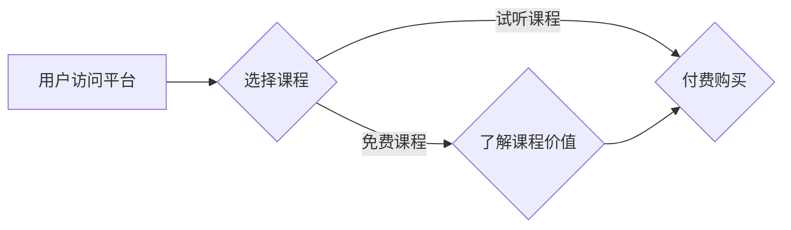

> 知识付费, 用户课程, 试听策略, 免费课程, 课程营销, 课程设计, 用户行为

## 1. 背景介绍

在互联网时代，知识付费成为一种蓬勃发展的商业模式。越来越多的专家学者和行业从业者通过线上平台分享知识，并通过付费课程的方式获取收益。然而，在知识付费市场竞争日益激烈的背景下，如何吸引用户，提高转化率，成为众多课程创作者面临的挑战。

用户课程试听和免费课程策略是吸引用户、提升转化率的重要手段。试听课程可以帮助用户了解课程内容和教学风格，从而提高付费意愿。而免费课程则可以作为引流工具，吸引潜在用户，并引导他们购买完整课程。

## 2. 核心概念与联系

**2.1 用户课程试听策略**

用户课程试听策略是指在知识付费平台上，为用户提供课程部分内容的免费试听服务，以帮助用户了解课程内容和教学风格，从而提高付费意愿。

**2.2 免费课程策略**

免费课程策略是指在知识付费平台上，提供部分课程内容或完整课程的免费版本，以吸引潜在用户，并引导他们购买完整课程。

**2.3 核心概念联系**

试听课程和免费课程策略相互补充，共同构成了知识付费平台吸引用户、提升转化率的重要手段。试听课程可以帮助用户快速了解课程内容，而免费课程则可以更深入地展示课程价值，从而提高用户付费意愿。

**Mermaid 流程图**



## 3. 核心算法原理 & 具体操作步骤

**3.1 算法原理概述**

用户课程试听和免费课程策略的制定需要考虑用户行为分析、课程内容设计、营销推广等多个方面。

**3.2 算法步骤详解**

1. **用户行为分析:** 通过分析用户浏览、观看、购买等行为数据，了解用户兴趣、偏好和购买习惯。
2. **课程内容设计:** 根据用户行为分析结果，设计课程内容和试听策略，突出课程亮点，吸引用户关注。
3. **试听策略制定:** 确定试听课程的长度、内容、时间节点等，以最大程度地吸引用户并激发付费意愿。
4. **免费课程设计:** 设计免费课程内容，使其具有价值，并引导用户购买完整课程。
5. **营销推广:** 通过多种渠道推广课程，吸引目标用户，提高课程曝光率。

**3.3 算法优缺点**

* **优点:** 可以有效吸引用户，提高转化率，提升课程收益。
* **缺点:** 需要投入一定的成本和时间进行数据分析、课程设计和营销推广。

**3.4 算法应用领域**

* 在线教育平台
* 知识付费平台
* 课程创作者个人网站

## 4. 数学模型和公式 & 详细讲解 & 举例说明

**4.1 数学模型构建**

我们可以使用以下数学模型来描述用户课程试听和免费课程策略的转化率：

```latex
转化率 = (付费用户数 / 总用户数) * 100%
```

其中：

* 付费用户数：购买完整课程的用户数量
* 总用户数：访问课程页面或试听课程的用户数量

**4.2 公式推导过程**

转化率是衡量课程试听和免费课程策略效果的重要指标。我们可以通过分析用户行为数据，例如试听课程观看时长、免费课程完成率等，来优化试听策略和免费课程内容，从而提高转化率。

**4.3 案例分析与讲解**

假设一个在线教育平台推出了一门编程课程，该课程提供免费试听和免费课程。

* 免费试听课程：提供课程第一节内容，时长15分钟。
* 免费课程：提供课程前三节内容，总时长60分钟。

通过分析用户行为数据，发现用户观看免费试听课程的比例为80%，观看免费课程的比例为50%，购买完整课程的比例为10%。

根据以上数据，我们可以计算出该课程的转化率为：

```latex
转化率 = (10% / 80%) * 100% = 12.5%
```

## 5. 项目实践：代码实例和详细解释说明

**5.1 开发环境搭建**

* 操作系统：Windows/macOS/Linux
* 编程语言：Python
* 开发工具：VS Code/PyCharm

**5.2 源代码详细实现**

```python
# 用户行为分析
def analyze_user_behavior(user_data):
    # 分析用户浏览、观看、购买等行为数据
    # 返回用户兴趣、偏好和购买习惯等信息

# 课程内容设计
def design_course_content(user_behavior):
    # 根据用户行为分析结果，设计课程内容和试听策略
    # 返回试听课程内容和时间节点等信息

# 试听策略制定
def define_trial_strategy(course_content):
    # 确定试听课程的长度、内容、时间节点等
    # 返回试听策略参数

# 免费课程设计
def design_free_course(course_content):
    # 设计免费课程内容，使其具有价值，并引导用户购买完整课程
    # 返回免费课程内容

# 营销推广
def promote_course(course_info):
    # 通过多种渠道推广课程，吸引目标用户
    # 返回推广效果数据

# 主程序
if __name__ == "__main__":
    user_data = load_user_data()  # 加载用户行为数据
    user_behavior = analyze_user_behavior(user_data)  # 分析用户行为
    course_content = design_course_content(user_behavior)  # 设计课程内容
    trial_strategy = define_trial_strategy(course_content)  # 制定试听策略
    free_course = design_free_course(course_content)  # 设计免费课程
    promote_course(course_content)  # 营销推广
```

**5.3 代码解读与分析**

以上代码示例展示了用户课程试听和免费课程策略的开发流程。

* `analyze_user_behavior()` 函数用于分析用户行为数据，并返回用户兴趣、偏好和购买习惯等信息。
* `design_course_content()` 函数根据用户行为分析结果，设计课程内容和试听策略。
* `define_trial_strategy()` 函数确定试听课程的长度、内容、时间节点等。
* `design_free_course()` 函数设计免费课程内容，使其具有价值，并引导用户购买完整课程。
* `promote_course()` 函数通过多种渠道推广课程，吸引目标用户。

**5.4 运行结果展示**

运行以上代码后，可以根据用户行为数据和课程内容设计，生成试听策略和免费课程内容，并进行营销推广。

## 6. 实际应用场景

**6.1 在线教育平台**

在线教育平台可以利用用户课程试听和免费课程策略，吸引用户注册、学习课程，并提高付费转化率。

**6.2 知识付费平台**

知识付费平台可以利用用户课程试听和免费课程策略，推广课程内容，吸引用户购买付费课程。

**6.3 课程创作者个人网站**

课程创作者可以利用用户课程试听和免费课程策略，推广自己的课程，吸引用户购买。

**6.4 未来应用展望**

随着人工智能技术的不断发展，用户课程试听和免费课程策略将更加智能化、个性化。

## 7. 工具和资源推荐

**7.1 学习资源推荐**

* 在线课程平台：Coursera、edX、Udemy
* 知识付费平台：知乎付费专栏、网易云课堂
* 技术博客：Hacker News、Medium

**7.2 开发工具推荐**

* 编程语言：Python、Java、JavaScript
* 开发框架：Django、Flask、React
* 数据库：MySQL、MongoDB

**7.3 相关论文推荐**

* "The Impact of Free Trials on Customer Acquisition and Retention"
* "The Effectiveness of Free Content in Driving Paid Subscriptions"

## 8. 总结：未来发展趋势与挑战

**8.1 研究成果总结**

用户课程试听和免费课程策略是知识付费市场的重要手段，可以有效吸引用户，提高转化率。

**8.2 未来发展趋势**

未来，用户课程试听和免费课程策略将更加智能化、个性化，并与人工智能、大数据等技术深度融合。

**8.3 面临的挑战**

* 如何设计更有效的试听策略和免费课程内容
* 如何提高用户付费意愿
* 如何应对知识付费市场竞争加剧

**8.4 研究展望**

未来研究将重点关注以下方面：

* 基于人工智能的个性化课程推荐
* 增强现实和虚拟现实技术在课程试听中的应用
* 知识付费市场监管和用户权益保护


## 9. 附录：常见问题与解答

**9.1 如何设计有效的试听课程内容？**

试听课程内容应突出课程亮点，吸引用户关注，并能展现课程的价值和教学风格。

**9.2 如何提高用户付费意愿？**

可以通过提供优质的课程内容、完善的售后服务、优惠活动等方式提高用户付费意愿。

**9.3 如何应对知识付费市场竞争加剧？**

可以通过打造差异化课程、提升用户体验、加强品牌建设等方式应对市场竞争。


作者：禅与计算机程序设计艺术 / Zen and the Art of Computer Programming 
<end_of_turn>