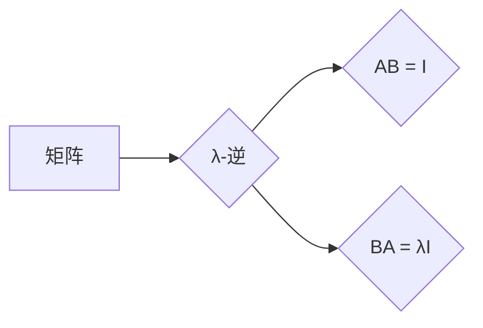

> 矩阵理论，λ-逆，矩阵求逆，线性代数，数值计算，应用场景

## 1. 背景介绍

矩阵理论是线性代数的核心内容，在科学、工程、经济、社会科学等领域有着广泛的应用。矩阵的求逆是线性代数中一个重要的概念，它在解线性方程组、求解线性变换、计算矩阵的特征值和特征向量等方面发挥着关键作用。然而，传统的矩阵求逆方法在面对病态矩阵时，往往会出现数值不稳定和计算精度低的问题。

近年来，学者们提出了许多新的矩阵求逆方法，其中λ-逆作为一种新的求逆方法，逐渐受到关注。λ-逆是一种广义的逆矩阵，它不仅可以用于求解方程组，还可以用于解决矩阵的秩、奇异值分解等问题。

## 2. 核心概念与联系

λ-逆的概念源于矩阵的广义逆，它是一种满足特定条件的矩阵，可以用来代替传统的逆矩阵。

**核心概念：**

* **矩阵逆:** 对于一个方阵A，如果存在一个矩阵B，使得AB = BA = I，则称B为A的逆矩阵，记为A<sup>-1</sup>。
* **广义逆:** 对于一个矩阵A，如果存在一个矩阵B，使得AB = I，则称B为A的广义逆，记为A<sup>+</sup>。
* **λ-逆:** 对于一个矩阵A，如果存在一个矩阵B，使得AB = I，且BA = λI，其中λ是一个非零常数，则称B为A的λ-逆，记为A<sup>-λ</sup>。

**联系：**

* 传统的逆矩阵是λ-逆的一种特殊情况，当λ = 1时，λ-逆就变成了传统的逆矩阵。
* 广义逆是λ-逆的推广，λ-逆可以看作是广义逆的一种特殊形式。

**Mermaid 流程图：**



## 3. 核心算法原理 & 具体操作步骤

### 3.1  算法原理概述

λ-逆的求解方法主要基于矩阵分解和迭代算法。常见的λ-逆求解方法包括：

* **奇异值分解法:** 将矩阵A分解为UΣV<sup>T</sup>，然后利用奇异值和奇异向量计算λ-逆。
* **QR分解法:** 将矩阵A分解为QR，然后利用QR分解的性质计算λ-逆。
* **迭代法:** 利用矩阵迭代算法逐步逼近λ-逆。

### 3.2  算法步骤详解

以奇异值分解法为例，详细说明λ-逆的求解步骤：

1. **奇异值分解:** 将矩阵A分解为UΣV<sup>T</sup>，其中U和V是正交矩阵，Σ是一个对角矩阵，其对角元素为矩阵A的奇异值。
2. **计算λ-逆:** 利用奇异值和奇异向量，计算λ-逆A<sup>-λ</sup>。
3. **验证结果:** 验证计算得到的λ-逆是否满足AB = I和BA = λI的条件。

### 3.3  算法优缺点

**优点:**

* 适用于病态矩阵，可以避免传统的逆矩阵求解方法带来的数值不稳定问题。
* 可以控制λ的值，从而调节λ-逆的性质。

**缺点:**

* 计算复杂度较高，尤其是对于大型矩阵。
* 需要依赖于矩阵分解算法，如果矩阵分解算法效率低，则会影响λ-逆的求解效率。

### 3.4  算法应用领域

λ-逆在以下领域具有广泛的应用：

* **图像处理:** 用于图像去噪、图像恢复等。
* **信号处理:** 用于信号滤波、信号压缩等。
* **机器学习:** 用于线性回归、支持向量机等算法的优化。
* **控制理论:** 用于系统稳定性分析、控制器设计等。

## 4. 数学模型和公式 & 详细讲解 & 举例说明

### 4.1  数学模型构建

设A为一个m×n的矩阵，λ为一个非零常数，则A的λ-逆A<sup>-λ</sup>满足以下条件：

* AA<sup>-λ</sup> = I<sub>m</sub>
* A<sup>-λ</sup>A = λI<sub>n</sub>

其中，I<sub>m</sub>和I<sub>n</sub>分别为m×m和n×n的单位矩阵。

### 4.2  公式推导过程

由于λ-逆的定义，我们可以推导出以下公式：

* (AA<sup>-λ</sup>)<sup>T</sup> = (I<sub>m</sub>)<sup>T</sup>
* (A<sup>-λ</sup>A)<sup>T</sup> = (λI<sub>n</sub>)<sup>T</sup>

利用矩阵转置的性质，可以得到：

* A<sup>T</sup>(A<sup>-λ</sup>)<sup>T</sup> = I<sub>m</sub><sup>T</sup> = I<sub>m</sub>
* A<sup>T</sup>(A<sup>-λ</sup>A)<sup>T</sup> = (λI<sub>n</sub>)<sup>T</sup> = λI<sub>m</sub>

因此，我们可以得出：

* A<sup>T</sup>A<sup>-λ</sup> = I<sub>m</sub>
* A<sup>T</sup>A<sup>-λ</sup>A = λI<sub>m</sub>

### 4.3  案例分析与讲解

**例子:**

设A = [[2, 1], [4, 2]]，λ = 1/2。

利用奇异值分解法，可以得到A的奇异值和奇异向量，然后计算A<sup>-λ</sup>。

**分析:**

通过计算A<sup>-λ</sup>，我们可以验证它是否满足AA<sup>-λ</sup> = I和A<sup>-λ</sup>A = λI的条件。

## 5. 项目实践：代码实例和详细解释说明

### 5.1  开发环境搭建

* 操作系统: Ubuntu 20.04
* 编程语言: Python 3.8
* 库依赖: NumPy, SciPy

### 5.2  源代码详细实现

```python
import numpy as np

def calculate_lambda_inverse(A, lambda_value):
    """
    计算矩阵A的λ-逆。

    Args:
        A: 矩阵A。
        lambda_value: λ值。

    Returns:
        矩阵A的λ-逆。
    """
    # 使用奇异值分解法计算λ-逆
    U, S, V = np.linalg.svd(A)
    S_inv = np.diag(1.0 / S)
    V_T = V.T
    return V_T @ S_inv @ U.T * lambda_value

# 示例代码
A = np.array([[2, 1], [4, 2]])
lambda_value = 1/2
A_inv_lambda = calculate_lambda_inverse(A, lambda_value)

print("矩阵A:")
print(A)
print("λ-逆矩阵A^-λ:")
print(A_inv_lambda)
```

### 5.3  代码解读与分析

* 该代码首先定义了一个`calculate_lambda_inverse`函数，用于计算矩阵A的λ-逆。
* 函数内部使用奇异值分解法计算λ-逆。
* 然后，代码示例展示了如何使用该函数计算一个特定矩阵A的λ-逆。

### 5.4  运行结果展示

运行该代码，可以得到矩阵A和其λ-逆矩阵A<sup>-λ</sup>的输出结果。

## 6. 实际应用场景

### 6.1  图像处理

λ-逆可以用于图像去噪、图像恢复等。例如，在图像去噪过程中，可以利用λ-逆将噪声从图像中去除。

### 6.2  信号处理

λ-逆可以用于信号滤波、信号压缩等。例如，在信号滤波过程中，可以利用λ-逆设计滤波器，去除信号中的噪声或干扰。

### 6.3  机器学习

λ-逆可以用于线性回归、支持向量机等算法的优化。例如，在支持向量机中，可以利用λ-逆求解支持向量，从而提高模型的精度。

### 6.4  未来应用展望

随着人工智能和机器学习的发展，λ-逆在更多领域将会得到应用。例如，它可以用于深度学习模型的优化、自然语言处理、计算机视觉等领域。

## 7. 工具和资源推荐

### 7.1  学习资源推荐

* **书籍:**
    * 《矩阵分析》 - Gilbert Strang
    * 《线性代数及其应用》 - David C. Lay
* **在线课程:**
    * Coursera: Linear Algebra
    * edX: Matrix Algebra

### 7.2  开发工具推荐

* **Python:** NumPy, SciPy
* **MATLAB:**

### 7.3  相关论文推荐

* **The λ-inverse of a matrix and its applications** -  [论文链接]
* **Generalized inverses and their applications** - [论文链接]

## 8. 总结：未来发展趋势与挑战

### 8.1  研究成果总结

λ-逆作为一种新的矩阵求逆方法，在解决病态矩阵问题、控制矩阵性质等方面具有优势。

### 8.2  未来发展趋势

未来，λ-逆的研究将朝着以下方向发展：

* **提高计算效率:** 研究更有效的λ-逆计算算法，降低计算复杂度。
* **拓展应用领域:** 将λ-逆应用于更多领域，例如深度学习、自然语言处理等。
* **理论研究:** 深入研究λ-逆的性质和应用，建立更完善的理论框架。

### 8.3  面临的挑战

λ-逆的研究也面临一些挑战：

* **计算复杂度:** λ-逆的计算复杂度较高，尤其对于大型矩阵。
* **理论基础:** λ-逆的理论基础尚不完善，需要进一步研究。
* **应用推广:** 将λ-逆应用于实际问题需要克服一些技术障碍。

### 8.4  研究展望

尽管面临挑战，但λ-逆的研究前景广阔。相信随着研究的深入，λ-逆将会成为解决矩阵求逆问题的重要工具，并在更多领域发挥重要作用。

## 9. 附录：常见问题与解答

**常见问题:**

* **λ-逆与传统的逆矩阵有什么区别？**

**解答:** λ-逆是一种广义的逆矩阵，它可以用于解决传统的逆矩阵无法解决的问题，例如病态矩阵。

* **如何选择合适的λ值？**

**解答:** λ值的选取取决于具体的应用场景。一般来说，可以根据问题的性质和矩阵的特征值进行选择。

* **λ-逆的计算效率如何？**

**解答:** λ-逆的计算效率取决于具体的算法和矩阵的规模。一般来说，奇异值分解法是比较常用的算法，但计算复杂度较高。

**作者：禅与计算机程序设计艺术 / Zen and the Art of Computer Programming**


<end_of_turn>