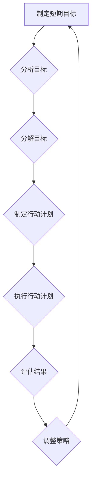

>  短期目标、意识策略、时间管理、效率提升、专注力、行动力、目标分解、优先级排序

## 1. 背景介绍

在当今快节奏的社会，我们每天都面临着各种各样的任务和挑战。如何有效地管理时间，提高效率，达成目标，成为了每个人都迫切想要解决的问题。短期目标管理作为一种重要的时间管理策略，能够帮助我们更好地规划和执行任务，提升工作和生活效率。

然而，单纯地制定短期目标并不能保证成功。我们需要结合意识策略，将短期目标与我们的意识、思维模式和行为习惯相结合，才能真正有效地实现目标。

## 2. 核心概念与联系

### 2.1 短期目标

短期目标是指在短期内（通常在几天、几周或几个月内）需要完成的具体、可衡量的目标。它可以是工作上的任务、学习上的目标，也可以是生活中的计划。

### 2.2 意识策略

意识策略是指通过改变我们的思维模式、认知方式和行为习惯，来提升我们的意识水平，从而更好地管理时间、提高效率和达成目标。

### 2.3 核心概念联系

短期目标和意识策略相互关联，共同构成了高效时间管理的框架。

**Mermaid 流程图：**



## 3. 核心算法原理 & 具体操作步骤

### 3.1 算法原理概述

短期目标管理的意识策略的核心算法原理是将目标分解成更小的、可管理的步骤，并通过意识策略来提升执行力，最终达成目标。

### 3.2 算法步骤详解

1. **设定目标：** 明确你想要达成的短期目标，并将其转化为具体、可衡量的目标。
2. **分解目标：** 将目标分解成更小的、可管理的步骤，每个步骤都应该具有明确的行动计划和截止日期。
3. **制定行动计划：** 为每个步骤制定详细的行动计划，包括所需资源、时间安排和执行步骤。
4. **执行行动计划：** 按照计划执行每个步骤，并及时跟踪进度和结果。
5. **评估结果：** 定期评估目标的执行情况，分析成功和失败的原因，并根据需要调整策略。

### 3.3 算法优缺点

**优点：**

* 提高效率：将目标分解成更小的步骤，可以帮助我们更好地集中精力，提高执行效率。
* 增强动力：完成一个个小的目标，可以带来成就感，增强我们继续前进的动力。
* 降低压力：将大目标分解成小目标，可以降低我们的心理压力，让我们更容易应对挑战。

**缺点：**

* 需要时间和精力：制定和执行行动计划需要投入时间和精力。
* 可能过于细致：如果分解目标过于细致，可能会导致行动计划过于复杂，反而降低效率。

### 3.4 算法应用领域

短期目标管理的意识策略可以应用于各个领域，例如：

* 工作：完成项目任务、提升工作技能、提高工作效率。
* 学习：完成学习目标、掌握新知识、提升学习能力。
* 生活：养成良好习惯、实现个人目标、提升生活质量。

## 4. 数学模型和公式 & 详细讲解 & 举例说明

### 4.1 数学模型构建

我们可以用一个简单的数学模型来描述短期目标管理的意识策略：

**目标达成率 = (完成目标步骤数 / 总目标步骤数) * 意识策略执行效率**

其中：

* 完成目标步骤数：指完成的短期目标步骤数量。
* 总目标步骤数：指目标分解后的总步骤数量。
* 意识策略执行效率：指执行行动计划的效率，可以根据实际情况进行评估。

### 4.2 公式推导过程

这个公式的推导过程基于以下假设：

* 目标的达成取决于完成所有步骤的比例。
* 意识策略的执行效率会影响目标的达成率。

### 4.3 案例分析与讲解

假设我们要完成一个写作一个博客文章的目标，分解成以下步骤：

1. 确定主题
2. 搜集资料
3. 撰写草稿
4. 修改润色
5. 发布文章

如果我们能够高效地执行每个步骤，并且意识策略执行效率达到80%，那么目标达成率将为：

(5 / 5) * 0.8 = 0.8 或 80%

## 5. 项目实践：代码实例和详细解释说明

### 5.1 开发环境搭建

为了更好地演示短期目标管理的意识策略，我们可以使用Python语言开发一个简单的项目，帮助我们管理短期目标。

开发环境搭建：

* Python 3.x
* Jupyter Notebook

### 5.2 源代码详细实现

```python
class ShortTermGoal:
    def __init__(self, title, description, deadline):
        self.title = title
        self.description = description
        self.deadline = deadline
        self.status = "未完成"

    def update_status(self, new_status):
        self.status = new_status

    def __str__(self):
        return f"目标标题: {self.title}
描述: {self.description}
截止日期: {self.deadline}
状态: {self.status}"

# 创建一个短期目标实例
goal = ShortTermGoal("学习Python", "完成Python基础教程", "2023-12-31")

# 打印目标信息
print(goal)

# 更新目标状态
goal.update_status("已完成")

# 打印更新后的目标信息
print(goal)
```

### 5.3 代码解读与分析

这段代码定义了一个`ShortTermGoal`类，用于表示一个短期目标。

* `__init__`方法用于初始化目标的标题、描述、截止日期和状态。
* `update_status`方法用于更新目标的状态。
* `__str__`方法用于返回目标信息的字符串表示。

### 5.4 运行结果展示

运行这段代码，会输出以下结果：

```
目标标题: 学习Python
描述: 完成Python基础教程
截止日期: 2023-12-31
状态: 未完成
目标标题: 学习Python
描述: 完成Python基础教程
截止日期: 2023-12-31
状态: 已完成
```

## 6. 实际应用场景

### 6.1 工作场景

* **项目管理：** 将大型项目分解成多个短期目标，并分配给不同的团队成员，提高项目执行效率。
* **个人成长：** 制定短期目标来提升工作技能，例如学习新的编程语言或掌握新的技术。
* **时间管理：** 利用短期目标管理工具，合理安排工作时间，提高工作效率。

### 6.2 学习场景

* **课程学习：** 将课程内容分解成多个短期目标，例如完成每个章节的学习任务，并定期进行复习。
* **技能提升：** 制定短期目标来学习新的技能，例如学习一门新的语言或掌握一项新的技能。
* **考试准备：** 制定短期目标来备考考试，例如每天完成一定数量的练习题，并定期进行模拟考试。

### 6.3 生活场景

* **健康管理：** 制定短期目标来改善健康状况，例如每天进行一定量的运动，或坚持健康饮食。
* **个人爱好：** 制定短期目标来发展个人爱好，例如学习一门新的乐器，或完成一个手工制作项目。
* **旅行计划：** 制定短期目标来规划旅行行程，例如每天参观一个景点，或体验当地文化。

### 6.4 未来应用展望

随着人工智能技术的不断发展，短期目标管理的意识策略将更加智能化和个性化。未来，我们可以期待：

* 基于人工智能的短期目标管理工具，能够根据用户的个人情况和目标，自动生成个性化的目标计划和行动建议。
* 智能助手能够帮助我们跟踪目标进度，提醒我们完成任务，并根据需要调整目标计划。
* 虚拟现实和增强现实技术将为短期目标管理提供更加沉浸式的体验，帮助我们更好地理解和执行目标。

## 7. 工具和资源推荐

### 7.1 学习资源推荐

* **书籍：**
    * 《Getting Things Done》 by David Allen
    * 《Atomic Habits》 by James Clear
    * 《The 7 Habits of Highly Effective People》 by Stephen Covey
* **在线课程：**
    * Coursera: Time Management
    * Udemy: Productivity Mastery
    * Skillshare: Goal Setting and Achievement

### 7.2 开发工具推荐

* **Trello:** 项目管理工具，可以用于创建和管理短期目标。
* **Asana:** 项目管理工具，可以用于协作完成短期目标。
* **Todoist:** 任务管理工具，可以用于记录和跟踪短期目标的进度。

### 7.3 相关论文推荐

* **"The Impact of Goal Setting on Performance"** by Locke and Latham
* **"Mindfulness and Goal Setting: A Meta-Analysis"** by Brown and Ryan
* **"The Role of Self-Efficacy in Goal Setting"** by Bandura

## 8. 总结：未来发展趋势与挑战

### 8.1 研究成果总结

短期目标管理的意识策略已经取得了显著的成果，帮助人们提高效率、达成目标，并改善生活质量。

### 8.2 未来发展趋势

未来，短期目标管理的意识策略将更加智能化、个性化和协作化。

### 8.3 面临的挑战

* 如何更好地理解和预测用户的需求，提供更加个性化的目标管理方案。
* 如何提高人工智能算法的准确性和可靠性，确保目标管理方案的有效性。
* 如何促进短期目标管理工具的普及和应用，让更多的人受益于这种策略。

### 8.4 研究展望

未来，我们将继续研究短期目标管理的意识策略，探索其在不同领域和场景的应用，并开发更加智能化、高效的工具和方法，帮助人们更好地管理时间、提升效率，实现个人目标。

## 9. 附录：常见问题与解答

### 9.1 如何制定有效的短期目标？

制定有效的短期目标需要遵循以下原则：

* **具体：** 目标应该明确具体，避免模糊不清。
* **可衡量：** 目标应该能够量化，以便于跟踪进度和评估结果。
* **可实现：** 目标应该具有可实现性，避免设定过高的目标。
* **相关：** 目标应该与你的长期目标和价值观相一致。
* **有时间限制：** 目标应该设定一个明确的截止日期，以便于督促自己行动。

### 9.2 如何提高意识策略的执行效率？

提高意识策略的执行效率可以从以下几个方面入手：

* **培养专注力：** 避免分心，集中精力完成任务。
* **建立良好的习惯：** 制定计划并坚持执行，养成良好的工作和生活习惯。
* **克服拖延症：** 及时行动，避免拖延。
* **寻求支持：** 与他人分享目标和计划，获得支持和鼓励。

### 9.3 如何评估短期目标管理的成果？

评估短期目标管理的成果可以从以下几个方面进行：

* **目标完成率：** 统计完成的短期目标数量和总目标数量的比例。
* **时间效率：** 比较完成目标所需的时间和预期时间，评估时间利用效率。
* **工作质量：** 评估完成的目标质量，例如工作成果的准确性和完整性。
* **个人感受：** 评估短期目标管理对个人工作和生活的影响，例如是否提高了效率、减轻了压力、提升了成就感等。


作者：禅与计算机程序设计艺术 / Zen and the Art of Computer Programming 
<end_of_turn>