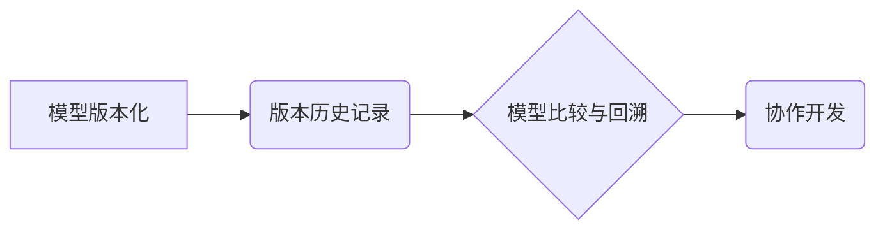

> 神经网络模型，版本控制，协作开发，Git，MLflow，DVC，模型管理，模型训练，模型部署

## 1. 背景介绍

随着深度学习技术的蓬勃发展，神经网络模型在各个领域都取得了令人瞩目的成就。然而，随着模型规模的不断扩大和训练过程的复杂性增加，如何有效地管理和协作开发神经网络模型成为了一个日益重要的挑战。传统的软件开发流程和工具难以满足神经网络模型开发的特殊需求，因此，针对神经网络模型的版本控制和协作开发方法和工具应运而生。

传统的软件开发流程通常依赖于版本控制系统，如Git，来跟踪代码的修改历史，并实现代码的协作开发。然而，神经网络模型的开发过程更加复杂，它不仅包含代码，还包含模型参数、训练数据、实验配置等多种类型的数据。传统的版本控制系统难以有效地管理这些多样化的数据，并且难以追踪模型训练过程中的各种参数变化。

## 2. 核心概念与联系

神经网络模型的版本控制和协作开发的核心概念包括：

* **模型版本化:** 将神经网络模型及其相关数据（如模型参数、训练数据、实验配置等）视为一个整体，并赋予每个版本一个唯一的标识符。
* **版本历史记录:** 记录每个模型版本的修改历史，包括修改时间、修改者、修改内容等信息。
* **模型比较与回溯:** 能够比较不同版本的模型，并能够回溯到任意一个历史版本。
* **协作开发:** 允许多个开发人员同时对同一个模型进行开发和修改，并能够协调不同版本的模型。

**核心概念架构图:**



## 3. 核心算法原理 & 具体操作步骤

### 3.1  算法原理概述

神经网络模型的版本控制和协作开发主要依赖于版本控制系统和模型管理工具。

* **版本控制系统:** 负责跟踪模型代码、模型参数、训练数据等文件的修改历史，并实现代码的协作开发。常用的版本控制系统包括Git、Mercurial等。
* **模型管理工具:** 专门用于管理神经网络模型及其相关数据的工具，能够帮助用户版本化模型、记录训练过程、比较不同版本模型等。常用的模型管理工具包括MLflow、DVC、Weights & Biases等。

### 3.2  算法步骤详解

1. **选择版本控制系统和模型管理工具:** 根据项目需求选择合适的版本控制系统和模型管理工具。
2. **创建项目仓库:** 在版本控制系统中创建项目仓库，用于存储模型代码、模型参数、训练数据等文件。
3. **版本化模型:** 使用模型管理工具将模型及其相关数据版本化，并记录每个版本的修改历史。
4. **协作开发:** 多个开发人员可以同时对同一个模型进行开发和修改，并使用版本控制系统和模型管理工具协调不同版本的模型。
5. **模型部署:** 将训练好的模型部署到生产环境中，并使用模型管理工具进行模型监控和管理。

### 3.3  算法优缺点

**优点:**

* **提高开发效率:** 版本控制和协作开发可以提高开发效率，并减少代码冲突。
* **增强模型可复现性:** 模型版本化可以确保模型的训练过程和结果的可复现性。
* **方便模型管理:** 模型管理工具可以帮助用户方便地管理和部署模型。

**缺点:**

* **学习成本:** 使用版本控制系统和模型管理工具需要一定的学习成本。
* **系统复杂性:** 版本控制和协作开发系统相对复杂，需要一定的维护成本。

### 3.4  算法应用领域

神经网络模型的版本控制和协作开发方法和工具广泛应用于以下领域:

* **计算机视觉:** 图像识别、目标检测、图像分割等。
* **自然语言处理:** 文本分类、机器翻译、文本生成等。
* **语音识别:** 语音转文本、语音合成等。
* **推荐系统:** 商品推荐、用户画像等。

## 4. 数学模型和公式 & 详细讲解 & 举例说明

### 4.1  数学模型构建

神经网络模型的版本控制和协作开发可以抽象为一个数学模型，其中模型参数、训练数据、实验配置等信息作为模型的输入，版本控制系统和模型管理工具作为模型的输出。

### 4.2  公式推导过程

由于神经网络模型的版本控制和协作开发是一个复杂的过程，涉及到多个因素和变量，因此很难用一个简单的公式来描述其整个过程。

### 4.3  案例分析与讲解

假设我们有一个神经网络模型用于图像分类，该模型包含多个层，每个层都有大量的参数。我们使用Git作为版本控制系统，并使用MLflow作为模型管理工具。

* **版本控制:** 我们将模型代码、模型参数、训练数据等文件存储在Git仓库中，并使用Git命令进行版本控制。每次修改模型代码或训练参数，我们都会提交一个新的版本到Git仓库。
* **模型管理:** 我们使用MLflow记录模型的训练过程，包括训练参数、训练时间、训练结果等信息。MLflow还能够帮助我们比较不同版本的模型，并回溯到任意一个历史版本。

## 5. 项目实践：代码实例和详细解释说明

### 5.1  开发环境搭建

* **操作系统:** Ubuntu 20.04
* **Python版本:** 3.8
* **依赖库:** Git, MLflow, TensorFlow

### 5.2  源代码详细实现

```python
# 使用MLflow记录模型训练过程
import mlflow

# 定义模型训练函数
def train_model(model_params):
    # 使用TensorFlow构建模型
    model = tf.keras.models.Sequential([
        # ... 模型结构定义 ...
    ])

    # 训练模型
    model.compile(optimizer='adam', loss='categorical_crossentropy', metrics=['accuracy'])
    model.fit(x_train, y_train, epochs=10)

    # 保存模型
    mlflow.tensorflow.log_model(model, "model")

# 设置模型参数
model_params = {
    # ... 模型参数 ...
}

# 启动MLflow追踪器
with mlflow.start_run():
    # 训练模型
    train_model(model_params)
```

### 5.3  代码解读与分析

* **MLflow追踪器:** `mlflow.start_run()`启动一个MLflow追踪器，用于记录模型训练过程。
* **模型保存:** `mlflow.tensorflow.log_model()`将训练好的模型保存到MLflow仓库中。
* **模型参数:** `model_params`包含模型训练的参数，例如学习率、批处理大小等。

### 5.4  运行结果展示

运行代码后，MLflow会记录模型训练过程中的所有信息，包括模型参数、训练时间、训练结果等。用户可以通过MLflow UI查看模型训练过程和结果。

## 6. 实际应用场景

### 6.1  机器学习模型开发

在机器学习模型开发过程中，版本控制和协作开发可以帮助开发人员跟踪模型的修改历史，并方便地比较不同版本的模型。

### 6.2  深度学习模型训练

在深度学习模型训练过程中，版本控制和协作开发可以帮助开发人员管理模型参数、训练数据、实验配置等信息，并方便地回溯到任意一个历史版本。

### 6.3  模型部署和监控

在模型部署和监控过程中，版本控制和协作开发可以帮助开发人员跟踪模型的部署历史，并方便地回滚到之前的版本。

### 6.4  未来应用展望

随着人工智能技术的不断发展，神经网络模型的版本控制和协作开发将变得更加重要。未来，我们将看到更多新的工具和方法出现，以更好地支持神经网络模型的开发和管理。

## 7. 工具和资源推荐

### 7.1  学习资源推荐

* **MLflow官方文档:** https://mlflow.org/docs/latest/index.html
* **DVC官方文档:** https://dvc.org/docs/
* **Weights & Biases官方文档:** https://docs.wandb.ai/

### 7.2  开发工具推荐

* **Git:** https://git-scm.com/
* **MLflow:** https://mlflow.org/
* **DVC:** https://dvc.org/
* **Weights & Biases:** https://wandb.ai/

### 7.3  相关论文推荐

* **MLflow: An Open Platform for Managing the Machine Learning Lifecycle:** https://arxiv.org/abs/1712.09731
* **DVC: Data Version Control for Machine Learning:** https://arxiv.org/abs/1909.04977
* **Weights & Biases: A Platform for Experiment Tracking and Model Management:** https://wandb.ai/

## 8. 总结：未来发展趋势与挑战

### 8.1  研究成果总结

神经网络模型的版本控制和协作开发已经取得了显著的进展，出现了许多优秀的工具和方法。这些工具和方法可以帮助开发人员更高效地开发和管理神经网络模型。

### 8.2  未来发展趋势

* **模型可解释性:** 未来，我们将看到更多工具和方法用于提高神经网络模型的可解释性，以便开发人员更好地理解模型的决策过程。
* **模型联邦学习:** 模型联邦学习是一种新的模型训练方法，它可以将模型训练分散到多个设备上，从而提高模型的隐私性和安全性。
* **模型自动化:** 未来，我们将看到更多自动化工具和方法用于神经网络模型的开发和管理，例如自动模型选择、自动模型优化等。

### 8.3  面临的挑战

* **模型复杂性:** 神经网络模型越来越复杂，其版本控制和协作开发也变得更加困难。
* **数据安全:** 神经网络模型的训练数据通常包含敏感信息，因此需要采取措施保护数据的安全。
* **开源生态:** 神经网络模型的开源生态系统仍然相对较弱，需要更多的开源工具和资源来支持模型的开发和管理。

### 8.4  研究展望

未来，我们将继续研究神经网络模型的版本控制和协作开发，以解决上述挑战，并推动人工智能技术的进步。

## 9. 附录：常见问题与解答

### 9.1  常见问题

* **如何选择合适的版本控制系统和模型管理工具？**

选择合适的版本控制系统和模型管理工具需要根据项目的具体需求进行选择。

* **如何进行神经网络模型的版本化？**

可以使用模型管理工具将模型及其相关数据版本化，并记录每个版本的修改历史。

* **如何协作开发神经网络模型？**

可以使用版本控制系统和模型管理工具协调不同版本的模型，并实现多人协作开发。

### 9.2  解答

* **如何选择合适的版本控制系统和模型管理工具？**

选择合适的版本控制系统和模型管理工具需要根据项目的具体需求进行选择。例如，对于小型项目，可以使用Git作为版本控制系统，并使用MLflow作为模型管理工具。对于大型项目，可以使用更专业的版本控制系统和模型管理工具，例如GitHub Enterprise和Weights & Biases。

* **如何进行神经网络模型的版本化？**

可以使用模型管理工具将模型及其相关数据版本化，并记录每个版本的修改历史。例如，可以使用MLflow将模型参数、训练数据、实验配置等信息保存到MLflow仓库中，并记录每个版本的修改时间、修改者等信息。

* **如何协作开发神经网络模型？**

可以使用版本控制系统和模型管理工具协调不同版本的模型，并实现多人协作开发。例如，可以使用Git将模型代码、模型参数、训练数据等文件存储在Git仓库中，并使用MLflow记录模型训练过程和结果。开发人员可以根据需要提交代码修改，并使用Git命令进行版本控制。

作者：禅与计算机程序设计艺术 / Zen and the Art of Computer Programming


<end_of_turn>