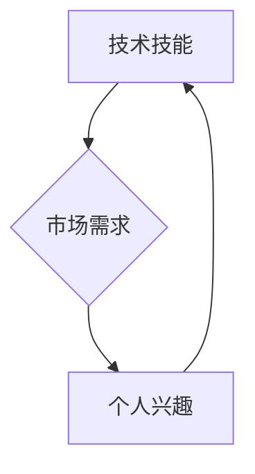

> 程序员，稳定收入，副业，开源项目，技术博客，在线课程，技术咨询，自由职业，远程工作，被动收入

## 1. 背景介绍

在当今科技飞速发展的时代，程序员作为数字时代的核心力量，备受追捧。然而，随着编程技能的普及，程序员的竞争也日益激烈。如何才能在激烈的市场竞争中脱颖而出，建立长期稳定的收入来源，成为许多程序员共同关注的问题。

传统的程序员工作模式往往依赖于公司或企业的雇佣关系，收入相对稳定，但缺乏自主性和发展空间。随着互联网和远程工作的兴起，程序员可以利用自身的技术优势，探索更多创新的收入模式，实现财务自由和职业发展。

## 2. 核心概念与联系

程序员建立长期稳定的收入来源，需要结合自身的技术能力、市场需求和个人兴趣，选择合适的收入模式。

**核心概念：**

* **技术技能：** 这是程序员收入的基础，需要不断学习和提升，掌握最新的技术趋势和技能。
* **市场需求：** 需要了解市场对哪些技术的需求量大，哪些技能更具竞争力。
* **个人兴趣：** 选择自己感兴趣的领域，才能保持持续的学习和创作动力。

**核心联系：**

技术技能、市场需求和个人兴趣相互关联，形成一个闭环。

* 技术技能满足市场需求，才能获得收入。
* 个人兴趣驱动技术技能的学习和提升。
* 了解市场需求，才能选择适合自己的技术方向。

**Mermaid 流程图：**



## 3. 核心算法原理 & 具体操作步骤

### 3.1  算法原理概述

程序员可以利用自身的技术优势，开发软件产品或提供技术服务，获得收入。

**核心算法：**

* **软件开发：** 

    * 需求分析
    * 设计方案
    * 代码编写
    * 测试和调试
    * 部署和维护

* **技术咨询：**

    * 问题分析
    * 方案设计
    * 技术指导
    * 问题解决

### 3.2  算法步骤详解

**软件开发步骤：**

1. **需求分析：** 了解客户的需求，明确软件的功能和目标。
2. **设计方案：** 设计软件的架构、界面和功能模块。
3. **代码编写：** 根据设计方案，编写软件代码。
4. **测试和调试：** 测试软件的功能和性能，修复代码中的错误。
5. **部署和维护：** 将软件部署到服务器，并进行后续的维护和更新。

**技术咨询步骤：**

1. **问题分析：** 了解客户遇到的技术问题，分析问题的原因。
2. **方案设计：** 设计解决问题的方案，并进行技术评估。
3. **技术指导：** 向客户提供技术指导，帮助客户解决问题。
4. **问题解决：** 协助客户解决技术问题，确保问题得到有效解决。

### 3.3  算法优缺点

**软件开发：**

* **优点：** 
    * 收入潜力大
    * 创造性强
    * 职业发展空间广
* **缺点：** 
    * 开发周期长
    * 风险较大
    * 需要不断学习新技术

**技术咨询：**

* **优点：** 
    * 收入稳定
    * 工作时间灵活
    * 帮助他人解决问题
* **缺点：** 
    * 收入相对较低
    * 需要积累丰富的经验
    * 需要良好的沟通能力

### 3.4  算法应用领域

**软件开发：**

* 移动应用开发
* Web 应用开发
* 游戏开发
* 数据分析软件开发
* 人工智能软件开发

**技术咨询：**

* 软件开发咨询
* 网络安全咨询
* 云计算咨询
* 数据存储咨询
* 互联网营销咨询

## 4. 数学模型和公式 & 详细讲解 & 举例说明

### 4.1  数学模型构建

程序员的收入可以看作是一个动态的数学模型，受多种因素影响。

**收入模型：**

```
收入 = 技能水平 * 市场需求 * 工作时间 * 收入比例
```

其中：

* **技能水平：** 指程序员的编程能力、技术经验和专业知识水平。
* **市场需求：** 指市场对特定技术技能的需求量。
* **工作时间：** 指程序员投入的工作时间。
* **收入比例：** 指程序员获得的收入比例，例如工资、项目分成、咨询费等。

### 4.2  公式推导过程

* **技能水平：** 可以通过编程竞赛、开源项目贡献、技术博客文章等方式提升。
* **市场需求：** 可以通过市场调研、行业报告、招聘网站等方式了解。
* **工作时间：** 可以通过合理安排工作时间、提高工作效率等方式优化。
* **收入比例：** 可以通过谈判、协商、建立个人品牌等方式提高。

### 4.3  案例分析与讲解

假设一名程序员拥有中等技能水平，从事移动应用开发，市场需求较高，每周工作40小时，收入比例为70%。根据上述公式，其收入可以计算如下：

```
收入 = 中等技能水平 * 高市场需求 * 40小时/周 * 70%
```

通过不断提升技能水平、拓展市场需求、优化工作时间和收入比例，程序员可以显著提高收入水平。

## 5. 项目实践：代码实例和详细解释说明

### 5.1  开发环境搭建

程序员需要搭建合适的开发环境，才能进行软件开发或技术咨询工作。

**开发环境搭建：**

* **操作系统：** Windows、macOS、Linux等
* **编程语言：** Java、Python、C++、JavaScript等
* **开发工具：** IDE、文本编辑器、版本控制系统等

### 5.2  源代码详细实现

程序员需要根据具体需求，编写相应的源代码。

**代码示例：**

```python
def hello_world():
  print("Hello, world!")

hello_world()
```

**代码解读：**

* `def hello_world():` 定义一个名为 `hello_world` 的函数。
* `print("Hello, world!")` 在控制台输出 "Hello, world!" 的字符串。
* `hello_world()` 调用 `hello_world` 函数，执行代码。

### 5.3  代码解读与分析

程序员需要对代码进行解读和分析，确保代码的正确性、效率和可维护性。

**代码分析：**

* 代码结构清晰，易于理解。
* 代码逻辑简单，易于调试。
* 代码注释完整，方便维护。

### 5.4  运行结果展示

程序员需要运行代码，观察运行结果，确保代码的功能满足需求。

**运行结果：**

```
Hello, world!
```

## 6. 实际应用场景

### 6.1  开源项目贡献

程序员可以参与开源项目，贡献代码和文档，提升技术能力和个人品牌。

### 6.2  技术博客写作

程序员可以撰写技术博客文章，分享技术经验和见解，吸引读者关注，建立个人品牌。

### 6.3  在线课程制作

程序员可以制作在线课程，教授编程知识和技能，获得被动收入。

### 6.4  未来应用展望

随着人工智能、大数据、云计算等技术的快速发展，程序员将面临更多新的机遇和挑战。

## 7. 工具和资源推荐

### 7.1  学习资源推荐

* **在线学习平台：** Coursera、Udemy、edX等
* **技术博客：** Hacker News、Stack Overflow、Medium等
* **开源社区：** GitHub、GitLab、Bitbucket等

### 7.2  开发工具推荐

* **IDE：** Visual Studio Code、IntelliJ IDEA、Eclipse等
* **版本控制系统：** Git、SVN等
* **云平台：** AWS、Azure、GCP等

### 7.3  相关论文推荐

* **人工智能：** Deep Learning, Natural Language Processing
* **大数据：** Hadoop, Spark
* **云计算：** Serverless Computing, Microservices

## 8. 总结：未来发展趋势与挑战

### 8.1  研究成果总结

程序员建立长期稳定的收入来源，需要不断学习新技术、提升技能水平、拓展市场需求、优化工作时间和收入比例。

### 8.2  未来发展趋势

* **人工智能：** 人工智能将对程序员工作产生重大影响，程序员需要学习人工智能相关技术。
* **大数据：** 大数据分析将成为重要的技术趋势，程序员需要掌握大数据处理和分析技能。
* **云计算：** 云计算将成为主流的计算模式，程序员需要了解云计算平台和服务。

### 8.3  面临的挑战

* **技术更新迭代快：** 程序员需要不断学习新技术，才能保持竞争力。
* **市场竞争激烈：** 程序员需要不断提升技能和个人品牌，才能脱颖而出。
* **职业发展路径不清晰：** 程序员需要明确职业目标，制定发展计划。

### 8.4  研究展望

未来，程序员将面临更多新的机遇和挑战，需要不断学习和创新，才能在数字时代取得成功。

## 9. 附录：常见问题与解答

**常见问题：**

* 如何提升编程技能？
* 如何找到合适的技术方向？
* 如何建立个人品牌？
* 如何获得稳定的收入来源？

**解答：**

* 通过在线学习平台、技术博客、开源社区等方式学习编程技能。
* 了解市场需求，选择自己感兴趣和擅长的技术方向。
* 通过技术博客写作、开源项目贡献、在线课程制作等方式建立个人品牌。
* 通过软件开发、技术咨询、开源项目维护等方式获得稳定的收入来源。


作者：禅与计算机程序设计艺术 / Zen and the Art of Computer Programming 
<end_of_turn>