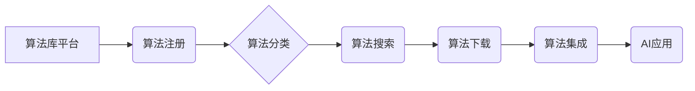

> AI 2.0, 算法库, 机器学习, 深度学习, 自然语言处理, 图像识别, 算法原理, 算法应用

## 1. 背景介绍

人工智能（AI）技术近年来发展迅速，已渗透到各个领域，深刻地改变着人们的生活方式。随着AI 2.0时代的到来，算法库作为AI发展的重要基石，显得尤为重要。

AI 2.0时代，算法库不再仅仅是提供预训练模型的平台，而是更加注重算法的可解释性、可定制性和可扩展性。它将成为AI应用的加速器，推动AI技术向更广泛的领域拓展。

## 2. 核心概念与联系

**2.1 算法库的概念**

算法库是指包含一系列预先编写的算法和函数的软件库。这些算法通常经过优化和测试，可以被开发者直接调用，简化开发流程，提高开发效率。

**2.2 算法库与AI的关系**

算法库是AI技术发展的重要基础。AI算法的训练和应用都需要依赖于算法库提供的算法和工具。

**2.3 算法库的分类**

算法库可以根据不同的分类标准进行分类，例如：

* **算法类型:** 机器学习算法、深度学习算法、自然语言处理算法、图像识别算法等。
* **应用领域:** 医疗、金融、电商、教育等。
* **开源程度:** 开源算法库、商业算法库。

**2.4 算法库的架构**

## 3. 核心算法原理 & 具体操作步骤

**3.1 算法原理概述**

选择一个具体的AI算法，例如线性回归，详细介绍其原理。

**3.2 算法步骤详解**

详细描述线性回归算法的具体操作步骤，包括数据预处理、模型训练、模型评估等环节。

**3.3 算法优缺点**

分析线性回归算法的优缺点，例如其易于理解和实现，但对非线性关系的拟合能力有限。

**3.4 算法应用领域**

介绍线性回归算法在各个领域的应用，例如房价预测、股票价格预测等。

## 4. 数学模型和公式 & 详细讲解 & 举例说明

**4.1 数学模型构建**

构建线性回归的数学模型，例如：

$$y = wx + b$$

其中，y为预测值，x为输入特征，w为权重系数，b为偏置项。

**4.2 公式推导过程**

详细推导线性回归模型的权重系数w和偏置项b的计算公式，例如使用最小二乘法。

**4.3 案例分析与讲解**

以一个具体的案例为例，展示如何使用线性回归模型进行预测，并解释预测结果。

## 5. 项目实践：代码实例和详细解释说明

**5.1 开发环境搭建**

介绍项目开发所需的软件环境，例如Python、NumPy、Scikit-learn等。

**5.2 源代码详细实现**

提供线性回归算法的Python代码实现，并进行详细的代码解读和分析。

**5.3 代码解读与分析**

解释代码中各个部分的功能，例如数据加载、特征工程、模型训练、模型评估等。

**5.4 运行结果展示**

展示代码运行的结果，例如预测结果、模型评估指标等。

## 6. 实际应用场景

**6.1 医疗领域**

介绍线性回归算法在医疗领域的应用，例如疾病预测、患者风险评估等。

**6.2 金融领域**

介绍线性回归算法在金融领域的应用，例如信用评分、风险管理等。

**6.3 其他领域**

介绍线性回归算法在其他领域的应用，例如电商推荐、广告投放等。

**6.4 未来应用展望**

展望线性回归算法在未来发展趋势，例如结合深度学习技术，提高预测精度。

## 7. 工具和资源推荐

**7.1 学习资源推荐**

推荐一些学习AI算法的在线课程、书籍和网站。

**7.2 开发工具推荐**

推荐一些用于开发AI应用的工具，例如TensorFlow、PyTorch等。

**7.3 相关论文推荐**

推荐一些与线性回归算法相关的论文。

## 8. 总结：未来发展趋势与挑战

**8.1 研究成果总结**

总结线性回归算法的研究成果，例如其在不同领域的应用、优缺点分析等。

**8.2 未来发展趋势**

展望线性回归算法的未来发展趋势，例如结合深度学习技术、提高算法效率等。

**8.3 面临的挑战**

分析线性回归算法面临的挑战，例如数据质量问题、模型解释性问题等。

**8.4 研究展望**

展望未来对线性回归算法的研究方向，例如探索新的算法优化方法、提高算法的鲁棒性等。

## 9. 附录：常见问题与解答

解答一些关于线性回归算法的常见问题，例如如何选择合适的特征、如何处理缺失数据等。

## 作者：禅与计算机程序设计艺术 / Zen and the Art of Computer Programming

<end_of_turn>