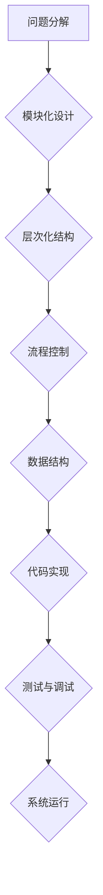

> 结构化思维，算法设计，数据结构，编程逻辑，代码优化，软件架构，复杂系统

## 1. 背景介绍

在当今科技日新月异的时代，面对日益复杂的软件系统和庞大的数据量，结构化思维已成为程序员和软件工程师必备的技能。它不仅能帮助我们更高效地解决问题，还能让我们在面对复杂挑战时保持冷静和清晰的思路。

传统的编程思维往往是碎片化的，缺乏整体的架构和逻辑。程序员往往会陷入“代码泥潭”，难以理清思路，导致代码难以维护和扩展。而结构化思维则强调将问题分解成更小的、可管理的子问题，并通过清晰的逻辑和结构来解决这些子问题。

## 2. 核心概念与联系

结构化思维的核心概念包括：

* **模块化:** 将复杂系统分解成独立、可重用的模块，每个模块都有明确的功能和接口。
* **层次化:** 将系统按照功能或逻辑层次进行组织，每个层次都包含更具体的子系统或模块。
* **流程控制:** 使用控制结构（如if-else、循环等）来控制程序的执行流程，确保程序能够按照预期的逻辑运行。
* **数据结构:** 使用合适的结构（如数组、链表、树等）来存储和组织数据，提高数据访问效率和程序的健壮性。

**Mermaid 流程图:**



## 3. 核心算法原理 & 具体操作步骤

### 3.1  算法原理概述

算法是解决特定问题的步骤序列，是结构化思维的核心。一个好的算法应该具有以下特点：

* **正确性:** 算法能够正确解决问题。
* **效率:** 算法能够在有限的时间和资源内完成任务。
* **可读性:** 算法易于理解和维护。

### 3.2  算法步骤详解

算法的具体步骤取决于所解决的问题。以下是一个简单的示例，演示如何使用算法解决查找特定元素的问题：

**查找算法:**

1. 从数组的第一个元素开始比较。
2. 如果当前元素等于目标元素，则返回当前元素的索引。
3. 如果当前元素小于目标元素，则跳过当前元素，继续比较下一个元素。
4. 如果当前元素大于目标元素，则跳过当前元素，继续比较前一个元素。
5. 如果遍历完整个数组，目标元素未找到，则返回-1。

### 3.3  算法优缺点

**查找算法的优点:**

* 算法简单易懂。
* 算法的实现代码简洁。

**查找算法的缺点:**

* 算法的时间复杂度为O(n)，当数组规模较大时，效率较低。

### 3.4  算法应用领域

查找算法广泛应用于各种领域，例如：

* **数据库查询:** 在数据库中查找特定记录。
* **搜索引擎:** 在海量网页中查找相关结果。
* **图像处理:** 在图像中查找特定特征。

## 4. 数学模型和公式 & 详细讲解 & 举例说明

### 4.1  数学模型构建

结构化思维的数学模型可以抽象为一个图论模型，其中节点代表模块或子系统，边代表模块之间的依赖关系。

### 4.2  公式推导过程

可以使用图论中的度数、路径长度等指标来衡量系统的复杂度和可维护性。

### 4.3  案例分析与讲解

例如，一个大型软件系统可以被抽象为一个包含多个模块的图。通过分析图的结构，我们可以发现系统的瓶颈和潜在的风险，并进行相应的优化。

## 5. 项目实践：代码实例和详细解释说明

### 5.1  开发环境搭建

使用Python语言和相应的开发工具，例如PyCharm，搭建开发环境。

### 5.2  源代码详细实现

```python
def find_element(array, target):
    for i in range(len(array)):
        if array[i] == target:
            return i
    return -1

# 测试代码
array = [1, 2, 3, 4, 5]
target = 3
index = find_element(array, target)
if index != -1:
    print(f"目标元素{target}在数组中的索引为{index}")
else:
    print(f"目标元素{target}未在数组中找到")
```

### 5.3  代码解读与分析

该代码实现了一个简单的查找算法，它遍历数组，逐个比较元素是否等于目标元素。如果找到目标元素，则返回其索引；否则，返回-1。

### 5.4  运行结果展示

```
目标元素3在数组中的索引为2
```

## 6. 实际应用场景

结构化思维在软件开发、数据分析、人工智能等领域都有广泛的应用。

### 6.1  软件开发

结构化思维可以帮助程序员设计更清晰、更易维护的软件系统。

### 6.2  数据分析

结构化思维可以帮助数据分析师更好地理解数据，并从中提取有价值的 insights。

### 6.3  人工智能

结构化思维可以帮助人工智能工程师设计更有效的算法和模型。

### 6.4  未来应用展望

随着科技的不断发展，结构化思维将变得更加重要。它将帮助我们更好地应对复杂问题，并创造更美好的未来。

## 7. 工具和资源推荐

### 7.1  学习资源推荐

* 《程序员的思维方式》
* 《代码的艺术》
* 《设计模式》

### 7.2  开发工具推荐

* PyCharm
* Visual Studio Code
* Eclipse

### 7.3  相关论文推荐

* 《结构化编程》
* 《算法导论》

## 8. 总结：未来发展趋势与挑战

### 8.1  研究成果总结

结构化思维已成为软件开发和数据分析等领域的重要工具，它帮助我们更好地理解和解决复杂问题。

### 8.2  未来发展趋势

随着人工智能和大数据的快速发展，结构化思维将变得更加重要。未来，我们将看到更多基于结构化思维的工具和技术出现，帮助我们更好地应对复杂挑战。

### 8.3  面临的挑战

结构化思维的应用也面临一些挑战，例如：

* 如何将结构化思维应用于更复杂的系统？
* 如何更好地评估和衡量结构化思维的有效性？
* 如何培养和提升人们的结构化思维能力？

### 8.4  研究展望

未来，我们将继续研究和探索结构化思维的应用，并致力于开发更有效、更易用的工具和技术，帮助人们更好地理解和解决复杂问题。

## 9. 附录：常见问题与解答

### 9.1  什么是结构化思维？

结构化思维是一种将问题分解成更小的、可管理的子问题，并通过清晰的逻辑和结构来解决这些子问题的思维方式。

### 9.2  结构化思维有什么好处？

结构化思维可以帮助我们更高效地解决问题，并让我们在面对复杂挑战时保持冷静和清晰的思路。

### 9.3  如何培养结构化思维能力？

可以通过学习相关书籍、参加培训课程、练习编程等方式来培养结构化思维能力。


作者：禅与计算机程序设计艺术 / Zen and the Art of Computer Programming 
<end_of_turn>