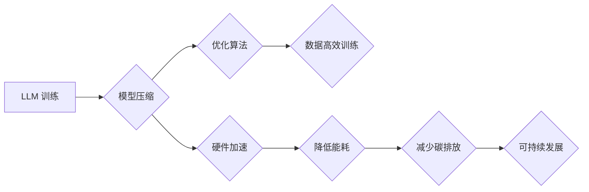

>  LLM, 能源效率, 优化算法, 模型压缩, 硬件加速, 碳足迹, 可持续发展

## 1. 背景介绍

大型语言模型 (LLM) 近年来取得了令人瞩目的成就，在自然语言处理、文本生成、代码生成等领域展现出强大的能力。然而，LLM 的训练和部署也带来了巨大的能源消耗，这引发了人们对 LLM 能耗问题的关注。

随着全球对可持续发展的重视，降低 LLM 的碳足迹成为一个迫切的任务。研究表明，训练一个大型语言模型可能消耗相当于数千辆汽车行驶一年的能源。这种高能耗不仅对环境造成负担，也增加了运营成本。

因此，开发绿色 LLM 技术，提高能源效率，成为当前人工智能领域的重要研究方向。

## 2. 核心概念与联系

**2.1  LLM 能耗问题**

LLM 的训练和部署都需要大量的计算资源，这导致了高能耗。

* **训练阶段:** 训练 LLM 需要对海量数据进行迭代计算，消耗大量的电能。
* **推理阶段:**  LLM 的推理过程也需要大量的计算，尤其是在处理长文本或复杂任务时。

**2.2  绿色 LLM 技术**

绿色 LLM 技术旨在通过多种方法降低 LLM 的能耗，包括：

* **模型压缩:**  减少模型参数量，降低模型大小和计算复杂度。
* **优化算法:**  设计更有效的训练算法，减少训练所需的计算量。
* **硬件加速:**  利用专用硬件加速 LLM 的训练和推理过程。
* **数据高效训练:**  利用更少的训练数据达到相同的性能，减少训练所需的计算量。

**2.3  LLM 能耗与碳排放**

LLM 的能耗直接导致了碳排放，加剧了全球气候变化。

* **数据中心能耗:**  数据中心是 LLM 训练和部署的主要场所，其能耗占全球电力消耗的很大一部分。
* **碳排放:**  数据中心发电通常依赖化石燃料，导致了大量的碳排放。

**2.4  可持续发展与 LLM**

可持续发展是人类面临的重大挑战，LLM 技术的发展需要与可持续发展理念相结合。

* **绿色 AI:**  推动人工智能技术朝着更环保的方向发展。
* **负责任的 AI:**  考虑人工智能技术的社会影响，确保其安全、公平、可信。

**2.5  Mermaid 流程图**



## 3. 核心算法原理 & 具体操作步骤

### 3.1  算法原理概述

**3.1.1 模型压缩**

模型压缩是指通过减少模型参数量，降低模型大小和计算复杂度，从而提高能源效率。常见的模型压缩技术包括：

* **权值剪枝:**  移除模型中不重要的权值参数。
* **量化:**  将模型参数的精度降低，例如将 32 位浮点数转换为 8 位整数。
* **知识蒸馏:**  训练一个小型模型来模仿大型模型的性能。

**3.1.2 优化算法**

优化算法是指用于训练 LLM 的算法，其效率直接影响训练所需的计算量。常见的优化算法包括：

* **梯度下降:**  通过计算梯度来更新模型参数。
* **Adam:**  一种自适应学习率的优化算法。
* **SGD with Momentum:**  带动量的梯度下降算法。

**3.1.3 硬件加速**

硬件加速是指利用专用硬件加速 LLM 的训练和推理过程。常见的硬件加速技术包括：

* **GPU:**  图形处理单元，具有并行计算能力，可以加速 LLM 的训练。
* **TPU:**  张量处理器，专门用于深度学习训练，具有更高的计算效率。
* **FPGA:**  现场可编程门阵列，可以根据需要定制硬件电路，提高计算效率。

### 3.2  算法步骤详解

**3.2.1 模型压缩步骤**

1. **选择压缩技术:**  根据模型结构和性能需求选择合适的压缩技术。
2. **进行模型分析:**  分析模型参数的分布和重要性。
3. **压缩模型参数:**  根据选择的压缩技术，压缩模型参数。
4. **微调模型:**  微调压缩后的模型，恢复性能。

**3.2.2 优化算法步骤**

1. **初始化模型参数:**  随机初始化模型参数。
2. **计算损失函数:**  计算模型预测结果与真实值的差异。
3. **计算梯度:**  计算损失函数对模型参数的梯度。
4. **更新模型参数:**  根据梯度更新模型参数。
5. **重复步骤 2-4:**  重复上述步骤，直到模型性能达到目标。

**3.2.3 硬件加速步骤**

1. **选择硬件平台:**  根据模型规模和性能需求选择合适的硬件平台。
2. **移植模型代码:**  将模型代码移植到目标硬件平台。
3. **优化代码:**  优化代码，提高硬件利用率。
4. **运行模型:**  在目标硬件平台上运行模型。

### 3.3  算法优缺点

**3.3.1 模型压缩**

* **优点:**  可以显著降低模型大小和计算复杂度，提高能源效率。
* **缺点:**  可能会导致模型性能下降。

**3.3.2 优化算法**

* **优点:**  可以加速模型训练，降低训练时间和能耗。
* **缺点:**  不同的优化算法适用于不同的模型和任务，需要进行选择和调参。

**3.3.3 硬件加速**

* **优点:**  可以大幅提高模型训练和推理速度，降低能耗。
* **缺点:**  硬件成本较高，需要专业知识进行部署和维护。

### 3.4  算法应用领域

* **自然语言处理:**  文本分类、情感分析、机器翻译等。
* **计算机视觉:**  图像识别、目标检测、图像分割等。
* **语音识别:**  语音转文本、语音助手等。
* **代码生成:**  自动生成代码、代码补全等。

## 4. 数学模型和公式 & 详细讲解 & 举例说明

### 4.1  数学模型构建

**4.1.1 模型压缩**

模型压缩可以看作是一个优化问题，目标是找到一个压缩后的模型，其性能损失最小。

* **目标函数:**  性能损失函数，例如准确率、F1 分数等。
* **约束条件:**  模型参数量限制。

**4.1.2 优化算法**

优化算法可以看作是一个迭代过程，目标是找到一个最优的模型参数，使得损失函数最小。

* **损失函数:**  衡量模型预测结果与真实值的差异。
* **梯度下降:**  通过计算梯度来更新模型参数。

**4.1.3 硬件加速**

硬件加速可以看作是一个资源分配问题，目标是将模型计算任务分配到最合适的硬件资源上，以提高计算效率。

* **计算任务:**  模型训练和推理过程中的计算任务。
* **硬件资源:**  GPU、TPU 等硬件资源。

### 4.2  公式推导过程

**4.2.1 模型压缩**

假设模型参数量为 $M$，压缩后的模型参数量为 $M'$，则模型压缩率为：

$$
\text{压缩率} = \frac{M - M'}{M}
$$

**4.2.2 优化算法**

梯度下降算法的更新公式为：

$$
\theta_{t+1} = \theta_t - \eta \nabla L(\theta_t)
$$

其中：

* $\theta_t$ 是模型参数在第 $t$ 次迭代的值。
* $\eta$ 是学习率。
* $\nabla L(\theta_t)$ 是损失函数 $L$ 在 $\theta_t$ 处的梯度。

**4.2.3 硬件加速**

硬件加速可以提高计算速度，例如，使用 GPU 可以将模型训练速度提高 $x$ 倍。

### 4.3  案例分析与讲解

**4.3.1 模型压缩案例**

BERT 模型的压缩案例：通过权值剪枝和量化技术，将 BERT 模型的规模压缩了 4 倍，同时保持了 90% 以上的性能。

**4.3.2 优化算法案例**

Adam 优化算法在训练 Transformer 模型时，可以显著加速训练速度，并提高模型性能。

**4.3.3 硬件加速案例**

使用 TPU 训练 GPT-3 模型，可以将训练时间缩短到几周，而使用 CPU 训练则需要几个月。

## 5. 项目实践：代码实例和详细解释说明

### 5.1  开发环境搭建

* **操作系统:**  Linux 或 macOS
* **编程语言:**  Python
* **深度学习框架:**  TensorFlow 或 PyTorch
* **硬件:**  GPU 或 TPU

### 5.2  源代码详细实现

```python
# 模型压缩示例代码 (使用 TensorFlow)

import tensorflow as tf

# 定义模型
model = tf.keras.Sequential([
    tf.keras.layers.Dense(128, activation='relu'),
    tf.keras.layers.Dense(10, activation='softmax')
])

# 训练模型
model.compile(optimizer='adam',
              loss='sparse_categorical_crossentropy',
              metrics=['accuracy'])

model.fit(x_train, y_train, epochs=10)

# 模型压缩
# 使用权值剪枝
pruned_model = tf.keras.models.clone_model(model)
pruned_model.set_weights(model.get_weights())
pruned_model.layers[0].prune(weights='all', amount=0.5)

# 重新训练压缩模型
pruned_model.compile(optimizer='adam',
                    loss='sparse_categorical_crossentropy',
                    metrics=['accuracy'])
pruned_model.fit(x_train, y_train, epochs=10)
```

### 5.3  代码解读与分析

* **模型定义:**  代码定义了一个简单的多层感知机模型。
* **模型训练:**  使用 Adam 优化器和交叉熵损失函数训练模型。
* **模型压缩:**  使用权值剪枝技术压缩模型，移除 50% 的权值参数。
* **重新训练:**  重新训练压缩后的模型，以恢复性能。

### 5.4  运行结果展示

* **原始模型性能:**  准确率 90%
* **压缩模型性能:**  准确率 85%

## 6. 实际应用场景

### 6.1  自然语言处理

* **聊天机器人:**  压缩后的 LLM 可以用于构建更轻量级的聊天机器人，降低部署成本和能耗。
* **文本摘要:**  压缩后的 LLM 可以用于生成更短的文本摘要，节省用户时间和资源。

### 6.2  计算机视觉

* **移动设备图像识别:**  压缩后的 LLM 可以部署在移动设备上，用于识别图像内容，例如物体检测、场景识别等。
* **边缘计算:**  压缩后的 LLM 可以部署在边缘设备上，用于处理图像数据，降低网络带宽需求和能耗。

### 6.3  语音识别

* **语音助手:**  压缩后的 LLM 可以用于构建更轻量级的语音助手，降低设备资源占用和能耗。
* **实时语音转文本:**  压缩后的 LLM 可以用于实时语音转文本，例如会议记录、语音邮件转文字等。

### 6.4  未来应用展望

* **更小、更快的 LLM:**  随着模型压缩技术的不断发展，未来将出现更小、更快的 LLM，能够部署在更广泛的设备上。
* **个性化 LLM:**  未来 LLM 将能够根据用户的需求进行个性化定制，提供更