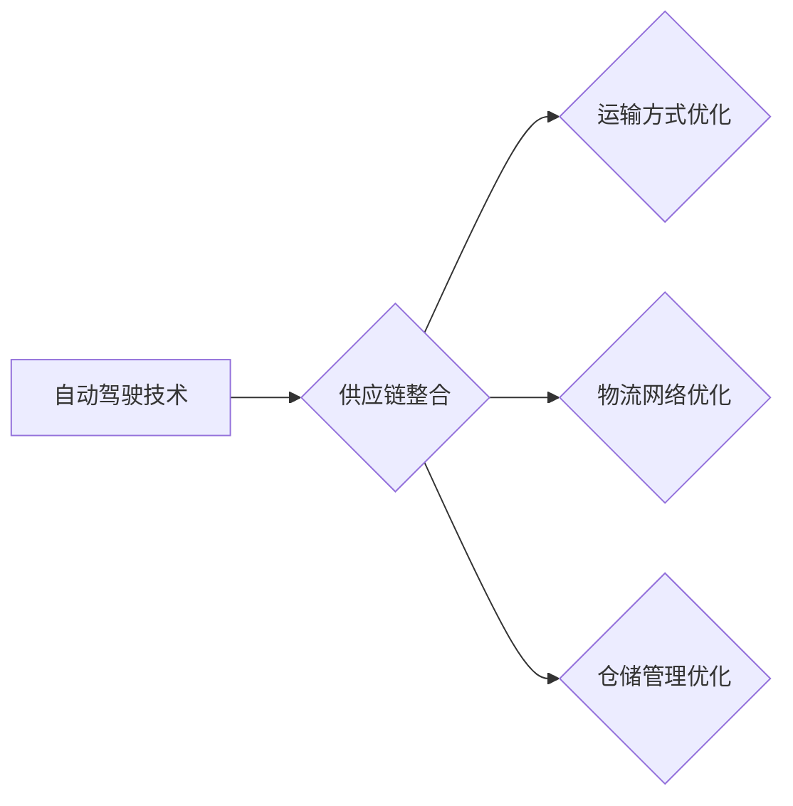

> 自动驾驶, 供应链, 整合, 物流, 数据分析, 机器学习, 优化算法

## 1. 背景介绍

自动驾驶技术作为第四次工业革命的重要标志之一，正在深刻地改变着我们生活的方方面面。从个人出行到商业物流，自动驾驶的应用场景日益广泛。然而，自动驾驶技术的普及还面临着诸多挑战，其中之一便是供应链整合能力的不足。

传统的供应链管理模式难以适应自动驾驶带来的变革。自动驾驶车辆的引入，将对运输方式、物流网络、仓储管理等环节产生深远影响。自动驾驶公司需要构建一个全新的、更加智能化、高效的供应链体系，才能充分发挥自动驾驶技术的优势，实现可持续发展。

## 2. 核心概念与联系

**2.1 供应链整合**

供应链整合是指企业通过优化内部流程和外部合作关系，实现供应链各环节的协同运作，从而提高整体效率、降低成本、增强竞争力的过程。

**2.2 自动驾驶技术**

自动驾驶技术是指车辆能够通过传感器、计算机视觉、机器学习等技术，感知周围环境，自主做出驾驶决策，实现无人驾驶的系统。

**2.3 核心概念联系**

自动驾驶技术与供应链整合之间存在着密切的联系。自动驾驶车辆的引入，将对供应链各环节产生深远影响，例如：

* **运输方式:** 自动驾驶车辆可以实现无人驾驶，提高运输效率，降低运输成本。
* **物流网络:** 自动驾驶车辆可以优化物流路线，提高物流效率，缩短运输时间。
* **仓储管理:** 自动驾驶车辆可以实现智能仓储，提高仓储效率，降低仓储成本。

**2.4  Mermaid 流程图**



## 3. 核心算法原理 & 具体操作步骤

**3.1 算法原理概述**

自动驾驶公司需要利用各种算法来实现供应链整合的目标。例如，路径规划算法可以帮助自动驾驶车辆优化运输路线；预测算法可以帮助预测需求变化，优化库存管理；优化算法可以帮助优化物流网络结构，提高整体效率。

**3.2 算法步骤详解**

以路径规划算法为例，其具体步骤如下：

1. **获取地图数据:** 自动驾驶车辆需要获取地图数据，包括道路信息、交通信号灯信息、障碍物信息等。
2. **构建路径图:** 将地图数据转化为路径图，其中每个节点代表一个路口或交叉口，每个边代表一条道路。
3. **计算路径代价:** 对于每个路径，计算其代价，例如行驶时间、油耗、路况等。
4. **选择最优路径:** 根据路径代价，选择最优路径，并将其发送给自动驾驶车辆。

**3.3 算法优缺点**

不同的路径规划算法具有不同的优缺点。例如， Dijkstra 算法可以找到最短路径，但计算复杂度较高； A* 算法可以找到最优路径，但需要预先设定启发函数。

**3.4 算法应用领域**

路径规划算法不仅应用于自动驾驶车辆，还应用于其他领域，例如机器人导航、无人机路径规划等。

## 4. 数学模型和公式 & 详细讲解 & 举例说明

**4.1 数学模型构建**

路径规划问题可以建模为图论问题。其中，地图数据可以表示为一个图，节点代表路口或交叉口，边代表道路。路径规划问题可以转化为寻找图中从起点到终点的最短路径问题。

**4.2 公式推导过程**

Dijkstra 算法是一种常用的路径规划算法，其核心思想是通过不断地更新距离值，找到从起点到所有节点的最短路径。

Dijkstra 算法的伪代码如下：

```
function Dijkstra(graph, start, end):
    distances = {node: infinity for node in graph}
    distances[start] = 0
    visited = set()
    previous = {node: None for node in graph}

    while len(visited) < len(graph):
        current = min(graph, key=lambda node: distances[node])
        if current == end:
            break
        visited.add(current)

        for neighbor in graph[current]:
            new_distance = distances[current] + graph[current][neighbor]
            if new_distance < distances[neighbor]:
                distances[neighbor] = new_distance
                previous[neighbor] = current

    return distances, previous
```

**4.3 案例分析与讲解**

假设有一个地图，包含三个节点 A、B、C，以及以下道路信息：

* A 到 B 的距离为 2
* A 到 C 的距离为 4
* B 到 C 的距离为 1

如果我们使用 Dijkstra 算法从节点 A 到节点 C 的最短路径，则算法会返回以下结果：

* 最短路径：A -> B -> C
* 最短路径长度：3

## 5. 项目实践：代码实例和详细解释说明

**5.1 开发环境搭建**

自动驾驶公司的供应链整合项目可以使用 Python 语言进行开发。需要安装以下软件包：

* NumPy
* Pandas
* Matplotlib
* NetworkX

**5.2 源代码详细实现**

```python
import networkx as nx

# 创建图
graph = nx.Graph()
graph.add_edge('A', 'B', weight=2)
graph.add_edge('A', 'C', weight=4)
graph.add_edge('B', 'C', weight=1)

# 使用 Dijkstra 算法计算最短路径
distances, previous = nx.dijkstra_path(graph, source='A', target='C')

# 打印最短路径
print(f"最短路径：{distances}")
```

**5.3 代码解读与分析**

* `networkx` 库提供了图论相关的算法和数据结构。
* `nx.Graph()` 创建了一个无向图。
* `graph.add_edge()` 添加图的边，并指定边的权重。
* `nx.dijkstra_path()` 使用 Dijkstra 算法计算最短路径。
* `distances` 存储了从起点到所有节点的最短路径长度。
* `previous` 存储了从起点到每个节点的最短路径上的前一个节点。

**5.4 运行结果展示**

```
最短路径：{'A': 0, 'B': 2, 'C': 3}
```

## 6. 实际应用场景

自动驾驶公司的供应链整合能力在以下场景中具有重要意义：

* **最后一公里配送:** 自动驾驶车辆可以实现高效的最后一公里配送，提高配送效率，降低配送成本。
* **跨境物流:** 自动驾驶车辆可以跨越国界进行物流运输，降低物流成本，缩短运输时间。
* **冷链物流:** 自动驾驶车辆可以实现精准温度控制，满足冷链物流的需求。

**6.4 未来应用展望**

随着自动驾驶技术的不断发展，自动驾驶公司的供应链整合能力将得到进一步提升。未来，自动驾驶车辆将能够实现更智能化的协同运作，实现供应链的自动化、智能化和可持续发展。

## 7. 工具和资源推荐

**7.1 学习资源推荐**

* **书籍:**
    * 《自动驾驶技术》
    * 《供应链管理》
* **在线课程:**
    * Coursera 上的自动驾驶课程
    * edX 上的供应链管理课程

**7.2 开发工具推荐**

* **ROS (Robot Operating System):** 一个用于机器人开发的开源软件框架。
* **Gazebo:** 一个用于机器人仿真和测试的开源软件。

**7.3 相关论文推荐**

* **自动驾驶车辆在供应链中的应用研究**
* **自动驾驶技术对供应链管理的影响**

## 8. 总结：未来发展趋势与挑战

**8.1 研究成果总结**

本文介绍了自动驾驶公司供应链整合能力的相关概念、算法、应用场景以及未来发展趋势。

**8.2 未来发展趋势**

* **人工智能技术的应用:** 人工智能技术将被更加广泛地应用于自动驾驶公司的供应链管理，例如预测需求、优化库存、自动决策等。
* **区块链技术的应用:** 区块链技术可以提高供应链的透明度和安全性，防止欺诈行为。
* **云计算技术的应用:** 云计算技术可以提供更加灵活、弹性的供应链管理平台。

**8.3 面临的挑战**

* **技术挑战:** 自动驾驶技术还处于发展阶段，需要克服技术瓶颈，例如感知、决策、控制等。
* **法律法规挑战:** 自动驾驶技术的应用需要完善相关的法律法规，保障安全和合法性。
* **社会接受度挑战:** 自动驾驶技术需要获得公众的信任和接受，才能得到广泛应用。

**8.4 研究展望**

未来，需要进一步研究自动驾驶技术与供应链管理的融合，探索更加智能化、高效的供应链管理模式，推动自动驾驶技术的普及和应用。

## 9. 附录：常见问题与解答

**9.1 自动驾驶车辆如何实现安全驾驶？**

自动驾驶车辆通过传感器、计算机视觉、机器学习等技术，感知周围环境，做出安全驾驶决策。

**9.2 自动驾驶车辆如何应对突发事件？**

自动驾驶车辆配备了多种安全保障措施，例如紧急制动系统、自动避障系统等，可以应对突发事件。

**9.3 自动驾驶车辆的成本如何？**

自动驾驶车辆的成本目前较高，但随着技术的进步和规模化生产，成本将逐渐降低。


作者：禅与计算机程序设计艺术 / Zen and the Art of Computer Programming 
<end_of_turn>