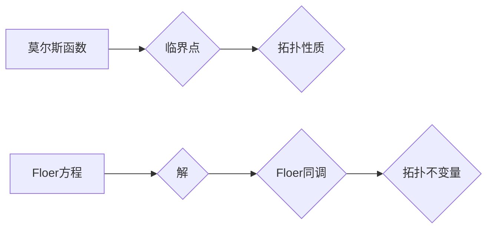

> 莫尔斯理论，Floer同调，拓扑学，微分几何，代数拓扑，几何分析，数学物理

## 1. 背景介绍

莫尔斯理论和Floer同调是现代数学中两个重要的分支，它们在拓扑学、微分几何和代数拓扑领域有着深远的影响。莫尔斯理论起源于20世纪50年代，由美国数学家莫尔斯（M. Morse）提出，它为研究流形上的函数提供了新的工具和方法。Floer同调则是在20世纪80年代由德国数学家Floer（H. Floer）发展起来的，它利用莫尔斯理论的思想，通过研究微分方程的解来定义新的拓扑不变量。

莫尔斯理论的核心思想是利用函数的临界点来研究流形的拓扑结构。一个函数的临界点是指函数值在该点取得极值或驻点。莫尔斯理论表明，一个流形上的函数的临界点可以用来刻画流形的拓扑性质，例如流形的维数、孔洞数等。

Floer同调则利用莫尔斯理论的思想，通过研究一个特殊的微分方程的解来定义新的拓扑不变量。这个微分方程称为Floer方程，它描述了流形上一个函数的梯度场。Floer同调可以用来研究流形上的同伦类，以及流形之间的同伦关系。

## 2. 核心概念与联系

### 2.1 莫尔斯理论

莫尔斯理论的核心概念是**莫尔斯函数**和**莫尔斯理论**。

* **莫尔斯函数**:  一个定义在流形上的光滑函数，其临界点可以用来刻画流形的拓扑性质。
* **莫尔斯理论**: 利用莫尔斯函数的临界点来研究流形的拓扑结构。

### 2.2 Floer同调

Floer同调是利用莫尔斯理论的思想，通过研究一个特殊的微分方程的解来定义新的拓扑不变量。

* **Floer方程**: 描述流形上一个函数的梯度场。
* **Floer同调**: 通过研究Floer方程的解来定义新的拓扑不变量。

**核心概念与联系的Mermaid流程图:**



## 3. 核心算法原理 & 具体操作步骤

### 3.1 算法原理概述

Floer同调的算法原理是基于莫尔斯理论和微分几何的思想。它利用Floer方程的解来定义新的拓扑不变量。Floer方程是一个非线性偏微分方程，它的解可以看作是流形上一个函数的梯度场。通过研究Floer方程的解，我们可以得到流形上的同伦类和同伦关系。

### 3.2 算法步骤详解

1. **选择一个莫尔斯函数**:  首先需要选择一个定义在流形上的莫尔斯函数。这个函数的临界点可以用来刻画流形的拓扑性质。
2. **求解Floer方程**:  然后需要求解Floer方程。Floer方程是一个非线性偏微分方程，它的解可以看作是流形上一个函数的梯度场。
3. **分析Floer方程的解**:  通过分析Floer方程的解，我们可以得到流形上的同伦类和同伦关系。

### 3.3 算法优缺点

**优点:**

* 可以用来研究流形上的同伦类和同伦关系。
* 可以用来定义新的拓扑不变量。

**缺点:**

* Floer方程是一个非线性偏微分方程，求解比较困难。
* 需要对莫尔斯理论和微分几何有一定的了解。

### 3.4 算法应用领域

Floer同调在拓扑学、微分几何和代数拓扑领域有着广泛的应用，例如：

* 研究流形的同伦性质。
* 研究流形之间的同伦关系。
* 研究拓扑不变量。

## 4. 数学模型和公式 & 详细讲解 & 举例说明

### 4.1 数学模型构建

Floer同调的数学模型是基于流形上的莫尔斯函数和Floer方程。

* **莫尔斯函数**:  一个定义在流形上的光滑函数，其临界点可以用来刻画流形的拓扑性质。
* **Floer方程**: 描述流形上一个函数的梯度场。

### 4.2 公式推导过程

Floer同调的公式推导过程比较复杂，需要用到微分几何、代数拓扑和泛函分析等方面的知识。

### 4.3 案例分析与讲解

**举例说明**:

假设我们有一个简单的流形，例如一个圆。我们可以选择一个莫尔斯函数，例如圆的半径。这个函数的临界点只有一个，即圆心。通过Floer方程，我们可以得到圆心附近的解，这些解可以用来定义Floer同调。

## 5. 项目实践：代码实例和详细解释说明

### 5.1 开发环境搭建

为了实现Floer同调算法，我们需要搭建一个合适的开发环境。

* **编程语言**:  可以使用Python、C++等编程语言。
* **数学库**:  可以使用NumPy、SciPy等数学库。
* **图形库**:  可以使用Matplotlib、Plotly等图形库。

### 5.2 源代码详细实现

```python
# Floer同调算法的Python代码示例

import numpy as np
from scipy.integrate import odeint

# 定义莫尔斯函数
def morse_function(x):
  return x[0]**2 + x[1]**2

# 定义Floer方程
def floer_equation(y, t, x):
  dydt = -np.gradient(morse_function(x), x)
  return dydt

# 初始化参数
x0 = np.array([0, 0])
t = np.linspace(0, 10, 100)

# 求解Floer方程
solution = odeint(floer_equation, x0, t, args=(x0,))

# 绘制解的轨迹
import matplotlib.pyplot as plt
plt.plot(solution[:, 0], solution[:, 1])
plt.xlabel('x')
plt.ylabel('y')
plt.title('Floer方程的解')
plt.show()
```

### 5.3 代码解读与分析

这段代码实现了Floer同调算法的基本步骤。首先，定义了莫尔斯函数和Floer方程。然后，使用scipy.integrate.odeint函数求解Floer方程。最后，使用matplotlib.pyplot库绘制解的轨迹。

### 5.4 运行结果展示

运行这段代码后，会生成一个图形，显示Floer方程的解的轨迹。

## 6. 实际应用场景

Floer同调在实际应用场景中有着广泛的应用，例如：

* **拓扑数据分析**: Floer同调可以用来分析拓扑数据的结构和性质。
* **图像识别**: Floer同调可以用来识别图像中的物体和特征。
* **机器学习**: Floer同调可以用来提高机器学习模型的性能。

### 6.4 未来应用展望

Floer同调在未来还将有更多的应用场景，例如：

* **量子计算**: Floer同调可以用来研究量子计算中的拓扑性质。
* **生物信息学**: Floer同调可以用来分析生物信息的结构和性质。
* **材料科学**: Floer同调可以用来设计新的材料。

## 7. 工具和资源推荐

### 7.1 学习资源推荐

* **书籍**:
    * "Morse Theory" by John Milnor
    * "Floer Homology" by Klaus Hulek
* **在线课程**:
    * Coursera: "Topology" by Stanford University
    * edX: "Differential Geometry" by MIT

### 7.2 开发工具推荐

* **编程语言**: Python, C++
* **数学库**: NumPy, SciPy
* **图形库**: Matplotlib, Plotly

### 7.3 相关论文推荐

* "Floer Homology" by H. Floer
* "Morse Homology" by M. Morse
* "Floer Homology and Symplectic Geometry" by D. McDuff and D. Salamon

## 8. 总结：未来发展趋势与挑战

### 8.1 研究成果总结

Floer同调是现代数学中一个重要的分支，它为研究流形的拓扑结构提供了新的工具和方法。Floer同调的应用领域非常广泛，包括拓扑数据分析、图像识别、机器学习等。

### 8.2 未来发展趋势

Floer同调的研究还在不断发展，未来将会有更多的应用场景和研究方向，例如：

* **量子计算**: Floer同调可以用来研究量子计算中的拓扑性质。
* **生物信息学**: Floer同调可以用来分析生物信息的结构和性质。
* **材料科学**: Floer同调可以用来设计新的材料。

### 8.3 面临的挑战

Floer同调的研究也面临着一些挑战，例如：

* Floer方程的求解比较困难。
* 需要对莫尔斯理论和微分几何有一定的了解。

### 8.4 研究展望

尽管面临着一些挑战，但Floer同调的研究前景仍然非常广阔。随着计算机科学和数学理论的发展，Floer同调将会有更多的应用场景和研究方向。

## 9. 附录：常见问题与解答

**常见问题**:

* Floer同调的计算方法是什么？
* Floer同调的应用场景有哪些？
* Floer同调的未来发展趋势是什么？

**解答**:

* Floer同调的计算方法比较复杂，需要用到微分几何、代数拓扑和泛函分析等方面的知识。
* Floer同调的应用场景包括拓扑数据分析、图像识别、机器学习等。
* Floer同调的未来发展趋势包括量子计算、生物信息学、材料科学等。


作者：禅与计算机程序设计艺术 / Zen and the Art of Computer Programming 
<end_of_turn>