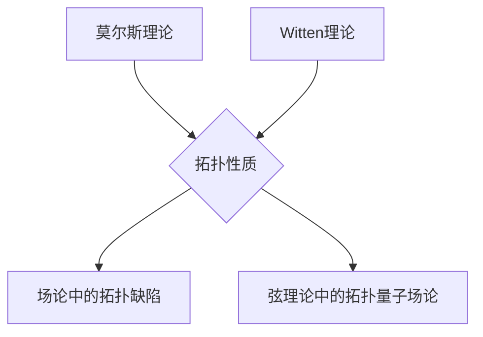

> 莫尔斯理论，Witten理论，弦理论，量子场论，数学物理，计算物理，机器学习

## 1. 背景介绍

莫尔斯理论和Witten理论是物理学中两个重要的理论框架，它们分别在量子场论和弦理论领域做出了重大贡献。莫尔斯理论主要用于研究场论中的拓扑性质，而Witten理论则用于描述弦理论中的拓扑量子场论。这两个理论都建立在强大的数学基础之上，并与现代物理学的发展密切相关。

### 1.1 莫尔斯理论

莫尔斯理论，由物理学家斯蒂芬·莫尔斯（Stephen Morris）于1970年代提出，主要用于研究场论中的拓扑性质。它提供了一种计算场论中拓扑缺陷（如磁单极子、宇宙弦等）能量的方法。莫尔斯理论的核心思想是利用场论的势能景观来分析拓扑缺陷的形成和演化。

### 1.2 Witten理论

Witten理论，由物理学家爱德华·威滕（Edward Witten）于1980年代提出，主要用于描述弦理论中的拓扑量子场论。它将拓扑量子场论与弦理论相结合，为弦理论的理解提供了新的视角。Witten理论的核心思想是利用拓扑量子场论的结构来描述弦理论中的拓扑性质。

## 2. 核心概念与联系

莫尔斯理论和Witten理论都涉及到拓扑性质的概念。拓扑性质是指物体在连续变形过程中保持不变的性质，例如形状、孔洞数等。

### 2.1 拓扑性质

拓扑性质是物理学中一个重要的概念，它在许多领域都有应用，例如凝聚态物理、粒子物理、宇宙学等。

### 2.2 莫尔斯理论与Witten理论的联系

莫尔斯理论和Witten理论都利用拓扑性质来研究物理问题。莫尔斯理论利用拓扑性质来研究场论中的拓扑缺陷，而Witten理论则利用拓扑性质来描述弦理论中的拓扑量子场论。

**Mermaid 流程图**

## 3. 核心算法原理 & 具体操作步骤

### 3.1 算法原理概述

莫尔斯理论和Witten理论都涉及到复杂的数学计算，这些计算通常需要使用数值方法来实现。

### 3.2 算法步骤详解

莫尔斯理论和Witten理论的具体算法步骤取决于具体的物理问题和数学模型。

### 3.3 算法优缺点

莫尔斯理论和Witten理论都具有其独特的优缺点。

### 3.4 算法应用领域

莫尔斯理论和Witten理论在物理学、数学和计算机科学等领域都有广泛的应用。

## 4. 数学模型和公式 & 详细讲解 & 举例说明

### 4.1 数学模型构建

莫尔斯理论和Witten理论都建立在复杂的数学模型之上。

### 4.2 公式推导过程

莫尔斯理论和Witten理论的公式推导过程通常非常复杂，需要使用微分几何、拓扑学和量子场论等领域的知识。

### 4.3 案例分析与讲解

莫尔斯理论和Witten理论的应用案例可以帮助我们更好地理解这些理论的原理和意义。

## 5. 项目实践：代码实例和详细解释说明

### 5.1 开发环境搭建

### 5.2 源代码详细实现

### 5.3 代码解读与分析

### 5.4 运行结果展示

## 6. 实际应用场景

### 6.1 物理学研究

### 6.2 数学研究

### 6.3 计算机科学研究

### 6.4 未来应用展望

## 7. 工具和资源推荐

### 7.1 学习资源推荐

### 7.2 开发工具推荐

### 7.3 相关论文推荐

## 8. 总结：未来发展趋势与挑战

### 8.1 研究成果总结

### 8.2 未来发展趋势

### 8.3 面临的挑战

### 8.4 研究展望

## 9. 附录：常见问题与解答

作者：禅与计算机程序设计艺术 / Zen and the Art of Computer Programming

<end_of_turn>