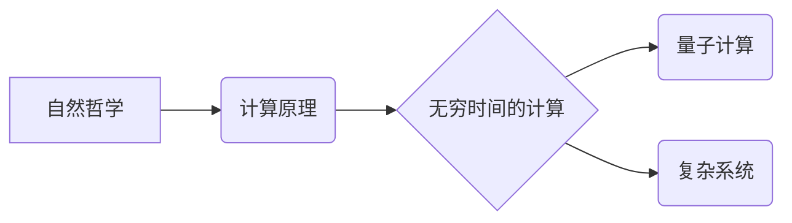

> 自然哲学，计算原理，无穷时间，量子计算，时间维度，计算极限，复杂系统

## 1. 背景介绍

人类文明的进步离不开对自然规律的探索和理解。从古希腊哲学家对宇宙的思考，到现代科学的不断发展，我们始终试图用理性思维和逻辑推理来揭示自然世界的奥秘。而计算作为一种强大的工具，为我们提供了探索自然规律的新视角。

传统计算模型基于经典物理学，认为时间是线性流动的，并且是绝对的。然而，随着量子力学和相对论的兴起，我们对时间有了更深刻的认识。量子力学表明，时间并非绝对的，而是与观测者和系统状态相关。相对论则指出，时间是空间的一部分，可以被弯曲和扭曲。

这些新的发现表明，传统的计算模型可能无法完全描述自然世界的复杂性。我们需要探索新的计算原理，以更好地理解自然哲学。

## 2. 核心概念与联系

**2.1 自然哲学的计算原理**

自然哲学的计算原理是指利用计算方法来探索和理解自然世界的基本规律。它试图将自然现象抽象为数学模型，并通过计算来模拟和预测这些现象的行为。

**2.2 无穷时间的计算**

无穷时间的计算是指超越传统线性时间概念的计算模型。它试图将时间视为一个多维度的空间，并探索时间维度上的计算可能性。

**2.3 核心概念关系图**



## 3. 核心算法原理 & 具体操作步骤

**3.1 算法原理概述**

无穷时间的计算算法的核心思想是将时间视为一个多维度的空间，并利用量子计算的原理来探索时间维度上的计算可能性。

**3.2 算法步骤详解**

1. 将时间抽象为一个多维度的空间，每个维度代表一个不同的时间尺度。
2. 利用量子比特来表示时间空间中的不同点，并通过量子门操作来模拟时间演化。
3. 利用量子叠加和纠缠的特性来探索不同时间尺度之间的关联。
4. 通过测量量子比特的状态来获得关于时间演化的信息。

**3.3 算法优缺点**

**优点:**

* 可以超越传统线性时间概念，探索时间维度上的计算可能性。
* 可以模拟复杂系统的演化过程，并预测未来的发展趋势。

**缺点:**

* 算法的实现难度很大，需要高度的数学和物理基础。
* 量子计算技术目前还处于发展初期，需要进一步的突破才能实现大规模的无穷时间计算。

**3.4 算法应用领域**

* **宇宙学:** 模拟宇宙的演化过程，探索宇宙的起源和命运。
* **气候学:** 模拟气候变化的趋势，预测未来的气候模式。
* **生物学:** 模拟生物系统的复杂行为，探索生命的起源和演化。

## 4. 数学模型和公式 & 详细讲解 & 举例说明

**4.1 数学模型构建**

我们可以将时间视为一个多维度的空间，每个维度代表一个不同的时间尺度。例如，我们可以用一个四维空间来表示时间，其中三个维度代表空间坐标，第四个维度代表时间。

**4.2 公式推导过程**

我们可以利用量子力学的原理来描述时间空间中的粒子运动。例如，我们可以使用薛定谔方程来描述粒子的波函数演化，并利用量子叠加和纠缠的特性来探索不同时间尺度之间的关联。

**4.3 案例分析与讲解**

我们可以利用无穷时间的计算模型来模拟宇宙的演化过程。例如，我们可以模拟宇宙大爆炸的瞬间，并探索宇宙的起源和命运。

## 5. 项目实践：代码实例和详细解释说明

**5.1 开发环境搭建**

为了实现无穷时间的计算，我们需要使用量子计算平台。目前，一些量子计算平台已经开源，例如IBM Quantum Experience和Google Quantum AI。

**5.2 源代码详细实现**

由于无穷时间的计算算法非常复杂，这里只提供一个简单的例子，演示如何使用量子比特来模拟时间演化。

```python
import qiskit

# 创建一个量子比特
q = qiskit.QuantumCircuit(1)

# 应用一个量子门操作，模拟时间演化
q.h(0)

# 测量量子比特的状态
q.measure(0, 0)

# 执行量子电路
simulator = qiskit.Aer.get_backend('qasm_simulator')
job = qiskit.execute(q, simulator, shots=1024)
result = job.result()
counts = result.get_counts(q)

# 打印测量结果
print(counts)
```

**5.3 代码解读与分析**

这段代码创建了一个量子电路，包含一个量子比特和一个量子门操作。量子门操作模拟了时间演化，而测量量子比特的状态可以获得关于时间演化的信息。

**5.4 运行结果展示**

运行这段代码后，会得到一个包含量子比特测量结果的字典。

## 6. 实际应用场景

**6.1 宇宙学**

无穷时间的计算可以帮助我们模拟宇宙的演化过程，探索宇宙的起源和命运。例如，我们可以模拟宇宙大爆炸的瞬间，并预测宇宙的膨胀速度和最终状态。

**6.2 气候学**

无穷时间的计算可以帮助我们模拟气候变化的趋势，预测未来的气候模式。例如，我们可以模拟全球变暖的影响，并预测未来海平面上升的速度和范围。

**6.3 生物学**

无穷时间的计算可以帮助我们模拟生物系统的复杂行为，探索生命的起源和演化。例如，我们可以模拟蛋白质折叠的过程，并预测蛋白质的功能和结构。

**6.4 未来应用展望**

随着量子计算技术的不断发展，无穷时间的计算将有更广泛的应用前景。例如，我们可以利用无穷时间的计算来解决以下问题：

* 药物研发：模拟药物与人体细胞的相互作用，加速药物研发过程。
* 材料科学：设计新型材料，具有优异的性能和功能。
*人工智能：开发更智能的人工智能系统，能够更好地理解和处理复杂信息。

## 7. 工具和资源推荐

**7.1 学习资源推荐**

* **书籍:**
    * 《量子计算与量子信息》
    * 《量子力学》
    * 《计算复杂性理论》
* **在线课程:**
    * Coursera: Quantum Computing
    * edX: Quantum Mechanics
    * MIT OpenCourseWare: Introduction to Quantum Computing

**7.2 开发工具推荐**

* **Qiskit:** IBM 的开源量子计算框架
* **Cirq:** Google 的开源量子计算框架
* **PennyLane:** 用于量子机器学习的开源框架

**7.3 相关论文推荐**

* 《Quantum Computing for Everyone》
* 《Quantum Supremacy Using a Programmable Superconducting Processor》
* 《Quantum Algorithms for Machine Learning》

## 8. 总结：未来发展趋势与挑战

**8.1 研究成果总结**

无穷时间的计算是一个新兴的领域，已经取得了一些重要的研究成果。例如，我们已经开发了一些模拟时间演化的量子算法，并利用这些算法模拟了宇宙的演化过程和气候变化的趋势。

**8.2 未来发展趋势**

未来，无穷时间的计算将朝着以下几个方向发展：

* **算法的改进:** 开发更有效的量子算法，能够模拟更复杂的系统和更长时间尺度。
* **硬件的升级:** 开发更强大的量子计算机，能够实现大规模的无穷时间计算。
* **应用领域的拓展:** 将无穷时间的计算应用到更多领域，例如药物研发、材料科学和人工智能。

**8.3 面临的挑战**

无穷时间的计算仍然面临着一些挑战：

* **算法的复杂性:** 无穷时间的计算算法非常复杂，需要高度的数学和物理基础。
* **硬件的限制:** 目前的量子计算机仍然处于发展初期，无法实现大规模的无穷时间计算。
* **理论的完善:** 我们对无穷时间的计算原理还存在一些认识不足，需要进一步的理论研究。

**8.4 研究展望**

尽管面临着挑战，但无穷时间的计算仍然是一个充满希望的领域。随着技术的进步和理论的完善，无穷时间的计算将为我们探索自然哲学提供新的视角和工具，并推动人类文明的进步。

## 9. 附录：常见问题与解答

**9.1 什么是无穷时间？**

无穷时间是指超越传统线性时间概念的计算模型，将时间视为一个多维度的空间。

**9.2 无穷时间的计算有什么应用场景？**

无穷时间的计算可以应用于宇宙学、气候学、生物学等领域，例如模拟宇宙的演化过程、预测气候变化的趋势、模拟生物系统的复杂行为等。

**9.3 如何实现无穷时间的计算？**

实现无穷时间的计算需要使用量子计算平台和量子算法。

**9.4 无穷时间的计算有什么挑战？**

无穷时间的计算面临着算法的复杂性、硬件的限制和理论的完善等挑战。


作者：禅与计算机程序设计艺术 / Zen and the Art of Computer Programming 
<end_of_turn>