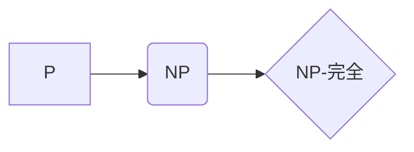

> 计算复杂性，NP问题，P问题，NP-完全问题，多项式时间，指数时间，算法复杂度，图灵机，计算极限

## 1. 背景介绍

在计算机科学领域，计算复杂性是研究算法效率和资源消耗的关键问题。它旨在量化算法解决特定问题所需的时间和空间资源。随着计算机技术的发展，我们不断面临着更复杂的问题，例如破解密码、优化物流、预测天气等。这些问题通常需要大量的计算资源，甚至可能无法在有限时间内得到解决。

计算复杂性理论试图揭示这些问题的本质，并为我们提供解决方法。它将问题分为不同的复杂度类，例如P类和NP类，并研究它们之间的关系。P类包含所有可以在多项式时间内解决的问题，而NP类包含所有可以在多项式时间内验证答案的问题。

## 2. 核心概念与联系

**2.1  P类和NP类**

P类和NP类是计算复杂性理论中的两个重要概念。

* **P类 (Polynomial Time)**：包含所有可以在多项式时间内被确定性算法解决的问题。多项式时间是指算法运行时间随着输入规模的增长，最多呈多项式函数增长。例如，查找一个有序数组中的特定元素，其时间复杂度为O(log n)，属于P类。

* **NP类 (Nondeterministic Polynomial Time)**：包含所有可以在多项式时间内被确定性算法验证答案的问题。换句话说，如果给出一个答案，我们可以用多项式时间验证其正确性，但找到这个答案可能需要指数时间。例如，旅行商问题，即找到最短路径访问所有城市并返回原点的路径，属于NP类。

**2.2  NP-完全问题**

NP-完全问题是NP类中最难解决的问题之一。如果存在一个算法可以在多项式时间内解决NP-完全问题，那么所有NP问题都可以被多项式时间内解决。

**2.3  P vs NP问题**

P vs NP问题是计算机科学领域最著名的未解问题之一。它试图回答以下问题：P类是否等于NP类？换句话说，所有可以在多项式时间内验证答案的问题，是否都可以被多项式时间内解决？

**2.4  计算复杂性类别的关系**



## 3. 核心算法原理 & 具体操作步骤

### 3.1  算法原理概述

由于NP-完全问题难以解决，因此通常采用近似算法或启发式算法来找到近似最优解。

**3.1.1  近似算法**

近似算法旨在找到问题的近似最优解，其解的质量与最优解之间存在一定的误差。近似算法通常具有较高的效率，可以在有限时间内找到可接受的解。

**3.1.2  启发式算法**

启发式算法利用启发式规则或经验知识，通过迭代搜索来找到一个可接受的解。启发式算法通常没有保证找到最优解，但可以快速找到一个相对较好的解。

### 3.2  算法步骤详解

**3.2.1  近似算法步骤**

1.  **定义问题目标:** 明确问题的目标函数和约束条件。
2.  **设计近似策略:** 选择合适的近似策略，例如贪婪算法、局部搜索算法等。
3.  **迭代求解:** 根据近似策略，迭代地改进解，直到满足终止条件。
4.  **评估解质量:** 评估近似解的质量，并与最优解进行比较。

**3.2.2  启发式算法步骤**

1.  **定义启发式规则:** 根据问题的特点，设计启发式规则，用于指导搜索过程。
2.  **初始化解:** 生成一个初始解。
3.  **迭代搜索:** 根据启发式规则，迭代地搜索新的解，并选择更优的解。
4.  **终止条件:** 当满足终止条件时，停止搜索过程。

### 3.3  算法优缺点

**3.3.1  近似算法**

* **优点:** 效率高，可以找到可接受的近似解。
* **缺点:** 解的质量可能不如最优解。

**3.3.2  启发式算法**

* **优点:** 能够快速找到一个相对较好的解。
* **缺点:** 没有保证找到最优解，解的质量可能不稳定。

### 3.4  算法应用领域

近似算法和启发式算法广泛应用于各种领域，例如：

* **优化问题:** 运输调度、资源分配、网络路由等。
* **机器学习:** 分类、回归、聚类等。
* **人工智能:** 游戏、机器人控制、自然语言处理等。

## 4. 数学模型和公式 & 详细讲解 & 举例说明

### 4.1  数学模型构建

计算复杂性通常使用时间复杂度和空间复杂度来衡量算法的效率。

* **时间复杂度:** 指的是算法运行时间随着输入规模的增长而变化的趋势。
* **空间复杂度:** 指的是算法运行过程中使用的内存空间大小。

时间复杂度和空间复杂度通常用大O符号来表示，例如O(n)、O(n^2)、O(log n)等。

### 4.2  公式推导过程

时间复杂度和空间复杂度可以通过分析算法的执行步骤和资源消耗来推导。例如，一个简单的线性搜索算法的时间复杂度为O(n)，因为在最坏情况下，需要检查所有n个元素。

### 4.3  案例分析与讲解

**4.3.1  冒泡排序算法**

冒泡排序算法是一种简单排序算法，其时间复杂度为O(n^2)。

**4.3.2  快速排序算法**

快速排序算法是一种高效的排序算法，其平均时间复杂度为O(n log n)。

## 5. 项目实践：代码实例和详细解释说明

### 5.1  开发环境搭建

本项目使用Python语言进行开发，需要安装Python解释器和相关库。

### 5.2  源代码详细实现

```python
def bubble_sort(arr):
    n = len(arr)
    for i in range(n):
        for j in range(0, n-i-1):
            if arr[j] > arr[j+1]:
                arr[j], arr[j+1] = arr[j+1], arr[j]
    return arr

# 测试代码
arr = [64, 34, 25, 12, 22, 11, 90]
sorted_arr = bubble_sort(arr)
print("排序后的数组:", sorted_arr)
```

### 5.3  代码解读与分析

* `bubble_sort(arr)`函数实现冒泡排序算法。
* 外层循环 `for i in range(n)` 控制排序的轮数。
* 内层循环 `for j in range(0, n-i-1)` 比较相邻元素，并交换位置。
* `if arr[j] > arr[j+1]` 判断元素是否需要交换。
* `arr[j], arr[j+1] = arr[j+1], arr[j]` 交换元素位置。

### 5.4  运行结果展示

```
排序后的数组: [11, 12, 22, 25, 34, 64, 90]
```

## 6. 实际应用场景

计算复杂性理论在实际应用场景中具有广泛的意义。例如：

* **密码学:** 许多密码算法的安全性依赖于NP-完全问题的难解性。
* **人工智能:** 许多人工智能算法，例如图搜索算法和规划算法，需要考虑计算复杂性问题。
* **软件工程:** 软件开发人员需要了解算法复杂度，以便选择合适的算法和优化代码性能。

### 6.4  未来应用展望

随着计算机技术的发展，计算复杂性理论将继续发挥重要作用。例如：

* **量子计算:** 量子计算有可能改变我们对计算复杂性的理解，并解决一些目前无法解决的NP-完全问题。
* **机器学习:** 机器学习算法的复杂度分析将有助于提高算法效率和性能。
* **大数据分析:** 大数据分析需要处理海量数据，计算复杂性问题将变得更加重要。

## 7. 工具和资源推荐

### 7.1  学习资源推荐

* **书籍:**
    * 《算法导论》
    * 《计算复杂性导论》
* **在线课程:**
    * Coursera: Computational Complexity
    * edX: Introduction to Algorithms

### 7.2  开发工具推荐

* **Python:** 广泛用于算法开发和实现。
* **C++:** 性能优异，适合开发高性能算法。

### 7.3  相关论文推荐

* **P vs NP问题:**
    * The P versus NP Problem
* **NP-完全问题:**
    * NP-Completeness

## 8. 总结：未来发展趋势与挑战

### 8.1  研究成果总结

计算复杂性理论取得了显著的成果，例如：

* 确定了多个NP-完全问题。
* 发展了近似算法和启发式算法。
* 探索了量子计算对计算复杂性的影响。

### 8.2  未来发展趋势

* **量子计算:** 量子计算有可能解决一些目前无法解决的NP-完全问题。
* **机器学习:** 机器学习算法的复杂度分析将有助于提高算法效率和性能。
* **大数据分析:** 大数据分析需要处理海量数据，计算复杂性问题将变得更加重要。

### 8.3  面临的挑战

* **P vs NP问题:** 这个问题仍然是计算机科学领域最著名的未解问题之一。
* **复杂算法的分析:** 随着算法的复杂性不断增加，分析其复杂度变得更加困难。
* **新技术对复杂性的影响:** 新兴技术，例如量子计算和人工智能，可能会对计算复杂性产生新的影响。

### 8.4  研究展望

未来，计算复杂性理论的研究将继续深入，探索计算的极限，并为解决现实世界中的复杂问题提供新的思路和方法。

## 9. 附录：常见问题与解答

**9.1  P类和NP类有什么区别？**

P类包含所有可以在多项式时间内被确定性算法解决的问题，而NP类包含所有可以在多项式时间内被确定性算法验证答案的问题。

**9.2  什么是NP-完全问题？**

NP-完全问题是NP类中最难解决的问题之一。如果存在一个算法可以在多项式时间内解决NP-完全问题，那么所有NP问题都可以被多项式时间内解决。

**9.3  P vs NP问题是什么？**

P vs NP问题试图回答以下问题：P类是否等于NP类？换句话说，所有可以在多项式时间内验证答案的问题，是否都可以被多项式时间内解决？

**9.4  近似算法和启发式算法有什么区别？**

近似算法旨在找到问题的近似最优解，而启发式算法利用启发式规则或经验知识，通过迭代搜索来找到一个可接受的解。

**9.5  计算复杂性理论在实际应用场景中有什么意义？**

计算复杂性理论在密码学、人工智能、软件工程等领域具有广泛的应用。


作者：禅与计算机程序设计艺术 / Zen and the Art of Computer Programming 
<end_of_turn>