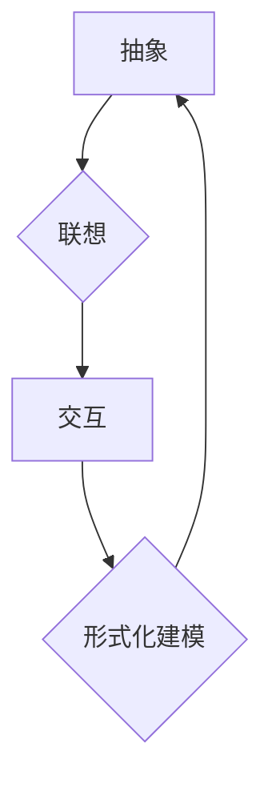

> 认知、形式化、抽象、联想、交互、人工智能、生物学、计算机科学

## 1. 背景介绍

认知，作为人类和其他生物区别于其他物质的本质特征，一直是哲学、心理学和计算机科学的核心议题。从古希腊哲学家对“灵魂”的探讨，到现代人工智能的兴起，我们一直在试图理解和模拟认知过程。然而，认知的复杂性和多层次性使得其形式化建模一直是一个巨大的挑战。

传统上，认知科学主要依赖于观察和实验，试图揭示认知过程背后的机制。然而，这种方法难以捕捉到认知的动态性和复杂性。近年来，随着计算机科学和人工智能的快速发展，形式化建模方法逐渐成为认知科学研究的重要工具。

形式化建模是指用数学符号、逻辑规则和计算模型来描述和分析认知过程。这种方法能够提供一种更加精确和客观的认知模型，并为认知科学研究提供新的视角和方法。

## 2. 核心概念与联系

**2.1 抽象**

抽象是认知的核心能力之一，它指从具体的事物中提取出其本质特征，形成概念和符号。例如，我们能够将不同的动物抽象成“动物”这个概念，并用“动物”这个符号来代表它们。抽象能力使得我们能够将知识进行组织和归纳，并进行更高层次的思考。

**2.2 联想**

联想是指将不同的概念和信息联系起来，形成新的认知结构。例如，当我们看到“苹果”这个词时，我们会联想到“红色”、“圆形”和“甜味”等信息。联想能力使得我们能够从已有的知识中提取信息，并构建新的知识结构。

**2.3 交互**

交互是指认知过程与外部环境的互动。例如，我们通过观察、感知和行动来获取信息，并根据信息做出决策和行动。交互能力使得我们能够适应环境变化，并与环境进行有效沟通。

**2.4 形式化建模**

形式化建模将抽象、联想和交互等认知能力转化为数学符号、逻辑规则和计算模型。通过形式化建模，我们可以将认知过程进行精确描述和分析，并构建更加科学和可靠的认知模型。

**Mermaid 流程图**



## 3. 核心算法原理 & 具体操作步骤

**3.1 算法原理概述**

形式化建模的算法原理基于符号逻辑、知识图谱和机器学习等技术。

* **符号逻辑:** 使用符号和逻辑规则来描述知识和推理过程。
* **知识图谱:** 将知识表示为节点和边，并使用规则和推理机制进行知识推理。
* **机器学习:** 利用数据训练模型，学习认知过程的模式和规律。

**3.2 算法步骤详解**

1. **知识表示:** 将认知领域中的知识转化为符号形式，例如概念、关系和规则。
2. **推理机制:** 设计推理机制，根据知识表示和逻辑规则进行推理和推导。
3. **模型训练:** 利用机器学习算法，训练模型以学习认知过程的模式和规律。
4. **预测和解释:** 利用训练好的模型进行预测和解释，例如预测用户的行为或解释模型的决策过程。

**3.3 算法优缺点**

**优点:**

* 精确描述认知过程
* 提供客观的认知模型
* 支持知识推理和预测

**缺点:**

* 建模过程复杂
* 需要大量的数据和计算资源
* 难以捕捉到认知过程的复杂性和动态性

**3.4 算法应用领域**

* 人工智能
* 自然语言处理
* 计算机视觉
* 医疗诊断
* 教育

## 4. 数学模型和公式 & 详细讲解 & 举例说明

**4.1 数学模型构建**

我们可以使用图论和逻辑学来构建形式化的认知模型。

* **图论:** 将知识表示为节点和边，节点代表概念，边代表关系。
* **逻辑学:** 使用符号和逻辑规则来描述知识和推理过程。

**4.2 公式推导过程**

例如，我们可以使用逻辑规则来推导知识。

* **前提:** 所有猫都是哺乳动物。
* **前提:** 小明是一只猫。
* **结论:** 小明是哺乳动物。

**4.3 案例分析与讲解**

我们可以使用形式化建模来分析人类的决策过程。例如，我们可以构建一个模型来模拟人类在面对选择时如何权衡利弊，并做出决策。

## 5. 项目实践：代码实例和详细解释说明

**5.1 开发环境搭建**

可以使用 Python 和相关库来实现形式化建模。例如，可以使用 NetworkX 库来构建知识图谱，可以使用 sympy 库来进行符号计算。

**5.2 源代码详细实现**

```python
import networkx as nx

# 创建知识图谱
graph = nx.Graph()

# 添加节点
graph.add_node("猫")
graph.add_node("哺乳动物")

# 添加边
graph.add_edge("猫", "哺乳动物")

# 打印知识图谱
print(graph.nodes())
print(graph.edges())
```

**5.3 代码解读与分析**

这段代码使用 NetworkX 库创建了一个简单的知识图谱，其中“猫”节点与“哺乳动物”节点之间存在一条边，表示“猫”是“哺乳动物”。

**5.4 运行结果展示**

运行代码后，会输出以下结果：

```
['猫', '哺乳动物']
[('猫', '哺乳动物')]
```

## 6. 实际应用场景

形式化建模在人工智能、自然语言处理、计算机视觉等领域都有广泛的应用。例如，

* **人工智能:** 用于构建智能代理，实现决策、推理和学习。
* **自然语言处理:** 用于理解和生成自然语言，例如机器翻译、文本摘要和问答系统。
* **计算机视觉:** 用于识别和理解图像和视频，例如物体检测、图像分类和场景理解。

**6.4 未来应用展望**

随着人工智能和计算能力的不断发展，形式化建模将在更多领域得到应用，例如医疗诊断、教育和金融。

## 7. 工具和资源推荐

**7.1 学习资源推荐**

* **书籍:**
    * 《人工智能：现代方法》
    * 《认知科学导论》
    * 《形式化方法论》
* **在线课程:**
    * Coursera: 人工智能
    * edX: 认知科学
    * MIT OpenCourseWare: 逻辑学

**7.2 开发工具推荐**

* **Protégé:** 用于构建知识图谱的工具
* **OWL API:** 用于处理 OWL 语义网的 Java 库
* **NetworkX:** 用于构建和分析图的 Python 库

**7.3 相关论文推荐**

* **《形式化认知科学》**
* **《知识图谱与人工智能》**
* **《机器学习与认知科学》**

## 8. 总结：未来发展趋势与挑战

**8.1 研究成果总结**

形式化建模为认知科学研究提供了新的视角和方法，并取得了一定的成果。例如，我们已经能够构建一些能够进行推理和决策的智能代理。

**8.2 未来发展趋势**

未来，形式化建模将朝着更加复杂、更加智能的方向发展。例如，我们将能够构建能够学习和适应环境变化的认知模型。

**8.3 面临的挑战**

形式化建模仍然面临着一些挑战，例如：

* 如何更好地捕捉到认知过程的复杂性和动态性
* 如何构建更加高效和鲁棒的推理机制
* 如何将形式化建模与其他认知科学研究方法相结合

**8.4 研究展望**

我们相信，形式化建模将成为认知科学研究的重要工具，并为我们更好地理解人类和其他生物的认知过程提供新的见解。

## 9. 附录：常见问题与解答

**常见问题:**

* 什么是形式化建模？
* 形式化建模有哪些应用？
* 如何学习形式化建模？

**解答:**

* 形式化建模是指用数学符号、逻辑规则和计算模型来描述和分析认知过程。
* 形式化建模在人工智能、自然语言处理、计算机视觉等领域都有广泛的应用。
* 可以通过阅读相关书籍、参加在线课程或学习相关工具来学习形式化建模。


作者：禅与计算机程序设计艺术 / Zen and the Art of Computer Programming 
<end_of_turn>