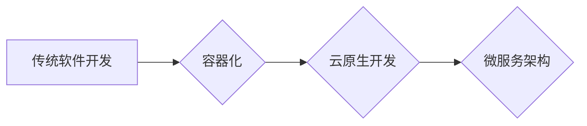

> 容器化、云原生、微服务、Docker、Kubernetes、DevOps、CI/CD

## 1. 背景介绍

软件开发行业经历了从传统瀑布式开发到敏捷开发的巨大变革，如今，随着云计算技术的蓬勃发展，软件开发模式又迎来了新的变革——云原生开发。云原生开发是一种基于云计算平台的软件开发理念和实践，它强调利用云平台的弹性、可扩展性和高可用性，构建灵活、可维护、可扩展的软件系统。

容器化技术作为云原生开发的核心技术之一，为软件开发带来了革命性的改变。容器技术将应用程序及其所有依赖项打包成一个独立的单元，可以轻松地在不同的环境中运行，从而简化了软件部署和管理，提高了开发效率。

## 2. 核心概念与联系

### 2.1 容器化

容器化是一种软件打包和部署的技术，它将应用程序及其所有依赖项（库、框架、运行时环境等）打包成一个独立的单元，称为容器。容器可以像独立的进程一样运行，并且可以共享宿主机器的内核资源，从而实现资源隔离和高效利用。

### 2.2 云原生

云原生是一种基于云计算平台的软件开发理念和实践，它强调利用云平台的弹性、可扩展性和高可用性，构建灵活、可维护、可扩展的软件系统。云原生开发通常采用微服务架构、容器化技术、DevOps文化等现代化技术。

### 2.3 微服务

微服务是一种软件架构风格，它将大型应用程序分解成多个小型、独立的服务，每个服务负责特定的业务功能。微服务之间通过轻量级的通信协议（如RESTful API）进行交互。微服务架构具有高可维护性、高扩展性和高容错性等优点。

**容器化与云原生之间的关系**

容器化技术是云原生开发的重要组成部分。容器化技术可以帮助实现微服务架构，简化软件部署和管理，提高开发效率。云原生平台通常提供容器编排工具（如Kubernetes）和服务发现机制，支持微服务架构的构建和运行。

**Mermaid 流程图**



## 3. 核心算法原理 & 具体操作步骤

### 3.1 算法原理概述

容器化技术的核心算法原理是将应用程序及其所有依赖项打包成一个独立的单元，并使用容器运行时环境（如Docker）运行容器。容器运行时环境负责管理容器的生命周期、资源分配和网络连接等。

### 3.2 算法步骤详解

1. **构建镜像:** 将应用程序及其所有依赖项打包成一个镜像文件。镜像文件包含应用程序代码、库、框架、运行时环境等所有必要信息。
2. **运行容器:** 使用容器运行时环境运行镜像文件，创建出一个容器实例。容器实例运行在宿主机器上，但与宿主机器隔离，拥有独立的资源和网络空间。
3. **管理容器:** 使用容器编排工具（如Kubernetes）管理容器实例的生命周期、资源分配、网络连接等。

### 3.3 算法优缺点

**优点:**

* **资源隔离:** 容器可以将应用程序和其依赖项隔离，避免相互干扰。
* **高效利用资源:** 容器可以共享宿主机器的内核资源，提高资源利用率。
* **简化部署:** 容器可以轻松地在不同的环境中运行，简化软件部署和管理。
* **提高开发效率:** 容器化技术可以简化开发流程，提高开发效率。

**缺点:**

* **安全风险:** 容器化技术可能会增加安全风险，需要采取相应的安全措施。
* **复杂性:** 容器化技术可能会增加系统复杂性，需要专业的技术人员进行管理。

### 3.4 算法应用领域

容器化技术广泛应用于各种领域，例如：

* **Web 应用开发:** 容器化可以简化Web应用的部署和管理，提高应用的可用性和弹性。
* **数据分析:** 容器化可以帮助构建数据分析平台，提高数据处理效率。
* **机器学习:** 容器化可以帮助构建机器学习平台，简化模型训练和部署。

## 4. 数学模型和公式 & 详细讲解 & 举例说明

### 4.1 数学模型构建

容器化技术可以抽象为一个资源分配模型，其中容器作为资源消费者，宿主机器作为资源提供者。

**资源分配模型:**

```
R = Σ(C_i * r_i)
```

其中：

* R: 宿主机器的总资源量
* C_i: 第 i 个容器的数量
* r_i: 第 i 个容器所需的资源量

### 4.2 公式推导过程

资源分配模型的推导过程基于以下假设：

* 宿主机器的资源量是有限的。
* 每个容器所需的资源量是固定的。
* 容器之间相互独立，不会互相影响资源使用。

根据这些假设，我们可以推导出资源分配模型公式。

### 4.3 案例分析与讲解

假设一个宿主机器有 10 个 CPU 核，每个容器需要 1 个 CPU 核。如果部署了 5 个容器，则资源分配模型可以计算出：

```
R = 10 (CPU 核)
C_i = 5 (容器数量)
r_i = 1 (CPU 核)

R = Σ(C_i * r_i) = 5 * 1 = 5 (CPU 核)
```

因此，5 个容器共占用 5 个 CPU 核，剩余 5 个 CPU 核可以用于其他任务。

## 5. 项目实践：代码实例和详细解释说明

### 5.1 开发环境搭建

* 安装 Docker 和 Docker Compose
* 安装 Kubernetes

### 5.2 源代码详细实现

```dockerfile
FROM ubuntu:latest

# 安装依赖软件
RUN apt-get update && apt-get install -y nginx

# 复制应用程序代码
COPY . /usr/share/nginx/html

# 设置启动命令
CMD ["nginx", "-g", "daemon off;"]
```

### 5.3 代码解读与分析

* `FROM ubuntu:latest`: 指定镜像基础镜像为 Ubuntu 最新版本。
* `RUN apt-get update && apt-get install -y nginx`: 安装 Nginx Web 服务器。
* `COPY . /usr/share/nginx/html`: 将应用程序代码复制到 Nginx 的默认文档根目录。
* `CMD ["nginx", "-g", "daemon off;"]`: 设置 Nginx 的启动命令，使其以前台模式运行。

### 5.4 运行结果展示

使用 Docker Compose 部署应用程序，并使用 Kubernetes 进行容器编排。

## 6. 实际应用场景

### 6.1 电子商务平台

容器化技术可以帮助电子商务平台构建高可用、高性能的系统，提高用户体验。

### 6.2 金融服务

容器化技术可以帮助金融服务机构构建安全可靠的系统，满足金融行业的严格要求。

### 6.3 游戏开发

容器化技术可以帮助游戏开发商构建高效的开发环境，提高游戏开发效率。

### 6.4 未来应用展望

容器化技术将继续在软件开发领域发挥重要作用，并与其他新兴技术（如 Serverless、人工智能）相结合，构建更加智能、高效的软件系统。

## 7. 工具和资源推荐

### 7.1 学习资源推荐

* Docker 官方文档: https://docs.docker.com/
* Kubernetes 官方文档: https://kubernetes.io/docs/home/

### 7.2 开发工具推荐

* Docker Desktop: https://www.docker.com/products/docker-desktop
* Kubernetes Dashboard: https://kubernetes.io/docs/tasks/tools/dashboard/

### 7.3 相关论文推荐

* The Twelve-Factor App: https://www.12factor.net/
* Building Microservices: https://www.oreilly.com/library/view/building-microservices/9781491969697/

## 8. 总结：未来发展趋势与挑战

### 8.1 研究成果总结

容器化技术已经成为云原生开发的重要组成部分，它简化了软件部署和管理，提高了开发效率。

### 8.2 未来发展趋势

* **容器安全:** 容器安全将成为未来发展的重要趋势，需要开发更加安全的容器技术和安全策略。
* **容器网络:** 容器网络将更加复杂和智能，需要开发更加高效和安全的容器网络解决方案。
* **Serverless 与容器化:** Serverless 和容器化技术将更加融合，构建更加灵活和高效的云原生应用。

### 8.3 面临的挑战

* **容器安全:** 容器化技术可能会增加安全风险，需要采取相应的安全措施。
* **容器管理复杂性:** 容器化技术可能会增加系统复杂性，需要专业的技术人员进行管理。
* **跨平台兼容性:** 容器化技术需要支持跨平台兼容性，才能在不同的环境中运行。

### 8.4 研究展望

未来，容器化技术将继续发展，并与其他新兴技术相结合，构建更加智能、高效的软件系统。

## 9. 附录：常见问题与解答

### 9.1 什么是容器镜像？

容器镜像是一个包含应用程序代码、库、框架、运行时环境等所有必要信息的打包文件。

### 9.2 如何部署容器化应用程序？

可以使用 Docker Compose 或 Kubernetes 等工具部署容器化应用程序。

### 9.3 容器化技术有哪些优势？

容器化技术具有资源隔离、高效利用资源、简化部署、提高开发效率等优势。


作者：禅与计算机程序设计艺术 / Zen and the Art of Computer Programming 
<end_of_turn>