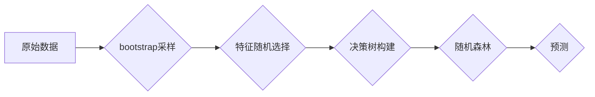

> 随机森林、机器学习、分类、回归、集成学习、决策树、过拟合、特征随机性

## 1. 背景介绍

在机器学习领域，分类和回归任务是两个重要的研究方向。传统的机器学习算法，例如线性回归、逻辑回归等，在某些情况下表现良好，但在面对复杂、高维数据时，往往难以获得理想的预测效果。为了解决这个问题，集成学习方法应运而生。集成学习的核心思想是将多个弱学习器（例如决策树）组合起来，构建一个更强大的强学习器。

随机森林（Random Forests）作为一种非常有效的集成学习算法，在近年来得到了广泛的应用。它通过构建多个决策树，并对每个决策树进行随机采样，最终通过投票或平均的方式进行预测。随机森林算法具有以下优点：

* **高准确率:** 随机森林通常能够获得比单个决策树更高的预测准确率。
* **鲁棒性:** 随机森林对噪声数据和异常值具有较强的鲁棒性。
* **可解释性:** 虽然随机森林是一个复杂的算法，但可以通过分析决策树的特征重要性来理解模型的决策过程。
* **并行化:** 随机森林算法可以并行化训练，从而提高训练效率。

## 2. 核心概念与联系

**2.1 决策树**

决策树是一种树形结构的机器学习模型，它通过一系列的决策节点和叶子节点来进行分类或回归。每个决策节点代表一个特征，每个叶子节点代表一个类别或一个预测值。决策树的构建过程通常使用ID3、C4.5或CART等算法。

**2.2 集成学习**

集成学习是指将多个机器学习模型组合起来，以提高模型的预测性能。常见的集成学习方法包括bagging、boosting和stacking。

**2.3 随机森林**

随机森林是一种基于bagging和特征随机性的集成学习算法。它通过以下步骤构建多个决策树：

1. 从原始数据集中随机抽取样本，构建一个bootstrap样本集。
2. 在每个bootstrap样本集上构建一个决策树，并在每个决策节点选择一个随机子集的特征进行划分。
3. 将所有决策树组合起来，形成一个随机森林模型。

**2.4 流程图**



## 3. 核心算法原理 & 具体操作步骤

### 3.1 算法原理概述

随机森林算法的核心思想是通过构建多个决策树，并对每个决策树进行随机采样，最终通过投票或平均的方式进行预测。

* **Bootstrap采样:** 从原始数据集中随机抽取样本，构建一个bootstrap样本集。每个样本集都包含原始数据集中所有样本的重复，但每个样本只被选取一次。
* **特征随机性:** 在每个决策节点选择一个随机子集的特征进行划分。这有助于减少决策树之间的相关性，从而提高随机森林的泛化能力。

### 3.2 算法步骤详解

1. **数据预处理:** 对原始数据进行清洗、转换和特征工程等预处理操作。
2. **bootstrap采样:** 从原始数据集中随机抽取样本，构建多个bootstrap样本集。
3. **特征随机选择:** 在每个决策节点选择一个随机子集的特征进行划分。
4. **决策树构建:** 在每个bootstrap样本集上构建一个决策树。
5. **预测:** 对新的数据进行预测时，将每个决策树的预测结果进行投票或平均，得到最终的预测结果。

### 3.3 算法优缺点

**优点:**

* 高准确率
* 鲁棒性
* 可解释性
* 并行化

**缺点:**

* 训练时间较长
* 存储空间较大

### 3.4 算法应用领域

随机森林算法广泛应用于以下领域:

* **图像识别:** 人脸识别、物体检测、图像分类
* **自然语言处理:** 文本分类、情感分析、机器翻译
* **金融领域:** 欺诈检测、信用评分、风险评估
* **医疗领域:** 疾病诊断、药物发现、患者风险预测

## 4. 数学模型和公式 & 详细讲解 & 举例说明

### 4.1 数学模型构建

随机森林模型可以看作是一个多个决策树的集合，每个决策树的预测结果通过投票或平均的方式进行组合。

假设我们有N个决策树，每个决策树对样本x的预测结果为h_i(x)，其中i=1,2,...,N。随机森林模型的预测结果为：

```
H(x) = argmax_{c} Σ_{i=1}^{N} I(h_i(x) = c)
```

其中，argmax表示找到使表达式最大化的值，I(a)表示布尔函数，当a为真时返回1，否则返回0。

### 4.2 公式推导过程

随机森林模型的预测结果是通过投票或平均的方式得到的。

* **投票:** 对于分类任务，每个决策树对样本x的预测结果为一个类别，随机森林模型将所有决策树的预测结果进行投票，选择出现次数最多的类别作为最终预测结果。
* **平均:** 对于回归任务，每个决策树对样本x的预测结果为一个数值，随机森林模型将所有决策树的预测结果进行平均，得到最终预测结果。

### 4.3 案例分析与讲解

假设我们有一个包含三个类别的数据集，我们构建了一个包含三个决策树的随机森林模型。

* 决策树1对样本x的预测结果为类别A。
* 决策树2对样本x的预测结果为类别B。
* 决策树3对样本x的预测结果为类别A。

根据投票规则，随机森林模型的预测结果为类别A。

## 5. 项目实践：代码实例和详细解释说明

### 5.1 开发环境搭建

* Python 3.6+
* scikit-learn库

### 5.2 源代码详细实现

```python
from sklearn.ensemble import RandomForestClassifier
from sklearn.datasets import load_iris
from sklearn.model_selection import train_test_split

# 加载iris数据集
iris = load_iris()
X = iris.data
y = iris.target

# 将数据划分为训练集和测试集
X_train, X_test, y_train, y_test = train_test_split(X, y, test_size=0.2, random_state=42)

# 创建随机森林分类器
rf_classifier = RandomForestClassifier(n_estimators=100, random_state=42)

# 训练模型
rf_classifier.fit(X_train, y_train)

# 预测测试集
y_pred = rf_classifier.predict(X_test)

# 评估模型性能
from sklearn.metrics import accuracy_score
accuracy = accuracy_score(y_test, y_pred)
print(f"模型准确率: {accuracy}")
```

### 5.3 代码解读与分析

* **加载数据集:** 使用`load_iris()`函数加载iris数据集。
* **数据划分:** 使用`train_test_split()`函数将数据划分为训练集和测试集。
* **创建模型:** 使用`RandomForestClassifier()`函数创建随机森林分类器，设置参数`n_estimators`为100，表示构建100棵决策树。
* **训练模型:** 使用`fit()`函数训练模型。
* **预测测试集:** 使用`predict()`函数对测试集进行预测。
* **评估模型性能:** 使用`accuracy_score()`函数计算模型的准确率。

### 5.4 运行结果展示

运行以上代码，可以得到模型的准确率。

## 6. 实际应用场景

随机森林算法在许多实际应用场景中都取得了很好的效果。

* **图像识别:** 随机森林可以用于人脸识别、物体检测、图像分类等任务。
* **自然语言处理:** 随机森林可以用于文本分类、情感分析、机器翻译等任务。
* **金融领域:** 随机森林可以用于欺诈检测、信用评分、风险评估等任务。
* **医疗领域:** 随机森林可以用于疾病诊断、药物发现、患者风险预测等任务。

### 6.4 未来应用展望

随着机器学习技术的不断发展，随机森林算法的应用场景将会更加广泛。

* **更复杂的模型:** 研究人员正在探索构建更复杂的随机森林模型，例如使用深度学习技术来构建决策树。
* **更有效的算法:** 研究人员正在探索更有效的随机森林算法，例如使用并行化技术来加速训练过程。
* **新的应用领域:** 随机森林算法将会应用于更多新的领域，例如自动驾驶、机器人等。

## 7. 工具和资源推荐

### 7.1 学习资源推荐

* **书籍:**
    * The Elements of Statistical Learning
    * Introduction to Machine Learning
* **在线课程:**
    * Coursera: Machine Learning
    * edX: Introduction to Machine Learning with Python

### 7.2 开发工具推荐

* **Python:** 
* **scikit-learn:** Python机器学习库，包含随机森林算法的实现。
* **TensorFlow:** 深度学习框架，可以用于构建更复杂的随机森林模型。

### 7.3 相关论文推荐

* Breiman, L. (2001). Random forests. Machine learning, 45(1), 5-32.
* Liaw, A., & Wiener, M. (2002). Classification and regression by randomForest. R News, 2(3), 18-22.

## 8. 总结：未来发展趋势与挑战

### 8.1 研究成果总结

随机森林算法是一种非常有效的集成学习算法，在许多实际应用场景中都取得了很好的效果。

### 8.2 未来发展趋势

随机森林算法的未来发展趋势包括构建更复杂的模型、探索更有效的算法、应用于更多新的领域。

### 8.3 面临的挑战

随机森林算法也面临一些挑战，例如训练时间较长、存储空间较大、可解释性较差等。

### 8.4 研究展望

未来研究将集中在解决随机森林算法的挑战，例如探索更有效的训练算法、提高模型的可解释性、应用于更复杂的数据集等。

## 9. 附录：常见问题与解答

**Q1: 随机森林算法的训练时间较长，如何提高训练效率？**

**A1:** 可以使用并行化技术来加速训练过程，例如使用多核CPU或GPU进行训练。

**Q2: 随机森林算法的存储空间较大，如何减少存储空间？**

**A2:** 可以使用模型压缩技术来减少模型的大小，例如使用量化技术或剪枝技术。

**Q3: 随机森林算法的可解释性较差，如何提高模型的可解释性？**

**A3:** 可以使用特征重要性分析来了解模型的决策过程，也可以使用局部解释方法来解释单个预测结果。


作者：禅与计算机程序设计艺术 / Zen and the Art of Computer Programming 
<end_of_turn>