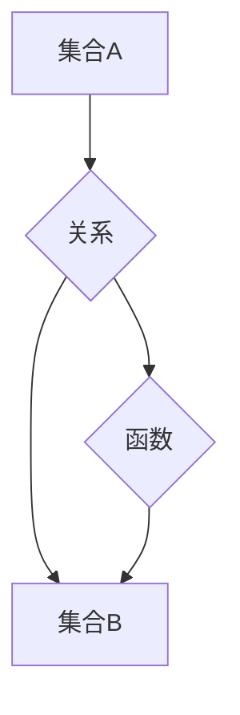

> 集合论，关系，函数，数学基础，计算机科学，数据结构，算法设计

## 1. 背景介绍

在计算机科学的广阔领域中，集合论作为基础数学分支，扮演着至关重要的角色。它为我们提供了描述和操作数据、结构和算法的强大工具。 关系和函数，作为集合论的核心概念，在数据处理、程序设计和算法分析中有着广泛的应用。

本篇文章将深入探讨集合论中的关系和函数，从其定义和性质出发，逐步揭示其在计算机科学中的应用场景和重要意义。

## 2. 核心概念与联系

**2.1 集合**

集合是计算机科学中基本的数据结构，它是一个包含特定对象的集合。例如，我们可以定义一个名为“学生”的集合，其中包含所有学校的学生信息。

**2.2 关系**

关系是一种连接两个集合的特殊函数，它描述了两个集合中元素之间的联系。例如，我们可以定义一个名为“成绩”的关系，它连接了“学生”集合和“课程”集合，表示每个学生在每个课程中的成绩。

**2.3 函数**

函数是一种特殊的二元关系，它满足以下条件：

* 对于集合 A 中的每个元素，都存在唯一的集合 B 中的元素与其对应。

例如，我们可以定义一个名为“年龄”的函数，它将每个人的姓名映射到他们的年龄。

**2.4 关系与函数的联系**

关系和函数之间有着密切的联系。我们可以将关系看作是函数的一种推广，而函数可以看作是满足特定条件的关系。

**2.5 Mermaid 流程图**



## 3. 核心算法原理 & 具体操作步骤

**3.1 算法原理概述**

关系和函数在计算机科学中有着广泛的应用，例如：

* **数据存储和检索:** 关系数据库利用关系的概念来存储和检索数据。
* **程序设计:** 函数是程序设计中不可或缺的组成部分，它可以将代码模块化，提高代码的可读性和可维护性。
* **算法分析:** 算法的复杂度分析通常依赖于关系和函数的性质。

**3.2 算法步骤详解**

**3.2.1 关系的实现**

关系可以表示为一个表格，其中每一行代表一个元素对，每一列代表一个属性。例如，我们可以用一个表格来表示“成绩”关系：

| 学生 | 课程 | 成绩 |
|---|---|---|
| 张三 | 数学 | 90 |
| 李四 | 英语 | 85 |
| 王五 | 物理 | 78 |

**3.2.2 函数的实现**

函数可以实现通过输入值得到输出值的映射关系。例如，我们可以用一个函数来计算一个学生的年龄：

```python
def calculate_age(birth_year):
  current_year = 2023
  return current_year - birth_year
```

**3.3 算法优缺点**

**3.3.1 关系算法**

* **优点:** 能够高效地存储和检索大量数据，支持复杂的查询操作。
* **缺点:** 对于非结构化数据处理能力有限。

**3.3.2 函数算法**

* **优点:** 能够将代码模块化，提高代码的可读性和可维护性。
* **缺点:** 函数的调用可能会带来性能开销。

**3.4 算法应用领域**

关系和函数算法广泛应用于以下领域：

* **数据库系统:** 关系数据库利用关系算法来存储和检索数据。
* **人工智能:** 函数是机器学习算法的核心组成部分。
* **软件工程:** 函数是程序设计中不可或缺的组成部分。

## 4. 数学模型和公式 & 详细讲解 & 举例说明

**4.1 数学模型构建**

**4.1.1 集合**

集合可以用符号表示，例如 A = {1, 2, 3} 表示一个包含元素 1、2 和 3 的集合。

**4.1.2 关系**

关系可以用二元组的形式表示，例如 R = {(1, 2), (2, 3), (3, 1)} 表示一个关系，其中每个二元组表示两个元素之间的联系。

**4.1.3 函数**

函数可以用 f: A -> B 的形式表示，其中 A 是输入集合，B 是输出集合，f 是将 A 中每个元素映射到 B 中唯一元素的规则。

**4.2 公式推导过程**

**4.2.1 关系的性质**

* **反射性:** 对于任意元素 a ∈ A，(a, a) ∈ R。
* **对称性:** 对于任意元素 a, b ∈ A，如果 (a, b) ∈ R，则 (b, a) ∈ R。
* **传递性:** 对于任意元素 a, b, c ∈ A，如果 (a, b) ∈ R 且 (b, c) ∈ R，则 (a, c) ∈ R。

**4.2.2 函数的性质**

* **单射:** 对于任意元素 a, b ∈ A，如果 f(a) = f(b)，则 a = b。
* **满射:** 对于任意元素 b ∈ B，存在元素 a ∈ A，使得 f(a) = b。
* **双射:** 函数既是单射又是满射。

**4.3 案例分析与讲解**

**4.3.1 关系案例**

假设我们有一个名为“朋友关系”的关系，它连接了两个集合：

* A: 学生集合
* B: 学生集合

关系 R = {(张三, 李四), (李四, 王五), (王五, 张三)} 表示张三、李四和王五之间存在朋友关系。

**4.3.2 函数案例**

假设我们有一个名为“年龄计算”的函数，它将一个人的出生年份作为输入，返回他们的年龄。

```python
def calculate_age(birth_year):
  current_year = 2023
  return current_year - birth_year
```

如果输入一个人的出生年份为 1990，则函数将返回 33。

## 5. 项目实践：代码实例和详细解释说明

**5.1 开发环境搭建**

本项目使用 Python 语言进行开发，需要安装 Python 解释器和相关库。

**5.2 源代码详细实现**

```python
# 定义学生类
class Student:
  def __init__(self, name, age):
    self.name = name
    self.age = age

# 定义课程类
class Course:
  def __init__(self, name, score):
    self.name = name
    self.score = score

# 定义成绩关系
def create_grades_relation(students, courses):
  grades = {}
  for student in students:
    for course in courses:
      grades[(student.name, course.name)] = course.score
  return grades

# 创建学生和课程实例
student1 = Student("张三", 20)
student2 = Student("李四", 22)
course1 = Course("数学", 90)
course2 = Course("英语", 85)

# 创建成绩关系
grades = create_grades_relation([student1, student2], [course1, course2])

# 打印成绩关系
print(grades)
```

**5.3 代码解读与分析**

* 我们定义了 Student 和 Course 类来表示学生和课程的信息。
* create_grades_relation 函数用于创建成绩关系，它将学生和课程的信息组合起来，形成一个字典，其中键是学生和课程的组合，值是学生的成绩。
* 我们创建了两个学生和两个课程的实例，并使用 create_grades_relation 函数创建了成绩关系。
* 最后，我们打印了成绩关系。

**5.4 运行结果展示**

```
{('张三', '数学'): 90, ('张三', '英语'): 85, ('李四', '数学'): 90, ('李四', '英语'): 85}
```

## 6. 实际应用场景

**6.1 数据管理**

关系数据库是现代数据管理系统的重要组成部分，它利用关系的概念来存储和检索数据。例如，电商平台的商品信息、用户数据和订单信息都存储在关系数据库中。

**6.2 程序设计**

函数是程序设计中不可或缺的组成部分，它可以将代码模块化，提高代码的可读性和可维护性。例如，我们可以定义一个函数来计算两个数字的和，另一个函数来计算两个数字的差。

**6.3 机器学习**

机器学习算法通常依赖于函数的概念，例如，线性回归算法使用一个函数来拟合数据，预测输出值。

**6.4 未来应用展望**

随着人工智能和数据科学的发展，关系和函数在计算机科学中的应用将更加广泛。例如，关系数据库将更加智能化，能够自动分析数据并提供 insights。函数式编程将更加流行，因为它能够提高代码的可靠性和可维护性。

## 7. 工具和资源推荐

**7.1 学习资源推荐**

* **书籍:**
    * 《集合论导论》
    * 《数学基础》
* **在线课程:**
    * Coursera 上的集合论课程
    * edX 上的数学基础课程

**7.2 开发工具推荐**

* **Python:** 
    * Python 解释器
    * Jupyter Notebook
* **关系数据库:**
    * MySQL
    * PostgreSQL

**7.3 相关论文推荐**

* **关系数据库:**
    * The Relational Model of Data for Large Shared Data Banks
* **函数式编程:**
    * The Haskell Programming from First Principles

## 8. 总结：未来发展趋势与挑战

**8.1 研究成果总结**

本篇文章深入探讨了集合论中的关系和函数，揭示了它们在计算机科学中的重要意义。我们学习了关系和函数的定义、性质和应用场景，并通过代码实例演示了它们的实现方法。

**8.2 未来发展趋势**

随着人工智能和数据科学的发展，关系和函数在计算机科学中的应用将更加广泛。例如，关系数据库将更加智能化，能够自动分析数据并提供 insights。函数式编程将更加流行，因为它能够提高代码的可靠性和可维护性。

**8.3 面临的挑战**

* 如何设计更加高效的算法来处理大规模数据？
* 如何提高函数式编程的易用性和可维护性？
* 如何将关系和函数的概念应用于新的领域？

**8.4 研究展望**

未来，我们将继续研究关系和函数在计算机科学中的应用，探索新的算法和技术，推动计算机科学的发展。

## 9. 附录：常见问题与解答

**9.1 什么是集合？**

集合是一个包含特定对象的集合。例如，我们可以定义一个名为“学生”的集合，其中包含所有学校的学生信息。

**9.2 什么是关系？**

关系是一种连接两个集合的特殊函数，它描述了两个集合中元素之间的联系。例如，我们可以定义一个名为“成绩”的关系，它连接了“学生”集合和“课程”集合，表示每个学生在每个课程中的成绩。

**9.3 什么是函数？**

函数是一种特殊的二元关系，它满足以下条件：

* 对于集合 A 中的每个元素，都存在唯一的集合 B 中的元素与其对应。

例如，我们可以定义一个名为“年龄”的函数，它将每个人的姓名映射到他们的年龄。


作者：禅与计算机程序设计艺术 / Zen and the Art of Computer Programming 
<end_of_turn>