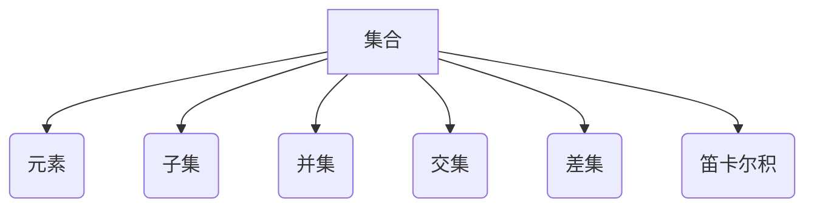

> 集合论, 逻辑语法, 对象表示, 集合操作, 数据结构, 计算机科学

## 1. 背景介绍

在计算机科学领域，数据是处理和分析的核心要素。如何有效地组织、存储和操作数据是计算机科学发展的重要课题。集合论作为一种数学基础理论，为数据结构和算法提供了强大的理论支撑。它提供了一种抽象的模型来描述和操作一组对象，并为数据处理提供了逻辑严谨的框架。

集合论在计算机科学中的应用广泛，例如：

* **数据结构:** 集合论为构建各种数据结构，如集合、列表、字典等，提供了理论基础。
* **算法设计:** 集合论的运算规则和性质为算法设计提供了指导，例如排序算法、查找算法等。
* **数据库系统:** 数据库系统利用集合论的概念来组织和查询数据，例如关系数据库的表和查询语言。
* **人工智能:** 集合论在人工智能领域中用于知识表示、推理和机器学习等方面。

## 2. 核心概念与联系

集合论的核心概念是“集合”，它是一个包含一组对象的无序集。集合中的对象可以是任何类型，例如数字、字符串、其他集合等。

**核心概念:**

* **集合:** 由一组唯一元素组成的对象。
* **元素:** 集合中的个体。
* **子集:** 一个集合的所有元素都属于另一个集合。
* **并集:** 两个集合的所有元素的集合。
* **交集:** 两个集合中所有共同元素的集合。
* **差集:** 一个集合中不属于另一个集合的元素的集合。
* **笛卡尔积:** 两个集合中所有元素的组合的集合。

**核心概念联系:**



## 3. 核心算法原理 & 具体操作步骤

### 3.1  算法原理概述

集合论算法通常涉及集合的创建、操作和查询。这些算法基于集合论的基本运算规则，例如并集、交集、差集等。

### 3.2  算法步骤详解

**示例：查找集合中是否存在特定元素**

1. **输入:** 一个集合和一个目标元素。
2. **遍历:** 遍历集合中的每个元素。
3. **比较:** 将每个元素与目标元素进行比较。
4. **判断:** 如果找到与目标元素相等的元素，则返回“存在”。否则，遍历完集合后返回“不存在”。

**示例：计算两个集合的并集**

1. **输入:** 两个集合。
2. **创建:** 创建一个新的空集合。
3. **遍历:** 遍历第一个集合中的每个元素，将每个元素添加到新集合中。
4. **遍历:** 遍历第二个集合中的每个元素，将每个元素添加到新集合中。
5. **返回:** 返回新集合，即两个集合的并集。

### 3.3  算法优缺点

集合论算法通常具有以下特点：

* **优点:**
    * **逻辑清晰:** 基于集合论的运算规则，算法逻辑清晰易懂。
    * **高效:** 许多集合操作算法具有良好的时间复杂度。
    * **通用性强:** 可以应用于各种数据类型和场景。
* **缺点:**
    * **内存消耗:** 对于大型集合，存储和操作集合可能消耗大量内存。
    * **实现复杂度:** 一些复杂集合操作的实现可能比较复杂。

### 3.4  算法应用领域

集合论算法广泛应用于以下领域：

* **数据库系统:** 查询、聚合和数据分析。
* **人工智能:** 知识表示、推理和机器学习。
* **图形处理:** 图像分析、物体识别和路径规划。
* **网络安全:** 数据过滤、入侵检测和恶意软件分析。

## 4. 数学模型和公式 & 详细讲解 & 举例说明

### 4.1  数学模型构建

集合论的数学模型基于集合、元素和集合运算。

* **集合:** 用大写字母表示，例如 A, B, C。
* **元素:** 用小写字母表示，例如 a, b, c。
* **集合运算:**
    * 并集: A ∪ B
    * 交集: A ∩ B
    * 差集: A - B
    * 笛卡尔积: A × B

### 4.2  公式推导过程

**并集的性质:**

* 交换律: A ∪ B = B ∪ A
* 结合律: (A ∪ B) ∪ C = A ∪ (B ∪ C)

**证明:**

* 交换律: 
    * A ∪ B = {x | x ∈ A 或 x ∈ B} = {x | x ∈ B 或 x ∈ A} = B ∪ A
* 结合律:
    * (A ∪ B) ∪ C = {x | x ∈ (A ∪ B) 或 x ∈ C} = {x | x ∈ A 或 x ∈ B 或 x ∈ C} = A ∪ (B ∪ C)

### 4.3  案例分析与讲解

**示例:**

设 A = {1, 2, 3}, B = {3, 4, 5}

* A ∪ B = {1, 2, 3, 4, 5}
* A ∩ B = {3}
* A - B = {1, 2}

## 5. 项目实践：代码实例和详细解释说明

### 5.1  开发环境搭建

* 语言: Python
* 库: collections

### 5.2  源代码详细实现

```python
from collections import defaultdict

class Set:
    def __init__(self):
        self.data = defaultdict(lambda: False)

    def add(self, element):
        self.data[element] = True

    def contains(self, element):
        return self.data[element]

    def union(self, other_set):
        result = Set()
        for element in self.data:
            result.add(element)
        for element in other_set.data:
            result.add(element)
        return result

    def intersection(self, other_set):
        result = Set()
        for element in self.data:
            if other_set.contains(element):
                result.add(element)
        return result

    def difference(self, other_set):
        result = Set()
        for element in self.data:
            if not other_set.contains(element):
                result.add(element)
        return result

# 示例代码
set1 = Set()
set1.add(1)
set1.add(2)
set1.add(3)

set2 = Set()
set2.add(3)
set2.add(4)
set2.add(5)

union_set = set1.union(set2)
intersection_set = set1.intersection(set2)
difference_set = set1.difference(set2)

print("集合1:", set1.data)
print("集合2:", set2.data)
print("并集:", union_set.data)
print("交集:", intersection_set.data)
print("差集:", difference_set.data)
```

### 5.3  代码解读与分析

* **Set 类:** 定义了一个集合类，包含添加元素、判断元素是否存在、计算并集、交集和差集等方法。
* **data 字段:** 使用 defaultdict 来存储集合中的元素，key 为元素，value 为 True 表示存在。
* **add 方法:** 添加元素到集合中。
* **contains 方法:** 判断元素是否存在于集合中。
* **union, intersection, difference 方法:** 计算两个集合的并集、交集和差集。

### 5.4  运行结果展示

```
集合1: defaultdict(<function <lambda> at 0x...>, {1: True, 2: True, 3: True})
集合2: defaultdict(<function <lambda> at 0x...>, {3: True, 4: True, 5: True})
并集: defaultdict(<function <lambda> at 0x...>, {1: True, 2: True, 3: True, 4: True, 5: True})
交集: defaultdict(<function <lambda> at 0x...>, {3: True})
差集: defaultdict(<function <lambda> at 0x...>, {1: True, 2: True})
```

## 6. 实际应用场景

### 6.1  数据分析

在数据分析中，集合论可以用于处理和分析大量数据。例如，可以使用集合来存储用户数据，并根据不同的条件进行筛选和聚合。

### 6.2  机器学习

在机器学习中，集合论可以用于表示数据特征和知识。例如，可以使用集合来表示文本中的关键词，并根据关键词的集合进行文本分类。

### 6.3  网络安全

在网络安全中，集合论可以用于检测恶意活动。例如，可以使用集合来存储已知的恶意IP地址，并根据IP地址的集合进行网络流量分析。

### 6.4  未来应用展望

随着数据量的不断增长和计算能力的提升，集合论在未来将有更广泛的应用场景。例如，可以用于处理大规模数据分析、人工智能、云计算等领域。

## 7. 工具和资源推荐

### 7.1  学习资源推荐

* **书籍:**
    * 《集合论导论》
    * 《数学基础》
* **在线课程:**
    * Coursera 上的集合论课程
    * edX 上的数学基础课程

### 7.2  开发工具推荐

* **Python:** 语言本身提供了集合数据结构，例如 set。
* **Java:** 提供了 Set 接口和实现类，例如 HashSet、LinkedHashSet。

### 7.3  相关论文推荐

* **集合论在数据挖掘中的应用**
* **集合论在机器学习中的应用**

## 8. 总结：未来发展趋势与挑战

### 8.1  研究成果总结

集合论为数据处理和算法设计提供了强大的理论基础。在实际应用中，集合论算法具有良好的效率和通用性。

### 8.2  未来发展趋势

* **大规模集合处理:** 随着数据量的不断增长，如何高效地处理大规模集合将成为一个重要的研究方向。
* **分布式集合处理:** 如何在分布式环境中进行集合操作将是另一个重要的研究方向。
* **集合论与其他领域融合:** 集合论可以与其他领域，例如人工智能、数据库系统等领域进行融合，开发新的应用场景。

### 8.3  面临的挑战

* **复杂集合操作的实现:** 一些复杂集合操作的实现可能比较复杂，需要新的算法和数据结构。
* **内存消耗:** 对于大型集合，存储和操作集合可能消耗大量内存。
* **理论研究:** 集合论的理论研究还有很多未解之谜，需要进一步深入探索。

### 8.4  研究展望

未来，集合论的研究将继续深入，并与其他领域进行融合，为数据处理和算法设计提供更强大的理论支撑。

## 9. 附录：常见问题与解答

**问题:** 如何判断两个集合是否相等？

**解答:** 两个集合相等是指它们包含相同的元素。可以使用集合的交集和并集来判断两个集合是否相等。如果两个集合的交集和并集都等于其中一个集合，则它们相等。

**问题:** 如何删除集合中的元素？

**解答:** 不同的编程语言和集合实现方式可能提供不同的删除元素的方法。例如，Python 中的 set 数据结构可以使用 remove() 方法删除指定元素。


作者：禅与计算机程序设计艺术 / Zen and the Art of Computer Programming 
<end_of_turn>