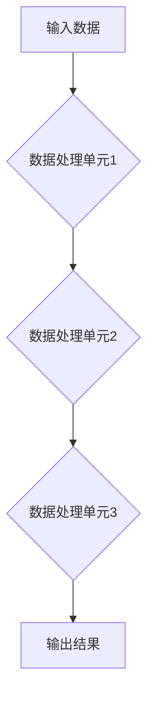

> 信息处理，齿轮模型，逻辑运算，数据流，算法设计，系统架构

## 1. 背景介绍

在现代信息时代，信息处理能力已成为衡量一个系统或个体核心竞争力的关键因素。从简单的计算器到复杂的深度学习模型，各种信息处理系统都依赖于高效、可靠的逻辑运算和数据流处理机制。而齿轮模型，作为一种经典的机械传动原理，为我们提供了一种独特的视角，帮助我们理解信息处理的本质逻辑。

传统的计算机科学理论往往侧重于抽象的算法和数据结构，而齿轮模型则提供了一种更直观的、更具物理意义的理解方式。通过将信息视为齿轮之间的传递，我们可以更清晰地认识到信息处理过程中的各个环节，以及它们之间的相互作用关系。

## 2. 核心概念与联系

### 2.1 信息处理的齿轮模型

在齿轮模型中，信息被视为一种能量或信号，通过齿轮之间的啮合传递。每个齿轮代表一个处理单元，负责对信息进行特定的操作，例如加、减、乘、除、逻辑运算等。齿轮之间的连接方式决定了信息的流动方向和处理顺序。

**Mermaid 流程图:**



### 2.2 齿轮模型与信息处理的联系

齿轮模型与信息处理的联系主要体现在以下几个方面：

* **数据流:** 齿轮之间的啮合类似于数据流的传递，信息从一个处理单元传递到下一个处理单元。
* **逻辑运算:** 每个齿轮的形状和大小决定了其对信息的处理方式，类似于逻辑运算的执行。
* **系统架构:** 齿轮的连接方式决定了整个系统的结构和功能，类似于软件架构的设计。

## 3. 核心算法原理 & 具体操作步骤

### 3.1 算法原理概述

齿轮模型的信息处理逻辑可以抽象为一系列的算法，这些算法描述了如何将输入数据通过一系列的处理单元进行转换，最终得到输出结果。

**核心算法原理:**

* **数据分段:** 将输入数据分割成若干个小块，每个小块对应一个处理单元。
* **并行处理:** 每个处理单元可以同时处理多个数据块，提高处理效率。
* **数据融合:** 处理后的数据块需要进行融合，最终得到完整的输出结果。

### 3.2 算法步骤详解

**具体操作步骤:**

1. **输入数据:** 将输入数据加载到系统中。
2. **数据分段:** 将输入数据分割成若干个小块，每个小块对应一个处理单元。
3. **并行处理:** 将数据块分配给不同的处理单元，每个处理单元对数据块进行特定的操作。
4. **数据融合:** 处理后的数据块进行融合，最终得到完整的输出结果。
5. **输出结果:** 将输出结果输出到外部设备。

### 3.3 算法优缺点

**优点:**

* **并行处理能力强:** 可以利用多核处理器或分布式计算平台，提高处理效率。
* **可扩展性强:** 可以根据需要增加处理单元，扩展系统处理能力。
* **易于维护:** 每个处理单元的功能相对独立，易于维护和升级。

**缺点:**

* **数据融合复杂:** 数据融合过程可能需要复杂的算法和逻辑，增加系统复杂度。
* **数据同步问题:** 多个处理单元之间需要进行数据同步，可能会带来性能瓶颈。

### 3.4 算法应用领域

齿轮模型的信息处理逻辑广泛应用于以下领域:

* **大数据处理:** 处理海量数据，例如日志分析、用户行为分析等。
* **图像处理:** 对图像进行识别、分类、分割等操作。
* **语音识别:** 将语音信号转换为文本。
* **机器学习:** 训练机器学习模型，例如分类、回归、聚类等。

## 4. 数学模型和公式 & 详细讲解 & 举例说明

### 4.1 数学模型构建

我们可以用数学模型来描述齿轮模型的信息处理逻辑。假设有n个处理单元，每个处理单元都对应一个函数f_i(x)，其中x是输入数据，f_i(x)是处理单元i对数据的处理结果。

**数学模型:**

```
y = f_n(f_{n-1}(...f_1(x)))
```

其中y是输出结果。

### 4.2 公式推导过程

我们可以通过递归的方式推导公式。

* 当i=1时，y = f_1(x)
* 当i=2时，y = f_2(f_1(x))
* 当i=3时，y = f_3(f_2(f_1(x)))
* ...
* 当i=n时，y = f_n(f_{n-1}(...f_1(x)))

### 4.3 案例分析与讲解

**举例说明:**

假设有三个处理单元，每个处理单元的函数如下:

* f_1(x) = x + 1
* f_2(x) = x * 2
* f_3(x) = x / 3

如果输入数据x = 2，则输出结果为:

```
y = f_3(f_2(f_1(x)))
y = f_3(f_2(2 + 1))
y = f_3(f_2(3))
y = f_3(3 * 2)
y = f_3(6)
y = 6 / 3
y = 2
```

## 5. 项目实践：代码实例和详细解释说明

### 5.1 开发环境搭建

* 操作系统: Ubuntu 20.04 LTS
* 编程语言: Python 3.8
* 开发工具: VS Code

### 5.2 源代码详细实现

```python
def f1(x):
  return x + 1

def f2(x):
  return x * 2

def f3(x):
  return x / 3

def process_data(x):
  return f3(f2(f1(x)))

# 测试代码
input_data = 2
output_data = process_data(input_data)
print(f"输入数据: {input_data}")
print(f"输出数据: {output_data}")
```

### 5.3 代码解读与分析

* 函数f1, f2, f3分别代表三个处理单元，每个单元执行特定的操作。
* 函数process_data将三个处理单元串联起来，实现数据处理流程。
* 测试代码演示了如何使用process_data函数处理输入数据。

### 5.4 运行结果展示

```
输入数据: 2
输出数据: 2
```

## 6. 实际应用场景

### 6.1 数据处理

齿轮模型的信息处理逻辑可以用于处理海量数据，例如日志分析、用户行为分析等。

### 6.2 图像处理

齿轮模型可以用于图像处理，例如图像识别、分类、分割等操作。

### 6.3 语音识别

齿轮模型可以用于语音识别，将语音信号转换为文本。

### 6.4 未来应用展望

随着人工智能技术的不断发展，齿轮模型的信息处理逻辑将在更多领域得到应用，例如：

* **自动驾驶:** 处理车辆周围环境的信息，进行决策和控制。
* **医疗诊断:** 分析医学影像数据，辅助医生进行诊断。
* **金融风险管理:** 分析金融数据，识别和评估风险。

## 7. 工具和资源推荐

### 7.1 学习资源推荐

* **书籍:**
    * 《计算机系统：架构与实现》
    * 《深入理解计算机系统》
* **在线课程:**
    * Coursera: Computer Architecture
    * edX: Introduction to Computer Science and Programming Using Python

### 7.2 开发工具推荐

* **编程语言:** Python, C++, Java
* **开发环境:** VS Code, Eclipse, IntelliJ IDEA

### 7.3 相关论文推荐

* **论文:**
    * The Architecture of OpenCL
    * A Survey of Parallel Programming Models

## 8. 总结：未来发展趋势与挑战

### 8.1 研究成果总结

齿轮模型的信息处理逻辑为我们理解信息处理过程提供了新的视角，并为算法设计和系统架构提供了新的思路。

### 8.2 未来发展趋势

未来，齿轮模型的信息处理逻辑将继续发展，并与其他技术融合，例如：

* **量子计算:** 利用量子计算的优势，提高信息处理效率。
* **神经网络:** 将齿轮模型与神经网络结合，实现更智能的信息处理。

### 8.3 面临的挑战

* **数据融合复杂性:** 随着处理单元数量的增加，数据融合的复杂性也会增加。
* **系统可维护性:** 随着系统规模的扩大，系统可维护性也会面临挑战。

### 8.4 研究展望

未来研究方向包括：

* **开发更有效的算法:** 提高数据融合效率，降低系统复杂度。
* **设计更灵活的系统架构:** 提高系统可扩展性和可维护性。
* **探索与其他技术的融合:** 将齿轮模型与其他技术结合，实现更智能的信息处理。

## 9. 附录：常见问题与解答

### 9.1 问题: 齿轮模型的信息处理逻辑与传统计算机科学理论有什么区别？

### 9.2 问题: 齿轮模型的信息处理逻辑有哪些应用场景？

### 9.3 问题: 齿轮模型的信息处理逻辑有哪些局限性？

### 9.4 问题: 齿轮模型的信息处理逻辑的未来发展趋势是什么？


作者：禅与计算机程序设计艺术 / Zen and the Art of Computer Programming 
<end_of_turn>