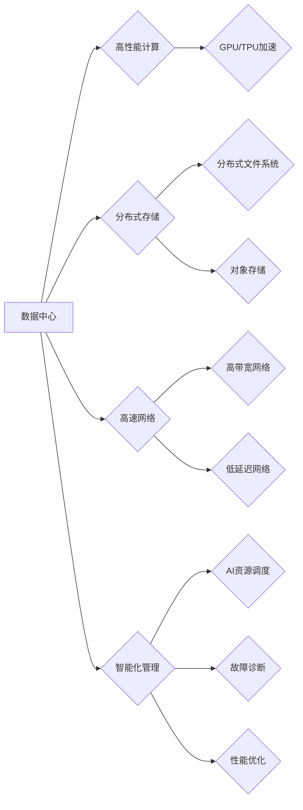

> AI大模型、数据中心、技术创新、高性能计算、分布式存储、人工智能

## 1. 背景介绍

近年来，人工智能（AI）技术取得了飞速发展，特别是大规模语言模型（LLM）的出现，如GPT-3、LaMDA等，展现出强大的文本生成、理解和翻译能力，为各行各业带来了革命性的变革。然而，训练和部署这些庞大的AI模型需要海量数据和强大的计算资源，这推动了数据中心技术向更高效、更高性能的方向发展。

数据中心作为AI应用的基础设施，承担着海量数据存储、计算处理和模型部署等关键任务。随着AI模型规模的不断扩大，传统的数据中心架构面临着诸多挑战，例如：

* **计算能力不足:** 训练大型AI模型需要大量的计算资源，传统数据中心难以满足需求。
* **存储压力巨大:** AI模型参数量庞大，数据存储需求也随之增加，传统存储系统难以应对海量数据存储和访问。
* **网络带宽瓶颈:** 大模型训练和推理需要频繁的数据传输，网络带宽不足会严重影响性能。
* **能源消耗高:** 大规模计算和数据存储会消耗大量的能源，导致数据中心运营成本高昂。

为了应对这些挑战，数据中心技术需要进行创新，构建更高效、更高性能的AI应用平台。

## 2. 核心概念与联系

**2.1 数据中心架构演进**

传统数据中心架构主要采用集中式部署模式，所有计算资源和存储资源集中在少数服务器上。随着AI应用的兴起，数据中心架构逐渐向分布式部署模式转变，将计算资源和存储资源分散到多个节点上，以提高计算能力、存储容量和网络带宽。

**2.2 AI大模型训练与部署**

AI大模型的训练和部署需要协同工作，训练阶段需要大量的计算资源和数据，部署阶段则需要高效的推理引擎和模型优化技术。

**2.3 数据中心技术创新方向**

为了满足AI应用需求，数据中心技术正在朝着以下几个方向进行创新：

* **高性能计算:** 采用GPU、TPU等加速器，提升计算能力。
* **分布式存储:** 利用分布式文件系统和对象存储，提高存储容量和访问速度。
* **高速网络:** 采用高带宽、低延迟的网络技术，保障数据传输效率。
* **智能化管理:** 利用AI技术进行数据中心资源调度、故障诊断和性能优化。

**2.4 数据中心技术架构**



## 3. 核心算法原理 & 具体操作步骤

**3.1 算法原理概述**

深度学习算法是AI大模型的核心，其原理是通过多层神经网络模拟人类大脑的学习过程，从海量数据中提取特征和规律。常见的深度学习算法包括卷积神经网络（CNN）、循环神经网络（RNN）和Transformer等。

**3.2 算法步骤详解**

1. **数据预处理:** 将原始数据进行清洗、转换和格式化，使其适合深度学习算法训练。
2. **模型构建:** 根据任务需求选择合适的深度学习算法，并构建模型结构。
3. **模型训练:** 使用训练数据训练模型，调整模型参数，使其能够准确预测或分类数据。
4. **模型评估:** 使用测试数据评估模型性能，并根据评估结果进行模型调优。
5. **模型部署:** 将训练好的模型部署到生产环境中，用于实际应用。

**3.3 算法优缺点**

**优点:**

* 能够学习复杂的数据模式。
* 性能优于传统机器学习算法。
* 可用于多种任务，例如图像识别、自然语言处理和语音识别。

**缺点:**

* 训练数据量大，计算资源消耗高。
* 模型解释性差，难以理解模型决策过程。
* 对数据质量要求高，数据噪声会影响模型性能。

**3.4 算法应用领域**

深度学习算法广泛应用于各个领域，例如：

* **计算机视觉:** 图像识别、物体检测、图像分割。
* **自然语言处理:** 文本分类、情感分析、机器翻译。
* **语音识别:** 语音转文本、语音助手。
* **医疗诊断:** 病理图像分析、疾病预测。
* **金融分析:** 风险评估、欺诈检测。

## 4. 数学模型和公式 & 详细讲解 & 举例说明

**4.1 数学模型构建**

深度学习模型的数学基础是神经网络，其核心是激活函数、权重和偏置。

* **激活函数:** 用于引入非线性，使神经网络能够学习复杂的数据模式。常见的激活函数包括ReLU、Sigmoid和Tanh等。
* **权重:** 连接神经元之间的参数，决定了信号传递强度。
* **偏置:** 每个神经元的阈值，用于控制神经元的激活。

**4.2 公式推导过程**

深度学习模型的训练过程是通过反向传播算法来优化模型参数的。反向传播算法的核心是计算损失函数对模型参数的梯度，并根据梯度更新模型参数。

损失函数衡量模型预测结果与真实结果之间的差异。常见的损失函数包括均方误差（MSE）、交叉熵损失（Cross-Entropy Loss）等。

**4.3 案例分析与讲解**

以图像分类为例，假设我们有一个包含10个类别的图像数据集，训练一个CNN模型进行图像分类。

* **输入层:** 接收图像数据，每个像素点对应一个神经元。
* **隐藏层:** 提取图像特征，通过卷积、池化和激活函数进行处理。
* **输出层:** 输出每个类别的概率，使用softmax函数将概率归一化到0到1之间。

训练过程中，将图像数据输入模型，计算模型输出与真实标签之间的损失，然后使用反向传播算法更新模型参数，直到损失函数达到最小值。

## 5. 项目实践：代码实例和详细解释说明

**5.1 开发环境搭建**

* 操作系统: Ubuntu 20.04
* 编程语言: Python 3.8
* 深度学习框架: TensorFlow 2.0
* GPU: NVIDIA GeForce RTX 3090

**5.2 源代码详细实现**

```python
import tensorflow as tf

# 定义模型结构
model = tf.keras.models.Sequential([
    tf.keras.layers.Conv2D(32, (3, 3), activation='relu', input_shape=(28, 28, 1)),
    tf.keras.layers.MaxPooling2D((2, 2)),
    tf.keras.layers.Conv2D(64, (3, 3), activation='relu'),
    tf.keras.layers.MaxPooling2D((2, 2)),
    tf.keras.layers.Flatten(),
    tf.keras.layers.Dense(10, activation='softmax')
])

# 编译模型
model.compile(optimizer='adam',
              loss='sparse_categorical_crossentropy',
              metrics=['accuracy'])

# 训练模型
model.fit(x_train, y_train, epochs=10)

# 评估模型
loss, accuracy = model.evaluate(x_test, y_test)
print('Test loss:', loss)
print('Test accuracy:', accuracy)
```

**5.3 代码解读与分析**

* 代码首先定义了一个简单的CNN模型，包含两层卷积层、两层池化层和一层全连接层。
* 然后使用Adam优化器、交叉熵损失函数和准确率指标编译模型。
* 最后使用训练数据训练模型，并使用测试数据评估模型性能。

**5.4 运行结果展示**

训练完成后，模型的准确率会随着训练轮数的增加而提高。

## 6. 实际应用场景

**6.1 图像识别**

AI大模型可以用于识别图像中的物体、场景和人物，应用于自动驾驶、安防监控、医疗诊断等领域。

**6.2 自然语言处理**

AI大模型可以理解和生成自然语言，应用于机器翻译、聊天机器人、文本摘要等领域。

**6.3 语音识别**

AI大模型可以将语音转换为文本，应用于语音助手、语音搜索、听力辅助等领域。

**6.4 其他应用场景**

AI大模型还可以应用于药物研发、金融风险评估、个性化推荐等领域。

**6.5 未来应用展望**

随着AI技术的不断发展，AI大模型的应用场景将会更加广泛，例如：

* **智能家居:** 通过语音控制、图像识别等技术，实现智能家居的自动化和个性化。
* **远程医疗:** 利用AI大模型进行疾病诊断、远程问诊等，提高医疗服务效率和质量。
* **个性化教育:** 根据学生的学习情况，提供个性化的学习内容和辅导。

## 7. 工具和资源推荐

**7.1 学习资源推荐**

* **书籍:**
    * 深度学习
    * 人工智能：一种现代方法
* **在线课程:**
    * Coursera: 深度学习
    * Udacity: AI编程
* **开源项目:**
    * TensorFlow
    * PyTorch

**7.2 开发工具推荐**

* **编程语言:** Python
* **深度学习框架:** TensorFlow, PyTorch
* **数据处理工具:** Pandas, NumPy
* **可视化工具:** Matplotlib, Seaborn

**7.3 相关论文推荐**

* Attention Is All You Need
* BERT: Pre-training of Deep Bidirectional Transformers for Language Understanding
* GPT-3: Language Models are Few-Shot Learners

## 8. 总结：未来发展趋势与挑战

**8.1 研究成果总结**

近年来，AI大模型取得了显著进展，在图像识别、自然语言处理等领域取得了突破性成果。

**8.2 未来发展趋势**

* **模型规模更大:** 随着计算资源的不断提升，AI大模型的规模将会进一步扩大。
* **模型更加通用:** 训练一个通用的AI大模型，能够适应多种任务。
* **模型更加安全可靠:** 提高AI大模型的安全性、可靠性和可解释性。

**8.3 面临的挑战**

* **计算资源需求高:** 训练大型AI模型需要大量的计算资源，成本高昂。
* **数据获取和隐私问题:** AI模型训练需要海量数据，数据获取和隐私保护是一个挑战。
* **模型解释性和可控性:** AI模型的决策过程难以理解，缺乏可控性。

**8.4 研究展望**

未来研究方向包括：

* **高效训练方法:** 开发更有效的训练方法，降低训练成本。
* **联邦学习:** 利用联邦学习技术，在不共享原始数据的情况下训练模型。
* **可解释AI:** 研究AI模型的决策过程，提高模型的可解释性和可控性。

## 9. 附录：常见问题与解答

**9.1 如何选择合适的AI大模型？**

选择合适的AI大模型需要根据具体的应用场景和需求进行考虑，例如：

* **任务类型:** 不同的任务类型需要不同的模型架构。
* **数据规模:** 模型规模需要与数据规模相匹配。
* **计算资源:** 模型训练和部署需要足够的计算资源。

**9.2 如何训练自己的AI大模型？**

训练自己的AI大模型需要具备一定的机器学习和深度学习知识，以及足够的计算资源和数据。

**9.3 如何部署AI大模型？**

AI大模型的部署方式多种多样，可以部署到云端、边缘设备或本地服务器上。

**9.4 如何评估AI大模型的性能？**

AI大模型的性能可以通过准确率、召回率、F1-score等指标进行