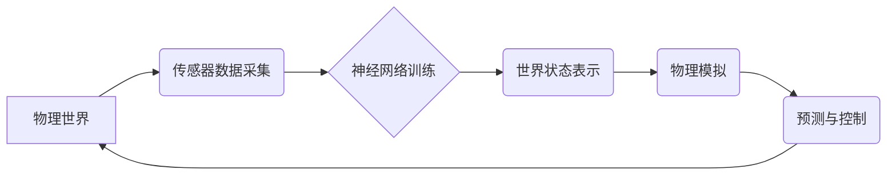

> 世界模型、神经网络、物理模拟、AI计算、深度学习、自然环境

## 1. 背景介绍

在人工智能领域，构建能够理解和交互自然世界的智能体一直是终极目标。而世界模型作为实现这一目标的关键技术，正逐渐成为研究热点。世界模型是指一个 AI 系统对周围环境的认知和理解，它包含了环境的物理属性、动态关系以及各种事件的因果关系。

传统的 AI 系统通常依赖于人工设计的规则和知识库，难以应对复杂、动态的环境变化。而神经网络的出现为构建世界模型提供了新的可能性。通过学习海量数据，神经网络能够自动提取环境的特征和规律，构建出更灵活、更精准的世界模型。

## 2. 核心概念与联系

世界模型的构建本质上是一个将物理世界映射到数字世界的过程。它需要结合物理学、计算机科学、人工智能等多学科的知识。

**核心概念：**

* **物理模拟:**  模拟自然世界物理现象的计算过程，例如运动、碰撞、热传导等。
* **神经网络:**  一种能够学习和处理复杂数据的算法模型，可以用于提取环境特征、预测未来状态等。
* **世界状态表示:**  将环境信息以数字形式表示，例如坐标、速度、温度等。

**架构图:**



## 3. 核心算法原理 & 具体操作步骤

### 3.1  算法原理概述

世界模型的构建通常采用以下算法原理：

* **深度学习:**  利用多层神经网络，从传感器数据中学习环境特征和规律。
* **强化学习:**  通过与环境交互，学习最优的行动策略，以达到预定的目标。
* **物理引擎:**  模拟物理现象，预测环境状态的变化。

### 3.2  算法步骤详解

1. **数据采集:**  使用传感器收集环境数据，例如图像、音频、文本等。
2. **数据预处理:**  对采集到的数据进行清洗、转换、特征提取等处理，使其适合神经网络训练。
3. **神经网络训练:**  利用深度学习算法，训练神经网络模型，使其能够从数据中学习环境特征和规律。
4. **世界状态表示:**  将神经网络的输出结果转换为世界状态表示，例如坐标、速度、温度等。
5. **物理模拟:**  利用物理引擎，根据世界状态表示，模拟环境状态的变化。
6. **预测与控制:**  根据物理模拟的结果，预测未来环境状态，并制定相应的控制策略。

### 3.3  算法优缺点

**优点:**

* 能够学习复杂、动态的环境。
* 能够自动提取环境特征和规律。
* 能够预测未来环境状态。

**缺点:**

* 需要大量的训练数据。
* 计算量大，训练时间长。
* 难以解释模型的决策过程。

### 3.4  算法应用领域

* **机器人控制:**  帮助机器人更好地理解和交互环境，完成复杂的任务。
* **自动驾驶:**  帮助自动驾驶汽车感知周围环境，做出安全决策。
* **虚拟现实:**  构建更加逼真的虚拟环境。
* **游戏开发:**  开发更加智能、更加逼真的游戏角色。

## 4. 数学模型和公式 & 详细讲解 & 举例说明

### 4.1  数学模型构建

世界模型的数学模型通常基于以下几个方面：

* **状态空间:**  描述环境所有可变参数的集合。
* **状态转移函数:**  描述环境状态随时间变化的规律。
* **观测函数:**  描述传感器如何观测环境状态。

### 4.2  公式推导过程

假设环境状态空间为 S，状态转移函数为 f，观测函数为 h。则世界模型的数学描述如下：

* **状态转移:**  s<sub>t+1</sub> = f(s<sub>t</sub>, a<sub>t</sub>)
* **观测:**  o<sub>t</sub> = h(s<sub>t</sub>)

其中：

* s<sub>t</sub> 表示环境在时间 t 的状态。
* a<sub>t</sub> 表示在时间 t 施加的控制输入。
* o<sub>t</sub> 表示在时间 t 的观测数据。

### 4.3  案例分析与讲解

例如，考虑一个简单的机器人导航场景。

* **状态空间:**  机器人位置 (x, y) 和速度 (v<sub>x</sub>, v<sub>y</sub>)。
* **状态转移函数:**  根据机器人速度和控制输入，计算机器人位置和速度的变化。
* **观测函数:**  传感器测量机器人位置和周围环境的障碍物信息。

通过学习上述数学模型，机器人能够根据传感器数据和环境信息，预测未来位置和障碍物信息，并做出相应的控制决策。

## 5. 项目实践：代码实例和详细解释说明

### 5.1  开发环境搭建

* 操作系统: Ubuntu 20.04
* Python 版本: 3.8
* 深度学习框架: TensorFlow 2.x

### 5.2  源代码详细实现

```python
import tensorflow as tf

# 定义神经网络模型
class WorldModel(tf.keras.Model):
    def __init__(self):
        super(WorldModel, self).__init__()
        # 定义神经网络层
        self.dense1 = tf.keras.layers.Dense(128, activation='relu')
        self.dense2 = tf.keras.layers.Dense(64, activation='relu')
        self.output = tf.keras.layers.Dense(10)  # 输出维度根据实际需求调整

    def call(self, inputs):
        x = self.dense1(inputs)
        x = self.dense2(x)
        return self.output(x)

# 实例化模型
model = WorldModel()

# 训练模型
# ...

# 使用模型预测
predictions = model.predict(input_data)
```

### 5.3  代码解读与分析

* 代码定义了一个名为 `WorldModel` 的神经网络模型。
* 模型包含两层全连接层和一层输出层。
* `call` 方法定义了模型的计算过程。
* `predict` 方法用于使用训练好的模型进行预测。

### 5.4  运行结果展示

训练完成后，可以使用模型预测未来环境状态。例如，可以输入当前环境状态和控制输入，模型将输出预测的未来状态。

## 6. 实际应用场景

### 6.1  机器人控制

世界模型可以帮助机器人更好地理解和交互环境，完成复杂的任务。例如，可以训练一个世界模型来帮助机器人导航复杂环境，避开障碍物，并与其他机器人协作完成任务。

### 6.2  自动驾驶

世界模型可以帮助自动驾驶汽车感知周围环境，做出安全决策。例如，可以训练一个世界模型来帮助自动驾驶汽车识别道路标志、交通信号灯、行人和其他车辆，并根据这些信息做出相应的驾驶决策。

### 6.3  虚拟现实

世界模型可以构建更加逼真的虚拟环境。例如，可以训练一个世界模型来模拟一个城市环境，包括建筑物、道路、交通流量等，为用户提供更加沉浸式的虚拟体验。

### 6.4  未来应用展望

随着人工智能技术的不断发展，世界模型的应用场景将会更加广泛。例如，可以利用世界模型来构建更加智能的虚拟助手、更加逼真的游戏角色、更加高效的工业生产系统等。

## 7. 工具和资源推荐

### 7.1  学习资源推荐

* **书籍:**
    * 《深度学习》
    * 《强化学习：原理、算法和应用》
* **在线课程:**
    * Coursera: 深度学习
    * Udacity: 强化学习

### 7.2  开发工具推荐

* **深度学习框架:** TensorFlow, PyTorch
* **物理引擎:** Bullet Physics, PhysX

### 7.3  相关论文推荐

* **世界模型论文:**
    * "Learning a World Model from Pixels"
    * "World Models"

## 8. 总结：未来发展趋势与挑战

### 8.1  研究成果总结

世界模型是人工智能领域的一个重要研究方向，已经取得了一些显著成果。例如，一些研究团队已经成功地训练出能够模拟复杂环境的 world model，并将其应用于机器人控制、自动驾驶等领域。

### 8.2  未来发展趋势

未来，世界模型的研究将朝着以下几个方向发展：

* **模型规模和能力的提升:**  训练更加大型、更加复杂的 world model，使其能够模拟更加复杂的现实世界。
* **多模态感知:**  融合多种传感器数据，例如图像、音频、文本等，构建更加全面的世界模型。
* **可解释性增强:**  提高世界模型的解释性，使其决策过程更加透明可理解。

### 8.3  面临的挑战

世界模型的构建仍然面临一些挑战：

* **数据获取和标注:**  训练高质量的世界模型需要大量的真实世界数据，而获取和标注这些数据非常困难。
* **计算资源:**  训练大型世界模型需要大量的计算资源，这对于资源有限的研究机构来说是一个挑战。
* **模型安全性:**  世界模型的决策可能会影响现实世界，因此需要确保模型的安全性，避免出现不可预知的风险。

### 8.4  研究展望

尽管面临挑战，世界模型的研究前景依然非常广阔。随着人工智能技术的不断发展，相信未来世界模型将会在更多领域发挥重要作用，为我们构建更加智能、更加美好的未来贡献力量。

## 9. 附录：常见问题与解答

**Q1: 世界模型和强化学习有什么关系？**

**A1:** 强化学习是一种训练世界模型的重要方法。通过与环境交互，强化学习算法可以学习最优的行动策略，以达到预定的目标。

**Q2: 世界模型的应用场景有哪些？**

**A2:** 世界模型的应用场景非常广泛，例如机器人控制、自动驾驶、虚拟现实等。

**Q3: 如何构建一个高质量的世界模型？**

**A3:** 构建高质量的世界模型需要大量的真实世界数据、强大的计算资源以及先进的算法模型。


作者：禅与计算机程序设计艺术 / Zen and the Art of Computer Programming 
<end_of_turn>