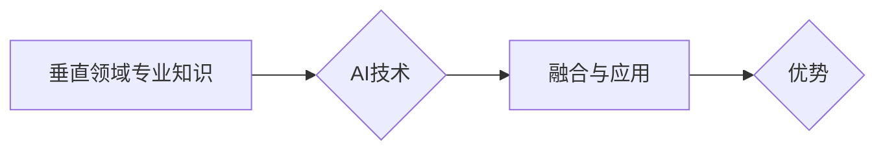

> AI创业,垂直领域,专业知识,行业应用,数据驱动,算法模型,商业价值

## 1. 背景介绍

人工智能（AI）技术近年来发展迅速，已渗透到各个领域，为企业带来了巨大的变革机遇。越来越多的创业者看到了AI的潜力，纷纷涌入AI创业领域。然而，单纯依靠AI技术并不能保证创业成功的概率。 

成功的AI创业需要结合垂直领域的专业知识，才能更好地解决行业痛点，创造独特的商业价值。

## 2. 核心概念与联系

**2.1 垂直领域专业知识**

垂直领域专业知识是指特定行业或领域的专业技能、经验和知识体系。例如，医疗领域专业知识包括医学诊断、疾病治疗、药物研发等；金融领域专业知识包括金融市场分析、风险管理、投资策略等。

**2.2 AI技术**

AI技术是指模拟人类智能的计算机科学领域，包括机器学习、深度学习、自然语言处理、计算机视觉等。

**2.3 融合与应用**

将AI技术与垂直领域专业知识融合，可以赋能行业，提升效率，创造新的商业模式。例如，在医疗领域，AI可以辅助医生进行诊断，预测疾病风险，优化治疗方案；在金融领域，AI可以用于风险评估、欺诈检测、个性化理财等。

**2.4 优势**

AI创业结合垂直领域专业知识的优势：

* **更精准的市场定位:** 深入了解行业需求，精准定位目标客户，提高产品市场竞争力。
* **更有效的解决方案:** 基于行业经验，开发更符合实际需求的AI解决方案，解决行业痛点。
* **更强的商业价值:** 创造独特的行业价值，获得更高的商业回报。

**2.5 流程图**



## 3. 核心算法原理 & 具体操作步骤

**3.1 算法原理概述**

深度学习算法是AI技术的重要组成部分，其核心原理是利用多层神经网络模拟人类大脑的学习过程。通过训练大量的样本数据，深度学习模型可以自动学习特征，并进行预测或分类。

**3.2 算法步骤详解**

1. **数据收集和预处理:** 收集相关领域的数据，并进行清洗、转换、特征提取等预处理工作。
2. **模型构建:** 选择合适的深度学习模型架构，例如卷积神经网络（CNN）、循环神经网络（RNN）等。
3. **模型训练:** 利用训练数据训练深度学习模型，调整模型参数，使其能够准确地进行预测或分类。
4. **模型评估:** 使用测试数据评估模型的性能，例如准确率、召回率、F1-score等。
5. **模型部署:** 将训练好的模型部署到实际应用场景中，用于进行预测或分类。

**3.3 算法优缺点**

**优点:**

* **高准确率:** 深度学习算法能够学习到复杂的特征，从而实现高准确率的预测或分类。
* **自动化学习:** 深度学习模型能够自动学习特征，无需人工特征工程。
* **泛化能力强:** 深度学习模型能够对新的数据进行泛化，具有较强的推广能力。

**缺点:**

* **数据依赖:** 深度学习算法需要大量的训练数据，否则模型性能会下降。
* **计算资源消耗:** 深度学习模型训练需要大量的计算资源，成本较高。
* **可解释性差:** 深度学习模型的决策过程较为复杂，难以解释其决策依据。

**3.4 算法应用领域**

深度学习算法广泛应用于各个领域，例如：

* **图像识别:** 人脸识别、物体检测、图像分类等。
* **自然语言处理:** 文本分类、情感分析、机器翻译等。
* **语音识别:** 语音转文本、语音助手等。
* **医疗诊断:** 疾病诊断、影像分析等。
* **金融风险管理:** 欺诈检测、信用评分等。

## 4. 数学模型和公式 & 详细讲解 & 举例说明

**4.1 数学模型构建**

深度学习模型通常采用多层神经网络结构，每个神经元接收多个输入信号，并通过激活函数进行处理，输出一个信号。神经网络的训练过程是通过调整神经元权重和偏置，使得模型输出与真实值之间的误差最小化。

**4.2 公式推导过程**

深度学习模型的训练过程通常使用反向传播算法，其核心公式包括：

* **损失函数:** 用于衡量模型预测值与真实值之间的误差。常见的损失函数包括均方误差（MSE）、交叉熵损失等。
* **梯度下降:** 用于更新模型参数，使其朝着损失函数最小化的方向进行调整。

**4.3 案例分析与讲解**

例如，在图像分类任务中，可以使用卷积神经网络（CNN）模型。CNN模型通过卷积层和池化层提取图像特征，并通过全连接层进行分类。损失函数可以使用交叉熵损失，梯度下降算法可以使用随机梯度下降（SGD）或其变种算法。

## 5. 项目实践：代码实例和详细解释说明

**5.1 开发环境搭建**

使用Python语言和深度学习框架TensorFlow或PyTorch进行开发。

**5.2 源代码详细实现**

```python
# 使用TensorFlow构建一个简单的图像分类模型
import tensorflow as tf

# 定义模型结构
model = tf.keras.models.Sequential([
    tf.keras.layers.Conv2D(32, (3, 3), activation='relu', input_shape=(28, 28, 1)),
    tf.keras.layers.MaxPooling2D((2, 2)),
    tf.keras.layers.Conv2D(64, (3, 3), activation='relu'),
    tf.keras.layers.MaxPooling2D((2, 2)),
    tf.keras.layers.Flatten(),
    tf.keras.layers.Dense(10, activation='softmax')
])

# 编译模型
model.compile(optimizer='adam',
              loss='sparse_categorical_crossentropy',
              metrics=['accuracy'])

# 训练模型
model.fit(x_train, y_train, epochs=5)

# 评估模型
loss, accuracy = model.evaluate(x_test, y_test)
print('Test loss:', loss)
print('Test accuracy:', accuracy)
```

**5.3 代码解读与分析**

代码示例展示了使用TensorFlow构建一个简单的图像分类模型的过程。模型结构包括卷积层、池化层和全连接层。训练过程使用Adam优化器、交叉熵损失函数和准确率作为评估指标。

**5.4 运行结果展示**

训练完成后，模型可以用于对新的图像进行分类。

## 6. 实际应用场景

**6.1 医疗领域**

* **疾病诊断:** 利用AI技术分析患者的影像数据，辅助医生进行疾病诊断。
* **药物研发:** 利用AI技术加速药物研发过程，例如预测药物的有效性、安全性等。
* **个性化医疗:** 根据患者的基因信息、生活习惯等数据，提供个性化的医疗方案。

**6.2 金融领域**

* **风险评估:** 利用AI技术分析客户的信用信息，评估其贷款风险。
* **欺诈检测:** 利用AI技术识别金融交易中的欺诈行为。
* **个性化理财:** 根据客户的投资目标、风险承受能力等数据，提供个性化的理财建议。

**6.3 其他领域**

* **制造业:** 利用AI技术进行设备故障预测、生产过程优化等。
* **零售业:** 利用AI技术进行商品推荐、库存管理等。
* **教育行业:** 利用AI技术进行个性化学习、智能辅导等。

**6.4 未来应用展望**

随着AI技术的不断发展，其应用场景将更加广泛，例如：

* **自动驾驶:** 利用AI技术实现自动驾驶汽车。
* **机器人:** 利用AI技术开发更加智能的机器人。
* **虚拟助手:** 利用AI技术开发更加智能的虚拟助手。

## 7. 工具和资源推荐

**7.1 学习资源推荐**

* **在线课程:** Coursera、edX、Udacity等平台提供丰富的AI课程。
* **书籍:** 《深度学习》、《机器学习实战》等书籍。
* **开源项目:** TensorFlow、PyTorch等开源深度学习框架。

**7.2 开发工具推荐**

* **Python:** AI开发的主要编程语言。
* **TensorFlow:** Google开发的开源深度学习框架。
* **PyTorch:** Facebook开发的开源深度学习框架。
* **Jupyter Notebook:** 用于代码编写、数据分析和可视化。

**7.3 相关论文推荐**

* **《ImageNet Classification with Deep Convolutional Neural Networks》**
* **《Attention Is All You Need》**
* **《BERT: Pre-training of Deep Bidirectional Transformers for Language Understanding》**

## 8. 总结：未来发展趋势与挑战

**8.1 研究成果总结**

近年来，AI技术取得了长足的进步，在各个领域都取得了显著的应用成果。深度学习算法成为AI技术的重要驱动力，其应用场景不断扩展。

**8.2 未来发展趋势**

* **模型规模和复杂度提升:** 未来AI模型将更加庞大、复杂，能够处理更加复杂的任务。
* **跨模态学习:** AI模型将能够处理多种模态数据，例如文本、图像、音频等。
* **边缘计算:** AI模型将部署到边缘设备，实现更加实时、高效的应用。

**8.3 面临的挑战**

* **数据安全和隐私保护:** AI模型训练需要大量数据，如何保证数据安全和隐私保护是一个重要挑战。
* **算法可解释性:** 深度学习模型的决策过程较为复杂，难以解释其决策依据，如何提高算法可解释性是一个重要研究方向。
* **伦理问题:** AI技术的发展引发了一些伦理问题，例如算法偏见、工作岗位替代等，需要社会共同探讨和解决。

**8.4 研究展望**

未来，AI技术将继续发展，为人类社会带来更多福祉。我们需要加强基础研究，探索更先进的AI算法和模型；同时，也要关注AI技术的伦理问题，确保其安全、可控、可持续发展。

## 9. 附录：常见问题与解答

**9.1 如何选择合适的深度学习框架？**

选择深度学习框架需要根据实际项目需求和个人经验进行选择。TensorFlow和PyTorch是目前最流行的深度学习框架，各有优缺点。

**9.2 如何处理不平衡数据集？**

不平衡数据集是指类别分布不均匀的数据集。处理不平衡数据集的方法包括：

* **数据采样:** 采用过采样或欠采样技术，平衡类别分布。
* **权重调整:** 给予少数类样本更高的权重，提高其在训练过程中的影响力。
* **算法调整:** 使用专门针对不平衡数据集的算法，例如支持向量机（SVM）等。

**9.3 如何评估深度学习模型的性能？**

深度学习模型的性能可以使用多种指标进行评估，例如：

* **准确率:** 模型正确预测的样本比例。
* **召回率:** 模型识别出所有正样本的比例。
* **F1-score:** 准确率和召回率的调和平均值。
* **AUC:** 曲线下面积，用于评估模型的二分类性能。


作者：禅与计算机程序设计艺术 / Zen and the Art of Computer Programming 
<end_of_turn>