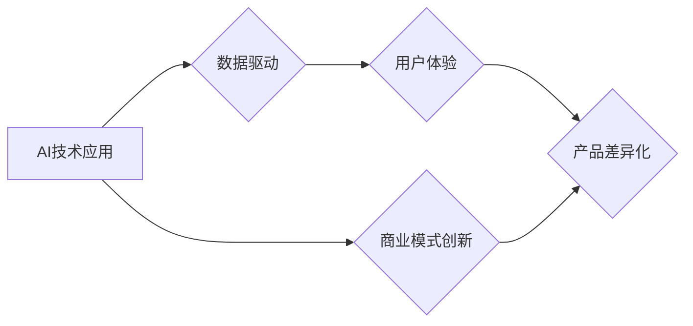

> AI创业,产品差异化,市场竞争,技术创新,商业模式,数据驱动,用户体验

## 1. 背景介绍

人工智能（AI）技术近年来发展迅速，已渗透到各个行业，催生了一批AI创业公司。然而，AI领域的竞争日益激烈，众多公司提供类似的产品和服务，如何实现产品差异化成为AI创业公司面临的重大挑战。

传统商业模式的竞争往往围绕价格、营销和渠道展开，而AI创业公司需要在技术创新、数据驱动和用户体验等方面寻求差异化优势。

## 2. 核心概念与联系

**2.1 产品差异化**

产品差异化是指在满足用户基本需求的同时，通过产品功能、性能、设计、品牌等方面的独特优势，使其与竞争对手的产品区别开来，从而吸引用户并获得市场份额。

**2.2 AI技术应用**

人工智能技术可以应用于各个领域，例如：

* **自然语言处理（NLP）：** 语音识别、机器翻译、文本生成等。
* **计算机视觉（CV）：** 图像识别、物体检测、视频分析等。
* **机器学习（ML）：** 预测分析、推荐系统、个性化服务等。

**2.3 数据驱动**

数据是AI技术的核心驱动力，AI创业公司需要收集、分析和利用海量数据，才能训练出高精度的模型，提供个性化和智能化的服务。

**2.4 用户体验**

用户体验是产品成功的关键因素，AI创业公司需要关注用户需求，设计简洁易用的产品界面，提供流畅的交互体验。

**2.5 商业模式创新**

AI技术可以颠覆传统的商业模式，例如：

* **订阅制：** 用户按月或年付费使用AI服务。
* **平台化：** 建立AI平台，为开发者提供工具和服务。
* **数据交易：** 将用户数据进行匿名化处理，并进行交易。

**2.6 差异化策略**

AI创业公司可以通过以下策略实现产品差异化：

* **技术领先：** 开发独有的AI算法和模型，拥有技术壁垒。
* **数据优势：** 积累海量高质量的数据，训练出更精准的模型。
* **场景聚焦：** 专注于特定行业或场景，提供针对性的解决方案。
* **用户体验优化：** 设计简洁易用的产品界面，提供流畅的交互体验。
* **商业模式创新：** 探索新的商业模式，创造新的价值。

**Mermaid 流程图**



## 3. 核心算法原理 & 具体操作步骤

**3.1 算法原理概述**

深度学习算法是AI领域的核心技术之一，它能够通过多层神经网络学习复杂的模式和关系。

**3.2 算法步骤详解**

1. **数据预处理：** 将原始数据进行清洗、转换和特征提取。
2. **网络结构设计：** 根据任务需求设计多层神经网络结构，包括输入层、隐藏层和输出层。
3. **参数初始化：** 为神经网络参数进行随机初始化。
4. **前向传播：** 将输入数据通过神经网络进行计算，得到输出结果。
5. **反向传播：** 计算输出结果与真实值的误差，并根据误差反向传播，更新神经网络参数。
6. **迭代训练：** 重复前向传播和反向传播的过程，直到模型达到预设的精度。

**3.3 算法优缺点**

**优点：**

* 能够学习复杂的模式和关系。
* 性能优于传统机器学习算法。
* 可应用于多种任务，例如图像识别、自然语言处理等。

**缺点：**

* 需要大量的训练数据。
* 计算量大，训练时间长。
* 模型解释性差，难以理解模型的决策过程。

**3.4 算法应用领域**

* **图像识别：** 人脸识别、物体检测、图像分类等。
* **自然语言处理：** 语音识别、机器翻译、文本生成等。
* **推荐系统：** 产品推荐、内容推荐等。
* **预测分析：** 销售预测、风险评估等。

## 4. 数学模型和公式 & 详细讲解 & 举例说明

**4.1 数学模型构建**

深度学习模型可以看作是一个复杂的数学函数，其输入是数据特征，输出是预测结果。

**4.2 公式推导过程**

深度学习模型的训练过程基于梯度下降算法，其目标是找到最优的参数，使得模型的预测结果与真实值之间的误差最小。

**损失函数：** 用于衡量模型预测结果与真实值的误差。常见的损失函数包括均方误差（MSE）、交叉熵损失（Cross-Entropy Loss）等。

**梯度下降：** 用于更新模型参数的方法，其核心思想是沿着梯度方向调整参数，使得损失函数的值不断减小。

**4.3 案例分析与讲解**

假设我们有一个图像分类任务，目标是将图像分类为猫或狗。我们可以使用卷积神经网络（CNN）作为模型，其结构包括卷积层、池化层和全连接层。

**损失函数：** 我们可以使用交叉熵损失函数来衡量模型预测结果与真实标签之间的误差。

**梯度下降：** 我们可以使用随机梯度下降（SGD）算法来更新模型参数。

## 5. 项目实践：代码实例和详细解释说明

**5.1 开发环境搭建**

* Python 3.x
* TensorFlow 或 PyTorch
* Jupyter Notebook

**5.2 源代码详细实现**

```python
import tensorflow as tf

# 定义模型结构
model = tf.keras.models.Sequential([
    tf.keras.layers.Conv2D(32, (3, 3), activation='relu', input_shape=(28, 28, 1)),
    tf.keras.layers.MaxPooling2D((2, 2)),
    tf.keras.layers.Conv2D(64, (3, 3), activation='relu'),
    tf.keras.layers.MaxPooling2D((2, 2)),
    tf.keras.layers.Flatten(),
    tf.keras.layers.Dense(10, activation='softmax')
])

# 编译模型
model.compile(optimizer='adam',
              loss='sparse_categorical_crossentropy',
              metrics=['accuracy'])

# 训练模型
model.fit(x_train, y_train, epochs=10)

# 评估模型
loss, accuracy = model.evaluate(x_test, y_test)
print('Test loss:', loss)
print('Test accuracy:', accuracy)
```

**5.3 代码解读与分析**

* 代码定义了一个简单的卷积神经网络模型，用于图像分类任务。
* 模型包含卷积层、池化层和全连接层，用于提取图像特征和进行分类。
* 模型使用Adam优化器、交叉熵损失函数和准确率作为评估指标。
* 代码展示了模型的训练和评估过程。

**5.4 运行结果展示**

训练完成后，模型的准确率会随着训练轮数的增加而提高。

## 6. 实际应用场景

**6.1 图像识别**

* **人脸识别：** 用于身份验证、安全监控等。
* **物体检测：** 用于自动驾驶、安防监控等。
* **图像分类：** 用于医疗诊断、产品分类等。

**6.2 自然语言处理**

* **机器翻译：** 将文本从一种语言翻译成另一种语言。
* **文本生成：** 生成自然语言文本，例如文章、对话等。
* **情感分析：** 分析文本的情感倾向，例如正面、负面、中性。

**6.3 其他应用场景**

* **推荐系统：** 根据用户行为推荐产品或内容。
* **预测分析：** 预测未来趋势，例如销售预测、风险评估等。
* **个性化服务：** 提供个性化的产品和服务，例如个性化推荐、定制化服务等。

**6.4 未来应用展望**

AI技术将继续发展，并应用于更多领域，例如：

* **医疗保健：** 辅助诊断、个性化治疗等。
* **教育：** 个性化学习、智能辅导等。
* **金融：** 风险管理、欺诈检测等。

## 7. 工具和资源推荐

**7.1 学习资源推荐**

* **在线课程：** Coursera、edX、Udacity等平台提供丰富的AI课程。
* **书籍：** 《深度学习》、《机器学习实战》等书籍。
* **博客和论坛：** AI社区博客和论坛，例如Towards Data Science、Kaggle等。

**7.2 开发工具推荐**

* **TensorFlow：** 开源深度学习框架。
* **PyTorch：** 开源深度学习框架。
* **Keras：** 高级深度学习API，可以运行在TensorFlow或Theano之上。

**7.3 相关论文推荐**

* **《ImageNet Classification with Deep Convolutional Neural Networks》**
* **《Attention Is All You Need》**
* **《BERT: Pre-training of Deep Bidirectional Transformers for Language Understanding》**

## 8. 总结：未来发展趋势与挑战

**8.1 研究成果总结**

近年来，AI技术取得了显著进展，例如：

* 深度学习算法的性能大幅提升。
* 自然语言处理和计算机视觉领域取得突破性进展。
* AI技术应用于越来越多的领域。

**8.2 未来发展趋势**

* **模型规模和复杂度进一步提升。**
* **模型解释性和可解释性增强。**
* **AI技术与其他技术融合发展，例如：边缘计算、量子计算等。**
* **AI技术应用于更多领域，例如：医疗保健、教育、金融等。**

**8.3 面临的挑战**

* **数据安全和隐私保护。**
* **算法偏见和公平性。**
* **AI技术伦理问题。**
* **人才短缺。**

**8.4 研究展望**

未来，AI研究需要关注以下方面：

* 开发更安全、更可靠、更可解释的AI算法。
* 解决AI技术伦理问题。
* 培养更多AI人才。


## 9. 附录：常见问题与解答

**9.1 如何选择合适的AI算法？**

选择合适的AI算法取决于具体的应用场景和数据特点。

**9.2 如何解决AI模型的过拟合问题？**

可以使用正则化、交叉验证等方法来解决AI模型的过拟合问题。

**9.3 如何评估AI模型的性能？**

可以使用准确率、召回率、F1-score等指标来评估AI模型的性能。


作者：禅与计算机程序设计艺术 / Zen and the Art of Computer Programming 
<end_of_turn>