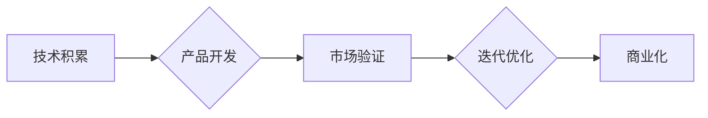

> AI创业,技术积累,行业洞察,团队成长,机器学习,深度学习,自然语言处理,计算机视觉,数据分析

## 1. 背景介绍

人工智能（AI）正以惊人的速度发展，其应用领域不断拓展，从医疗保健到金融，从自动驾驶到个性化教育，AI正在深刻地改变着我们的生活。在这个充满机遇的时代，越来越多的创业团队涌入AI领域，希望抓住这股浪潮，创造出具有颠覆性价值的产品和服务。然而，AI创业之路并非一帆风顺，技术积累与行业洞察的缺失往往成为创业团队面临的重大挑战。

## 2. 核心概念与联系

**2.1 AI创业的核心概念**

AI创业的核心概念包括：

* **机器学习（Machine Learning）：** 算法能够从数据中学习，并根据学习到的知识进行预测或决策。
* **深度学习（Deep Learning）：** 基于多层神经网络的机器学习方法，能够处理更复杂的数据，并取得更优的性能。
* **自然语言处理（Natural Language Processing）：** 使计算机能够理解和处理人类语言。
* **计算机视觉（Computer Vision）：** 使计算机能够“看”图像和视频，并从中提取信息。
* **数据分析（Data Analysis）：** 从数据中发现模式和趋势，并为决策提供支持。

**2.2 AI创业团队的成长路径**

AI创业团队的成长路径可以概括为以下几个阶段：

* **萌芽阶段：** 团队成员确定创业方向，并进行初步的技术探索和市场调研。
* **起步阶段：** 团队搭建核心技术团队，并开发出初步的产品原型。
* **成长阶段：** 团队获得用户反馈，并不断迭代产品，提升产品质量和用户体验。
* **成熟阶段：** 团队建立完善的商业模式，并实现可持续发展。

**2.3 技术积累与行业洞察的联系**

技术积累和行业洞察是AI创业团队成功的关键要素。技术积累为团队提供强大的技术支撑，而行业洞察则帮助团队更好地理解市场需求，并开发出具有市场竞争力的产品。

**2.4 Mermaid 流程图**



## 3. 核心算法原理 & 具体操作步骤

**3.1 算法原理概述**

深度学习算法是AI创业团队的核心技术之一，其原理基于多层神经网络，能够学习数据中的复杂模式。

**3.2 算法步骤详解**

深度学习算法的具体操作步骤包括：

1. **数据预处理：** 将原始数据进行清洗、转换和特征提取。
2. **网络结构设计：** 根据任务需求设计神经网络的结构，包括层数、节点数和激活函数等。
3. **模型训练：** 使用训练数据训练神经网络，调整网络参数，使模型能够准确地预测或分类数据。
4. **模型评估：** 使用测试数据评估模型的性能，并进行调整和优化。
5. **模型部署：** 将训练好的模型部署到实际应用场景中。

**3.3 算法优缺点**

**优点：**

* 能够处理复杂的数据，并取得优异的性能。
* 自动学习特征，无需人工特征工程。
* 具有强大的泛化能力，能够应用于不同的领域。

**缺点：**

* 需要大量的训练数据。
* 训练过程耗时和耗能。
* 模型解释性较差。

**3.4 算法应用领域**

深度学习算法广泛应用于以下领域：

* **图像识别：** 人脸识别、物体检测、图像分类。
* **自然语言处理：** 机器翻译、文本摘要、情感分析。
* **语音识别：** 语音转文本、语音助手。
* **推荐系统：** 商品推荐、内容推荐。

## 4. 数学模型和公式 & 详细讲解 & 举例说明

**4.1 数学模型构建**

深度学习模型通常采用多层神经网络结构，每个神经元接收多个输入信号，并通过激活函数进行处理，输出一个信号。

**4.2 公式推导过程**

神经网络的训练过程基于梯度下降算法，目标是找到最优的网络参数，使模型的预测结果与真实值之间的误差最小化。

**损失函数（Loss Function）：** 用于衡量模型预测结果与真实值的误差。常见的损失函数包括均方误差（MSE）和交叉熵损失（Cross-Entropy Loss）。

**梯度下降算法（Gradient Descent）：** 通过计算损失函数的梯度，不断调整网络参数，使损失函数的值逐渐减小。

**4.3 案例分析与讲解**

以图像分类为例，假设我们有一个包含10个类别的图像数据集，目标是训练一个深度学习模型，能够准确地识别图像的类别。

**训练过程：**

1. 将图像数据集分为训练集和测试集。
2. 设计一个包含多个卷积层、池化层和全连接层的深度学习模型。
3. 使用训练集训练模型，并使用损失函数和梯度下降算法不断调整模型参数。
4. 使用测试集评估模型的性能，并根据评估结果进行模型调整和优化。

## 5. 项目实践：代码实例和详细解释说明

**5.1 开发环境搭建**

使用Python语言和深度学习框架TensorFlow或PyTorch搭建开发环境。

**5.2 源代码详细实现**

```python
import tensorflow as tf

# 定义模型结构
model = tf.keras.models.Sequential([
    tf.keras.layers.Conv2D(32, (3, 3), activation='relu', input_shape=(28, 28, 1)),
    tf.keras.layers.MaxPooling2D((2, 2)),
    tf.keras.layers.Conv2D(64, (3, 3), activation='relu'),
    tf.keras.layers.MaxPooling2D((2, 2)),
    tf.keras.layers.Flatten(),
    tf.keras.layers.Dense(10, activation='softmax')
])

# 编译模型
model.compile(optimizer='adam',
              loss='sparse_categorical_crossentropy',
              metrics=['accuracy'])

# 训练模型
model.fit(x_train, y_train, epochs=5)

# 评估模型
loss, accuracy = model.evaluate(x_test, y_test)
print('Test loss:', loss)
print('Test accuracy:', accuracy)
```

**5.3 代码解读与分析**

这段代码定义了一个简单的卷积神经网络模型，用于图像分类任务。

* `tf.keras.models.Sequential`：定义一个顺序模型，层级结构清晰。
* `tf.keras.layers.Conv2D`：卷积层，用于提取图像特征。
* `tf.keras.layers.MaxPooling2D`：池化层，用于降低特征图尺寸，提高模型鲁棒性。
* `tf.keras.layers.Flatten`：将多维特征图展平为一维向量。
* `tf.keras.layers.Dense`：全连接层，用于分类。
* `model.compile`：编译模型，指定优化器、损失函数和评价指标。
* `model.fit`：训练模型，使用训练数据进行训练。
* `model.evaluate`：评估模型，使用测试数据评估模型性能。

**5.4 运行结果展示**

训练完成后，模型能够对图像进行分类，并输出分类结果的概率分布。

## 6. 实际应用场景

**6.1 医疗诊断**

深度学习算法可以用于分析医学图像，辅助医生进行疾病诊断。例如，可以用于识别肿瘤、骨折和心血管疾病。

**6.2 金融风险控制**

深度学习算法可以用于分析金融数据，识别欺诈行为和预测风险。例如，可以用于检测信用卡欺诈和评估贷款风险。

**6.3 自动驾驶**

深度学习算法可以用于训练自动驾驶汽车，使其能够感知周围环境，做出决策并控制车辆。例如，可以用于识别交通信号灯、行人和其他车辆。

**6.4 个性化教育**

深度学习算法可以用于分析学生的学习数据，提供个性化的学习建议和辅导。例如，可以根据学生的学习进度和能力，推荐合适的学习资源和教学方法。

**6.5 未来应用展望**

随着人工智能技术的不断发展，深度学习算法将在更多领域得到应用，例如：

* **药物研发：** 预测药物的有效性和安全性。
* **材料科学：** 设计新型材料。
* **农业生产：** 提高农业生产效率。

## 7. 工具和资源推荐

**7.1 学习资源推荐**

* **在线课程：** Coursera、edX、Udacity 等平台提供深度学习相关的在线课程。
* **书籍：** 《深度学习》、《动手学深度学习》等书籍。
* **博客和论坛：** TensorFlow、PyTorch 等深度学习框架的官方博客和论坛。

**7.2 开发工具推荐**

* **TensorFlow：** Google 开发的开源深度学习框架。
* **PyTorch：** Facebook 开发的开源深度学习框架。
* **Keras：** TensorFlow 和 Theano 的高层API，简化深度学习模型的开发。

**7.3 相关论文推荐**

* **AlexNet：** 2012 年 ImageNet 大赛冠军论文，标志着深度学习的兴起。
* **VGGNet：** 2014 年 ImageNet 大赛亚军论文，提出了更深的网络结构。
* **ResNet：** 2015 年 ImageNet 大赛冠军论文，提出了残差连接结构，解决深度网络训练的梯度消失问题。

## 8. 总结：未来发展趋势与挑战

**8.1 研究成果总结**

近年来，深度学习算法取得了显著的进展，在图像识别、自然语言处理、语音识别等领域取得了突破性成果。

**8.2 未来发展趋势**

* **模型更深、更广：** 研究更深层次、更广阔结构的深度学习模型。
* **数据更丰富、更智能：** 利用更多数据和更智能的数据处理方法，提高模型的训练效率和性能。
* **解释性更强：** 研究更易于理解和解释的深度学习模型，提高模型的透明度和可信度。

**8.3 面临的挑战**

* **数据获取和隐私保护：** 深度学习算法需要大量的训练数据，如何获取高质量数据并保护用户隐私是一个挑战。
* **模型解释性和可信度：** 深度学习模型的决策过程往往难以解释，如何提高模型的解释性和可信度是一个重要问题。
* **伦理和社会影响：** 深度学习算法的应用可能带来伦理和社会问题，例如算法偏见和就业失业，需要认真思考和应对。

**8.4 研究展望**

未来，深度学习技术将继续发展，并在更多领域发挥重要作用。我们需要加强基础研究，探索更先进的算法和模型，并关注深度学习技术的伦理和社会影响，确保其安全、可持续地发展。

## 9. 附录：常见问题与解答

**9.1 如何选择合适的深度学习框架？**

TensorFlow 和 PyTorch 是目前最流行的深度学习框架，选择哪个框架取决于个人喜好和项目需求。

* TensorFlow 更适合于生产环境，具有更好的部署和可扩展性。
* PyTorch 更灵活，更容易上手，更适合于研究和开发。

**9.2 如何处理深度学习模型的过拟合问题？**

过拟合是指模型在训练数据上表现很好，但在测试数据上表现较差。

* 使用更小的模型。
* 使用正则化技术，例如L1正则化和L2正则化。
* 使用交叉验证技术，将数据分成多个子集，并在每个子集上训练模型，并使用其他子集进行测试。

**9.3 如何评估深度学习模型的性能？**

常用的评估指标包括准确率、召回率、F1-score 和 AUC。

* **准确率：