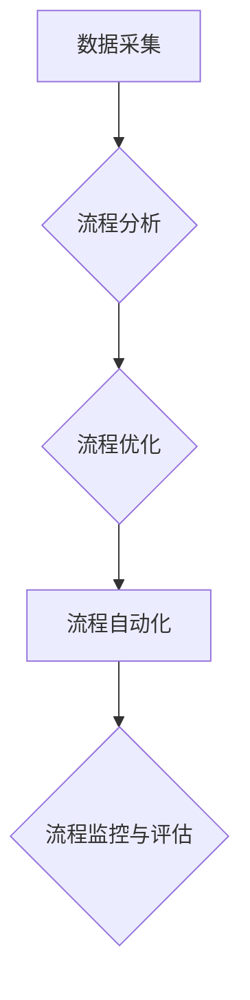

> AI, 业务流程重组, 流程自动化, 机器学习, 深度学习, 自然语言处理, 决策优化

## 1. 背景介绍

在当今数字化转型浪潮席卷全球的背景下，企业不断寻求提升效率、降低成本、增强竞争力的途径。业务流程重组作为一种重要的转型策略，旨在优化企业内部流程，提高资源利用率和运营效率。而人工智能（AI）作为一项颠覆性技术，正在深刻地改变着业务流程重组的模式和方式。

传统业务流程重组主要依赖于人工分析和优化，效率低下，难以应对复杂多变的业务环境。而AI技术的应用，则为业务流程重组注入了新的活力。AI算法能够自动识别和分析业务流程中的关键环节，并根据数据驱动的方式进行优化，从而实现流程自动化、智能化和高效化。

## 2. 核心概念与联系

**2.1 业务流程重组**

业务流程重组是指企业对现有业务流程进行系统性的分析、设计和改进，以提高流程效率、降低成本、增强竞争力。

**2.2 人工智能（AI）**

人工智能是指模拟人类智能行为的计算机系统。AI技术涵盖了机器学习、深度学习、自然语言处理等多个领域，能够实现自动学习、决策、推理等功能。

**2.3 AI在业务流程重组中的作用**

AI技术可以应用于各个环节的业务流程重组，包括流程分析、流程优化、流程自动化等。

**2.4 流程重组架构**



## 3. 核心算法原理 & 具体操作步骤

**3.1 算法原理概述**

AI在业务流程重组中的核心算法主要包括：

* **机器学习算法:** 用于识别和分析业务流程中的模式和趋势，例如决策树、支持向量机、神经网络等。
* **深度学习算法:** 用于处理复杂的数据结构和模式，例如卷积神经网络、循环神经网络等。
* **自然语言处理算法:** 用于理解和处理文本数据，例如文本分类、情感分析、文本摘要等。
* **强化学习算法:** 用于优化流程决策，例如Q学习、SARSA等。

**3.2 算法步骤详解**

1. **数据采集:** 收集业务流程相关数据，例如流程图、操作记录、用户行为数据等。
2. **数据预处理:** 对收集到的数据进行清洗、转换、特征提取等操作，使其适合算法训练。
3. **模型训练:** 使用机器学习、深度学习等算法对预处理后的数据进行训练，建立流程分析、优化和自动化的模型。
4. **模型评估:** 对训练好的模型进行评估，验证其准确性和有效性。
5. **流程部署:** 将训练好的模型部署到实际业务环境中，实现流程自动化和智能化。
6. **流程监控与评估:** 持续监控流程运行情况，收集反馈数据，并对模型进行调整和优化。

**3.3 算法优缺点**

* **优点:**

    * 自动化流程分析和优化，提高效率。
    * 识别和处理复杂模式，发现传统方法难以发现的优化机会。
    * 数据驱动决策，提高决策准确性。
    * 持续学习和优化，适应不断变化的业务环境。

* **缺点:**

    * 需要大量的数据进行训练，数据质量对模型性能影响较大。
    * 模型训练和部署需要专业技术人员。
    * 算法解释性较差，难以理解模型的决策逻辑。

**3.4 算法应用领域**

* **金融行业:** 贷前风控、客户服务自动化、交易风险管理等。
* **制造业:** 生产流程优化、质量控制、设备维护等。
* **零售业:** 库存管理、供应链优化、个性化推荐等。
* **医疗行业:** 疾病诊断、患者管理、药物研发等。

## 4. 数学模型和公式 & 详细讲解 & 举例说明

**4.1 数学模型构建**

在业务流程重组中，可以使用数学模型来描述流程的结构、行为和性能。例如，可以使用状态机模型来描述流程的各个状态和状态之间的转换关系，可以使用 Petri 网模型来描述流程的并发性和同步性。

**4.2 公式推导过程**

可以使用数学公式来量化流程的性能指标，例如流程效率、流程成本、流程风险等。例如，流程效率可以定义为完成流程所需的时间除以流程的完成量，流程成本可以定义为完成流程所需的资源投入。

**4.3 案例分析与讲解**

假设一个企业想要优化其订单处理流程。可以使用数学模型来描述订单处理流程的各个步骤和时间消耗，并使用公式来计算流程的效率和成本。通过分析模型和公式的结果，企业可以识别出流程中的瓶颈和优化机会，并制定相应的改进措施。

## 5. 项目实践：代码实例和详细解释说明

**5.1 开发环境搭建**

* 操作系统：Windows/Linux/macOS
* Python版本：3.6+
* 必要的库：pandas, numpy, scikit-learn, TensorFlow等

**5.2 源代码详细实现**

```python
# 导入必要的库
import pandas as pd
from sklearn.model_selection import train_test_split
from sklearn.linear_model import LogisticRegression

# 加载数据
data = pd.read_csv('process_data.csv')

# 数据预处理
# ...

# 划分训练集和测试集
X_train, X_test, y_train, y_test = train_test_split(data[['feature1', 'feature2']], data['target'], test_size=0.2)

# 训练模型
model = LogisticRegression()
model.fit(X_train, y_train)

# 模型评估
# ...

# 流程自动化
# ...
```

**5.3 代码解读与分析**

这段代码展示了如何使用机器学习算法来实现业务流程的自动化。首先，需要加载数据并进行预处理，然后将数据划分成训练集和测试集。接着，使用LogisticRegression模型训练模型，并对模型进行评估。最后，将训练好的模型应用于实际业务场景，实现流程自动化。

**5.4 运行结果展示**

运行结果将展示模型的准确率、召回率、F1-score等指标，以及流程自动化后的效率和成本变化等。

## 6. 实际应用场景

**6.1 金融行业**

* **贷前风控:** 使用AI算法分析客户的信用记录、收入、支出等数据，自动评估客户的贷款风险，提高贷款审批效率和准确性。
* **客户服务自动化:** 使用自然语言处理算法，构建智能客服系统，自动回答客户常见问题，提高客户服务效率和满意度。

**6.2 制造业**

* **生产流程优化:** 使用AI算法分析生产数据，识别生产瓶颈，优化生产流程，提高生产效率和产品质量。
* **设备维护:** 使用机器学习算法预测设备故障，提前进行维护，降低设备故障率和维修成本。

**6.3 零售业**

* **库存管理:** 使用AI算法预测商品需求，优化库存水平，降低库存成本和缺货率。
* **个性化推荐:** 使用协同过滤算法和内容过滤算法，为用户推荐个性化的商品，提高销售额和用户满意度。

**6.4 未来应用展望**

随着AI技术的不断发展，其在业务流程重组中的应用将更加广泛和深入。例如，未来可能会出现以下应用场景：

* **流程智能化:** AI算法能够自动识别和理解业务流程中的复杂规则，并根据规则自动执行流程操作，实现流程的智能化。
* **流程可视化:** AI算法能够将复杂的业务流程可视化，方便用户理解和分析流程，并进行优化。
* **流程协同:** AI算法能够帮助不同部门和人员协同完成业务流程，提高流程效率和协作效率。

## 7. 工具和资源推荐

**7.1 学习资源推荐**

* **书籍:**
    * 《深度学习》
    * 《机器学习实战》
    * 《人工智能：一种现代方法》
* **在线课程:**
    * Coursera: 深度学习
    * edX: 机器学习
    * Udacity: AI Nanodegree

**7.2 开发工具推荐**

* **Python:** 广泛应用于AI开发，拥有丰富的库和工具。
* **TensorFlow:** 开源深度学习框架，支持多种硬件平台。
* **PyTorch:** 开源深度学习框架，以其灵活性和易用性而闻名。
* **Scikit-learn:** 机器学习库，提供各种算法和工具。

**7.3 相关论文推荐**

* **《Attention Is All You Need》**
* **《BERT: Pre-training of Deep Bidirectional Transformers for Language Understanding》**
* **《Generative Adversarial Networks》**

## 8. 总结：未来发展趋势与挑战

**8.1 研究成果总结**

AI在业务流程重组领域取得了显著的成果，例如提高了流程效率、降低了成本、增强了竞争力。

**8.2 未来发展趋势**

* **更智能化的流程自动化:** AI算法将更加智能化，能够自动识别和理解复杂的业务规则，并根据规则自动执行流程操作。
* **更个性化的流程定制:** AI算法将能够根据用户的需求和偏好，定制个性化的流程。
* **更安全的流程保障:** AI算法将能够识别和预防流程中的安全风险，保障流程的安全性和可靠性。

**8.3 面临的挑战**

* **数据质量问题:** AI算法的性能依赖于数据质量，数据不完整、不准确或不一致会影响模型的准确性和有效性。
* **算法解释性问题:** 许多AI算法的决策逻辑难以理解，这可能会导致用户对模型的信任度降低。
* **伦理问题:** AI算法在业务流程重组中的应用可能会带来一些伦理问题，例如算法偏见、数据隐私等。

**8.4 研究展望**

未来研究将重点关注以下几个方面:

* **提高数据质量:** 开发新的数据清洗、转换和特征提取方法，提高数据质量。
* **增强算法解释性:** 研究可解释AI算法，使模型的决策逻辑更加透明。
* **解决伦理问题:** 制定相应的伦理规范和法律法规，规范AI算法在业务流程重组中的应用。

## 9. 附录：常见问题与解答

**9.1 如何选择合适的AI算法？**

选择合适的AI算法需要根据具体的业务场景和数据特点进行选择。例如，如果需要预测连续值，可以使用回归算法；如果需要分类数据，可以使用分类算法。

**9.2 如何评估AI模型的性能？**

可以使用准确率、召回率、F1-score等指标来评估AI模型的性能。

**9.3 如何解决数据质量问题？**

可以使用数据清洗、转换和特征提取等方法来解决数据质量问题。

**9.4 如何应对算法解释性问题？**

可以使用可解释AI算法，或者使用模型解释工具来解释模型的决策逻辑。


作者：禅与计算机程序设计艺术 / Zen and the Art of Computer Programming 
<end_of_turn>