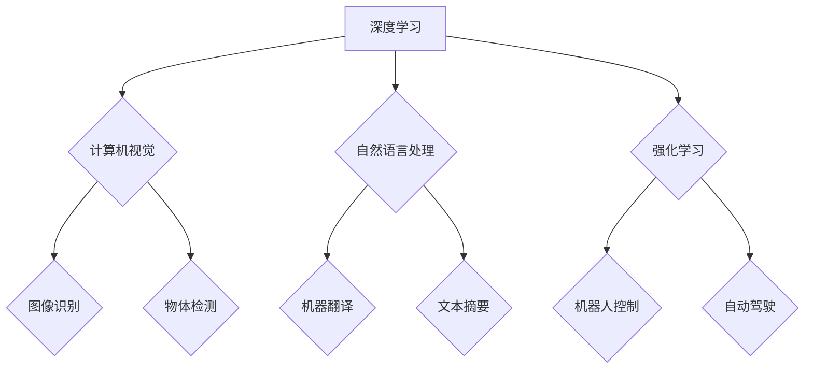

> 人工智能，深度学习，计算机视觉，自然语言处理，强化学习，伦理，未来趋势

## 1. 背景介绍

人工智能（AI）正以惊人的速度发展，深刻地改变着我们生活的方方面面。从自动驾驶汽车到智能语音助手，AI技术已经渗透到我们的日常生活中。而Andrej Karpathy，作为一位享誉全球的人工智能专家，他对AI的未来发展有着深刻的洞察和独特的见解。

Andrej Karpathy是一位计算机科学家，斯坦福大学博士，曾任特斯拉自动驾驶团队负责人，现任OpenAI研究员。他以其在深度学习、计算机视觉和强化学习领域的杰出贡献而闻名。他的研究成果和技术洞察力对推动AI发展起到了至关重要的作用。

## 2. 核心概念与联系

**2.1 深度学习**

深度学习是人工智能领域的一个重要分支，它利用多层神经网络来模拟人类大脑的学习过程。通过大量的训练数据，深度学习模型能够自动学习特征和模式，从而实现对复杂问题的解决。

**2.2 计算机视觉**

计算机视觉是让计算机“看”世界的一种技术，它旨在使计算机能够理解和解释图像和视频信息。深度学习在计算机视觉领域取得了突破性的进展，例如图像识别、物体检测和图像分割等。

**2.3 自然语言处理**

自然语言处理（NLP）是让计算机“理解”人类语言的技术，它旨在使计算机能够理解、生成和处理自然语言文本。深度学习在NLP领域也取得了显著的成果，例如机器翻译、文本摘要和情感分析等。

**2.4 强化学习**

强化学习是一种机器学习方法，它通过奖励和惩罚机制来训练智能体，使其在特定环境中做出最优决策。强化学习在机器人控制、游戏AI和自动驾驶等领域具有广泛的应用前景。

**2.5 伦理与社会影响**

随着AI技术的快速发展，其伦理和社会影响也日益受到关注。例如，AI算法的偏见、隐私保护和工作岗位替代等问题都需要认真思考和解决。

**Mermaid 流程图**



## 3. 核心算法原理 & 具体操作步骤

### 3.1 算法原理概述

深度学习算法的核心是多层神经网络。神经网络由多个层组成，每层包含多个神经元。每个神经元接收来自上一层的输入信号，并对其进行处理，然后将处理后的信号传递到下一层。通过训练，神经网络能够学习到输入和输出之间的映射关系。

### 3.2 算法步骤详解

1. **数据预处理:** 将原始数据转换为深度学习模型可以理解的格式。
2. **网络结构设计:** 根据任务需求设计神经网络的结构，包括层数、神经元数量和激活函数等。
3. **参数初始化:** 为神经网络中的参数进行随机初始化。
4. **前向传播:** 将输入数据通过神经网络进行前向传播，得到输出结果。
5. **损失函数计算:** 计算输出结果与真实值的差异，即损失函数值。
6. **反向传播:** 根据损失函数值，反向传播误差信号，更新神经网络的参数。
7. **迭代训练:** 重复步骤4-6，直到损失函数值达到预设阈值。

### 3.3 算法优缺点

**优点:**

* 能够自动学习特征，无需人工特征工程。
* 能够处理大规模数据。
* 在图像识别、自然语言处理等领域取得了突破性进展。

**缺点:**

* 训练数据量大，计算资源消耗高。
* 训练过程复杂，需要专业知识和经验。
* 模型解释性差，难以理解模型的决策过程。

### 3.4 算法应用领域

* 计算机视觉：图像识别、物体检测、图像分割、人脸识别等。
* 自然语言处理：机器翻译、文本摘要、情感分析、聊天机器人等。
* 强化学习：机器人控制、游戏AI、自动驾驶等。
* 其他领域：医疗诊断、金融预测、推荐系统等。

## 4. 数学模型和公式 & 详细讲解 & 举例说明

### 4.1 数学模型构建

深度学习模型通常采用多层感知机（MLP）或卷积神经网络（CNN）等结构。

**4.1.1 多层感知机（MLP）**

MLP由多个全连接层组成，每层神经元之间全连接。

**4.1.2 卷积神经网络（CNN）**

CNN利用卷积层和池化层来提取图像特征。卷积层通过卷积核对图像进行卷积运算，提取图像局部特征。池化层对卷积层的输出进行降维，减少计算量。

### 4.2 公式推导过程

**4.2.1 激活函数**

激活函数用于引入非线性，使神经网络能够学习复杂的映射关系。常见的激活函数包括ReLU、Sigmoid和Tanh等。

**4.2.2 损失函数**

损失函数用于衡量模型预测结果与真实值的差异。常见的损失函数包括均方误差（MSE）、交叉熵损失（Cross-Entropy Loss）等。

**4.2.3 反向传播算法**

反向传播算法用于更新神经网络的参数。通过计算梯度，调整参数以最小化损失函数值。

### 4.3 案例分析与讲解

**4.3.1 图像分类**

使用CNN模型进行图像分类，例如识别猫和狗的图片。

**4.3.2 机器翻译**

使用RNN模型进行机器翻译，例如将英文翻译成中文。

## 5. 项目实践：代码实例和详细解释说明

### 5.1 开发环境搭建

使用Python语言和深度学习框架TensorFlow或PyTorch搭建开发环境。

### 5.2 源代码详细实现

使用TensorFlow或PyTorch框架实现一个简单的图像分类模型。

```python
import tensorflow as tf

# 定义模型结构
model = tf.keras.models.Sequential([
    tf.keras.layers.Conv2D(32, (3, 3), activation='relu', input_shape=(28, 28, 1)),
    tf.keras.layers.MaxPooling2D((2, 2)),
    tf.keras.layers.Conv2D(64, (3, 3), activation='relu'),
    tf.keras.layers.MaxPooling2D((2, 2)),
    tf.keras.layers.Flatten(),
    tf.keras.layers.Dense(10, activation='softmax')
])

# 编译模型
model.compile(optimizer='adam',
              loss='sparse_categorical_crossentropy',
              metrics=['accuracy'])

# 训练模型
model.fit(x_train, y_train, epochs=5)

# 评估模型
loss, accuracy = model.evaluate(x_test, y_test)
print('Test loss:', loss)
print('Test accuracy:', accuracy)
```

### 5.3 代码解读与分析

代码首先定义了一个简单的CNN模型结构，包括卷积层、池化层和全连接层。然后，使用Adam优化器和交叉熵损失函数编译模型。最后，使用训练数据训练模型，并使用测试数据评估模型性能。

### 5.4 运行结果展示

训练完成后，可以查看模型的训练和测试精度，以及损失函数的变化趋势。

## 6. 实际应用场景

### 6.1 自动驾驶

AI技术在自动驾驶领域发挥着至关重要的作用，例如感知环境、规划路径和控制车辆。

### 6.2 医疗诊断

AI可以辅助医生进行疾病诊断，例如识别肿瘤、分析医学影像等。

### 6.3 金融预测

AI可以用于金融风险评估、股票预测和欺诈检测等。

### 6.4 未来应用展望

AI技术将继续在各个领域得到广泛应用，例如个性化教育、智能家居、工业自动化等。

## 7. 工具和资源推荐

### 7.1 学习资源推荐

* **书籍:**
    * 深度学习
    * 人工智能：一种现代方法
* **在线课程:**
    * Coursera深度学习课程
    * Udacity人工智能课程

### 7.2 开发工具推荐

* **深度学习框架:** TensorFlow, PyTorch, Keras
* **编程语言:** Python

### 7.3 相关论文推荐

* **ImageNet Classification with Deep Convolutional Neural Networks**
* **Attention Is All You Need**

## 8. 总结：未来发展趋势与挑战

### 8.1 研究成果总结

深度学习在图像识别、自然语言处理等领域取得了突破性进展，推动了AI技术的快速发展。

### 8.2 未来发展趋势

* **模型规模和效率:** 发展更强大、更高效的深度学习模型。
* **数据增强和泛化能力:** 提高模型对不同数据环境的适应能力。
* **解释性和可信度:** 增强模型的解释性和可信度，提高人类对AI决策的理解。

### 8.3 面临的挑战

* **数据隐私和安全:** 保护数据隐私和安全，防止数据滥用。
* **算法偏见和公平性:** 避免算法产生偏见，确保公平公正的决策。
* **伦理和社会影响:** 关注AI技术的伦理和社会影响，制定相应的规范和政策。

### 8.4 研究展望

未来，AI技术将继续发展，并对人类社会产生更深远的影响。我们需要加强对AI技术的理解和研究，并积极应对其带来的挑战，以确保AI技术能够造福人类。

## 9. 附录：常见问题与解答

**9.1 什么是深度学习？**

深度学习是一种机器学习方法，它利用多层神经网络来模拟人类大脑的学习过程。

**9.2 深度学习有哪些应用场景？**

深度学习在图像识别、自然语言处理、语音识别、机器翻译等领域都有广泛的应用。

**9.3 如何学习深度学习？**

可以通过阅读书籍、参加在线课程、参与开源项目等方式学习深度学习。

作者：禅与计算机程序设计艺术 / Zen and the Art of Computer Programming


<end_of_turn>