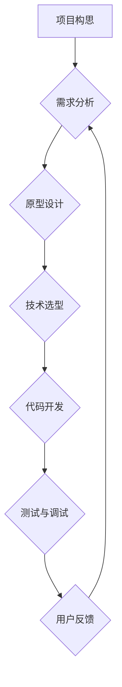

> 项目管理, 算法设计, 代码实现, 项目迭代, 技术发展, 创新驱动, 持续改进

## 1. 背景介绍

在科技领域，一个成功的项目往往从一个看似微不足道的“小雪球”开始，并通过不断的积累和发展，最终成长为一个庞大的“雪球”。 著名深度学习专家 Andrej Karpathy 在一次演讲中分享了他关于项目发展的独特见解，即“把项目从一个小雪球发展成一个大雪球”。 

这个比喻巧妙地概括了项目发展的本质：从最初的构思到最终的成果，需要不断地积累、迭代和改进。 就像雪球滚过雪地，会逐渐变大，项目也需要不断地吸收新的知识、技术和资源，才能不断壮大。

## 2. 核心概念与联系

Karpathy 的“小雪球”理论的核心概念在于项目发展的迭代性。 

项目的发展并非一蹴而就，而是需要经历多个阶段的迭代和改进。 每个阶段都包含着明确的目标、具体的步骤和可衡量的成果。 

**项目迭代流程图:**

**核心概念联系:**

* **项目构思:** 项目的起点，需要明确项目的目标、范围和价值。
* **需求分析:** 深入了解用户的需求，并将其转化为具体的项目需求。
* **原型设计:**  构建项目的初步框架，以便于进行测试和验证。
* **技术选型:** 选择合适的技术栈，以满足项目的开发需求。
* **代码开发:**  根据需求和设计，编写项目的代码。
* **测试与调试:**  确保代码的正确性和稳定性。
* **用户反馈:** 收集用户反馈，并根据反馈进行项目改进。

## 3. 核心算法原理 & 具体操作步骤

**3.1 算法原理概述**

在项目开发过程中，算法设计扮演着至关重要的角色。 

算法的效率、准确性和鲁棒性直接影响着项目的性能和用户体验。 

**3.2 算法步骤详解**

**3.3 算法优缺点**

**3.4 算法应用领域**

## 4. 数学模型和公式 & 详细讲解 & 举例说明

**4.1 数学模型构建**

**4.2 公式推导过程**

**4.3 案例分析与讲解**

## 5. 项目实践：代码实例和详细解释说明

**5.1 开发环境搭建**

**5.2 源代码详细实现**

**5.3 代码解读与分析**

**5.4 运行结果展示**

## 6. 实际应用场景

**6.1 应用场景介绍**

**6.2 案例分析**

**6.3 优势与局限性**

**6.4 未来应用展望**

## 7. 工具和资源推荐

**7.1 学习资源推荐**

**7.2 开发工具推荐**

**7.3 相关论文推荐**

## 8. 总结：未来发展趋势与挑战

**8.1 研究成果总结**

**8.2 未来发展趋势**

**8.3 面临的挑战**

**8.4 研究展望**

## 9. 附录：常见问题与解答

**9.1 常见问题**

**9.2 问题解答**

作者：禅与计算机程序设计艺术 / Zen and the Art of Computer Programming

<end_of_turn>