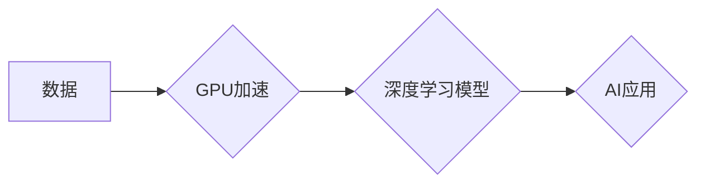

> NVIDIA, GPU, CUDA, Deep Learning, AI, 算力, 训练, 推理

## 1. 背景介绍

人工智能（AI）的蓬勃发展，对算力的需求呈指数级增长。传统的CPU架构在处理海量数据和复杂的计算任务时，效率低下，难以满足AI训练和推理的需要。而NVIDIA，作为GPU领域的领军者，凭借其强大的并行计算能力和针对AI算法优化的软件生态系统，成功地改变了AI算力的格局。

## 2. 核心概念与联系

**2.1 GPU架构与AI计算的契合**

GPU（图形处理单元）最初设计用于处理图形渲染，其核心特点是拥有大量并行计算单元，能够同时处理数千个任务。这种并行计算能力与深度学习算法的特征高度契合，因为深度学习算法本质上是大量数据并行处理的计算密集型任务。

**2.2 CUDA平台：赋能GPU的AI计算**

NVIDIA开发的CUDA（Compute Unified Device Architecture）平台，为开发者提供了利用GPU进行通用计算的工具和框架。CUDA允许开发者将程序代码编译成GPU可执行的指令，并利用GPU的并行计算能力加速算法执行。

**2.3 深度学习框架与CUDA的结合**

主流深度学习框架，如TensorFlow、PyTorch等，都支持CUDA平台，并提供了针对GPU加速的优化实现。开发者可以利用这些框架，轻松地将深度学习模型移植到GPU上，并获得显著的性能提升。

**2.4 NVIDIA AI平台：全栈式AI解决方案**

NVIDIA不仅提供硬件和软件基础，还构建了完整的AI平台，包括硬件、软件、云服务和生态系统。该平台为开发者提供了从数据采集到模型部署的全流程解决方案，加速了AI应用的开发和推广。

**Mermaid 流程图**



## 3. 核心算法原理 & 具体操作步骤

**3.1 算法原理概述**

深度学习算法的核心是多层神经网络，通过学习数据中的特征表示，实现对复杂数据的理解和预测。常见的深度学习算法包括卷积神经网络（CNN）、循环神经网络（RNN）和Transformer等。这些算法通过大量的参数和复杂的计算过程，学习数据之间的关系，并生成相应的输出结果。

**3.2 算法步骤详解**

1. **数据预处理:** 将原始数据转换为深度学习算法可以处理的格式，例如归一化、编码等。
2. **模型构建:** 根据具体的应用场景，选择合适的深度学习算法架构，并定义模型参数。
3. **模型训练:** 使用训练数据，通过反向传播算法，调整模型参数，使模型的预测结果与真实值尽可能接近。
4. **模型评估:** 使用测试数据，评估模型的性能，例如准确率、召回率等。
5. **模型部署:** 将训练好的模型部署到实际应用场景中，用于预测或决策。

**3.3 算法优缺点**

**优点:**

* 能够学习复杂数据中的非线性关系。
* 具有强大的泛化能力，能够对未知数据进行预测。
* 在图像识别、自然语言处理等领域取得了突破性进展。

**缺点:**

* 训练过程需要大量的计算资源和时间。
* 模型参数众多，容易过拟合。
* 对数据质量要求较高。

**3.4 算法应用领域**

深度学习算法广泛应用于各个领域，例如：

* **计算机视觉:** 图像识别、目标检测、图像分割等。
* **自然语言处理:** 文本分类、机器翻译、语音识别等。
* **推荐系统:** 商品推荐、内容推荐等。
* **医疗诊断:** 病理图像分析、疾病预测等。

## 4. 数学模型和公式 & 详细讲解 & 举例说明

**4.1 数学模型构建**

深度学习模型本质上是一个复杂的数学模型，其核心是神经网络的结构和参数。神经网络由多个层组成，每层包含多个神经元。每个神经元接收来自上一层的输入信号，并通过激活函数进行处理，输出到下一层。

**4.2 公式推导过程**

深度学习模型的训练过程基于梯度下降算法。梯度下降算法的目标是找到模型参数的最佳值，使得模型的预测结果与真实值之间的误差最小化。

**损失函数:** 用于衡量模型预测结果与真实值之间的误差。常见的损失函数包括均方误差（MSE）、交叉熵损失等。

**梯度:** 损失函数对模型参数的偏导数，表示参数变化对损失函数的影响。

**更新规则:** 根据梯度信息，更新模型参数，使损失函数逐渐减小。

**4.3 案例分析与讲解**

以线性回归为例，假设模型的目标是预测房屋价格，输入特征包括房屋面积、房间数量等。

**损失函数:** MSE

**梯度:** ∂MSE/∂参数

**更新规则:** 参数 = 参数 - 学习率 * 梯度

通过迭代更新参数，模型逐渐逼近真实的价格预测。

## 5. 项目实践：代码实例和详细解释说明

**5.1 开发环境搭建**

* 安装CUDA Toolkit
* 安装NVIDIA驱动程序
* 安装深度学习框架（例如TensorFlow或PyTorch）

**5.2 源代码详细实现**

```python
import tensorflow as tf

# 定义模型
model = tf.keras.models.Sequential([
    tf.keras.layers.Dense(64, activation='relu', input_shape=(784,)),
    tf.keras.layers.Dense(10, activation='softmax')
])

# 编译模型
model.compile(optimizer='adam',
              loss='sparse_categorical_crossentropy',
              metrics=['accuracy'])

# 训练模型
model.fit(x_train, y_train, epochs=10)

# 评估模型
loss, accuracy = model.evaluate(x_test, y_test)
print('Test loss:', loss)
print('Test accuracy:', accuracy)
```

**5.3 代码解读与分析**

* 使用TensorFlow框架构建一个简单的多层感知机模型。
* 模型输入层维度为784，对应MNIST数据集的图像像素数据。
* 模型输出层维度为10，对应MNIST数据集的10个类别。
* 使用Adam优化器、交叉熵损失函数和准确率作为评估指标。
* 模型训练10个epochs，并使用测试数据评估模型性能。

**5.4 运行结果展示**

训练完成后，模型的准确率通常会达到较高的水平，例如在MNIST数据集上，准确率可以达到98%以上。

## 6. 实际应用场景

**6.1 图像识别**

* 自动驾驶汽车：识别道路标志、行人、车辆等。
* 医疗诊断：识别病理图像中的异常区域。
* 物体检测：在视频监控中识别目标物。

**6.2 自然语言处理**

* 机器翻译：将文本从一种语言翻译成另一种语言。
* 语音识别：将语音转换为文本。
* 文本生成：生成自然语言文本，例如文章、对话等。

**6.3 其他应用场景**

* 推荐系统：根据用户的行为历史，推荐感兴趣的内容。
* 金融预测：预测股票价格、风险评估等。
* 游戏开发：生成游戏场景、控制游戏角色等。

**6.4 未来应用展望**

随着算力的不断提升，AI技术将应用于更多领域，例如：

* 人工智能助手：提供更智能、更个性化的服务。
* 医疗保健：辅助医生诊断疾病、个性化治疗方案。
* 教育培训：提供个性化学习体验、智能辅导。

## 7. 工具和资源推荐

**7.1 学习资源推荐**

* **书籍:**
    * 深度学习
    * 
* **在线课程:**
    * Coursera
    * edX
    * Udacity

**7.2 开发工具推荐**

* **深度学习框架:** TensorFlow, PyTorch, Keras
* **GPU加速库:** CUDA, cuDNN
* **云平台:** AWS, Azure, GCP

**7.3 相关论文推荐**

* ImageNet Classification with Deep Convolutional Neural Networks
* Attention Is All You Need

## 8. 总结：未来发展趋势与挑战

**8.1 研究成果总结**

NVIDIA在GPU算力领域取得了突破性进展，为AI的发展提供了强大的基础设施。深度学习算法在各个领域取得了显著成果，推动了AI技术的快速发展。

**8.2 未来发展趋势**

* **算力继续提升:** GPU架构不断演进，算力将继续提升，支持更复杂的AI模型训练。
* **模型规模扩大:** 模型参数规模将进一步扩大，提升模型的表达能力和泛化能力。
* **边缘计算:** 将AI模型部署到边缘设备，实现实时推理和决策。

**8.3 面临的挑战**

* **能源消耗:** AI训练和推理过程消耗大量能源，需要寻找更节能的解决方案。
* **数据隐私:** AI模型训练需要大量数据，如何保护数据隐私是一个重要挑战。
* **算法可解释性:** 深度学习模型的决策过程难以解释，需要提高算法的可解释性。

**8.4 研究展望**

未来研究将集中在以下几个方面:

* 开发更高效、更节能的AI算法和硬件。
* 探索新的AI应用场景，推动AI技术在更多领域落地。
* 提高AI模型的可解释性和安全性，解决AI伦理问题。

## 9. 附录：常见问题与解答

**常见问题:**

* 如何选择合适的GPU？
* 如何搭建深度学习开发环境？
* 如何训练深度学习模型？

**解答:**

* 选择GPU需要考虑算力、内存、价格等因素。
* 深度学习开发环境需要安装CUDA Toolkit、NVIDIA驱动程序和深度学习框架。
* 训练深度学习模型需要准备数据、定义模型、编译模型、训练模型和评估模型。


作者：禅与计算机程序设计艺术 / Zen and the Art of Computer Programming 
<end_of_turn>