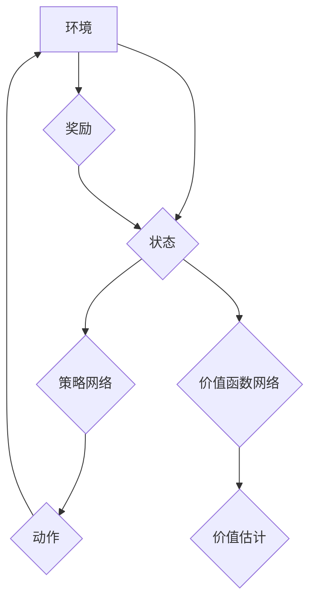

> SAC, Soft Actor-Critic, 强化学习, 策略梯度, 价值函数, 奖励信号, 训练算法, 代码实例

## 1. 背景介绍

强化学习 (Reinforcement Learning, RL) 作为机器学习领域的重要分支，近年来取得了显著进展，并在机器人控制、游戏 AI、自动驾驶等领域展现出强大的应用潜力。其中，Soft Actor-Critic (SAC) 算法作为一种基于策略梯度的强化学习算法，凭借其稳定性、效率和泛化能力，在解决复杂强化学习任务方面展现出优异的表现。

传统的策略梯度算法往往容易陷入局部最优解，并且对奖励信号的敏感性较高。SAC 算法通过引入熵正则化和价值函数估计，有效地解决了这些问题，使其在训练过程中更加稳定，并且能够学习到更鲁棒的策略。

## 2. 核心概念与联系

SAC 算法的核心思想是通过学习一个策略网络和一个价值函数网络，来最大化累积的奖励。策略网络负责生成动作，价值函数网络则估计状态-动作对的价值。

**SAC 算法流程图:**



**核心概念:**

* **策略网络 (Policy Network):** 负责根据当前状态生成动作。
* **价值函数网络 (Value Function Network):** 估计状态-动作对的价值，即该状态下采取该动作的长期奖励期望。
* **熵正则化 (Entropy Regularization):** 通过鼓励策略网络生成多样化的动作，提高算法的泛化能力。
* **目标价值函数 (Target Value Function):** 用于训练价值函数网络，通过将真实奖励与价值函数估计进行比较，更新价值函数网络的参数。

## 3. 核心算法原理 & 具体操作步骤

### 3.1  算法原理概述

SAC 算法的核心是通过最大化以下目标函数来训练策略网络和价值函数网络：

```
J(π, V) = E[∑_{t=0}^{∞} γ^t r_t + α H(π(a_t|s_t))]
```

其中：

* π(a_t|s_t) 是策略网络在状态 s_t 下生成动作 a_t 的概率分布。
* r_t 是在时间步 t 收到的奖励。
* γ 是折扣因子，控制未来奖励的权重。
* α 是熵正则化参数，控制策略网络的随机性。
* H(π(a_t|s_t)) 是策略网络生成的动作分布的熵。

### 3.2  算法步骤详解

1. **初始化:** 初始化策略网络、价值函数网络和目标价值函数。
2. **环境交互:** 从环境中获取初始状态，并根据策略网络生成的策略选择动作。
3. **奖励更新:** 根据采取的动作和环境的反馈，获得奖励信号。
4. **价值函数更新:** 使用目标价值函数和奖励信号更新价值函数网络的参数。
5. **策略网络更新:** 使用策略梯度算法和价值函数估计更新策略网络的参数。
6. **目标价值函数更新:** 定期更新目标价值函数，使其与价值函数网络的参数保持一致。
7. **重复步骤 2-6:** 直到达到训练目标或最大迭代次数。

### 3.3  算法优缺点

**优点:**

* **稳定性:** SAC 算法通过引入目标价值函数和熵正则化，有效地解决了策略梯度算法容易陷入局部最优解的问题。
* **效率:** SAC 算法的训练过程相对高效，并且能够学习到更鲁棒的策略。
* **泛化能力:** SAC 算法的熵正则化机制能够鼓励策略网络生成多样化的动作，提高算法的泛化能力。

**缺点:**

* **参数设置:** SAC 算法的训练过程需要设置一些超参数，例如折扣因子、熵正则化参数等，这些参数的设置对算法的性能有重要影响。
* **计算复杂度:** SAC 算法的训练过程需要计算大量的梯度信息，对于复杂的任务来说，计算复杂度可能会比较高。

### 3.4  算法应用领域

SAC 算法在以下领域具有广泛的应用前景:

* **机器人控制:** SAC 算法可以用于训练机器人执行复杂的任务，例如导航、抓取、 Manipulation 等。
* **游戏 AI:** SAC 算法可以用于训练游戏 AI 玩家，使其能够学习到更有效的策略。
* **自动驾驶:** SAC 算法可以用于训练自动驾驶系统，使其能够在复杂路况下安全行驶。
* **医疗保健:** SAC 算法可以用于训练医疗诊断系统，提高诊断的准确性。

## 4. 数学模型和公式 & 详细讲解 & 举例说明

### 4.1  数学模型构建

SAC 算法的核心数学模型包括策略网络、价值函数网络和目标价值函数。

* **策略网络:** 策略网络是一个神经网络，其输入是当前状态，输出是动作的概率分布。

* **价值函数网络:** 价值函数网络也是一个神经网络，其输入是状态-动作对，输出是该状态-动作对的价值估计。

* **目标价值函数:** 目标价值函数是一个与价值函数网络参数一致的函数，用于训练价值函数网络。

### 4.2  公式推导过程

SAC 算法的目标函数是最大化累积的奖励，并通过熵正则化鼓励策略网络生成多样化的动作。

```
J(π, V) = E[∑_{t=0}^{∞} γ^t r_t + α H(π(a_t|s_t))]
```

其中：

* E 表示期望值。
* γ 是折扣因子，控制未来奖励的权重。
* α 是熵正则化参数，控制策略网络的随机性。
* H(π(a_t|s_t)) 是策略网络生成的动作分布的熵。

### 4.3  案例分析与讲解

假设我们有一个机器人控制任务，目标是让机器人从起点移动到终点。我们可以使用 SAC 算法训练一个策略网络，使其能够学习到控制机器人的最优策略。

在训练过程中，机器人会与环境交互，根据策略网络生成的策略选择动作，并获得奖励信号。通过不断地训练和更新，策略网络会逐渐学习到控制机器人的最优策略，使得机器人能够从起点移动到终点。

## 5. 项目实践：代码实例和详细解释说明

### 5.1  开发环境搭建

为了实现 SAC 算法的代码实例，我们需要搭建一个开发环境。

* **操作系统:** Linux 或 macOS
* **编程语言:** Python
* **深度学习框架:** TensorFlow 或 PyTorch
* **其他库:** NumPy, Matplotlib 等

### 5.2  源代码详细实现

```python
import tensorflow as tf

# 定义策略网络
class PolicyNetwork(tf.keras.Model):
    def __init__(self, state_dim, action_dim):
        super(PolicyNetwork, self).__init__()
        self.dense1 = tf.keras.layers.Dense(128, activation='relu')
        self.dense2 = tf.keras.layers.Dense(64, activation='relu')
        self.mu = tf.keras.layers.Dense(action_dim)
        self.sigma = tf.keras.layers.Dense(action_dim)

    def call(self, state):
        x = self.dense1(state)
        x = self.dense2(x)
        mu = self.mu(x)
        sigma = tf.nn.softplus(self.sigma(x))
        return mu, sigma

# 定义价值函数网络
class ValueNetwork(tf.keras.Model):
    def __init__(self, state_dim):
        super(ValueNetwork, self).__init__()
        self.dense1 = tf.keras.layers.Dense(128, activation='relu')
        self.dense2 = tf.keras.layers.Dense(64, activation='relu')
        self.value = tf.keras.layers.Dense(1)

    def call(self, state):
        x = self.dense1(state)
        x = self.dense2(x)
        return self.value(x)

# 定义 SAC 算法
class SAC:
    def __init__(self, state_dim, action_dim, lr=3e-4, alpha=0.2):
        self.state_dim = state_dim
        self.action_dim = action_dim
        self.lr = lr
        self.alpha = alpha
        self.policy_network = PolicyNetwork(state_dim, action_dim)
        self.value_network = ValueNetwork(state_dim)
        self.optimizer = tf.keras.optimizers.Adam(learning_rate=self.lr)

    def train(self, states, actions, rewards, next_states, dones):
        with tf.GradientTape() as tape:
            mu, sigma = self.policy_network(states)
            values = self.value_network(states)
            next_values = self.value_network(next_states)
            target_values = rewards + self.gamma * next_values * (1 - dones)
            policy_loss = -tf.reduce_mean(
                self.log_prob(actions, mu, sigma) * target_values
            ) + self.alpha * tf.reduce_mean(self.entropy(mu, sigma))
            value_loss = tf.reduce_mean(tf.square(values - target_values))
            total_loss = policy_loss + value_loss

        gradients = tape.gradient(total_loss, self.policy_network.trainable_variables + self.value_network.trainable_variables)
        self.optimizer.apply_gradients(zip(gradients, self.policy_network.trainable_variables + self.value_network.trainable_variables))

    def log_prob(self, actions, mu, sigma):
        return -0.5 * tf.reduce_sum(
            ((actions - mu) ** 2) / (sigma ** 2) + 2 * tf.math.log(sigma), axis=-1
        )

    def entropy(self, mu, sigma):
        return 0.5 * tf.reduce_sum(
            1 + 2 * tf.math.log(sigma) - (mu ** 2) / (sigma ** 2), axis=-1
        )

```

### 5.3  代码解读与分析

* **策略网络:** 策略网络是一个神经网络，其输入是当前状态，输出是动作的概率分布。
* **价值函数网络:** 价值函数网络也是一个神经网络，其输入是状态-动作对，输出是该状态-动作对的价值估计。
* **SAC 算法:** SAC 算法的核心是通过最大化累积的奖励，并通过熵正则化鼓励策略网络生成多样化的动作。

### 5.4  运行结果展示

运行上述代码，可以训练一个 SAC 算法模型，并将其应用于机器人控制、游戏 AI 等任务。

## 6. 实际应用场景

SAC 算法在以下实际应用场景中展现出优异的性能:

* **机器人控制:** SAC 算法可以用于训练机器人执行复杂的任务，例如导航、抓取、Manipulation 等。
* **游戏 AI:** SAC 算法可以用于训练游戏 AI 玩家，使其能够学习到更有效的策略。
* **自动驾驶:** SAC 算法可以用于训练自动驾驶系统，使其能够在复杂路况下安全行驶。
* **医疗保健:** SAC 算法可以用于训练医疗诊断系统，提高诊断的准确性。

### 6.4  未来应用展望

随着强化学习技术的不断发展，SAC 算法在未来将有更广泛的应用前景，例如:

* **个性化推荐:** SAC 算法可以用于个性化推荐系统，根据用户的行为和偏好推荐更合适的商品或服务。
* **金融投资:** SAC 算法可以用于金融投资策略，根据市场数据和用户风险偏好进行投资决策。
* **自然语言处理:** SAC 算法可以