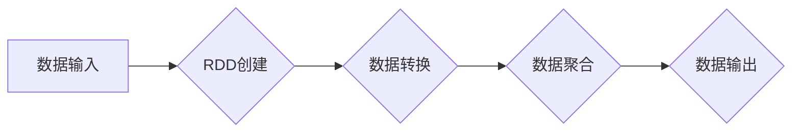

> Spark,内存计算,数据流,分布式计算,数据处理,代码实例,性能优化

## 1. 背景介绍

在海量数据时代，高效处理数据成为各行各业的关键挑战。传统的磁盘式数据处理方式由于数据读写速度慢，难以满足实时数据处理的需求。为了解决这一问题，Apache Spark 应运而生，它是一种基于内存的分布式计算框架，以其高性能、易用性和灵活性，迅速成为大数据处理的首选工具。

Spark 的核心思想是将数据加载到内存中进行计算，从而大幅提升数据处理速度。它支持多种编程语言，包括 Scala、Java、Python 和 R，并提供丰富的 API 和生态系统，方便用户进行数据分析、机器学习和流式处理等任务。

## 2. 核心概念与联系

Spark 的内存计算引擎基于一系列核心概念，包括：

* **Resilient Distributed Datasets (RDDs):** RDD 是 Spark 的基本数据结构，它是一个分布式、可恢复的数据集合。RDD 可以通过各种操作进行转换和聚合，例如过滤、映射、连接等。
* **DAG (Directed Acyclic Graph):** Spark 将每个操作都表示为一个节点，并将节点之间的依赖关系表示为边，形成一个有向无环图 (DAG)。Spark 会根据 DAG 的拓扑结构，并行执行操作，从而提高计算效率。
* **Shuffle:** Shuffle 是 Spark 中的一种数据重排操作，它用于将数据按照特定键进行分组，以便进行聚合操作。Shuffle 操作会产生大量的网络流量，因此 Spark 会采用多种优化策略，例如数据分区和数据压缩，来减少 Shuffle 的开销。
* **Task 和 Executor:** Spark 将计算任务分解为多个 Task，每个 Task 在一个 Executor 上执行。Executor 是运行在集群节点上的进程，负责执行 Task 和管理数据。

**Spark 内存计算引擎架构流程图:**



## 3. 核心算法原理 & 具体操作步骤

### 3.1  算法原理概述

Spark 的内存计算引擎的核心算法是基于 DAG 的并行计算。它将数据处理任务分解为一系列操作，并根据操作之间的依赖关系，构建一个 DAG 图。然后，Spark 会根据 DAG 的拓扑结构，并行执行操作，从而提高计算效率。

### 3.2  算法步骤详解

1. **数据加载:** 将数据加载到内存中，形成 RDD。
2. **操作转换:** 对 RDD 进行各种操作转换，例如过滤、映射、连接等。
3. **DAG 构建:** 将所有操作转换为 DAG 图。
4. **任务调度:** 将 DAG 分解为多个 Task，并调度到不同的 Executor 上执行。
5. **数据并行处理:** Executor 在内存中并行执行 Task，处理数据。
6. **结果聚合:** 将各个 Task 的结果聚合起来，形成最终结果。
7. **数据输出:** 将最终结果输出到指定位置。

### 3.3  算法优缺点

**优点:**

* **高性能:** 基于内存计算，数据处理速度大幅提升。
* **易用性:** 提供丰富的 API 和生态系统，方便用户使用。
* **灵活性:** 支持多种编程语言和数据格式。

**缺点:**

* **内存限制:** 对于海量数据，内存可能不足以容纳所有数据。
* **数据倾斜:** 数据倾斜会导致某些 Executor 负载过重，影响整体性能。

### 3.4  算法应用领域

Spark 的内存计算引擎广泛应用于以下领域:

* **数据分析:** 对海量数据进行统计分析、趋势预测等。
* **机器学习:** 对数据进行特征提取、模型训练等。
* **流式处理:** 实时处理数据流，例如日志分析、异常检测等。

## 4. 数学模型和公式 & 详细讲解 & 举例说明

### 4.1  数学模型构建

Spark 的内存计算引擎可以抽象为一个图论模型，其中：

* **节点:** 代表数据操作，例如过滤、映射、连接等。
* **边:** 代表操作之间的依赖关系。

DAG 图的拓扑结构决定了数据处理的顺序。

### 4.2  公式推导过程

Spark 的并行计算效率可以由以下公式表示:

```latex
Efficiency = \frac{Total\_Time}{Parallel\_Time}
```

其中:

* **Total\_Time:** 单机执行任务所需时间。
* **Parallel\_Time:** 并行执行任务所需时间。

### 4.3  案例分析与讲解

假设一个数据处理任务需要执行 10 个操作，每个操作需要 1 秒钟的时间。如果单机执行，则总共需要 10 秒钟。如果使用 Spark 并行执行，假设可以利用 4 个 Executor，则每个 Executor 需要执行 2.5 个操作，并行执行时间为 2.5 秒钟。

因此，Spark 的并行计算效率为:

```latex
Efficiency = \frac{10}{2.5} = 4
```

这表明 Spark 的并行计算可以提高效率 4 倍。

## 5. 项目实践：代码实例和详细解释说明

### 5.1  开发环境搭建

为了方便演示，我们使用 Python 语言和 Spark 3.0 版本进行开发。

需要安装以下软件:

* Python 3.x
* Spark 3.0
* PySpark

### 5.2  源代码详细实现

```python
from pyspark.sql import SparkSession

# 创建 SparkSession
spark = SparkSession.builder.appName("SparkMemoryExample").getOrCreate()

# 创建一个 RDD
data = [1, 2, 3, 4, 5]
rdd = spark.sparkContext.parallelize(data)

# 计算 RDD 中元素的平方
squared_rdd = rdd.map(lambda x: x * x)

# 打印结果
squared_rdd.collect()

# 关闭 SparkSession
spark.stop()
```

### 5.3  代码解读与分析

1. **创建 SparkSession:** SparkSession 是 Spark 的入口点，用于创建 Spark 上下文。
2. **创建 RDD:** `parallelize()` 方法将数据转换为一个 RDD。
3. **计算平方:** `map()` 方法将每个元素映射到其平方值。
4. **打印结果:** `collect()` 方法将 RDD 的结果收集到本地机器。
5. **关闭 SparkSession:** `stop()` 方法关闭 SparkSession。

### 5.4  运行结果展示

运行代码后，输出结果为:

```
[1, 4, 9, 16, 25]
```

## 6. 实际应用场景

Spark 的内存计算引擎在各种实际应用场景中发挥着重要作用，例如:

* **电商平台:** 对用户行为数据进行分析，推荐商品、个性化营销。
* **金融机构:** 对交易数据进行实时监控，风险控制、欺诈检测。
* **医疗行业:** 对患者数据进行分析，辅助诊断、预测疾病风险。

### 6.4  未来应用展望

随着数据量的不断增长和计算能力的提升，Spark 的内存计算引擎将继续发挥重要作用，并应用于更多领域，例如:

* **人工智能:** 对海量数据进行训练，开发更智能的 AI 模型。
* **物联网:** 处理海量传感器数据，实现智能感知和控制。
* **边缘计算:** 将 Spark 的内存计算引擎部署到边缘设备，实现实时数据处理。

## 7. 工具和资源推荐

### 7.1  学习资源推荐

* **Spark 官方文档:** https://spark.apache.org/docs/latest/
* **Spark 中文文档:** https://spark.apache.org/docs/latest/zh-cn/
* **Spark 入门教程:** https://spark.apache.org/docs/latest/getting-started.html

### 7.2  开发工具推荐

* **IDE:** IntelliJ IDEA, Eclipse
* **数据可视化工具:** Tableau, Power BI

### 7.3  相关论文推荐

* **Spark: Cluster Computing with Working Sets**
* **Resilient Distributed Datasets: A Fault-Tolerant Abstraction for In-Memory Cluster Computing**

## 8. 总结：未来发展趋势与挑战

### 8.1  研究成果总结

Spark 的内存计算引擎在数据处理领域取得了显著的成果，其高性能、易用性和灵活性使其成为大数据处理的首选工具。

### 8.2  未来发展趋势

未来，Spark 的内存计算引擎将朝着以下方向发展:

* **更强大的内存管理:** 提高内存利用率，支持更大规模的数据处理。
* **更优的并行计算算法:** 进一步提升计算效率，降低数据倾斜问题。
* **更丰富的功能支持:** 支持更多数据类型和计算模型，满足更复杂的业务需求。

### 8.3  面临的挑战

Spark 的内存计算引擎也面临一些挑战:

* **内存限制:** 对于海量数据，内存可能不足以容纳所有数据。
* **数据倾斜:** 数据倾斜会导致某些 Executor 负载过重，影响整体性能。
* **复杂性:** Spark 的架构和功能比较复杂，需要一定的学习成本。

### 8.4  研究展望

未来，研究人员将继续探索新的内存计算模型和算法，以解决 Spark 的内存限制和数据倾斜问题，并提高其计算效率和性能。


## 9. 附录：常见问题与解答

**Q1: Spark 的内存计算引擎与磁盘式计算引擎相比有什么优势?**

**A1:** Spark 的内存计算引擎基于内存计算，数据处理速度大幅提升，而磁盘式计算引擎则需要频繁读写磁盘，速度较慢。

**Q2: 如何解决 Spark 中的数据倾斜问题?**

**A2:** 可以通过数据分区、数据压缩等方法来减少数据倾斜的影响。

**Q3: Spark 的内存计算引擎支持哪些编程语言?**

**A3:** Spark 支持 Scala、Java、Python 和 R 等多种编程语言。


作者：禅与计算机程序设计艺术 / Zen and the Art of Computer Programming 
<end_of_turn>