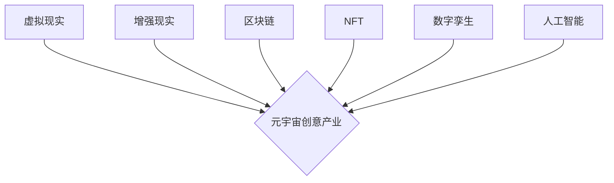

> 元宇宙、创意产业、虚拟现实、增强现实、区块链、NFT、数字孪生、人工智能

## 1. 背景介绍

元宇宙概念近年来备受关注，它被定义为一个由虚拟现实、增强现实、区块链、人工智能等技术融合而成的沉浸式数字世界。这个概念不仅引发了科技界的热议，也对创意产业产生了深远的影响。

传统创意产业主要围绕物理世界展开，而元宇宙为创意工作者提供了全新的创作、展示和传播平台。在这个虚拟世界中，创意不再受限于物理空间和时间，人们可以自由地构建、体验和分享创意作品。

## 2. 核心概念与联系

元宇宙创意产业的核心概念包括：

* **虚拟现实 (VR):**  通过头戴式设备，用户可以沉浸在虚拟环境中，体验身临其境的感觉。
* **增强现实 (AR):**  通过手机或眼镜等设备，将虚拟元素叠加到现实世界中，增强现实体验。
* **区块链:**  提供去中心化的、安全可靠的数字资产交易平台，支持数字艺术品、虚拟物品等创作者的权益保护。
* **NFT (非同质化代币):**  代表着独特的数字资产，可以用于交易虚拟物品、艺术品等，赋予数字内容独一无二的价值。
* **数字孪生:**  虚拟世界中的虚拟模型，可以与现实世界中的实体进行实时同步，用于模拟、预测和优化现实世界中的各种场景。
* **人工智能 (AI):**  可以用于生成创意内容、个性化用户体验、自动运营虚拟世界等。

**核心概念架构图:**



## 3. 核心算法原理 & 具体操作步骤

### 3.1  算法原理概述

元宇宙创意产业涉及多种算法，例如：

* **3D建模算法:** 用于构建虚拟世界中的场景、人物、物体等。
* **渲染算法:** 用于将虚拟场景渲染成可视化的图像。
* **物理模拟算法:** 用于模拟虚拟世界中的物理现象，例如重力、碰撞等。
* **路径规划算法:** 用于计算虚拟角色在虚拟世界中的移动路径。
* **人工智能算法:** 用于生成创意内容、个性化用户体验、自动运营虚拟世界等。

### 3.2  算法步骤详解

以3D建模算法为例，其基本步骤包括：

1. **数据采集:** 收集现实世界中的三维数据，例如扫描、照片等。
2. **数据处理:** 对采集到的数据进行处理，例如去除噪声、修复缺失部分等。
3. **模型构建:** 根据处理后的数据，构建三维模型。
4. **模型优化:** 对模型进行优化，例如简化模型、提高渲染效率等。
5. **模型导出:** 将模型导出为可用于虚拟世界的格式。

### 3.3  算法优缺点

不同的算法具有不同的优缺点，需要根据具体应用场景选择合适的算法。

例如，3D建模算法的优点是能够构建逼真的虚拟场景，缺点是计算量大，需要强大的硬件支持。

### 3.4  算法应用领域

元宇宙创意产业中的算法广泛应用于以下领域：

* **游戏开发:** 构建虚拟游戏世界、设计游戏角色、模拟游戏物理等。
* **影视制作:** 制作虚拟场景、合成虚拟人物、实现虚拟特效等。
* **建筑设计:** 虚拟展示建筑模型、模拟建筑结构、进行建筑优化等。
* **教育培训:** 创建沉浸式学习环境、模拟真实场景、提供个性化学习体验等。

## 4. 数学模型和公式 & 详细讲解 & 举例说明

### 4.1  数学模型构建

元宇宙创意产业涉及多种数学模型，例如：

* **3D空间坐标系:** 用于描述虚拟世界中的位置和方向。
* **线性代数:** 用于处理虚拟场景中的变换、旋转、缩放等操作。
* **微积分:** 用于模拟虚拟世界中的物理现象，例如运动、碰撞等。
* **概率统计:** 用于分析用户行为、预测用户需求等。

### 4.2  公式推导过程

以3D空间坐标系为例，其基本公式如下：

* **点坐标:**  (x, y, z)
* **向量:** (dx, dy, dz)
* **点到点的距离:**  √((x2 - x1)^2 + (y2 - y1)^2 + (z2 - z1)^2)

### 4.3  案例分析与讲解

假设我们想要在虚拟世界中移动一个虚拟角色，我们可以使用线性代数的矩阵变换来实现。

例如，我们可以使用旋转矩阵将角色绕Y轴旋转90度，然后使用平移矩阵将角色沿Z轴移动10单位。

## 5. 项目实践：代码实例和详细解释说明

### 5.1  开发环境搭建

元宇宙创意产业的开发环境通常包括：

* **操作系统:** Windows、macOS、Linux等。
* **编程语言:** C++、Python、Java等。
* **游戏引擎:** Unity、Unreal Engine等。
* **虚拟现实平台:** Oculus、HTC Vive等。

### 5.2  源代码详细实现

以下是一个简单的Python代码示例，用于在虚拟世界中绘制一个立方体：

```python
import pygame

# 初始化Pygame
pygame.init()

# 设置窗口大小
screen_width = 640
screen_height = 480
screen = pygame.display.set_mode((screen_width, screen_height))

# 设置标题
pygame.display.set_caption("立方体")

# 设置颜色
black = (0, 0, 0)
white = (255, 255, 255)

# 定义立方体顶点坐标
vertices = [
    (-1, -1, -1),
    (1, -1, -1),
    (1, 1, -1),
    (-1, 1, -1),
    (-1, -1, 1),
    (1, -1, 1),
    (1, 1, 1),
    (-1, 1, 1),
]

# 定义立方体面
faces = [
    (0, 1, 2, 3),
    (4, 5, 6, 7),
    (0, 4, 7, 3),
    (1, 5, 6, 2),
    (0, 1, 5, 4),
    (3, 2, 6, 7),
]

# 游戏循环
running = True
while running:
    for event in pygame.event.get():
        if event.type == pygame.QUIT:
            running = False

    # 清空屏幕
    screen.fill(black)

    # 绘制立方体
    for face in faces:
        pygame.draw.polygon(screen, white, [
            vertices[i] for i in face
        ])

    # 更新显示
    pygame.display.flip()

# 退出Pygame
pygame.quit()
```

### 5.3  代码解读与分析

这段代码使用Pygame库绘制了一个立方体。

* 首先，初始化Pygame并设置窗口大小和标题。
* 然后，定义立方体的顶点坐标和面。
* 最后，在游戏循环中，清空屏幕，绘制立方体，并更新显示。

### 5.4  运行结果展示

运行这段代码后，将显示一个黑色的窗口，其中有一个白色的立方体。

## 6. 实际应用场景

元宇宙创意产业的应用场景非常广泛，例如：

* **虚拟展览:**  艺术家可以在虚拟世界中举办展览，观众可以身临其境地欣赏艺术作品。
* **虚拟音乐会:**  音乐家可以在虚拟世界中举办音乐会，观众可以与音乐家互动，体验沉浸式的音乐表演。
* **虚拟游戏:**  游戏开发者可以使用元宇宙技术开发更加沉浸式、交互式的游戏。
* **虚拟教育:**  学生可以在虚拟世界中学习，体验身临其境的环境和互动学习。

### 6.4  未来应用展望

元宇宙创意产业未来发展潜力巨大，例如：

* **更逼真的虚拟体验:**  随着技术的进步，虚拟世界将更加逼真，能够提供更沉浸式的体验。
* **更丰富的互动方式:**  元宇宙将支持更丰富的互动方式，例如手势识别、语音识别等，使虚拟世界更加人性化。
* **更广泛的应用场景:**  元宇宙将应用于更多领域，例如医疗、教育、商业等，带来更多创新和价值。

## 7. 工具和资源推荐

### 7.1  学习资源推荐

* **书籍:**  《元宇宙：下一代互联网》
* **在线课程:**  Coursera、Udemy等平台上的元宇宙相关课程
* **技术博客:**  Hacker News、Medium等平台上的元宇宙相关博客

### 7.2  开发工具推荐

* **游戏引擎:**  Unity、Unreal Engine
* **虚拟现实平台:**  Oculus、HTC Vive
* **编程语言:**  C++、Python、Java

### 7.3  相关论文推荐

* **元宇宙的定义和特征**
* **元宇宙的技术架构**
* **元宇宙的应用场景和未来发展趋势**

## 8. 总结：未来发展趋势与挑战

### 8.1  研究成果总结

元宇宙创意产业是一个新兴的领域，近年来取得了显著的进展。

* 虚拟现实、增强现实等技术的进步，为元宇宙提供了技术基础。
* 区块链技术为元宇宙提供了去中心化的平台，保障了数字资产的权益保护。
* 人工智能技术为元宇宙提供了智能化服务，增强了用户体验。

### 8.2  未来发展趋势

元宇宙创意产业未来将朝着以下方向发展：

* **更加逼真、沉浸式的虚拟体验:**  随着技术的进步，虚拟世界将更加逼真，能够提供更沉浸式的体验。
* **更丰富的互动方式:**  元宇宙将支持更丰富的互动方式，例如手势识别、语音识别等，使虚拟世界更加人性化。
* **更广泛的应用场景:**  元宇宙将应用于更多领域，例如医疗、教育、商业等，带来更多创新和价值。

### 8.3  面临的挑战

元宇宙创意产业也面临着一些挑战：

* **技术难题:**  例如，如何实现更加逼真的虚拟体验、如何保障用户隐私安全等。
* **商业模式:**  如何构建可持续的商业模式，让元宇宙创意产业能够健康发展。
* **伦理问题:**  例如，如何避免虚拟世界中的虚拟暴力的发生、如何保护用户数据安全等。

### 8.4  研究展望

未来，我们需要继续深入研究元宇宙创意产业，解决技术难题，探索商业模式，并关注伦理问题，推动元宇宙创意产业健康发展。

## 9. 附录：常见问题与解答

* **什么是元宇宙？**

元宇宙是一个由虚拟现实、增强现实、区块链、人工智能等技术融合而成的沉浸式数字世界。

* **元宇宙创意产业有哪些应用场景？**

元宇宙创意产业的应用场景非常广泛，例如虚拟展览、虚拟音乐会、虚拟游戏、虚拟教育等。

* **元宇宙创意产业面临哪些挑战？**

元宇宙创意产业面临的技术难题、商业模式问题和伦理问题等挑战。


作者：禅与计算机程序设计艺术 / Zen and the Art of Computer Programming 
<end_of_turn>