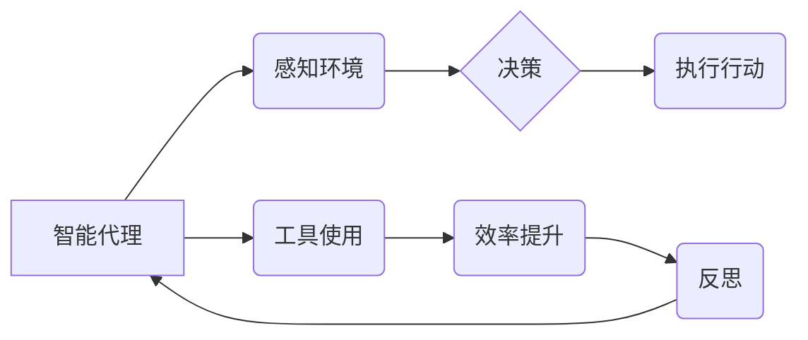

>  * 智能代理
>  * 效率提升
>  * 工具使用
>  * 反思与实践
>  * 决策优化
>  * 学习与适应

## 1. 背景介绍

在当今数据爆炸和计算能力飞速发展的时代，智能代理（Agent）作为一种能够自主感知环境、做出决策并执行行动的软件实体，在各个领域展现出巨大的潜力。从自动驾驶汽车到个性化推荐系统，从金融交易策略到医疗诊断辅助，智能代理正在改变着我们的生活方式和工作模式。

然而，构建高效、可靠的智能代理仍然是一个巨大的挑战。代理需要具备强大的学习能力，能够从海量数据中提取知识，并根据环境变化不断调整策略。同时，代理还需要高效地利用各种工具和资源，才能完成复杂的任务。

## 2. 核心概念与联系

**2.1 智能代理的定义**

智能代理是指能够感知环境、做出决策并执行行动的软件实体。它通常具有以下特征：

* **自主性:** 代理能够独立地做出决策，而不依赖于外部控制。
* **感知能力:** 代理能够感知环境中的信息，例如传感器数据、网络流量等。
* **决策能力:** 代理能够根据感知到的信息做出合理的决策。
* **行动能力:** 代理能够执行决策，例如控制机器、发送消息等。

**2.2 工具的使用与代理效率**

工具可以帮助代理提高效率，例如：

* **数据处理工具:** 用于处理海量数据，提取有价值的信息。
* **机器学习工具:** 用于训练代理的决策模型，提高其学习能力。
* **规划工具:** 用于帮助代理制定行动计划，提高其执行效率。
* **通信工具:** 用于帮助代理与其他代理或系统进行交互，协同完成任务。

**2.3 反思与工具使用**

反思是代理不断学习和改进的关键。通过反思，代理可以：

* **分析决策结果:** 识别成功的决策和失败的决策，找出原因。
* **优化策略:** 根据反思结果，调整决策策略，提高效率。
* **学习新知识:** 从经验中学习，扩展知识库。

**2.4 核心概念关系图**



## 3. 核心算法原理 & 具体操作步骤

**3.1 算法原理概述**

本节将介绍一种用于提高智能代理效率的算法，该算法基于强化学习和工具使用策略。

**3.2 算法步骤详解**

1. **环境建模:** 代理首先需要对环境进行建模，包括感知到的状态、可能的行动和奖励机制。
2. **工具库构建:** 代理需要构建一个工具库，包含各种工具和资源，例如数据处理工具、机器学习模型、规划算法等。
3. **策略学习:** 代理使用强化学习算法学习一个策略，该策略能够根据当前状态和工具库选择最优的行动。
4. **工具选择:** 在执行行动之前，代理需要选择合适的工具来辅助完成任务。
5. **行动执行:** 代理执行选择的行动，并根据结果更新策略和工具库。
6. **反思与优化:** 代理需要定期反思自己的决策和行动，识别改进空间，并根据反思结果优化策略和工具库。

**3.3 算法优缺点**

**优点:**

* **适应性强:** 该算法能够适应不断变化的环境。
* **效率高:** 通过工具使用和策略优化，代理能够更高效地完成任务。
* **可扩展性强:** 可以根据需要添加新的工具和资源。

**缺点:**

* **训练复杂:** 强化学习算法的训练需要大量数据和计算资源。
* **工具选择困难:** 选择合适的工具对于代理的效率至关重要，但这是一个复杂的问题。

**3.4 算法应用领域**

该算法可以应用于各种领域，例如：

* **自动驾驶:** 帮助自动驾驶汽车做出更安全、更有效的决策。
* **机器人控制:** 提高机器人的自主性和效率。
* **个性化推荐:** 提供更精准、更个性化的推荐结果。
* **金融交易:** 自动化交易策略，提高投资收益。

## 4. 数学模型和公式 & 详细讲解 & 举例说明

**4.1 数学模型构建**

我们可以用一个马尔可夫决策过程（MDP）来建模智能代理的行为。

* **状态空间:** S，表示代理可能处于的所有状态。
* **行动空间:** A，表示代理可以执行的所有行动。
* **转移概率:** P(s' | s, a)，表示从状态 s 执行行动 a 后转移到状态 s' 的概率。
* **奖励函数:** R(s, a)，表示在状态 s 执行行动 a 后获得的奖励。
* **折扣因子:** γ，表示未来奖励的权重。

**4.2 公式推导过程**

代理的目标是找到一个策略 π(s)，该策略能够最大化其累积奖励。我们可以使用贝尔曼方程来计算策略的价值函数 Vπ(s)：

```latex
Vπ(s) = R(s, π(s)) + γ Σ_{s'} P(s' | s, π(s)) Vπ(s')
```

**4.3 案例分析与讲解**

假设一个代理需要在迷宫中找到出口。我们可以将迷宫的状态空间定义为迷宫中的每个位置，行动空间定义为“向上”、“向下”、“向左”、“向右”四个方向。奖励函数可以定义为：

* 当代理到达出口时，奖励为 1。
* 当代理撞墙时，奖励为 -1。
* 其他情况下，奖励为 0。

代理可以使用强化学习算法学习一个策略，该策略能够最大化其累积奖励，从而找到迷宫的出口。

## 5. 项目实践：代码实例和详细解释说明

**5.1 开发环境搭建**

本项目使用 Python 语言开发，需要安装以下库：

* NumPy
* TensorFlow
* OpenAI Gym

**5.2 源代码详细实现**

```python
import gym
import tensorflow as tf

# 定义代理类
class Agent:
    def __init__(self, state_size, action_size):
        self.state_size = state_size
        self.action_size = action_size
        self.model = tf.keras.models.Sequential([
            tf.keras.layers.Dense(64, activation='relu', input_shape=(state_size,)),
            tf.keras.layers.Dense(action_size)
        ])
        self.optimizer = tf.keras.optimizers.Adam()

    # 选择行动
    def choose_action(self, state):
        state = tf.expand_dims(state, axis=0)
        action_probs = self.model(state)
        action = tf.random.categorical(action_probs, num_samples=1)[0, 0]
        return action

    # 更新模型
    def update_model(self, state, action, reward, next_state, done):
        with tf.GradientTape() as tape:
            target = reward
            if not done:
                target = reward + self.gamma * tf.reduce_max(self.model(next_state))
            prediction = self.model(state)
            loss = tf.keras.losses.categorical_crossentropy(
                tf.one_hot(action, self.action_size), prediction
            )
        gradients = tape.gradient(loss, self.model.trainable_variables)
        self.optimizer.apply_gradients(zip(gradients, self.model.trainable_variables))

# 创建环境
env = gym.make('CartPole-v1')

# 创建代理
agent = Agent(state_size=env.observation_space.shape[0], action_size=env.action_space.n)

# 训练代理
for episode in range(1000):
    state = env.reset()
    done = False
    total_reward = 0
    while not done:
        action = agent.choose_action(state)
        next_state, reward, done, _ = env.step(action)
        agent.update_model(state, action, reward, next_state, done)
        state = next_state
        total_reward += reward
    print(f'Episode {episode+1}: Total Reward = {total_reward}')

# 测试代理
state = env.reset()
while True:
    env.render()
    action = agent.choose_action(state)
    next_state, reward, done, _ = env.step(action)
    state = next_state
    if done:
        break
env.close()
```

**5.3 代码解读与分析**

该代码实现了一个简单的强化学习代理，用于控制 CartPole 环境中的杆子。

* 代理类 `Agent` 包含模型、优化器和行为选择方法。
* `choose_action` 方法根据当前状态选择行动。
* `update_model` 方法使用梯度下降更新模型参数。
* 主程序创建环境、代理和训练循环。

**5.4 运行结果展示**

运行代码后，代理将学习控制杆子，使其保持平衡尽可能长时间。

## 6. 实际应用场景

**6.1 自动驾驶**

智能代理可以用于自动驾驶汽车，帮助车辆感知环境、做出决策并控制车辆行驶。

**6.2 机器人控制**

智能代理可以用于控制机器人，帮助机器人完成各种任务，例如搬运物品、清洁环境等。

**6.3 个性化推荐**

智能代理可以用于个性化推荐系统，根据用户的行为和偏好推荐合适的商品或服务。

**6.4 金融交易**

智能代理可以用于自动化交易策略，帮助投资者提高投资收益。

**6.5 未来应用展望**

随着人工智能技术的不断发展，智能代理将在更多领域得到应用，例如医疗诊断、教育教学、科学研究等。

## 7. 工具和资源推荐

**7.1 学习资源推荐**

* **书籍:**
    * 《Reinforcement Learning: An Introduction》 by Richard S. Sutton and Andrew G. Barto
    * 《Deep Reinforcement Learning Hands-On》 by Maxim Lapan
* **在线课程:**
    * Coursera: Reinforcement Learning Specialization
    * Udacity: Deep Reinforcement Learning Nanodegree

**7.2 开发工具推荐**

* **TensorFlow:** 深度学习框架
* **PyTorch:** 深度学习框架
* **OpenAI Gym:** 强化学习环境库

**7.3 相关论文推荐**

* Deep Q-Network (DQN)
* Proximal Policy Optimization (PPO)
* Trust Region Policy Optimization (TRPO)

## 8. 总结：未来发展趋势与挑战

**8.1 研究成果总结**

近年来，智能代理领域取得了显著进展，例如深度强化学习算法的突破、通用人工智能的探索等。

**8.2 未来发展趋势**

* **更强大的学习能力:** 代理将能够学习更复杂的任务，并适应更动态的环境。
* **更广泛的应用场景:** 代理将应用于更多领域，例如医疗、教育、科学研究等。
* **更安全的代理:** 代理将更加安全可靠，能够更好地与人类协作。

**8.3 面临的挑战**

* **数据获取和标注:** 强化学习算法需要大量数据进行训练，数据获取和标注仍然是一个挑战。
* **模型解释性和可解释性:** 深度学习模型的决策过程难以解释，这限制了代理的应用。
* **伦理和社会影响:** 智能代理的应用可能带来伦理和社会问题，需要进行深入研究和讨论。

**8.4 研究展望**

未来，智能代理研究将继续朝着更强大、更安全、更可解释的方向发展。


## 9. 附录：常见问题与解答

**9.1 如何选择合适的工具？**

选择合适的工具取决于代理的任务和环境。需要考虑工具的功能、效率、可靠性等因素。

**9.2 如何评估代理的效率？