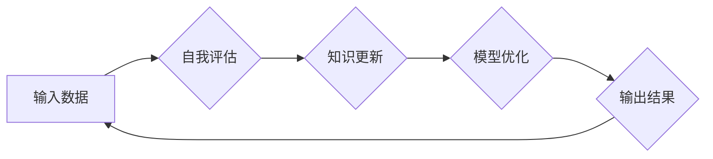

> Large Language Model (LLM), 自我改进, 反思机制, 知识更新, 性能优化, 伦理考量

## 1. 背景介绍

大型语言模型 (LLM) 近年来取得了令人瞩目的成就，在文本生成、翻译、问答等领域展现出强大的能力。然而，LLM 的训练数据通常是静态的，无法随着时间推移而更新，这导致模型知识的局限性和对新信息的适应能力不足。此外，LLM 的训练过程本身也存在着一些问题，例如过拟合、数据偏差等，这些问题都会影响模型的性能和可靠性。

为了解决这些问题，研究者们提出了许多自我改进的方法，旨在让 LLM 能够持续学习、更新知识并提升性能。这些方法的核心思想是让 LLM 能够反思自身，识别自身的局限性，并采取措施进行改进。

## 2. 核心概念与联系

**2.1  自我改进的本质**

自我改进是指 LLM 能够通过自身分析和学习，不断提升自身的能力和性能的过程。这与人类的学习过程类似，人类通过反思经验、总结教训，不断完善自己的知识和技能。

**2.2  反思机制**

反思机制是实现自我改进的关键。它需要 LLM 能够：

* **识别自身局限性:**  例如，识别自身在某些特定领域知识不足、推理能力有限等问题。
* **分析错误原因:**  例如，分析模型在处理某些输入时产生的错误，找出错误的根源。
* **制定改进方案:**  例如，根据分析结果，制定针对性的改进方案，例如学习新的知识、调整模型参数等。

**2.3  知识更新**

知识更新是自我改进的重要组成部分。LLM 需要能够从外部世界获取新的信息，并将其融入自身知识体系中。这可以通过以下方式实现：

* **持续学习:**  利用新的数据进行模型微调，更新模型参数。
* **知识图谱:**  构建知识图谱，将不同领域的知识进行关联，提高模型对知识的理解和应用能力。
* **人类反馈:**  利用人类专家对模型输出的反馈，进行模型修正和优化。

**2.4  性能优化**

性能优化是指通过改进模型结构、算法或训练方法，提高模型的效率和准确性。这可以通过以下方式实现：

* **模型压缩:**  减少模型参数量，降低模型的计算复杂度。
* **高效算法:**  采用更有效的算法进行模型训练和推理。
* **硬件加速:**  利用GPU等硬件加速器，提高模型训练和推理速度。

**2.5  伦理考量**

自我改进的 LLM 可能会带来一些伦理问题，例如：

* **模型偏见:**  如果训练数据存在偏见，自我改进的 LLM 也可能放大这些偏见。
* **模型透明度:**  自我改进的过程可能比较复杂，难以解释模型的决策过程，这可能会导致模型的不可信赖性。
* **模型安全:**  如果 LLM 的自我改进能力被恶意利用，可能会导致模型产生有害的输出。

因此，在开发和应用自我改进的 LLM 时，需要认真考虑这些伦理问题，并采取相应的措施进行规避。

**2.6  架构图**



## 3. 核心算法原理 & 具体操作步骤

**3.1  算法原理概述**

自我改进的 LLM 通常采用强化学习 (Reinforcement Learning, RL) 的方法。RL 是一种机器学习方法，它通过奖励机制来引导模型学习。在自我改进的 LLM 中，模型的输出会被评估，并根据评估结果获得奖励或惩罚。模型的目标是最大化奖励，从而不断改进自身。

**3.2  算法步骤详解**

1. **环境设定:**  定义模型的运行环境，包括输入数据、输出结果、奖励函数等。
2. **模型初始化:**  初始化 LLM 的模型参数。
3. **数据收集:**  收集模型的输出结果和相应的评估结果。
4. **奖励函数设计:**  设计一个奖励函数，根据模型的输出结果和评估结果计算奖励值。
5. **策略更新:**  利用 RL 算法，根据奖励函数和模型的输出结果，更新模型的参数，使其能够获得更高的奖励。
6. **迭代训练:**  重复步骤 3-5，直到模型的性能达到预期的水平。

**3.3  算法优缺点**

**优点:**

* 可以使 LLM 持续学习和改进。
* 可以根据实际应用场景定制奖励函数，引导模型学习特定技能。

**缺点:**

* 需要大量的训练数据和计算资源。
* 设计合理的奖励函数比较困难。

**3.4  算法应用领域**

* **自然语言处理:**  例如，文本生成、机器翻译、问答系统等。
* **计算机视觉:**  例如，图像识别、目标检测、图像生成等。
* **机器人控制:**  例如，自主导航、物体抓取等。

## 4. 数学模型和公式 & 详细讲解 & 举例说明

**4.1  数学模型构建**

在 RL 中，模型的学习过程可以看作是一个马尔可夫决策过程 (Markov Decision Process, MDP)。MDP 由以下几个要素组成:

* **状态空间 (State Space):**  模型可能处于的各种状态。
* **动作空间 (Action Space):**  模型在每个状态下可以采取的各种动作。
* **转移概率 (Transition Probability):**  从一个状态采取一个动作后，转移到另一个状态的概率。
* **奖励函数 (Reward Function):**  模型在每个状态采取一个动作后获得的奖励值。

**4.2  公式推导过程**

RL 的目标是找到一个策略 (Policy)，使得模型在 MDP 中获得最大的累积奖励。策略是一个映射关系，将每个状态映射到一个动作。常用的 RL 算法包括 Q 学习、SARSA 等。

**4.3  案例分析与讲解**

例如，训练一个 LLM 进行文本生成任务，我们可以将文本生成过程看作一个 MDP。

* **状态空间:**  当前生成的文本序列。
* **动作空间:**  可以添加的下一个单词。
* **转移概率:**  根据模型的语言模型，预测添加下一个单词的概率。
* **奖励函数:**  根据生成的文本的质量，例如流畅度、语法正确性、语义相关性等，给予奖励。

通过 RL 算法，模型可以学习到一个策略，使得它能够生成高质量的文本。

## 5. 项目实践：代码实例和详细解释说明

**5.1  开发环境搭建**

* Python 3.7+
* TensorFlow 或 PyTorch
* CUDA 和 cuDNN (如果使用 GPU)

**5.2  源代码详细实现**

```python
import tensorflow as tf

# 定义模型结构
model = tf.keras.Sequential([
    tf.keras.layers.Embedding(vocab_size, embedding_dim),
    tf.keras.layers.LSTM(units),
    tf.keras.layers.Dense(vocab_size, activation='softmax')
])

# 定义奖励函数
def reward_function(generated_text, target_text):
    # 计算奖励值，例如基于 BLEU 分数
    return bleu_score(generated_text, target_text)

# 定义训练循环
def train_loop(model, dataset, epochs):
    for epoch in range(epochs):
        for batch in dataset:
            # 前向传播
            predictions = model(batch['input_text'])
            # 计算损失
            loss = tf.keras.losses.CategoricalCrossentropy()(batch['target_text'], predictions)
            # 反向传播
            loss.backward()
            # 更新模型参数
            optimizer.step()
            # 计算奖励
            reward = reward_function(predictions, batch['target_text'])
            # 更新策略
            # 使用 RL 算法更新策略
    return model

# 训练模型
model = train_loop(model, dataset, epochs=10)
```

**5.3  代码解读与分析**

* 代码首先定义了 LLM 的模型结构，例如使用 LSTM 网络进行文本生成。
* 然后定义了奖励函数，用于评估模型生成的文本质量。
* 训练循环中，模型会进行前向传播、反向传播和参数更新，同时也会计算奖励并更新策略。

**5.4  运行结果展示**

训练完成后，可以将模型应用于文本生成任务，并观察生成的文本质量。

## 6. 实际应用场景

**6.1  文本生成:**

* 自动生成新闻报道、小说、诗歌等。
* 自动生成代码、文档、邮件等。

**6.2  机器翻译:**

* 自动将文本从一种语言翻译成另一种语言。

**6.3  问答系统:**

* 自动回答用户提出的问题。

**6.4  未来应用展望**

* 更智能、更个性化的 AI 助手。
* 更高效、更准确的机器学习模型。
* 更丰富的、更沉浸式的虚拟现实和增强现实体验。

## 7. 工具和资源推荐

**7.1  学习资源推荐**

* **书籍:**
    * Deep Reinforcement Learning Hands-On by Maxim Lapan
    * Reinforcement Learning: An Introduction by Richard S. Sutton and Andrew G. Barto
* **在线课程:**
    * Deep Reinforcement Learning Specialization by DeepLearning.AI
    * Reinforcement Learning by David Silver (University of DeepMind)

**7.2  开发工具推荐**

* **TensorFlow:**  https://www.tensorflow.org/
* **PyTorch:**  https://pytorch.org/
* **OpenAI Gym:**  https://gym.openai.com/

**7.3  相关论文推荐**

* **Attention Is All You Need:** https://arxiv.org/abs/1706.03762
* **BERT: Pre-training of Deep Bidirectional Transformers for Language Understanding:** https://arxiv.org/abs/1810.04805
* **GPT-3: Language Models are Few-Shot Learners:** https://arxiv.org/abs/2005.14165

## 8. 总结：未来发展趋势与挑战

**8.1  研究成果总结**

近年来，自我改进的 LLM 取得了显著进展，在文本生成、机器翻译等领域展现出强大的能力。

**8.2  未来发展趋势**

* **更强大的模型:**  随着计算资源的增加，模型规模和能力将会进一步提升。
* **更有效的算法:**  新的 RL 算法和训练方法将会被开发出来，提高模型的学习效率和性能。
* **更广泛的应用:**  自我改进的 LLM 将应用于更多领域，例如医疗、教育、金融等。

**8.3  面临的挑战**

* **数据安全和隐私:**  自我改进的 LLM 需要大量数据进行训练，如何保证数据安全和隐私是一个重要问题。
* **模型可解释性:**  自我改进的 LLM 的决策过程比较复杂，难以解释模型的决策结果，这可能会导致模型的不可信赖性。
* **伦理问题:**  自我改进的 LLM 可能被用于恶意目的，例如生成虚假信息、进行网络攻击等，需要认真考虑伦理问题。

**8.4  研究展望**

未来，研究者们将继续探索自我改进的 LLM 的潜力，开发更强大、更安全、更可解释的模型，并将 LLM 应用于更多领域，为人类社会带来更多福祉。

## 9. 附录：常见问题与解答

**9.1  Q: 自我改进的 LLM 是否会变得过于智能，威胁到人类？**

**A:**  这是一个重要的伦理问题。目前，自我改进的 LLM 仍然处于早期阶段，其智能水平远低于人类。但是，随着技术的进步，我们需要认真思考如何确保 AI 技术的安全性和可控性，避免其对人类社会造成负面影响。

**9.2  Q: 自我改进的 LLM 需要多少数据才能训练？**

