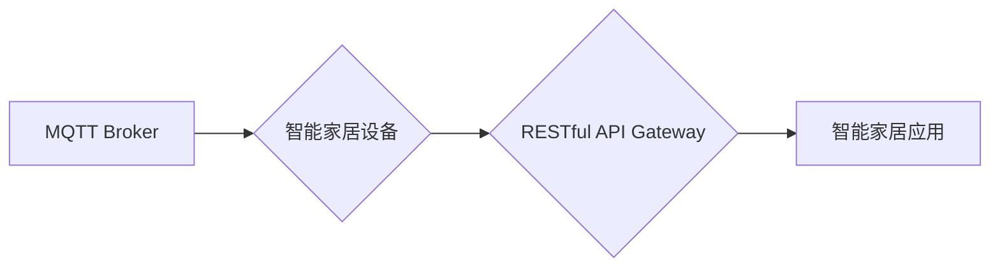

> MQTT, RESTful API, 智能家居, 设备适配, 协议, 架构, 安全

## 1. 背景介绍

智能家居已成为现代生活的重要组成部分，其核心是通过网络连接各种智能设备，实现对家居环境的自动化控制和智能化管理。然而，智能家居设备的种类繁多，来自不同厂商，采用不同的协议和接口，导致设备之间难以互联互通，严重影响了用户体验和智能家居生态的建设。

MQTT（Message Queuing Telemetry Transport）协议是一种轻量级、低功耗的机器对机器（M2M）通信协议，广泛应用于物联网领域，其特点是：

* **轻量级：** MQTT协议本身非常简洁，占用资源少，适合资源受限的设备。
* **低功耗：** MQTT协议采用发布/订阅模式，只在数据发生变化时进行传输，降低了通信开销，延长了设备续航时间。
* **可靠性：** MQTT协议支持消息确认机制，确保消息可靠传输。

RESTful API（Representational State Transfer Application Programming Interface）是一种基于HTTP协议的软件架构风格，其特点是：

* **资源导向：** RESTful API将数据视为资源，通过统一的接口进行访问和操作。
* **状态转移：** RESTful API通过HTTP方法（GET、POST、PUT、DELETE等）来操作资源状态。
* **可扩展性：** RESTful API采用层级架构，易于扩展和维护。

MQTT协议和RESTful API各自在智能家居领域发挥着重要作用，但它们之间缺乏直接的连接机制，导致智能家居设备的适配性问题。

## 2. 核心概念与联系

### 2.1 MQTT协议

MQTT协议是一种轻量级、低功耗的机器对机器（M2M）通信协议，广泛应用于物联网领域。其特点是：

* **发布/订阅模式：** MQTT协议采用发布/订阅模式，消息发布者将消息发布到特定的主题，订阅者可以订阅感兴趣的主题，接收相关消息。
* **消息确认机制：** MQTT协议支持消息确认机制，确保消息可靠传输。
* **QoS等级：** MQTT协议提供三种消息质量等级（QoS），分别为0、1和2，可以根据应用场景选择合适的QoS等级。

### 2.2 RESTful API

RESTful API是一种基于HTTP协议的软件架构风格，其特点是：

* **资源导向：** RESTful API将数据视为资源，通过统一的接口进行访问和操作。
* **状态转移：** RESTful API通过HTTP方法（GET、POST、PUT、DELETE等）来操作资源状态。
* **可扩展性：** RESTful API采用层级架构，易于扩展和维护。

### 2.3 MQTT与RESTful API的结合

将MQTT协议和RESTful API结合起来，可以实现智能家居设备的互联互通和数据共享。

* **MQTT作为设备层协议：** 智能家居设备使用MQTT协议进行数据通信，发布和订阅设备状态信息。
* **RESTful API作为应用层接口：** 智能家居应用使用RESTful API访问设备数据，控制设备状态。

**MQTT与RESTful API的架构图**



## 3. 核心算法原理 & 具体操作步骤

### 3.1  算法原理概述

本文主要探讨基于MQTT协议和RESTful API的智能家居设备适配性分析，其核心算法原理是基于消息路由和数据转换。

* **消息路由：** 根据设备类型和功能，将MQTT消息路由到相应的RESTful API接口。
* **数据转换：** 将MQTT消息转换为RESTful API可理解的数据格式，例如JSON或XML。

### 3.2  算法步骤详解

1. **设备注册：** 智能家居设备连接MQTT Broker，并注册自身信息，包括设备类型、功能、MQTT主题等。
2. **消息发布：** 智能家居设备根据自身状态或用户指令，发布MQTT消息到相应的主题。
3. **消息订阅：** RESTful API Gateway订阅MQTT Broker上的相关主题，接收设备发布的消息。
4. **消息路由：** RESTful API Gateway根据消息内容，路由到相应的RESTful API接口。
5. **数据转换：** RESTful API Gateway将MQTT消息转换为RESTful API可理解的数据格式，例如JSON或XML。
6. **数据处理：** RESTful API接口接收数据，进行相应的处理，例如控制设备状态、更新设备信息等。
7. **数据返回：** RESTful API接口将处理结果返回给智能家居应用，例如设备状态反馈、操作结果等。

### 3.3  算法优缺点

**优点：**

* **灵活性和扩展性：** MQTT协议和RESTful API都是开放标准，可以灵活扩展和定制。
* **可靠性和安全性：** MQTT协议支持消息确认机制，RESTful API可以结合安全认证机制，确保消息可靠传输和数据安全性。
* **跨平台兼容性：** MQTT协议和RESTful API都支持多种平台和编程语言，可以实现跨平台的设备互联互通。

**缺点：**

* **复杂度：** 将MQTT协议和RESTful API结合起来，需要考虑消息路由、数据转换等复杂逻辑。
* **性能：** 如果消息量过大，可能会导致系统性能下降。

### 3.4  算法应用领域

* **智能家居：** 实现智能家居设备的互联互通和数据共享。
* **工业自动化：** 连接工业设备，实现数据采集、控制和监控。
* **医疗保健：** 连接医疗设备，实现远程医疗和健康监测。

## 4. 数学模型和公式 & 详细讲解 & 举例说明

### 4.1  数学模型构建

为了分析MQTT协议和RESTful API的适配性，可以构建一个数学模型，其中：

* **设备状态：** 使用一个向量表示设备的状态，例如温度、湿度、灯光状态等。
* **用户指令：** 使用一个整数表示用户指令，例如打开灯光、关闭空调等。
* **消息传输时间：** 使用一个实数表示消息传输的时间。

### 4.2  公式推导过程

* **设备状态更新公式：**

$$
S(t+1) = S(t) + \alpha * U(t)
$$

其中：

* $S(t)$ 表示设备状态在时间 $t$ 的值。
* $S(t+1)$ 表示设备状态在时间 $t+1$ 的值。
* $\alpha$ 表示用户指令对设备状态的影响系数。
* $U(t)$ 表示用户指令在时间 $t$ 的值。

* **消息传输时间公式：**

$$
T(t) = f(D, R)
$$

其中：

* $T(t)$ 表示消息传输时间。
* $D$ 表示消息大小。
* $R$ 表示网络带宽。
* $f$ 表示消息传输时间与消息大小和网络带宽的关系函数。

### 4.3  案例分析与讲解

假设一个智能家居场景，用户通过智能手机发送指令打开客厅的灯光。

1. 用户指令被转换为MQTT消息，发布到相应的主题。
2. MQTT Broker接收消息，并路由到RESTful API Gateway。
3. RESTful API Gateway将MQTT消息转换为RESTful API可理解的数据格式，并路由到控制灯光设备的API接口。
4. 控制灯光设备的API接口接收数据，并发送指令给灯光设备，打开灯光。
5. 灯光设备收到指令，改变状态，并发布状态更新消息到MQTT Broker。
6. MQTT Broker将状态更新消息广播给订阅该主题的设备和应用，例如智能手机。
7. 智能手机接收状态更新消息，更新灯光状态信息。

## 5. 项目实践：代码实例和详细解释说明

### 5.1  开发环境搭建

* **操作系统：** Ubuntu 20.04 LTS
* **编程语言：** Python 3.8
* **MQTT Broker：** Mosquitto 1.6.1
* **RESTful API框架：** Flask 2.0.1

### 5.2  源代码详细实现

```python
# mqtt_client.py
import paho.mqtt.client as mqtt

# MQTT Broker地址
MQTT_BROKER_ADDRESS = "mqtt.example.com"
# MQTT主题
MQTT_TOPIC = "smart_home/living_room/light"

def on_connect(client, userdata, flags, rc):
    if rc == 0:
        print("Connected to MQTT Broker successfully!")
        client.subscribe(MQTT_TOPIC)
    else:
        print("Connection failed with code:", rc)

def on_message(client, userdata, msg):
    print("Received message:", msg.payload.decode())

client = mqtt.Client()
client.on_connect = on_connect
client.on_message = on_message
client.connect(MQTT_BROKER_ADDRESS)
client.loop_forever()

# rest_api.py
from flask import Flask, request, jsonify

app = Flask(__name__)

@app.route('/light', methods=['POST'])
def control_light():
    data = request.get_json()
    action = data.get('action')
    if action == 'on':
        # 发送MQTT消息打开灯光
        # ...
        return jsonify({'status': 'success'})
    elif action == 'off':
        # 发送MQTT消息关闭灯光
        # ...
        return jsonify({'status': 'success'})
    else:
        return jsonify({'status': 'error', 'message': 'Invalid action'}), 400

if __name__ == '__main__':
    app.run(debug=True)
```

### 5.3  代码解读与分析

* **mqtt_client.py:** 该文件实现了一个MQTT客户端，连接到MQTT Broker，订阅指定的主题，并处理接收到的消息。
* **rest_api.py:** 该文件实现了一个RESTful API，提供控制灯光设备的接口，接收用户指令，并通过MQTT消息发送指令给灯光设备。

### 5.4  运行结果展示

运行上述代码，可以实现以下功能：

* 通过智能手机发送POST请求到`/light`接口，控制客厅的灯光开关。
* MQTT Broker会将用户指令转换为MQTT消息，发布到相应的主题。
* 灯光设备订阅该主题，接收消息并执行相应的操作。

## 6. 实际应用场景

### 6.1 智能家居场景

* **灯光控制：** 用户可以通过智能手机或语音助手控制智能灯光，实现场景模式、定时开关等功能。
* **空调控制：** 用户可以通过智能手机或语音助手控制智能空调，实现温度调节、定时开关等功能。
* **窗帘控制：** 用户可以通过智能手机或语音助手控制智能窗帘，实现自动开合、遮光等功能。

### 6.2 工业自动化场景

* **设备监控：** 将工业设备连接到MQTT Broker，实时监控设备状态，例如温度、压力、流量等。
* **远程控制：** 通过RESTful API远程控制工业设备，例如启动、停止、调整参数等。
* **故障预警：** 当设备出现异常时，MQTT Broker会将报警信息发布到相应的主题，RESTful API可以接收报警信息，并采取相应的措施。

### 6.3 医疗保健场景

* **远程医疗：** 将医疗设备连接到MQTT Broker，实现远程患者监测和诊断。
* **健康监测：** 用户可以通过智能设备佩戴传感器，实时监测心率、血压、血糖等健康数据，并通过MQTT Broker发送到医生或家庭成员。
* **药物提醒：** 通过智能设备设置药物提醒功能，并通过MQTT Broker发送提醒信息给患者。

### 6.4 未来应用展望

随着物联网技术的不断发展，MQTT协议和RESTful API将应用于更多领域，例如：

* **智慧城市：** 实现城市交通、环境监测、公共安全等方面的智能化管理。
* **智慧农业：** 实现精准农业、智能灌溉、远程监控等功能。
