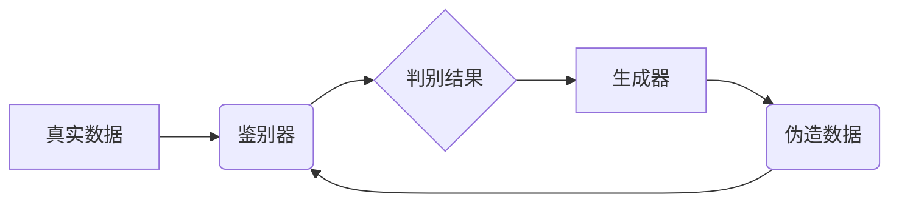

> 生成对抗网络 (GAN)，图像风格迁移，用户交互，体验优化，艺术创作

## 1. 背景介绍

图像风格迁移技术近年来备受关注，它能够将一种图像的风格应用到另一幅图像上，创造出具有独特艺术效果的图像。这种技术在艺术创作、图像编辑、电影特效等领域有着广泛的应用前景。传统的图像风格迁移方法通常依赖于手工设计的特征提取和风格转换算法，其效果往往有限，且难以满足用户个性化的需求。

随着深度学习技术的快速发展，基于生成对抗网络 (GAN) 的图像风格迁移方法取得了显著的进展。GAN 是一种由生成器 (Generator) 和鉴别器 (Discriminator) 组成的神经网络架构，通过对抗训练的方式，生成器不断学习生成逼真的图像，而鉴别器则不断学习区分真实图像和生成图像。这种对抗机制使得 GAN 在图像生成领域展现出强大的能力，并被广泛应用于图像风格迁移任务中。

## 2. 核心概念与联系

### 2.1 生成对抗网络 (GAN)

GAN 由 Ian Goodfellow 等人于 2014 年提出，是一种通过生成器和鉴别器之间的对抗训练来学习生成数据的机器学习框架。

* **生成器 (Generator):** 负责生成新的数据样本，例如图像、文本等。
* **鉴别器 (Discriminator):** 负责区分真实数据样本和生成器生成的伪造样本。

GAN 的训练过程可以看作是两个玩家之间的博弈：生成器试图生成逼真的伪造样本，而鉴别器试图识别出这些伪造样本。通过不断的对抗训练，生成器逐渐学习生成更逼真的样本，而鉴别器也逐渐提高了识别能力。



### 2.2 图像风格迁移

图像风格迁移是指将一幅图像的风格应用到另一幅图像上，生成具有目标风格的图像。

* **内容图像:** 需要迁移风格的图像。
* **风格图像:** 提供目标风格的图像。

目标是将内容图像的内容保留，同时应用风格图像的风格，生成具有独特艺术效果的图像。

## 3. 核心算法原理 & 具体操作步骤

### 3.1 算法原理概述

基于 GAN 的图像风格迁移算法通常采用以下步骤：

1. **特征提取:** 使用卷积神经网络 (CNN) 从内容图像和风格图像中提取特征。
2. **风格损失函数:** 计算内容图像和风格图像特征之间的差异，作为风格损失函数。
3. **对抗损失函数:** 使用 GAN 的对抗训练机制，训练生成器生成具有目标风格的图像。
4. **优化目标:** 将风格损失函数和对抗损失函数相结合，作为生成器的优化目标。

### 3.2 算法步骤详解

1. **数据预处理:** 将内容图像和风格图像预处理，例如调整尺寸、归一化像素值等。
2. **特征提取:** 使用预训练的 CNN 模型，例如 VGGNet，从内容图像和风格图像中提取特征。
3. **风格损失函数:** 计算内容图像和风格图像特征之间的差异，例如使用 Gram 矩阵计算特征的协方差。
4. **对抗损失函数:** 使用 GAN 的对抗训练机制，训练生成器生成具有目标风格的图像。鉴别器试图区分真实图像和生成图像，而生成器试图生成逼真的图像，以欺骗鉴别器。
5. **优化目标:** 将风格损失函数和对抗损失函数相结合，作为生成器的优化目标。使用梯度下降算法优化生成器的参数，使其生成具有目标风格的图像。
6. **图像合成:** 将生成器生成的图像与内容图像的内容融合，得到最终的风格迁移图像。

### 3.3 算法优缺点

**优点:**

* **效果显著:** 基于 GAN 的图像风格迁移算法能够生成具有高质量的风格迁移效果。
* **灵活多样:** 可以根据不同的风格图像和内容图像，生成具有不同风格的图像。
* **个性化定制:** 用户可以根据自己的喜好，调整风格迁移参数，实现个性化的风格迁移效果。

**缺点:**

* **训练复杂:** GAN 的训练过程比较复杂，需要大量的训练数据和计算资源。
* **模式崩溃:** GAN 训练过程中可能出现模式崩溃现象，导致生成器生成重复或低质量的图像。
* **稳定性差:** GAN 的训练过程比较不稳定，需要精心调参才能获得良好的效果。

### 3.4 算法应用领域

* **艺术创作:** 生成具有独特艺术风格的图像，用于绘画、雕塑、摄影等艺术创作。
* **图像编辑:** 将图像风格迁移到其他风格，例如将照片风格迁移到油画风格。
* **电影特效:** 在电影特效中使用图像风格迁移技术，例如将场景风格迁移到不同的时代背景。
* **游戏开发:** 在游戏中使用图像风格迁移技术，例如改变游戏角色的服装风格。

## 4. 数学模型和公式 & 详细讲解 & 举例说明

### 4.1 数学模型构建

基于 GAN 的图像风格迁移算法通常使用以下数学模型：

* **生成器 (G):**  G(z) 是一个神经网络，输入一个随机噪声向量 z，输出一个具有目标风格的图像。
* **鉴别器 (D):** D(x) 是一个神经网络，输入一个图像 x，输出一个判断该图像是否为真实图像的概率。

### 4.2 公式推导过程

* **风格损失函数:**  L_style(G(z), style_image) 计算生成器生成的图像 G(z) 和风格图像 style_image 的特征之间的差异。常用的风格损失函数是 Gram 矩阵损失函数。
* **对抗损失函数:** L_adv(G(z), D) 计算生成器生成的图像 G(z) 和真实图像之间的差异。
* **总损失函数:** L(G) = L_style(G(z), style_image) + λ * L_adv(G(z), D)

其中 λ 是一个超参数，用于平衡风格损失和对抗损失的权重。

### 4.3 案例分析与讲解

假设我们想要将一幅风景照片的风格迁移到梵高的绘画风格。

1. 我们选择一幅梵高的绘画作为风格图像，并提取其特征。
2. 我们选择一幅风景照片作为内容图像，并提取其特征。
3. 我们使用 GAN 的训练过程，训练生成器生成具有梵高绘画风格的图像。
4. 我们使用风格损失函数和对抗损失函数，优化生成器的参数。
5. 我们最终得到一幅具有梵高绘画风格的风景图像。

## 5. 项目实践：代码实例和详细解释说明

### 5.1 开发环境搭建

* **操作系统:** Ubuntu 18.04
* **Python 版本:** 3.7
* **深度学习框架:** TensorFlow 2.0
* **其他依赖库:** numpy, matplotlib, PIL

### 5.2 源代码详细实现

```python
import tensorflow as tf
from tensorflow.keras.layers import Input, Conv2D, BatchNormalization, LeakyReLU, Flatten, Dense
from tensorflow.keras.models import Model

# 定义生成器模型
def build_generator(input_shape):
    input_layer = Input(shape=input_shape)
    x = Conv2D(64, (3, 3), activation='relu', padding='same')(input_layer)
    x = BatchNormalization()(x)
    x = Conv2D(128, (3, 3), activation='relu', padding='same')(x)
    x = BatchNormalization()(x)
    x = Conv2D(256, (3, 3), activation='relu', padding='same')(x)
    x = BatchNormalization()(x)
    x = Conv2D(512, (3, 3), activation='relu', padding='same')(x)
    x = BatchNormalization()(x)
    x = Conv2D(3, (3, 3), activation='tanh', padding='same')(x)
    return Model(inputs=input_layer, outputs=x)

# 定义鉴别器模型
def build_discriminator(input_shape):
    input_layer = Input(shape=input_shape)
    x = Conv2D(64, (3, 3), activation='relu', padding='same')(input_layer)
    x = BatchNormalization()(x)
    x = Conv2D(128, (3, 3), activation='relu', padding='same')(x)
    x = BatchNormalization()(x)
    x = Conv2D(256, (3, 3), activation='relu', padding='same')(x)
    x = BatchNormalization()(x)
    x = Flatten()(x)
    x = Dense(1, activation='sigmoid')(x)
    return Model(inputs=input_layer, outputs=x)

# 构建生成器和鉴别器模型
generator = build_generator((128, 128, 3))
discriminator = build_discriminator((128, 128, 3))

# 定义损失函数和优化器
optimizer = tf.keras.optimizers.Adam(learning_rate=0.0002)
loss_fn = tf.keras.losses.BinaryCrossentropy()

# 训练循环
for epoch in range(100):
    # 训练生成器
    noise = tf.random.normal((batch_size, 128, 128, 3))
    generated_images = generator(noise)
    fake_output = discriminator(generated_images)
    generator_loss = loss_fn(tf.ones_like(fake_output), fake_output)
    optimizer.minimize(generator_loss, var_list=generator.trainable_variables)

    # 训练鉴别器
    real_images = tf.random.normal((batch_size, 128, 128, 3))
    real_output = discriminator(real_images)
    fake_output = discriminator(generated_images)
    discriminator_loss = loss_fn(tf.ones_like(real_output), real_output) + loss_fn(tf.zeros_like(fake_output), fake_output)
    optimizer.minimize(discriminator_loss, var_list=discriminator.trainable_variables)

    # 打印训练进度
    print(f"Epoch: {epoch}, Generator Loss: {generator_loss.numpy()}, Discriminator Loss: {discriminator_loss.numpy()}")

# 保存生成器模型
generator.save("style_transfer_generator.h5")
```

### 5.3 代码解读与分析

* **模型构建:** 代码首先定义了生成器和鉴别器模型的结构，使用卷积神经网络 (CNN) 作为模型基础。
* **损失函数:** 使用二元交叉熵损失函数 (Binary Crossentropy) 计算生成器和鉴别器的损失。
* **训练循环:** 代码实现了生成器和鉴别器的对抗训练循环，通过不断调整模型参数，使得生成器能够生成逼真的图像，而鉴别器能够区分真实图像和生成图像。
* **模型保存:** 训练完成后，将生成器模型保存为 `.h5` 文件，以便后续使用。

### 5.4 运行结果展示

运行代码后，可以生成具有目标风格的图像。

## 6. 实际应用场景

### 6.1 艺术创作

* **个性化艺术作品:** 用户可以将自己的照片或绘画风格迁移到其他艺术风格，创作出具有独特个性化的艺术作品。
* **艺术风格探索:** 艺术家可以使用图像风格迁移技术探索不同的艺术风格，并从中获得灵感。

### 6.2 图像编辑

* **风格化照片:** 将照片风格迁移到其他风格，例如将照片风格迁移到油画风格、水彩风格等。
* **图像增强:** 使用图像风格迁移技术增强图像的视觉效果，例如增加图像的细节、色彩饱和度等。

### 6.3 电影特效

* **场景