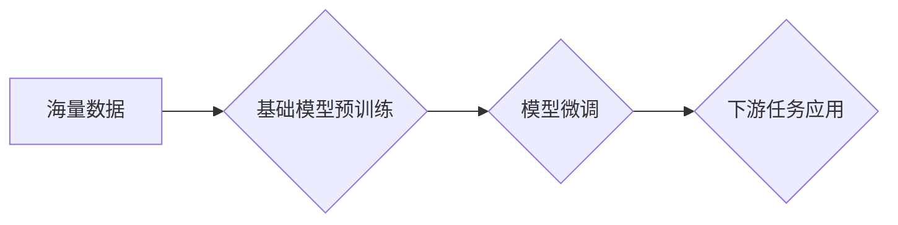

> 基础模型、涌现行为、部署、迁移学习、参数效率、可解释性、伦理

## 1. 背景介绍

近年来，深度学习领域取得了令人瞩目的进展，基础模型（Foundation Models）作为其重要组成部分，展现出强大的泛化能力和适应性。基础模型通常是指在海量数据上预训练的大规模神经网络，能够在各种下游任务中表现出色，例如自然语言处理、计算机视觉、语音识别等。

基础模型的涌现，标志着人工智能发展进入了一个新的阶段。它们不仅推动了人工智能技术的进步，也引发了广泛的讨论和思考。

**1.1 基础模型的优势**

基础模型的优势主要体现在以下几个方面：

* **强大的泛化能力:** 基于海量数据的预训练，基础模型能够学习到更深层的语义和模式，从而在未见过的任务和数据上表现出色。
* **参数效率:** 基础模型可以作为其他模型的起点，通过微调的方式进行特定任务的训练，从而降低训练成本和时间。
* **可复用性:** 基础模型可以被广泛应用于不同的领域和任务，提高了开发效率和资源利用率。

**1.2 基础模型的挑战**

尽管基础模型展现出巨大的潜力，但也面临着一些挑战：

* **训练成本高:** 基础模型的训练需要大量的计算资源和时间，这对于个人开发者和小型机构来说是一个很大的负担。
* **可解释性差:** 基础模型的决策过程复杂，难以理解其背后的逻辑，这对于一些安全敏感的应用来说是一个问题。
* **伦理风险:** 基础模型可能被用于生成虚假信息、传播偏见等，需要谨慎考虑其伦理风险。

## 2. 核心概念与联系

**2.1 基础模型的定义**

基础模型是指在海量数据上预训练的大规模神经网络，能够在各种下游任务中表现出色。

**2.2 涌现行为的定义**

涌现行为是指复杂系统中出现的新性质，这些性质不能从单个个体中预测出来，而是由系统整体的相互作用产生。

**2.3 基础模型与涌现行为的联系**

基础模型的训练过程可以看作是一个复杂系统，其中神经网络参数是系统个体，训练数据是系统环境。在训练过程中，神经网络参数会不断调整，最终形成一个能够处理各种任务的模型。

这种调整过程本身就是一个涌现行为，因为模型的最终性能是由所有参数的相互作用决定的，而这些相互作用是无法预先预测的。

**2.4 基础模型的部署**

基础模型的部署是指将预训练好的模型应用于实际场景中。

**2.5 基础模型部署的挑战**

基础模型的部署面临着以下挑战：

* **模型规模:** 基础模型通常非常庞大，部署到资源有限的设备上会带来挑战。
* **效率:** 基础模型的推理速度通常较慢，需要进行优化才能满足实时应用的需求。
* **可解释性:** 基础模型的决策过程难以理解，需要开发可解释性工具来帮助用户理解模型的输出。

**2.6 Mermaid 流程图**



## 3. 核心算法原理 & 具体操作步骤

**3.1 算法原理概述**

基础模型的训练通常采用自监督学习的方式，即利用无标签数据进行预训练。

常见的自监督学习方法包括：

* **语言建模:** 预测下一个词，例如GPT-3。
* **图像建模:** 预测图像的缺失部分，例如DALL-E 2。
* **对比学习:** 将相似样本映射到相近的向量空间，例如SimCLR。

**3.2 算法步骤详解**

1. **数据预处理:** 将原始数据进行清洗、格式化等处理，使其适合模型训练。
2. **模型架构设计:** 选择合适的模型架构，例如Transformer、CNN等。
3. **模型预训练:** 在海量数据上进行预训练，学习到底层特征和语义表示。
4. **模型微调:** 将预训练好的模型应用于特定任务，通过微调参数使其在目标任务上表现出色。
5. **模型评估:** 使用测试集评估模型的性能，并进行调整和优化。

**3.3 算法优缺点**

**优点:**

* 强大的泛化能力
* 参数效率
* 可复用性

**缺点:**

* 训练成本高
* 可解释性差
* 伦理风险

**3.4 算法应用领域**

基础模型在各个领域都有广泛的应用，例如：

* 自然语言处理: 文本生成、机器翻译、问答系统等。
* 计算机视觉: 图像识别、目标检测、图像生成等。
* 语音识别: 语音转文本、语音合成等。
* 其他领域: 代码生成、药物发现、科学研究等。

## 4. 数学模型和公式 & 详细讲解 & 举例说明

**4.1 数学模型构建**

基础模型的训练过程可以看作是一个优化问题，目标是找到一组参数，使得模型在训练数据上的损失函数最小。

损失函数通常是模型预测值与真实值的差值，例如均方误差（MSE）或交叉熵损失（Cross-Entropy Loss）。

**4.2 公式推导过程**

假设模型的输出为y，真实值是t，损失函数为L(y,t)。

模型的目标是找到参数θ，使得损失函数最小化：

```latex
\theta = \arg \min_{\theta} L(y, t)
```

可以使用梯度下降算法来优化参数θ。梯度下降算法的基本思想是：

1. 计算损失函数对参数θ的梯度。
2. 根据梯度方向更新参数θ。

**4.3 案例分析与讲解**

例如，在语言建模任务中，模型的输出是一个词的概率分布，真实值是下一个词。

损失函数可以使用交叉熵损失来衡量模型预测值与真实值的差异。

```latex
L(y, t) = - \sum_{i=1}^{V} t_i \log(y_i)
```

其中，V是词汇表的大小，t_i是真实词的one-hot编码，y_i是模型预测词的概率。

## 5. 项目实践：代码实例和详细解释说明

**5.1 开发环境搭建**

* Python 3.7+
* PyTorch 1.7+
* CUDA 10.2+

**5.2 源代码详细实现**

```python
import torch
import torch.nn as nn

class Transformer(nn.Module):
    def __init__(self, vocab_size, embedding_dim, num_heads, num_layers):
        super(Transformer, self).__init__()
        self.embedding = nn.Embedding(vocab_size, embedding_dim)
        self.transformer_encoder = nn.TransformerEncoder(nn.TransformerEncoderLayer(embedding_dim, num_heads), num_layers)

    def forward(self, x):
        x = self.embedding(x)
        x = self.transformer_encoder(x)
        return x

# 实例化模型
model = Transformer(vocab_size=10000, embedding_dim=512, num_heads=8, num_layers=6)

# 定义损失函数和优化器
criterion = nn.CrossEntropyLoss()
optimizer = torch.optim.Adam(model.parameters(), lr=0.001)

# 训练模型
for epoch in range(num_epochs):
    for batch in train_dataloader:
        optimizer.zero_grad()
        outputs = model(batch)
        loss = criterion(outputs, batch_labels)
        loss.backward()
        optimizer.step()

```

**5.3 代码解读与分析**

* 代码实现了基于Transformer架构的语言模型。
* 模型包含嵌入层、Transformer编码器等部分。
* 训练过程使用交叉熵损失函数和Adam优化器。

**5.4 运行结果展示**

训练完成后，可以评估模型在测试集上的性能，例如准确率、困惑度等。

## 6. 实际应用场景

基础模型在各个领域都有广泛的应用，例如：

* **自然语言处理:**

    * **文本生成:** 使用GPT-3等模型生成高质量的文本，例如小说、诗歌、代码等。
    * **机器翻译:** 使用T5等模型将文本从一种语言翻译成另一种语言。
    * **问答系统:** 使用BERT等模型回答用户的问题。

* **计算机视觉:**

    * **图像识别:** 使用ResNet、EfficientNet等模型识别图像中的物体。
    * **目标检测:** 使用YOLO、Faster R-CNN等模型检测图像中的多个物体。
    * **图像生成:** 使用DALL-E 2等模型根据文本描述生成图像。

* **语音识别:** 使用wav2vec 2.0等模型将语音转为文本。

**6.4 未来应用展望**

基础模型的应用前景广阔，未来可能在以下领域发挥更大的作用:

* **个性化推荐:** 基于用户的行为数据和偏好，提供个性化的商品、内容推荐等。
* **自动驾驶:** 基于图像和传感器数据，帮助车辆进行自主驾驶。
* **医疗诊断:** 基于患者的病历和影像数据，辅助医生进行诊断和治疗。

## 7. 工具和资源推荐

**7.1 学习资源推荐**

* **书籍:**
    * Deep Learning by Ian Goodfellow, Yoshua Bengio, and Aaron Courville
    * Hands-On Machine Learning with Scikit-Learn, Keras & TensorFlow by Aurélien Géron
* **课程:**
    * Stanford CS231n: Convolutional Neural Networks for Visual Recognition
    * Deep Learning Specialization by Andrew Ng

**7.2 开发工具推荐**

* **框架:** PyTorch, TensorFlow
* **库:** NumPy, Pandas, Scikit-learn
* **平台:** Google Colab, Kaggle

**7.3 相关论文推荐**

* Attention Is All You Need (Vaswani et al., 2017)
* BERT: Pre-training of Deep Bidirectional Transformers for Language Understanding (Devlin et al., 2018)
* GPT-3: Language Models are Few-Shot Learners (Brown et al., 2020)

## 8. 总结：未来发展趋势与挑战

**8.1 研究成果总结**

基础模型的涌现，标志着人工智能发展进入了一个新的阶段。它们展现出强大的泛化能力和适应性，在各个领域都有广泛的应用。

**8.2 未来发展趋势**

* **模型规模的进一步扩大:** 随着计算资源的不断发展，基础模型的规模将继续扩大，从而提升模型的性能。
* **多模态学习:** 基础模型将融合不同模态的数据，例如文本、图像、音频等，从而实现更全面的理解和生成。
* **可解释性研究:** 研究基础模型的决策过程，提高模型的可解释性和可信任性。

**8.3 面临的挑战**

* **训练成本:** 基础模型的训练成本仍然很高，需要开发更有效的训练方法和硬件平台。
* **数据偏见:** 基础模型可能继承训练数据中的偏见，需要开发方法来缓解数据偏见的影响。
* **伦理风险:** 基础模型可能被用于生成虚假信息、传播偏见等，需要谨慎考虑其伦理风险。

**8.4 研究展望**

未来，基础模型的研究将继续深入，探索其更深层的潜力，并解决其面临的挑战。


## 9. 附录：常见问题与解答

**9.1 如何选择合适的基础模型？**

选择合适的基础模型需要根据具体的应用场景和任务需求进行考虑。

例如，对于文本生成任务，可以考虑使用GPT-3等语言模型；对于图像识别任务，可以考虑使用ResNet、EfficientNet等图像识别模型。

**9.2 如何进行基础模型的微调？**

基础模型的微调是指将预训练好的模型应用于特定任务，通过调整模型参数使其在目标任务上表现出色。

微调过程通常包括以下步骤：

1