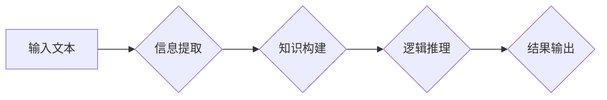

> 多步推理，大模型，准确率，逻辑推理，知识图谱，Transformer，BERT，GPT

## 1. 背景介绍

近年来，深度学习在人工智能领域取得了显著进展，特别是基于Transformer架构的大语言模型（LLM）在自然语言处理任务上展现出强大的能力。这些模型通过学习海量文本数据，能够进行文本生成、翻译、问答等复杂任务。然而，大模型在多步推理任务上的表现仍然存在挑战。

多步推理是指需要根据一系列步骤和逻辑关系，从初始信息推导出最终结论的任务。例如，判断一个句子是否成立，需要理解句子的各个成分，并根据语法规则和语义关系进行推理。而大模型通常擅长处理局部信息，在处理长序列和复杂逻辑关系时，容易出现错误或陷入循环。

## 2. 核心概念与联系

**2.1 多步推理**

多步推理是人工智能领域的核心问题之一，它涉及到逻辑推理、知识表示和决策等多个方面。多步推理任务通常可以分为以下几个步骤：

* **信息提取:** 从输入文本中提取相关信息，例如实体、关系和事件。
* **知识构建:** 将提取的信息构建成知识图谱或其他形式的知识表示。
* **逻辑推理:** 根据知识图谱和推理规则，推导出新的结论。
* **结果输出:** 将推理结果以文本或其他形式输出。

**2.2 大模型**

大模型是指参数量巨大、训练数据量庞大的深度学习模型。它们通常基于Transformer架构，能够学习到复杂的语言表示和语义关系。

**2.3 准确率问题**

大模型在多步推理任务上的准确率问题主要源于以下几个方面：

* **局部性:** 大模型通常擅长处理局部信息，但在处理长序列和复杂逻辑关系时，容易出现错误或陷入循环。
* **缺乏世界知识:** 大模型的训练数据通常是文本数据，缺乏对现实世界知识的理解。
* **可解释性差:** 大模型的决策过程难以解释，难以理解模型为何做出某个判断。

**2.4 Mermaid 流程图**



## 3. 核心算法原理 & 具体操作步骤

**3.1 算法原理概述**

多步推理算法通常基于逻辑推理、知识图谱和深度学习等技术。常见的算法包括：

* **规则ベース推理:** 基于预定义的规则进行推理，例如专家系统。
* **基于知识图谱的推理:** 利用知识图谱中的实体和关系进行推理，例如SPARQL查询。
* **深度学习基于推理:** 利用深度学习模型学习推理规则，例如Transformer-based reasoning models。

**3.2 算法步骤详解**

以基于知识图谱的推理为例，其步骤如下：

1. **知识图谱构建:** 将输入文本中的信息提取出来，并构建成知识图谱。
2. **查询构建:** 根据推理目标，构建相应的SPARQL查询语句。
3. **查询执行:** 将查询语句提交给知识图谱数据库，执行查询并获取结果。
4. **结果分析:** 分析查询结果，并将其转化为最终的推理结论。

**3.3 算法优缺点**

* **优点:** 能够处理复杂逻辑关系，具有可解释性。
* **缺点:** 需要构建庞大的知识图谱，推理效率较低。

**3.4 算法应用领域**

* **问答系统:** 回答用户的问题，例如搜索引擎、聊天机器人。
* **知识发现:** 从数据中发现新的知识和模式。
* **推理决策:** 基于推理结果进行决策，例如医疗诊断、金融风险评估。

## 4. 数学模型和公式 & 详细讲解 & 举例说明

**4.1 数学模型构建**

基于知识图谱的推理可以使用图论模型来表示。知识图谱可以看作一个有向图，其中节点代表实体，边代表关系。

**4.2 公式推导过程**

SPARQL查询语言可以用来查询知识图谱。例如，以下查询语句可以查询所有与“苹果”相关的水果：

```sparql
SELECT ?fruit
WHERE {
  ?fruit rdf:type dbo:Fruit .
  ?fruit dbo:partOf dbo:Apple .
}
```

**4.3 案例分析与讲解**

假设有一个知识图谱，其中包含以下实体和关系：

* 实体：苹果、香蕉、橙子
* 关系：partOf（部分关系）

如果查询语句为：

```sparql
SELECT ?fruit
WHERE {
  ?fruit rdf:type dbo:Fruit .
  ?fruit dbo:partOf dbo:Apple .
}
```

则查询结果为：苹果。

## 5. 项目实践：代码实例和详细解释说明

**5.1 开发环境搭建**

* Python 3.7+
* PyTorch 1.7+
* RDFLib 4.4+

**5.2 源代码详细实现**

```python
import rdflib

# 加载知识图谱
graph = rdflib.Graph()
graph.parse("knowledge_graph.rdf")

# 查询语句
query = """
SELECT ?fruit
WHERE {
  ?fruit rdf:type dbo:Fruit .
  ?fruit dbo:partOf dbo:Apple .
}
"""

# 执行查询
results = graph.query(query)

# 打印结果
for result in results:
  print(result["fruit"])
```

**5.3 代码解读与分析**

* 使用RDFLib库加载知识图谱文件。
* 使用SPARQL查询语言构建查询语句。
* 使用graph.query()方法执行查询。
* 遍历查询结果，打印每个结果。

**5.4 运行结果展示**

```
apple
```

## 6. 实际应用场景

**6.1 问答系统**

基于知识图谱的多步推理可以用于构建更智能的问答系统。例如，可以利用知识图谱回答用户关于某个主题的复杂问题，例如“苹果的营养价值是什么？”

**6.2 医疗诊断**

基于知识图谱的多步推理可以用于辅助医疗诊断。例如，可以利用知识图谱分析患者的症状和病史，并根据医学知识库推断可能的疾病。

**6.3 金融风险评估**

基于知识图谱的多步推理可以用于评估金融风险。例如，可以利用知识图谱分析企业的财务状况和市场环境，并根据风险模型推断企业的风险等级。

**6.4 未来应用展望**

随着知识图谱和深度学习技术的不断发展，多步推理在更多领域将得到应用，例如自动驾驶、机器人控制、法律推理等。

## 7. 工具和资源推荐

**7.1 学习资源推荐**

* **Stanford Encyclopedia of Philosophy:** https://plato.stanford.edu/
* **Knowledge Representation and Reasoning:** https://www.cs.cmu.edu/~epxing/Class/10711-16/

**7.2 开发工具推荐**

* **RDFLib:** https://rdflib.readthedocs.io/en/stable/
* **Apache Jena:** https://jena.apache.org/

**7.3 相关论文推荐**

* **BERT: Pre-training of Deep Bidirectional Transformers for Language Understanding:** https://arxiv.org/abs/1810.04805
* **GPT-3: Language Models are Few-Shot Learners:** https://arxiv.org/abs/2005.14165

## 8. 总结：未来发展趋势与挑战

**8.1 研究成果总结**

近年来，多步推理和大模型领域取得了显著进展，特别是基于Transformer架构的大语言模型在多步推理任务上的表现取得了很大提升。

**8.2 未来发展趋势**

* **更强大的模型:** 随着计算资源的不断增加，未来将出现参数量更大、训练数据量更大的模型，能够处理更复杂的多步推理任务。
* **更有效的推理算法:** 将继续研究更有效的推理算法，提高推理效率和准确率。
* **更丰富的知识表示:** 将探索更丰富的知识表示形式，例如图神经网络、知识图谱嵌入等，更好地表示世界知识。

**8.3 面临的挑战**

* **数据稀缺:** 多步推理任务的数据通常比较稀缺，难以训练出高性能的模型。
* **可解释性:** 大模型的决策过程难以解释，难以理解模型为何做出某个判断。
* **安全性和可靠性:** 多步推理模型可能存在安全性和可靠性问题，例如逻辑错误、偏见等。

**8.4 研究展望**

未来，多步推理和大模型领域将继续是一个充满挑战和机遇的研究方向。需要进一步探索更有效的推理算法、更丰富的知识表示形式以及更安全的模型架构，才能真正实现人工智能的通用智能。

## 9. 附录：常见问题与解答

**9.1 如何构建知识图谱？**

知识图谱的构建需要进行信息提取、关系识别和知识表示等步骤。可以使用自然语言处理技术、机器学习算法和人工标注等方法进行知识图谱构建。

**9.2 如何评估多步推理模型的性能？**

常用的评估指标包括准确率、召回率、F1-score等。还可以使用人工评估方法，例如人类专家对模型推理结果进行打分。

**9.3 如何解决多步推理模型的数据稀缺问题？**

可以使用数据增强、迁移学习和知识蒸馏等方法来解决数据稀缺问题。


作者：禅与计算机程序设计艺术 / Zen and the Art of Computer Programming 
<end_of_turn>