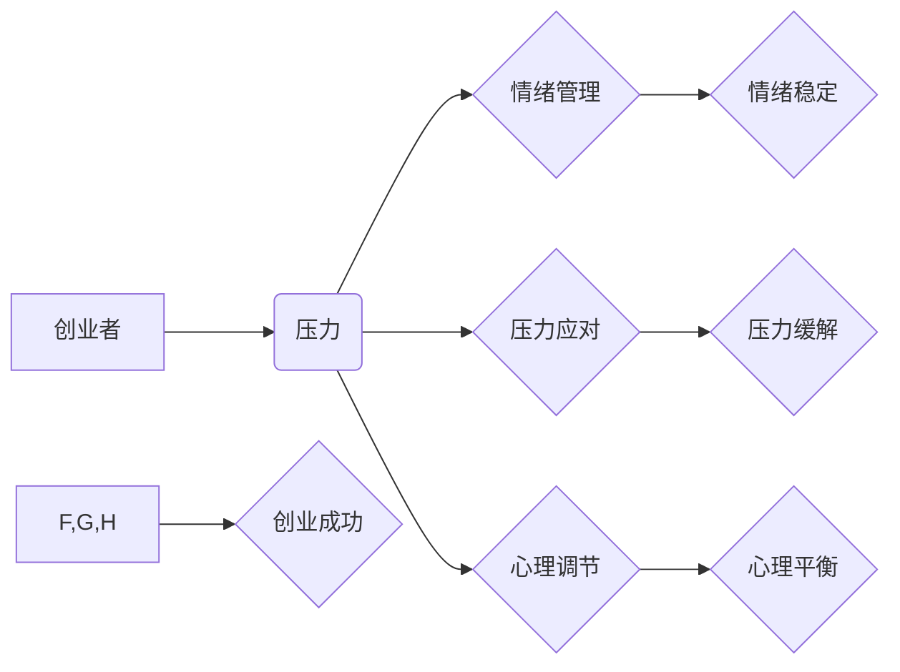

> 大模型、创业者、情绪管理、压力应对、心理调节、人工智能、技术焦虑、身心健康

## 1. 背景介绍

大模型时代来临，人工智能技术飞速发展，为创业者带来了前所未有的机遇和挑战。一方面，大模型赋予创业者强大的工具，可以加速产品开发、提升运营效率，甚至颠覆传统行业模式。另一方面，大模型的快速迭代和技术门槛也给创业者带来了巨大的压力和焦虑。

创业本身就是一项充满挑战的旅程，需要创业者具备强大的抗压能力和心理韧性。而大模型时代的到来，进一步加剧了创业者的压力，例如：

* **技术迭代速度快:** 大模型技术发展迅速，创业者需要不断学习新知识，掌握新技能，才能跟上时代的步伐。
* **竞争加剧:** 大模型技术应用广泛，创业者面临着来自各行各业的竞争，需要不断创新，才能脱颖而出。
* **市场风险高:** 大模型应用场景不断拓展，市场需求变化莫测，创业者需要快速适应市场变化，才能降低风险。

这些压力和焦虑，如果得不到有效应对，可能会导致创业者身心健康问题，甚至影响创业项目的成功。因此，创业者需要学习和掌握情绪管理、压力应对和心理调节的技巧，才能在充满挑战的大模型时代，保持身心健康，实现创业梦想。

## 2. 核心概念与联系

### 2.1  情绪管理

情绪管理是指识别、理解和调节自己的情绪，使其符合目标和情境。情绪管理是一个持续的过程，需要创业者不断练习和提升。

### 2.2  压力应对

压力应对是指面对压力时采取的积极的应对策略，例如：

* **认知重构:** 改变对压力的认知，将其视为挑战而不是威胁。
* **时间管理:** 合理安排时间，避免过度劳累。
* **放松技巧:** 学习放松技巧，例如深呼吸、冥想等，缓解压力。

### 2.3  心理调节

心理调节是指通过认知、行为和情感等方面的调整，使心理状态保持稳定和平衡。心理调节可以帮助创业者更好地应对压力，提高情绪管理能力。

**核心概念联系图:**

## 3. 核心算法原理 & 具体操作步骤

### 3.1  算法原理概述

情绪管理、压力应对和心理调节并非简单的算法，而是需要结合心理学、神经科学等多学科知识，并根据个体差异进行定制化的方案。

### 3.2  算法步骤详解

由于情绪管理、压力应对和心理调节的复杂性，无法用简单的算法步骤概括。但我们可以将这些技巧分解成一些具体的步骤，例如：

* **情绪识别:** 首先要学会识别自己的情绪，例如是焦虑、愤怒、悲伤还是快乐。
* **情绪理解:** 理解情绪的来源和背后的原因，例如是工作压力、人际关系问题还是自身性格缺陷。
* **情绪调节:** 学习一些情绪调节技巧，例如深呼吸、冥想、运动等，来控制和改变自己的情绪状态。
* **压力应对:** 针对不同的压力源，采取不同的应对策略，例如时间管理、认知重构、寻求支持等。
* **心理调节:** 通过认知行为疗法、正念训练等方式，调整自己的思维模式和行为习惯，提升心理韧性。

### 3.3  算法优缺点

由于情绪管理、压力应对和心理调节并非纯粹的算法，因此无法用传统的算法优缺点来评价。

### 3.4  算法应用领域

情绪管理、压力应对和心理调节的应用领域非常广泛，例如：

* **创业者:** 帮助创业者应对创业过程中的压力和焦虑，提高创业成功率。
* **职场人士:** 帮助职场人士缓解工作压力，提升工作效率和生活质量。
* **学生群体:** 帮助学生缓解学习压力，提高学习效率和心理健康。
* **大众群体:** 帮助大众提升情绪管理能力，改善心理健康状况。

## 4. 数学模型和公式 & 详细讲解 & 举例说明

情绪管理、压力应对和心理调节涉及到心理学、神经科学等多学科领域，其核心机制并非完全可以用数学模型和公式来描述。

## 5. 项目实践：代码实例和详细解释说明

由于情绪管理、压力应对和心理调节并非纯粹的编程问题，因此无法提供具体的代码实例和解释。

## 6. 实际应用场景

### 6.1  创业者情绪管理工具

一些创业者情绪管理工具，例如：

* **Mindfulness apps:** 例如 Headspace、Calm 等，提供冥想、呼吸练习等功能，帮助创业者缓解压力和焦虑。
* **Journaling apps:** 例如 Day One、Journey 等，帮助创业者记录情绪、反思压力源，并找到应对策略。
* **Productivity apps:** 例如 Todoist、Asana 等，帮助创业者合理安排时间，提高工作效率，减少压力。

### 6.2  压力应对策略

创业者可以根据自身情况，选择合适的压力应对策略，例如：

* **时间管理:** 利用番茄工作法、Eisenhower 矩阵等方法，合理安排时间，提高工作效率。
* **认知重构:** 将压力视为挑战而不是威胁，积极寻找解决问题的办法。
* **寻求支持:** 与家人、朋友、导师等分享压力，寻求他们的支持和帮助。
* **放松技巧:** 学习深呼吸、冥想、瑜伽等放松技巧，缓解压力和焦虑。

### 6.3  心理调节方法

创业者可以尝试一些心理调节方法，例如：

* **认知行为疗法:** 通过改变负面思维模式和行为习惯，提升心理韧性。
* **正念训练:** 培养专注力和自我意识，更好地应对压力和情绪波动。
* **心理咨询:** 向专业的心理咨询师寻求帮助，解决心理问题。

### 6.4  未来应用展望

随着人工智能技术的不断发展，未来将会有更多针对创业者情绪管理、压力应对和心理调节的工具和服务出现。例如：

* **个性化情绪管理系统:** 基于大数据分析和人工智能算法，为每个创业者提供个性化的情绪管理方案。
* **虚拟心理咨询师:** 利用人工智能技术，模拟心理咨询师的对话，为创业者提供情感支持和心理建议。
* **压力监测和预警系统:** 通过监测创业者的生理和心理指标，预警潜在的心理健康问题，并提供及时干预措施。

## 7. 工具和资源推荐

### 7.1  学习资源推荐

* **书籍:** 《情绪智力》、《压力与应对》、《正念心理学》等。
* **在线课程:** Coursera、edX 等平台提供有关情绪管理、压力应对和心理调节的在线课程。
* **网站:** 心理健康网站、创业者社区等，提供相关知识和经验分享。

### 7.2  开发工具推荐

* **Python:** 用于开发情绪分析、压力监测等人工智能应用。
* **R:** 用于数据分析和可视化，帮助研究情绪管理和压力应对的规律。
* **云计算平台:** 例如 AWS、Azure、GCP 等，提供计算资源和服务，支持大规模数据处理和模型训练。

### 7.3  相关论文推荐

* **情绪识别:** "Deep Learning for Emotion Recognition"
* **压力监测:** "Wearable Sensors for Stress Detection"
* **心理调节:** "Mindfulness-Based Interventions for Stress Reduction"

## 8. 总结：未来发展趋势与挑战

### 8.1  研究成果总结

大模型时代，情绪管理、压力应对和心理调节的研究取得了显著进展，涌现出许多新的工具和方法。

### 8.2  未来发展趋势

未来，情绪管理、压力应对和心理调节的研究将更加注重个性化、智能化和数据驱动。

### 8.3  面临的挑战

* **数据隐私和安全:** 

情绪管理和压力应对工具需要收集用户的个人数据，如何保障数据隐私和安全是一个重要的挑战。
* **算法伦理:** 

人工智能算法在情绪管理和压力应对中的应用，需要考虑伦理问题，例如算法的公平性、透明度和可解释性。
* **技术可普及性:** 

一些情绪管理和压力应对工具的技术门槛较高，需要降低技术门槛，使其更易于普及。

### 8.4  研究展望

未来，我们需要继续加强对情绪管理、压力应对和心理调节的科学研究，开发更加安全、有效、可普及的工具和方法，帮助创业者和其他群体更好地应对压力，提升心理健康水平。

## 9. 附录：常见问题与解答

### 9.1  常见问题

* **如何识别自己的情绪？**
* **如何应对创业过程中的压力？**
* **如何提升自己的心理韧性？**

### 9.2  解答

* **如何识别自己的情绪？** 可以通过观察自己的身体反应、思考模式和行为习惯来识别情绪。例如，焦虑时可能会感到心悸、呼吸急促、思维混乱；愤怒时可能会感到气愤、血压升高、易怒。
* **如何应对创业过程中的压力？** 可以尝试以下方法：时间管理、认知重构、寻求支持、放松技巧等。
* **如何提升自己的心理韧性？** 可以通过正念训练、认知行为疗法、寻求心理咨询等方式来提升心理韧性。

作者：禅与计算机程序设计艺术 / Zen and the Art of Computer Programming 
<end_of_turn>