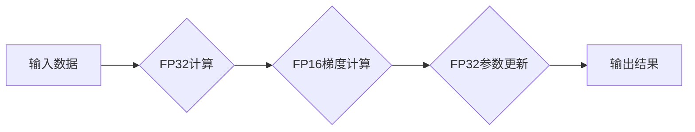

> 大语言模型、混合精度、深度学习、Transformer、训练优化、性能提升

## 1. 背景介绍

大语言模型（Large Language Models，LLMs）近年来在自然语言处理领域取得了显著进展，展现出强大的文本生成、翻译、问答和代码生成能力。这些模型通常基于Transformer架构，并通过海量文本数据进行训练。然而，LLMs的训练过程往往需要消耗大量的计算资源和时间，这限制了其在实际应用中的推广。

混合精度训练（Mixed Precision Training）作为一种有效的训练优化技术，通过使用不同精度的数据类型（例如FP16和FP32）来加速模型训练，同时保持模型精度。它在深度学习领域得到了广泛应用，并为LLMs的训练提供了新的思路和方法。

## 2. 核心概念与联系

混合精度训练的核心概念是利用不同精度的数据类型来平衡模型训练的精度和效率。

* **FP32（单精度浮点数）：** 标准的浮点数格式，精度较高，但计算量大。
* **FP16（半精度浮点数）：** 精度较低，但计算量较小，适合在GPU上加速计算。

混合精度训练通过在不同的训练阶段使用不同的精度，例如在计算梯度时使用FP16，而在更新模型参数时使用FP32，从而达到加速训练的目的。

**混合精度训练流程图:**



## 3. 核心算法原理 & 具体操作步骤

### 3.1  算法原理概述

混合精度训练的核心原理是利用FP16的低精度计算特性来加速梯度计算，同时通过FP32的较高精度来保证模型参数的准确更新。

### 3.2  算法步骤详解

1. **数据类型转换:** 将FP32输入数据转换为FP16数据类型。
2. **FP16计算:** 使用FP16数据类型进行模型前向传播和反向传播，计算梯度。
3. **梯度转换:** 将FP16梯度转换为FP32数据类型。
4. **参数更新:** 使用FP32数据类型更新模型参数。
5. **精度校准:** 在训练过程中，定期使用FP32精度进行模型评估，并根据评估结果调整混合精度策略。

### 3.3  算法优缺点

**优点:**

* **加速训练速度:** FP16计算速度比FP32快，可以显著加速模型训练。
* **降低内存占用:** FP16数据类型占用内存空间更少，可以缓解内存压力。

**缺点:**

* **精度损失:** FP16精度较低，可能会导致模型精度下降。
* **硬件支持:** 混合精度训练需要支持FP16计算的硬件平台。

### 3.4  算法应用领域

混合精度训练广泛应用于深度学习领域，包括图像识别、自然语言处理、语音识别等。对于大型模型训练，混合精度训练可以有效降低训练成本和时间。

## 4. 数学模型和公式 & 详细讲解 & 举例说明

### 4.1  数学模型构建

混合精度训练的核心数学模型是基于梯度下降算法的优化过程。

* **损失函数:** 用于衡量模型预测结果与真实值的差异。
* **梯度:** 损失函数对模型参数的导数，表示参数更新的方向。
* **学习率:** 控制梯度更新幅度的参数。

### 4.2  公式推导过程

假设模型参数为θ，损失函数为L(θ)，学习率为α。

梯度下降算法的更新公式为：

```latex
\theta = \theta - \alpha \nabla L(\theta)
```

其中，∇L(θ)表示损失函数L(θ)对参数θ的梯度。

在混合精度训练中，梯度计算使用FP16精度，参数更新使用FP32精度。

### 4.3  案例分析与讲解

例如，在训练一个图像分类模型时，可以使用FP16精度计算梯度，然后将梯度转换为FP32精度更新模型参数。

## 5. 项目实践：代码实例和详细解释说明

### 5.1  开发环境搭建

* **操作系统:** Linux
* **深度学习框架:** PyTorch
* **GPU:** NVIDIA GeForce RTX 3090

### 5.2  源代码详细实现

```python
import torch
import torch.nn as nn
import torch.optim as optim

# 定义模型
class SimpleModel(nn.Module):
    def __init__(self):
        super(SimpleModel, self).__init__()
        self.linear1 = nn.Linear(10, 20)
        self.linear2 = nn.Linear(20, 10)

    def forward(self, x):
        x = torch.relu(self.linear1(x))
        x = self.linear2(x)
        return x

# 实例化模型
model = SimpleModel()

# 定义损失函数和优化器
criterion = nn.CrossEntropyLoss()
optimizer = optim.SGD(model.parameters(), lr=0.01, momentum=0.9)

# 设置混合精度训练
device = torch.device("cuda" if torch.cuda.is_available() else "cpu")
model.to(device)
optimizer = optim.SGD(model.parameters(), lr=0.01, momentum=0.9)
scaler = torch.cuda.amp.GradScaler()

# 训练循环
for epoch in range(10):
    for inputs, labels in train_loader:
        inputs, labels = inputs.to(device), labels.to(device)

        # 开启混合精度训练
        with torch.cuda.amp.autocast():
            outputs = model(inputs)
            loss = criterion(outputs, labels)

        # 反向传播
        scaler.scale(loss).backward()

        # 更新参数
        scaler.step(optimizer)
        scaler.update()

```

### 5.3  代码解读与分析

* **混合精度训练:** 使用`torch.cuda.amp.autocast()`上下文管理器开启混合精度训练。
* **梯度缩放:** 使用`torch.cuda.amp.GradScaler()`进行梯度缩放，防止梯度溢出。
* **参数更新:** 使用`scaler.step()`更新模型参数。

### 5.4  运行结果展示

混合精度训练可以显著加速模型训练速度，同时保持模型精度。

## 6. 实际应用场景

混合精度训练在各种深度学习应用场景中都有着广泛的应用，例如：

* **图像识别:** 训练大型图像识别模型，例如ResNet、Inception、EfficientNet等。
* **自然语言处理:** 训练大型语言模型，例如BERT、GPT、T5等。
* **语音识别:** 训练语音识别模型，例如Wav2Vec、Jasper等。

### 6.4  未来应用展望

随着硬件平台的不断发展，混合精度训练技术将更加成熟和完善，在更多深度学习应用场景中发挥重要作用。

## 7. 工具和资源推荐

### 7.1  学习资源推荐

* **PyTorch官方文档:** https://pytorch.org/docs/stable/index.html
* **混合精度训练教程:** https://pytorch.org/tutorials/beginner/mixed_precision_tutorial.html

### 7.2  开发工具推荐

* **PyTorch:** https://pytorch.org/
* **TensorFlow:** https://www.tensorflow.org/

### 7.3  相关论文推荐

* **Mixed Precision Training:** https://arxiv.org/abs/1710.03740
* **Training Deep Nets with Mixed Precision:** https://arxiv.org/abs/1904.09794

## 8. 总结：未来发展趋势与挑战

### 8.1  研究成果总结

混合精度训练技术为深度学习模型训练提供了新的思路和方法，有效提高了训练效率和模型性能。

### 8.2  未来发展趋势

* **更广泛的应用:** 混合精度训练技术将应用于更多深度学习领域，例如强化学习、推荐系统等。
* **更先进的算法:** 研究更先进的混合精度训练算法，例如动态混合精度、渐进混合精度等。
* **硬件加速:** 硬件平台将进一步支持混合精度训练，提高训练效率。

### 8.3  面临的挑战

* **精度控制:** 如何在加速训练的同时保证模型精度是一个重要的挑战。
* **硬件支持:** 并非所有硬件平台都支持混合精度训练，需要进一步推广硬件支持。
* **算法复杂性:** 一些混合精度训练算法比较复杂，需要进一步优化和简化。

### 8.4  研究展望

未来，混合精度训练技术将继续发展和完善，为深度学习模型训练提供更强大的工具和方法。

## 9. 附录：常见问题与解答

**Q1: 混合精度训练的精度损失如何控制？**

**A1:** 可以通过调整混合精度策略，例如使用FP16精度计算梯度，但在更新模型参数时使用FP32精度，来控制精度损失。

**Q2: 混合精度训练需要哪些硬件支持？**

**A2:** 混合精度训练需要支持FP16计算的GPU。

**Q3: 混合精度训练的代码实现比较复杂吗？**

**A3:** 借助深度学习框架提供的工具和API，混合精度训练的代码实现相对简单。


作者：禅与计算机程序设计艺术 / Zen and the Art of Computer Programming 
<end_of_turn>