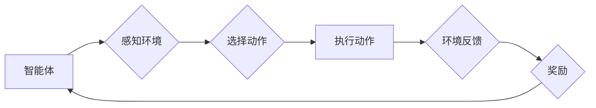

> 强化学习、强化学习算法、Q学习、SARSA、深度强化学习、环境、状态、动作、奖励、策略

## 1. 背景介绍

在人工智能领域，强化学习 (Reinforcement Learning, RL) 作为一种重要的机器学习范式，近年来取得了显著进展，并在许多实际应用中展现出强大的潜力。与监督学习和无监督学习不同，强化学习的核心在于让智能体通过与环境的交互学习最优策略，以最大化累积的奖励。

强化学习的灵感来源于动物行为学和心理学。动物通过与环境的互动，学习到哪些行为可以带来奖励，哪些行为会导致惩罚。类似地，强化学习中的智能体（agent）也通过与环境的交互，学习到如何采取最优动作序列，以获得最大的总奖励。

## 2. 核心概念与联系

强化学习的核心概念包括：

* **智能体 (Agent):**  与环境交互并采取行动的实体。
* **环境 (Environment):** 智能体所处的外部世界，它会根据智能体的动作产生新的状态和奖励。
* **状态 (State):** 环境的当前描述，它反映了环境的当前状况。
* **动作 (Action):** 智能体可以采取的行动，它会改变环境的状态。
* **奖励 (Reward):** 环境对智能体采取的动作给予的反馈，它可以是正向的（奖励）或负向的（惩罚）。
* **策略 (Policy):**  智能体在不同状态下采取动作的规则，它决定了智能体在每个状态下应该采取哪个动作。

**强化学习流程图:**



## 3. 核心算法原理 & 具体操作步骤

### 3.1  算法原理概述

强化学习算法的核心是通过不断与环境交互，学习一个最优策略，使得智能体在长期内获得最大的总奖励。常见的强化学习算法包括：

* **Q学习:**  Q学习是一种基于价值函数的强化学习算法，它通过学习状态-动作对的价值函数，来决定在每个状态下应该采取哪个动作。
* **SARSA:** SARSA (State-Action-Reward-State-Action) 是一种基于策略的强化学习算法，它通过学习状态-动作对的价值函数，来更新策略，使得智能体在每个状态下采取最优动作。

### 3.2  算法步骤详解

**Q学习算法步骤:**

1. 初始化 Q 函数，将所有状态-动作对的价值函数设置为 0。
2. 在环境中进行交互，观察当前状态和环境反馈的奖励。
3. 根据当前状态和动作，更新 Q 函数的值，使用 Bellman 方程：

 $$Q(s,a) = Q(s,a) + \alpha [r + \gamma \max_{a'} Q(s',a') - Q(s,a)]$$

其中：

* $Q(s,a)$ 是状态 $s$ 下动作 $a$ 的价值函数。
* $\alpha$ 是学习率，控制着学习速度。
* $r$ 是环境反馈的奖励。
* $\gamma$ 是折扣因子，控制着未来奖励的权重。
* $s'$ 是采取动作 $a$ 后进入的下一个状态。
* $a'$ 是在下一个状态 $s'$ 下采取的最优动作。

4. 重复步骤 2 和 3，直到 Q 函数收敛。

**SARSA 算法步骤:**

1. 初始化 Q 函数，将所有状态-动作对的价值函数设置为 0。
2. 在环境中进行交互，观察当前状态和环境反馈的奖励。
3. 根据当前状态和动作，更新 Q 函数的值，使用 Bellman 方程：

 $$Q(s,a) = Q(s,a) + \alpha [r + \gamma Q(s',a') - Q(s,a)]$$

其中：

* $Q(s,a)$ 是状态 $s$ 下动作 $a$ 的价值函数。
* $\alpha$ 是学习率，控制着学习速度。
* $r$ 是环境反馈的奖励。
* $\gamma$ 是折扣因子，控制着未来奖励的权重。
* $s'$ 是采取动作 $a$ 后进入的下一个状态。
* $a'$ 是在下一个状态 $s'$ 下采取的动作，而不是最优动作。

4. 重复步骤 2 和 3，直到 Q 函数收敛。

### 3.3  算法优缺点

**Q学习:**

* **优点:** 能够学习最优策略，收敛速度快。
* **缺点:** 需要探索所有状态-动作对，可能导致学习过程不稳定。

**SARSA:**

* **优点:** 能够学习在线策略，更适合在线学习场景。
* **缺点:** 可能学习到的策略不是最优策略。

### 3.4  算法应用领域

强化学习算法在许多领域都有广泛的应用，例如：

* **游戏:**  AlphaGo、AlphaZero 等人工智能程序通过强化学习算法，在围棋、象棋等游戏中战胜了人类世界冠军。
* **机器人:**  强化学习算法可以用于训练机器人进行各种任务，例如导航、抓取、操作等。
* **自动驾驶:**  强化学习算法可以用于训练自动驾驶汽车，使其能够在复杂道路环境中安全行驶。
* **推荐系统:**  强化学习算法可以用于个性化推荐，例如推荐电影、音乐、商品等。

## 4. 数学模型和公式 & 详细讲解 & 举例说明

### 4.1  数学模型构建

强化学习的数学模型主要包括以下几个方面：

* **状态空间 (State Space):**  所有可能的系统状态的集合。
* **动作空间 (Action Space):**  智能体在每个状态下可以采取的所有动作的集合。
* **奖励函数 (Reward Function):**  描述环境对智能体采取动作的反馈的函数。
* **策略 (Policy):**  智能体在每个状态下采取动作的概率分布。
* **价值函数 (Value Function):**  描述状态或状态-动作对的期望累积奖励的函数。

### 4.2  公式推导过程

**Bellman 方程:**

Bellman 方程是强化学习算法的核心公式，它描述了价值函数的更新规则。

* **状态价值函数 (State-Value Function):**

$$V(s) = \max_{\pi} \mathbb{E}_{\pi}[R_{t+1} + \gamma V(s')]$$

其中：

* $V(s)$ 是状态 $s$ 的价值函数。
* $\pi$ 是策略。
* $\mathbb{E}_{\pi}$ 表示根据策略 $\pi$ 的期望。
* $R_{t+1}$ 是下一个时间步的奖励。
* $\gamma$ 是折扣因子。
* $s'$ 是下一个状态。

* **动作价值函数 (Action-Value Function):**

$$Q(s,a) = \mathbb{E}[R_{t+1} + \gamma \max_{a'} Q(s',a')]$$

其中：

* $Q(s,a)$ 是状态 $s$ 下动作 $a$ 的价值函数。
* $R_{t+1}$ 是下一个时间步的奖励。
* $\gamma$ 是折扣因子。
* $s'$ 是下一个状态。
* $a'$ 是下一个状态 $s'$ 下采取的动作。

### 4.3  案例分析与讲解

**例子:**

假设有一个智能体在玩一个简单的游戏，游戏中有两种状态： "开始" 和 "结束"，智能体可以采取两种动作： "前进" 和 "后退"。

* 当智能体处于 "开始" 状态时，采取 "前进" 动作可以获得 1 的奖励，并进入 "结束" 状态。
* 当智能体处于 "开始" 状态时，采取 "后退" 动作可以获得 0 的奖励，并保持在 "开始" 状态。
* 当智能体处于 "结束" 状态时，无论采取什么动作，都不会获得奖励，也不会改变状态。

在这个例子中，我们可以使用 Q 学习算法来训练智能体学习最优策略。

## 5. 项目实践：代码实例和详细解释说明

### 5.1  开发环境搭建

* Python 3.x
* TensorFlow 或 PyTorch

### 5.2  源代码详细实现

```python
import numpy as np

# 定义环境
class Environment:
    def __init__(self):
        self.state = "start"

    def step(self, action):
        if self.state == "start":
            if action == "forward":
                self.state = "end"
                reward = 1
            else:
                reward = 0
        else:
            reward = 0
        return self.state, reward

# 定义 Q 学习算法
class QLearning:
    def __init__(self, learning_rate=0.1, discount_factor=0.9, epsilon=0.1):
        self.learning_rate = learning_rate
        self.discount_factor = discount_factor
        self.epsilon = epsilon
        self.q_table = {}

    def choose_action(self, state):
        if np.random.uniform(0, 1) < self.epsilon:
            return np.random.choice(actions)
        else:
            return np.argmax(self.q_table.get(state, [0]))

    def update_q_table(self, state, action, reward, next_state):
        self.q_table[state][action] = self.q_table.get(state, [0])[action] + self.learning_rate * (
            reward + self.discount_factor * np.max(self.q_table.get(next_state, [0])) - self.q_table.get(state, [0])[action]
        )

# 主程序
if __name__ == "__main__":
    env = Environment()
    agent = QLearning()
    actions = ["forward", "backward"]

    # 训练
    for episode in range(1000):
        state = env.state
        while state != "end":
            action = agent.choose_action(state)
            next_state, reward = env.step(action)
            agent.update_q_table(state, action, reward, next_state)
            state = next_state

    # 测试
    state = env.state
    while state != "end":
        action = agent.choose_action(state)
        next_state, reward = env.step(action)
        state = next_state
```

### 5.3  代码解读与分析

* **环境类 (Environment):** 定义了游戏环境，包括状态、动作和奖励函数。
* **Q 学习类 (QLearning):** 实现 Q 学习算法，包括学习率、折扣因子、探索率和 Q 表。
* **choose_action() 方法:** 根据当前状态和策略，选择动作。
* **update_q_table() 方法:** 更新 Q 表，根据 Bellman 方程计算新的 Q 值。
* **主程序:** 创建环境和智能体，进行训练和测试。

### 5.4  运行结果展示

训练完成后，智能体应该能够学习到最优策略，即在 "开始" 状态下采取 "前进" 动作，以获得最大的总奖励。

## 6. 实际应用场景

强化学习在许多实际应用场景中取得了显著成果，例如：

* **游戏 AI:** AlphaGo、AlphaZero 等人工智能程序通过强化学习算法，在围棋、象棋等游戏中战胜了人类世界冠军。
* **机器人控制:** 强化学习算法可以用于训练机器人进行各种任务，例如导航、抓取、操作等。
* **自动驾驶:** 强化学习算法可以用于训练自动驾驶汽车，使其能够在复杂道路环境中安全行驶。
* **推荐系统:** 强化学习算法可以用于个性化推荐，例如推荐电影、音乐、商品等。
* **医疗