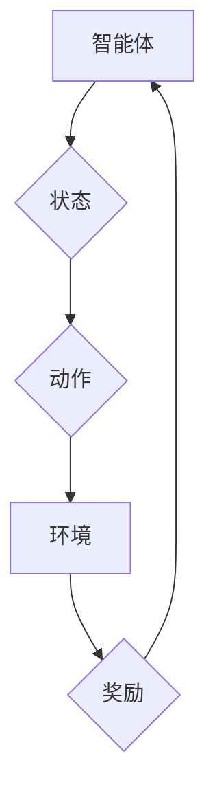

> 强化学习，注意力机制，资源分配，深度学习，强化信号

## 1. 背景介绍

在深度学习时代，模型规模不断扩大，参数数量呈指数级增长。然而，随着模型复杂度的增加，训练和推理效率也面临着严峻挑战。如何有效地分配有限的计算资源，提高模型训练和推理效率，成为一个重要的研究方向。

注意力机制（Attention Mechanism）作为一种能够模拟人类视觉注意力的机制，在自然语言处理、计算机视觉等领域取得了显著的成功。它能够学习到输入数据中最重要的部分，并对这些部分给予更多的关注，从而提高模型的性能。

强化学习（Reinforcement Learning，RL）是一种能够通过与环境交互学习最优策略的机器学习方法。它通过奖励信号引导智能体不断调整行为，最终达到目标。

将强化学习与注意力机制相结合，可以实现对计算资源的动态分配，从而提高模型的训练和推理效率。

## 2. 核心概念与联系

### 2.1 强化学习

强化学习的核心概念是“智能体-环境-状态-动作-奖励”的交互循环。智能体通过与环境交互，感知环境的状态，并根据状态选择动作。环境根据智能体的动作反馈奖励信号。智能体的目标是通过不断学习，找到能够最大化累积奖励的策略。

### 2.2 注意力机制

注意力机制的核心思想是学习到输入数据中最重要的部分，并对这些部分给予更多的关注。它可以看作是一种加权机制，将输入数据中的不同部分赋予不同的权重，从而突出重要信息。

### 2.3 强化学习与注意力机制的结合

将强化学习与注意力机制相结合，可以实现对计算资源的动态分配。

* **智能体:** 模型训练过程中的优化器，例如Adam、SGD等。
* **环境:** 模型训练过程中的数据和计算资源。
* **状态:** 模型训练过程中的当前状态，例如模型参数、损失函数值等。
* **动作:** 对计算资源的分配策略，例如分配给不同层的计算资源比例、分配给不同任务的计算资源比例等。
* **奖励:** 模型训练过程中的性能指标，例如准确率、损失函数值等。

通过强化学习的机制，模型可以学习到最优的计算资源分配策略，从而提高模型的训练和推理效率。



## 3. 核心算法原理 & 具体操作步骤

### 3.1 算法原理概述

强化学习在注意力资源分配中的应用，通常采用基于策略的强化学习算法，例如DQN（Deep Q-Network）、A2C（Advantage Actor-Critic）等。

这些算法的核心思想是通过学习一个策略函数，将模型的当前状态映射到对计算资源的分配策略。策略函数可以是一个神经网络，通过训练学习到最优的分配策略。

### 3.2 算法步骤详解

1. **初始化:** 初始化模型参数和策略函数。
2. **环境交互:** 模型根据当前状态选择动作，并与环境交互。
3. **奖励信号:** 环境根据模型的动作反馈奖励信号。
4. **策略更新:** 使用强化学习算法更新策略函数，使其能够学习到最优的分配策略。
5. **重复步骤2-4:** 重复以上步骤，直到策略函数收敛。

### 3.3 算法优缺点

**优点:**

* 可以动态地分配计算资源，提高模型的训练和推理效率。
* 可以学习到最优的分配策略，无需人工干预。

**缺点:**

* 训练过程复杂，需要大量的计算资源和训练数据。
* 策略函数的学习过程可能存在不稳定性。

### 3.4 算法应用领域

* **深度学习模型训练:** 提高模型训练速度和效率。
* **边缘计算:** 在资源受限的设备上进行高效的深度学习推理。
* **云计算:** 动态分配云计算资源，提高资源利用率。

## 4. 数学模型和公式 & 详细讲解 & 举例说明

### 4.1 数学模型构建

强化学习模型可以表示为一个马尔可夫决策过程（MDP），其中：

* **状态空间:** S，表示模型训练过程中的当前状态，例如模型参数、损失函数值等。
* **动作空间:** A，表示对计算资源的分配策略，例如分配给不同层的计算资源比例、分配给不同任务的计算资源比例等。
* **转移概率:** P(s' | s, a)，表示从状态s执行动作a后转移到状态s'的概率。
* **奖励函数:** R(s, a)，表示在状态s执行动作a后获得的奖励。

### 4.2 公式推导过程

强化学习的目标是学习一个策略函数π(s)，将状态s映射到最优的动作a。策略函数可以表示为：

```latex
\pi(a|s) = P(a|s)
```

其中，P(a|s)表示在状态s下执行动作a的概率。

策略函数的更新可以使用梯度下降算法进行，目标函数为：

```latex
J(\pi) = E_{\tau \sim \pi} [R(\tau)]
```

其中，τ表示一个轨迹，R(τ)表示轨迹的总奖励。

### 4.3 案例分析与讲解

假设我们有一个深度学习模型，需要在有限的计算资源下进行训练。我们可以使用强化学习算法来学习最优的计算资源分配策略。

* **状态空间:** 模型参数、损失函数值、训练进度等。
* **动作空间:** 分配给不同层的计算资源比例、分配给不同任务的计算资源比例等。
* **奖励函数:** 模型在当前状态下训练的准确率、训练速度等。

通过强化学习算法，模型可以学习到最优的计算资源分配策略，从而提高模型的训练速度和效率。

## 5. 项目实践：代码实例和详细解释说明

### 5.1 开发环境搭建

* Python 3.7+
* TensorFlow 2.0+
* PyTorch 1.0+

### 5.2 源代码详细实现

```python
import tensorflow as tf

# 定义模型
model = tf.keras.Sequential([
    tf.keras.layers.Dense(128, activation='relu'),
    tf.keras.layers.Dense(10, activation='softmax')
])

# 定义奖励函数
def reward_function(loss):
    return -loss

# 定义策略网络
policy_network = tf.keras.Sequential([
    tf.keras.layers.Dense(64, activation='relu'),
    tf.keras.layers.Dense(num_actions, activation='softmax')
])

# 定义训练循环
def train_loop(epochs):
    for epoch in range(epochs):
        for batch in dataset:
            # 前向传播
            with tf.GradientTape() as tape:
                # 计算损失
                loss = model.loss(batch)
                # 计算奖励
                reward = reward_function(loss)
                # 计算策略网络的损失
                policy_loss = tf.keras.losses.CategoricalCrossentropy()(
                    policy_network(batch),
                    tf.one_hot(batch_actions, num_actions)
                )
            # 反向传播
            gradients = tape.gradient(policy_loss, policy_network.trainable_variables)
            optimizer.apply_gradients(zip(gradients, policy_network.trainable_variables))
        print(f'Epoch {epoch+1}/{epochs}, Loss: {loss.numpy()}')

# 训练模型
train_loop(epochs=10)
```

### 5.3 代码解读与分析

* 代码首先定义了深度学习模型和奖励函数。
* 然后定义了策略网络，用于学习最优的计算资源分配策略。
* 训练循环中，模型根据策略网络的输出分配计算资源，并根据奖励函数更新策略网络。

### 5.4 运行结果展示

训练完成后，可以评估模型的性能，例如准确率、训练速度等。

## 6. 实际应用场景

### 6.1 深度学习模型训练

在深度学习模型训练过程中，可以利用强化学习算法动态分配计算资源，提高模型训练速度和效率。例如，可以根据模型的训练进度和损失函数值，动态调整分配给不同层的计算资源比例。

### 6.2 边缘计算

在资源受限的边缘设备上进行深度学习推理时，可以利用强化学习算法优化计算资源分配，提高推理效率。例如，可以根据输入数据的复杂度和推理任务的优先级，动态分配给不同模块的计算资源。

### 6.3 云计算

在云计算环境中，可以利用强化学习算法动态分配云计算资源，提高资源利用率。例如，可以根据用户需求和资源可用性，动态调整分配给不同用户的计算资源比例。

### 6.4 未来应用展望

强化学习在注意力资源分配领域的应用前景广阔，未来可能应用于以下领域：

* **自动驾驶:** 动态分配计算资源，提高自动驾驶系统的实时性和安全性。
* **机器人控制:** 动态分配计算资源，提高机器人的运动控制精度和效率。
* **医疗诊断:** 动态分配计算资源，提高医疗诊断系统的准确性和效率。

## 7. 工具和资源推荐

### 7.1 学习资源推荐

* **书籍:**
    * Reinforcement Learning: An Introduction by Richard S. Sutton and Andrew G. Barto
    * Deep Reinforcement Learning Hands-On by Maxim Lapan
* **在线课程:**
    * Deep Reinforcement Learning Specialization by DeepLearning.AI
    * Reinforcement Learning by David Silver (University of DeepMind)

### 7.2 开发工具推荐

* **TensorFlow:** https://www.tensorflow.org/
* **PyTorch:** https://pytorch.org/
* **OpenAI Gym:** https://gym.openai.com/

### 7.3 相关论文推荐

* **Attention Is All You Need:** https://arxiv.org/abs/1706.03762
* **Deep Reinforcement Learning with Double Q-Learning:** https://arxiv.org/abs/1509.06461
* **Asynchronous Methods for Deep Reinforcement Learning:** https://arxiv.org/abs/1602.01783

## 8. 总结：未来发展趋势与挑战

### 8.1 研究成果总结

强化学习在注意力资源分配领域的应用取得了显著的成果，能够有效提高模型训练和推理效率。

### 8.2 未来发展趋势

* **更有效的强化学习算法:** 研究更有效的强化学习算法，例如基于模型的强化学习算法，能够更快地学习到最优的分配策略。
* **更复杂的资源分配场景:** 将强化学习应用于更复杂的资源分配场景，例如多任务学习、多智能体协作等。
* **更广泛的应用领域:** 将强化学习应用于更多领域，例如自动驾驶、机器人控制、医疗诊断等。

### 8.3 面临的挑战

* **训练数据不足:** 强化学习算法需要大量的训练数据，而实际应用场景中，获取高质量的训练数据可能比较困难。
* **训练过程复杂:** 强化学习算法的训练过程比较复杂，需要大量的计算资源和专业知识。
* **模型解释性:** 强化学习模型的决策过程比较复杂，难以解释模型的决策逻辑。

### 8.4 研究展望

未来，强化学习在注意力资源分配领域的应用将继续发展，并取得更多突破。

## 9. 附录：常见问题与解答

* **Q1: 强化学习与注意力机制的结合有什么优势？**

**A1:** 强化学习能够学习到最优的资源分配策略，而注意力机制能够提高模型的效率，两者结合能够有效提高模型的训练和推理效率。

* **Q2: 强化学习在注意力资源分配中的应用有哪些局限性？**

**A2:** 强化学习算法需要大量的训练数据，训练过程复杂，模型解释性较差。

* **Q3: 如何选择合适的强化学习算法？**

**A3:** 选择合适的强化学习算法需要根据具体的应用场景和数据特点进行选择。


