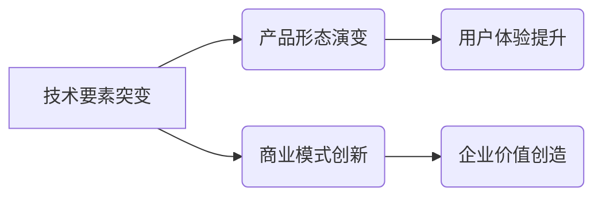

> 技术突变、产品形态、商业模式、人工智能、云计算、大数据、区块链、物联网

## 1. 背景介绍

科技发展日新月异，技术要素的突变往往会引发产业结构的重塑，深刻地影响着产品形态和商业模式的演变。从蒸汽机到互联网，每一次技术革命都带来了前所未有的变革，催生出全新的产业生态和商业模式。

当前，人工智能、云计算、大数据、区块链、物联网等新兴技术正处于快速发展阶段，它们相互交织，形成强大的技术合力，正在深刻地改变着我们的生活和工作方式。这些技术要素的突变，将对产品形态和商业模式产生深远的影响，催生出全新的商业模式和产品形态，同时也对传统产业和商业模式带来挑战。

## 2. 核心概念与联系

**2.1 技术要素突变**

技术要素突变是指在较短的时间内，出现具有颠覆性影响的技术突破，其核心特征包括：

* **颠覆性创新:** 能够彻底改变现有技术体系和产业格局。
* **快速发展:** 技术发展速度快，应用场景不断拓展。
* **广泛影响:** 对多个行业和领域产生深远影响。

**2.2 产品形态演变**

产品形态是指产品的外观、功能、结构、性能等方面的表现形式。技术要素的突变会推动产品形态的演变，例如：

* **智能化:** 人工智能技术的应用，使产品更加智能化，能够感知环境、理解用户需求，并提供个性化服务。
* **网络化:** 云计算、物联网技术的应用，使产品更加网络化，能够与其他设备和系统进行互联互通，形成智能网络。
* **平台化:**  平台化模式的兴起，使产品不再是孤立的实体，而是成为平台的一部分，能够与其他产品和服务进行整合，形成生态系统。

**2.3 商业模式创新**

商业模式是指企业为创造、传递和捕获价值而采取的策略和方法。技术要素的突变会推动商业模式的创新，例如：

* **订阅模式:**  云计算、软件即服务（SaaS）的兴起，促进了订阅模式的应用，用户可以按需付费使用软件和服务。
* **共享经济:**  互联网平台的应用，促进了共享经济的发展，用户可以共享资源，降低成本，提高效率。
* **数据驱动:**  大数据分析技术的应用，使企业能够更加深入地了解用户需求，提供更加精准的营销和服务。

**2.4  核心概念关系图**

## 3. 核心算法原理 & 具体操作步骤

**3.1 算法原理概述**

选择一个与文章主题相关的核心算法，例如深度学习算法，并对其原理进行概述。

**3.2 算法步骤详解**

详细描述该算法的具体操作步骤，可以使用流程图或伪代码进行说明。

**3.3 算法优缺点**

分析该算法的优缺点，包括其适用场景、效率、准确度等方面。

**3.4 算法应用领域**

介绍该算法在实际应用中的领域，例如图像识别、自然语言处理、推荐系统等。

## 4. 数学模型和公式 & 详细讲解 & 举例说明

**4.1 数学模型构建**

构建一个与文章主题相关的数学模型，例如深度学习模型的损失函数。

**4.2 公式推导过程**

详细推导该数学模型的公式，并解释每个公式的含义。

**4.3 案例分析与讲解**

通过一个具体的案例，解释该数学模型的应用和效果。

## 5. 项目实践：代码实例和详细解释说明

**5.1 开发环境搭建**

介绍项目开发所需的软件环境和工具。

**5.2 源代码详细实现**

提供项目代码的示例，并进行详细的代码解读和分析。

**5.3 代码解读与分析**

解释代码的逻辑结构、算法实现和关键功能。

**5.4 运行结果展示**

展示项目运行的结果，并进行分析和解释。

## 6. 实际应用场景

**6.1 应用场景介绍**

介绍该技术在实际应用中的场景，例如智能家居、自动驾驶、医疗诊断等。

**6.2 案例分析**

通过一个具体的案例，展示该技术在实际应用中的效果和价值。

**6.3 应用前景展望**

展望该技术的未来发展趋势和应用前景。

## 7. 工具和资源推荐

**7.1 学习资源推荐**

推荐一些相关的学习资源，例如书籍、课程、在线文档等。

**7.2 开发工具推荐**

推荐一些相关的开发工具，例如编程语言、框架、库等。

**7.3 相关论文推荐**

推荐一些相关的学术论文，供读者进一步深入了解。

## 8. 总结：未来发展趋势与挑战

**8.1 研究成果总结**

总结文章的主要研究成果，并对技术要素突变对产品形态和商业模式的影响进行概括。

**8.2 未来发展趋势**

展望未来技术发展趋势，并分析其对产品形态和商业模式的影响。

**8.3 面临的挑战**

分析技术要素突变带来的挑战，例如伦理问题、安全问题、人才短缺等。

**8.4 研究展望**

展望未来研究方向，并提出一些建议。

## 9. 附录：常见问题与解答

列出一些与文章主题相关的常见问题，并进行解答。

---

作者：禅与计算机程序设计艺术 / Zen and the Art of Computer Programming 

<end_of_turn>