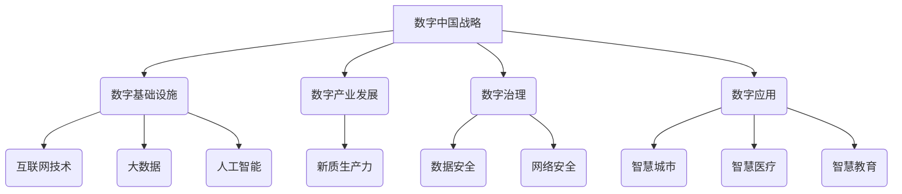

> 数字中国战略, 新质生产力, 互联网技术, 大数据, 人工智能, 云计算, 区块链, 数字孪生, 智慧城市

## 1. 背景介绍

21世纪初，以互联网、大数据、人工智能等为代表的新一代信息技术蓬勃发展，深刻地改变着人类社会生产方式和生活方式。中国政府于2021年发布了《数字中国建设整体方案》，明确提出要以数字技术为驱动，构建数字经济新格局，推动数字中国建设。

数字中国战略的提出，标志着中国迈向数字经济时代的关键一步。其核心目标是通过数字化转型，提升国家治理能力和服务水平，推动经济高质量发展，实现社会全面进步。

## 2. 核心概念与联系

**2.1 数字中国战略**

数字中国战略是指以信息化、数字化、智能化为核心，构建数字经济新格局，推动数字社会发展，实现数字中国建设的国家战略。其目标是：

* 建设数字基础设施，构建完善的数字网络体系。
* 推动数字产业发展，培育壮大数字经济。
* 加强数字治理，构建安全可靠的数字环境。
* 推广数字应用，提升数字素养，促进数字普惠。

**2.2 新质生产力**

新质生产力是指以数字技术为基础，融合人工智能、大数据、云计算等新兴技术，实现生产要素的优化配置，提升生产效率和产品质量的新型生产力。其特点是：

* **智能化:** 利用人工智能技术，实现生产过程的自动化、智能化。
* **数字化:** 将生产过程数字化，实现数据采集、分析和应用。
* **网络化:** 通过网络连接，实现生产要素的协同共享。

**2.3 核心概念联系**

数字中国战略与新质生产力是相互促进、相辅相成的。数字中国战略为新质生产力的发展提供了基础设施、政策支持和市场环境，而新质生产力则是数字中国建设的重要支撑力量。

**2.4 核心概念架构**

## 3. 核心算法原理 & 具体操作步骤

**3.1 算法原理概述**

新质生产力发展离不开算法的驱动。例如，人工智能算法可以实现机器学习、深度学习等功能，帮助企业优化生产流程、提高产品质量。大数据算法可以帮助企业分析海量数据，挖掘潜在的商业价值。云计算算法可以帮助企业实现资源共享、弹性伸缩等功能。

**3.2 算法步骤详解**

以机器学习算法为例，其基本步骤包括：

1. 数据收集和预处理：收集相关数据，并进行清洗、转换、特征提取等预处理工作。
2. 模型选择：根据具体任务选择合适的机器学习模型，例如线性回归、逻辑回归、决策树、支持向量机等。
3. 模型训练：利用训练数据训练模型，调整模型参数，使模型能够准确预测或分类。
4. 模型评估：利用测试数据评估模型的性能，例如准确率、召回率、F1-score等。
5. 模型部署：将训练好的模型部署到生产环境中，用于实际应用。

**3.3 算法优缺点**

不同的算法具有不同的优缺点，需要根据具体任务选择合适的算法。例如，线性回归算法简单易实现，但对非线性关系的拟合能力较弱；深度学习算法可以学习复杂的非线性关系，但训练时间长，参数量大。

**3.4 算法应用领域**

机器学习算法广泛应用于各个领域，例如：

* **图像识别:** 人脸识别、物体检测、图像分类等。
* **自然语言处理:** 文本分类、情感分析、机器翻译等。
* **推荐系统:** 商品推荐、内容推荐、用户画像等。
* **金融领域:** 风险评估、欺诈检测、信用评分等。

## 4. 数学模型和公式 & 详细讲解 & 举例说明

**4.1 数学模型构建**

新质生产力发展可以抽象为一个数学模型，其中生产要素、生产过程、生产效率等因素都可以用数学公式来描述。例如，可以构建一个生产函数，描述生产要素投入与产出之间的关系。

**4.2 公式推导过程**

生产函数的推导过程通常需要用到微积分、线性代数等数学工具。例如，可以利用柯布-道格拉斯生产函数，描述资本和劳动力投入与产出的关系。

**4.3 案例分析与讲解**

可以利用实际案例分析生产函数的应用效果。例如，可以分析某家企业的生产效率变化，并根据生产函数的预测结果，制定相应的生产策略。

## 5. 项目实践：代码实例和详细解释说明

**5.1 开发环境搭建**

可以利用开源工具和平台，搭建一个新质生产力项目开发环境。例如，可以利用 Docker、Kubernetes 等容器化技术，构建一个可扩展、可维护的开发环境。

**5.2 源代码详细实现**

可以提供一个新质生产力项目代码实例，并进行详细的代码解读和分析。例如，可以提供一个基于机器学习的生产流程优化项目代码，并解释代码的各个模块功能。

**5.3 代码解读与分析**

可以对代码进行结构化分析，解释代码的逻辑流程、算法实现、数据处理等关键部分。

**5.4 运行结果展示**

可以展示项目运行的结果，例如，可以展示机器学习模型的预测结果、生产流程优化后的效率提升等。

## 6. 实际应用场景

**6.1 智慧制造**

新质生产力可以应用于智慧制造领域，实现生产过程的自动化、智能化。例如，可以利用机器视觉技术实现产品质量检测，利用机器人技术实现生产线自动化操作。

**6.2 智慧物流**

新质生产力可以应用于智慧物流领域，提高物流效率和降低物流成本。例如，可以利用大数据分析技术优化物流路线，利用人工智能技术实现货物自动分拣。

**6.3 智慧农业**

新质生产力可以应用于智慧农业领域，提高农业生产效率和产品质量。例如，可以利用传感器技术监测土壤水分和温度，利用无人机技术进行农田喷洒。

**6.4 未来应用展望**

新质生产力将继续在各个领域得到广泛应用，例如：

* **个性化定制:** 利用人工智能技术，实现个性化产品定制。
* **自动驾驶:** 利用人工智能技术，实现自动驾驶汽车。
* **医疗诊断:** 利用人工智能技术，辅助医生进行医疗诊断。

## 7. 工具和资源推荐

**7.1 学习资源推荐**

* **在线课程:** Coursera、edX、Udacity 等平台提供丰富的机器学习、大数据、人工智能等课程。
* **书籍:** 《深度学习》、《机器学习实战》、《Python数据科学手册》等书籍。
* **开源社区:** GitHub、Stack Overflow 等开源社区提供丰富的代码示例和技术支持。

**7.2 开发工具推荐**

* **编程语言:** Python、Java、C++ 等编程语言。
* **机器学习框架:** TensorFlow、PyTorch、Scikit-learn 等机器学习框架。
* **云计算平台:** AWS、Azure、GCP 等云计算平台。

**7.3 相关论文推荐**

* **机器学习:** 《机器学习》
* **深度学习:** 《深度学习》
* **大数据:** 《大数据分析》

## 8. 总结：未来发展趋势与挑战

**8.1 研究成果总结**

数字中国战略与新质生产力的结合点，为推动中国经济高质量发展提供了新的动力。新质生产力发展取得了显著成果，例如，智慧制造、智慧物流、智慧农业等领域取得了突破性进展。

**8.2 未来发展趋势**

未来，数字中国战略与新质生产力将继续深度融合，发展趋势包括：

* **人工智能技术更加成熟:** 人工智能技术将更加智能化、自动化，应用场景更加广泛。
* **数据驱动决策:** 数据将成为企业决策的重要依据，数据分析和挖掘技术将更加重要。
* **数字孪生技术发展:** 数字孪生技术将应用于各个领域，实现虚拟与现实的融合。

**8.3 面临的挑战**

数字中国战略与新质生产力发展也面临一些挑战，例如：

* **数据安全和隐私保护:** 数据安全和隐私保护是数字经济发展的重要课题。
* **人才短缺:** 数字经济发展需要大量高素质人才，人才短缺是制约发展的瓶颈。
* **数字鸿沟:** 数字技术应用不均衡，导致数字鸿沟加深。

**8.4 研究展望**

未来，需要加强对数字中国战略与新质生产力发展趋势的研究，探索解决面临的挑战的有效途径，推动数字经济高质量发展。

## 9. 附录：常见问题与解答

**9.1 如何提升新质生产力？**

提升新质生产力需要从以下几个方面入手：

* **加强基础设施建设:** 建设完善的数字基础设施，提供高速网络、大数据存储、云计算等服务。
* **推动数字技术应用:** 加强数字技术在各个领域的应用，例如，利用人工智能技术优化生产流程、利用大数据技术分析市场需求。
* **培养高素质人才:** 加强对数字经济人才的培养，提高人才的素质和技能水平。

**9.2 数字中国战略与新质生产力有什么关系？**

数字中国战略为新质生产力的发展提供了基础设施、政策支持和市场环境，而新质生产力则是数字中国建设的重要支撑力量。两者相互促进、相辅相成。

**9.3 数字经济发展面临哪些挑战？**

数字经济发展面临一些挑战，例如：数据安全和隐私保护、人才短缺、数字鸿沟等。

作者：禅与计算机程序设计艺术 / Zen and the Art of Computer Programming 
<end_of_turn>