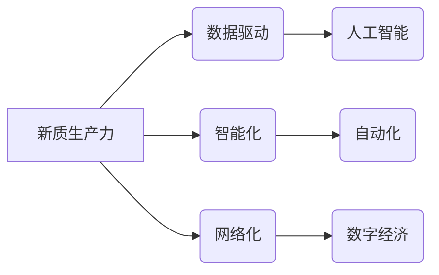

>人工智能、新质生产力、数字经济、中国现代化、技术创新、算法优化、数据驱动

## 1. 背景介绍

中国正处于一个重要的历史节点，正在从制造大国向创新强国转变。在这个过程中，新质生产力扮演着至关重要的角色。新质生产力是指以信息技术、人工智能等为基础，以数据为驱动，以智能化、自动化、网络化等为特征的生产力。它将深刻地改变生产方式、生活方式，并推动中国经济社会高质量发展。

近年来，人工智能技术取得了飞速发展，并在各个领域展现出巨大的应用潜力。从自动驾驶、医疗诊断到金融风险控制，人工智能正在改变着我们的生活和工作方式。

## 2. 核心概念与联系

**2.1 新质生产力**

新质生产力是基于新技术、新模式、新业态的生产力，其核心特征是：

* **数据驱动**: 数据是新质生产力的基础，通过数据分析和挖掘，可以洞察市场需求、优化生产流程、提升产品质量。
* **智能化**: 人工智能技术赋予生产系统智能化能力，能够自动学习、决策、执行，提高生产效率和灵活性。
* **网络化**: 物联网、云计算等技术将生产要素连接起来，实现生产过程的透明化、可视化和协同化。

**2.2 人工智能**

人工智能是指模拟人类智能行为的计算机系统。其主要技术包括：

* **机器学习**: 算法通过学习数据，自动发现模式和规律，从而进行预测和决策。
* **深度学习**: 基于多层神经网络的机器学习方法，能够处理更复杂的数据，并取得更优的性能。
* **自然语言处理**: 使计算机能够理解和处理人类语言，例如文本分析、机器翻译等。

**2.3 数字经济**

数字经济是指以数字技术为基础，以数据为核心要素，以网络为平台，以智能化和数字化为特征的经济形态。

**2.4 关系图**



## 3. 核心算法原理 & 具体操作步骤

**3.1 算法原理概述**

深度学习算法是人工智能的核心技术之一，其原理是通过多层神经网络模拟人类大脑的学习过程。

**3.2 算法步骤详解**

1. **数据预处理**: 将原始数据进行清洗、转换、特征提取等操作，使其适合深度学习模型的训练。
2. **模型构建**: 根据具体任务选择合适的深度学习模型架构，例如卷积神经网络、循环神经网络等。
3. **模型训练**: 使用训练数据训练深度学习模型，通过调整模型参数，使其能够准确地预测或分类数据。
4. **模型评估**: 使用测试数据评估模型的性能，例如准确率、召回率、F1-score等。
5. **模型部署**: 将训练好的模型部署到实际应用场景中，用于进行预测或分类任务。

**3.3 算法优缺点**

**优点**:

* 能够处理海量数据，并从中发现复杂模式。
* 具有强大的泛化能力，能够应用于多种不同的任务。
* 随着数据量的增加，模型性能会不断提升。

**缺点**:

* 训练深度学习模型需要大量的计算资源和时间。
* 模型的解释性较差，难以理解模型的决策过程。
* 对数据质量要求较高，数据噪声或偏差会影响模型性能。

**3.4 算法应用领域**

深度学习算法已广泛应用于各个领域，例如：

* **图像识别**: 人脸识别、物体检测、图像分类等。
* **自然语言处理**: 机器翻译、文本摘要、情感分析等。
* **语音识别**: 语音转文本、语音助手等。
* **医疗诊断**: 疾病预测、影像分析等。
* **金融风险控制**: 欺诈检测、信用评估等。

## 4. 数学模型和公式 & 详细讲解 & 举例说明

**4.1 数学模型构建**

深度学习模型可以看作是一个复杂的数学模型，其核心是神经网络。神经网络由多个层组成，每一层包含多个神经元。每个神经元接收来自上一层的输入信号，并通过激活函数进行处理，输出到下一层。

**4.2 公式推导过程**

深度学习模型的训练过程是通过优化模型参数来最小化损失函数的过程。损失函数衡量模型预测结果与真实结果之间的差异。常用的损失函数包括均方误差、交叉熵等。

**4.3 案例分析与讲解**

例如，在图像分类任务中，我们可以使用卷积神经网络（CNN）作为深度学习模型。CNN的结构包含卷积层、池化层和全连接层。卷积层用于提取图像特征，池化层用于降低特征维度，全连接层用于分类。

训练CNN模型时，我们会使用大量的图像数据，并通过反向传播算法来更新模型参数。反向传播算法通过计算损失函数对每个参数的梯度，并根据梯度进行参数更新。

## 5. 项目实践：代码实例和详细解释说明

**5.1 开发环境搭建**

可以使用Python语言和深度学习框架TensorFlow或PyTorch来开发深度学习项目。

**5.2 源代码详细实现**

```python
import tensorflow as tf

# 定义模型结构
model = tf.keras.models.Sequential([
    tf.keras.layers.Conv2D(32, (3, 3), activation='relu', input_shape=(28, 28, 1)),
    tf.keras.layers.MaxPooling2D((2, 2)),
    tf.keras.layers.Conv2D(64, (3, 3), activation='relu'),
    tf.keras.layers.MaxPooling2D((2, 2)),
    tf.keras.layers.Flatten(),
    tf.keras.layers.Dense(10, activation='softmax')
])

# 编译模型
model.compile(optimizer='adam',
              loss='sparse_categorical_crossentropy',
              metrics=['accuracy'])

# 训练模型
model.fit(x_train, y_train, epochs=5)

# 评估模型
loss, accuracy = model.evaluate(x_test, y_test)
print('Test loss:', loss)
print('Test accuracy:', accuracy)
```

**5.3 代码解读与分析**

这段代码定义了一个简单的卷积神经网络模型，用于手写数字识别任务。

* `tf.keras.models.Sequential` 创建了一个顺序模型，即层级结构。
* `tf.keras.layers.Conv2D` 定义卷积层，用于提取图像特征。
* `tf.keras.layers.MaxPooling2D` 定义池化层，用于降低特征维度。
* `tf.keras.layers.Flatten` 将多维特征转换为一维向量。
* `tf.keras.layers.Dense` 定义全连接层，用于分类。
* `model.compile` 编译模型，指定优化器、损失函数和评价指标。
* `model.fit` 训练模型，使用训练数据进行训练。
* `model.evaluate` 评估模型，使用测试数据进行评估。

**5.4 运行结果展示**

训练完成后，模型可以用于预测新的手写数字图像。

## 6. 实际应用场景

**6.1 智能制造**

人工智能可以应用于智能制造，例如：

* **预测性维护**: 通过分析设备运行数据，预测设备故障，并及时进行维护，降低设备停机时间。
* **质量控制**: 使用计算机视觉技术对产品进行质量检测，提高产品质量。
* **生产优化**: 通过数据分析，优化生产流程，提高生产效率。

**6.2 智能医疗**

人工智能可以应用于智能医疗，例如：

* **疾病诊断**: 使用深度学习算法分析医学影像，辅助医生进行疾病诊断。
* **药物研发**: 使用机器学习算法分析药物数据，加速药物研发过程。
* **个性化医疗**: 根据患者的基因信息和生活习惯，提供个性化的医疗方案。

**6.3 智能金融**

人工智能可以应用于智能金融，例如：

* **欺诈检测**: 使用机器学习算法分析交易数据，识别欺诈行为。
* **信用评估**: 使用机器学习算法分析客户数据，评估客户的信用风险。
* **投资决策**: 使用机器学习算法分析市场数据，辅助投资决策。

**6.4 未来应用展望**

随着人工智能技术的不断发展，其应用场景将更加广泛，例如：

* **自动驾驶**: 人工智能将推动自动驾驶技术的普及，改变交通出行方式。
* **机器人**: 人工智能将赋予机器人更强的智能化能力，使其能够更好地服务人类。
* **个性化教育**: 人工智能将根据学生的学习情况，提供个性化的教育方案。

## 7. 工具和资源推荐

**7.1 学习资源推荐**

* **在线课程**: Coursera、edX、Udacity等平台提供丰富的深度学习课程。
* **书籍**: 《深度学习》、《机器学习实战》等书籍是深度学习学习的经典教材。
* **开源项目**: TensorFlow、PyTorch等开源深度学习框架提供了丰富的学习资源和示例代码。

**7.2 开发工具推荐**

* **Python**: 深度学习开发的主要编程语言。
* **TensorFlow**: Google开发的开源深度学习框架。
* **PyTorch**: Facebook开发的开源深度学习框架。
* **Jupyter Notebook**: 用于深度学习开发和可视化的交互式笔记本环境。

**7.3 相关论文推荐**

* **《ImageNet Classification with Deep Convolutional Neural Networks》**: 
介绍了AlexNet模型，标志着深度学习在图像识别领域的突破。
* **《Deep Residual Learning for Image Recognition》**: 
提出了ResNet模型，解决了深度网络训练的梯度消失问题。
* **《Attention Is All You Need》**: 
提出了Transformer模型，在自然语言处理领域取得了突破性进展。

## 8. 总结：未来发展趋势与挑战

**8.1 研究成果总结**

近年来，人工智能技术取得了飞速发展，在各个领域展现出巨大的应用潜力。深度学习算法成为人工智能的核心技术之一，并取得了令人瞩目的成果。

**8.2 未来发展趋势**

* **模型规模和能力的提升**: 未来深度学习模型将更加庞大，并具备更强的泛化能力和推理能力。
* **算法效率的提高**: 研究人员将致力于开发更高效的深度学习算法，降低训练和推理成本。
* **跨模态学习**: 深度学习模型将能够处理多种模态数据，例如文本、图像、音频等，实现跨模态理解和交互。
* **可解释性增强**: 研究人员将致力于提高深度学习模型的可解释性，使其决策过程更加透明和可理解。

**8.3 面临的挑战**

* **数据获取和隐私保护**: 深度学习模型依赖于海量数据，如何获取高质量数据并保护用户隐私是一个重要的挑战。
* **算法偏见**: 深度学习模型可能存在算法偏见，导致不公平的结果。如何解决算法偏见是一个重要的研究方向。
* **安全性和可靠性**: 深度学习模型的安全性和可靠性需要得到保障，避免其被恶意利用。

**8.4 研究展望**

未来，人工智能技术将继续发展，并对社会产生深远的影响。我们需要加强人工智能伦理研究，确保人工智能技术被安全、负责任地应用，为人类社会带来福祉。

## 9. 附录：常见问题与解答

**9.1 如何选择合适的深度学习模型？**

选择合适的深度学习模型需要根据具体任务和数据特点进行选择。例如，对于图像识别任务，可以使用卷积神经网络；对于文本分类任务，可以使用循环神经网络或Transformer模型。

**9.2 如何解决深度学习模型的过拟合问题？**

过拟合是指模型在训练数据上表现良好，但在测试数据上表现较差。解决过拟合问题的方法包括：

* 增加训练数据量
* 使用正则化技术，例如L1正则化和L2正则化