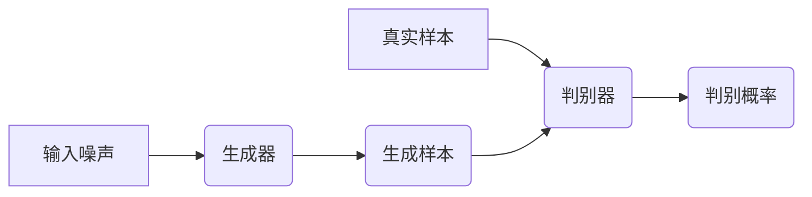

> 生成对抗网络 (GAN)、深度学习、生成模型、对抗训练、图像生成、代码生成

## 1. 背景介绍

近年来，深度学习技术取得了飞速发展，在图像识别、自然语言处理等领域取得了突破性进展。其中，生成对抗网络 (Generative Adversarial Networks，GAN) 作为一种新兴的生成模型，凭借其强大的生成能力和应用潜力，迅速成为研究热点。

GANs 由 Ian Goodfellow 等人在 2014 年提出，其核心思想是通过构建一个由两个相互竞争的网络组成的框架来实现数据生成。这两个网络分别是生成器 (Generator) 和判别器 (Discriminator)。生成器试图生成逼真的样本数据，而判别器则试图区分真实数据和生成数据。两者在不断对抗中相互学习，最终使得生成器能够生成与真实数据几乎 indistinguishable 的样本。

## 2. 核心概念与联系

GANs 的核心概念是“对抗训练”。生成器和判别器之间形成了一种博弈关系，就像两个对手在不断较量，互相提升。

**核心概念：**

* **生成器 (Generator):** 负责生成新的样本数据，输入随机噪声，输出与真实数据相似的样本。
* **判别器 (Discriminator):** 负责判断样本数据是真实数据还是生成数据，输入样本数据，输出一个概率值，表示样本为真实数据的概率。

**架构图：**



## 3. 核心算法原理 & 具体操作步骤

### 3.1  算法原理概述

GANs 的训练过程是一个迭代的过程，在每次迭代中，生成器和判别器都会进行一次更新。

1. **生成器训练:** 生成器根据随机噪声生成样本数据，并将样本数据输入到判别器中。判别器输出一个概率值，表示该样本为真实数据的概率。生成器根据判别器的反馈调整自己的参数，使得生成的样本数据能够更好地欺骗判别器。

2. **判别器训练:** 判别器接收真实数据和生成数据，并分别输出两个概率值，表示这两个样本分别为真实数据的概率。判别器根据这两个概率值调整自己的参数，使得能够更好地区分真实数据和生成数据。

### 3.2  算法步骤详解

1. **初始化:** 初始化生成器和判别器的参数。
2. **生成样本:** 生成器根据随机噪声生成样本数据。
3. **判别样本:** 判别器接收真实数据和生成数据，并分别输出两个概率值。
4. **更新生成器:** 根据判别器的反馈，更新生成器的参数，使得生成的样本数据能够更好地欺骗判别器。
5. **更新判别器:** 根据真实数据和生成数据的概率值，更新判别器的参数，使得能够更好地区分真实数据和生成数据。
6. **重复步骤2-5:** 重复上述步骤，直到生成器能够生成与真实数据几乎 indistinguishable 的样本。

### 3.3  算法优缺点

**优点:**

* **生成高质量样本:** GANs 可以生成高质量、逼真的样本数据，在图像、文本、音频等领域都有应用。
* **无监督学习:** GANs 可以进行无监督学习，不需要大量的标注数据。

**缺点:**

* **训练困难:** GANs 的训练过程比较复杂，容易出现模式崩溃等问题。
* **评价指标不完善:** 目前还没有一个完善的评价指标来衡量 GANs 的生成效果。

### 3.4  算法应用领域

GANs 在多个领域都有广泛的应用，例如：

* **图像生成:** 生成逼真的图像，例如人脸、风景、物体等。
* **图像修复:** 修复损坏的图像，例如去除噪声、补全缺失部分等。
* **文本生成:** 生成自然语言文本，例如文章、故事、对话等。
* **音频生成:** 生成逼真的音频，例如音乐、语音等。
* **视频生成:** 生成逼真的视频，例如电影片段、动画等。

## 4. 数学模型和公式 & 详细讲解 & 举例说明

### 4.1  数学模型构建

GANs 的数学模型主要由两个部分组成：生成器 (G) 和判别器 (D)。

* **生成器 (G):** 
    * 输入：随机噪声向量 z
    * 输出：生成样本 x'
    * 数学表达式: x' = G(z)

* **判别器 (D):**
    * 输入：样本数据 x
    * 输出：样本为真实数据的概率 p(x)
    * 数学表达式: p(x) = D(x)

### 4.2  公式推导过程

GANs 的训练目标是让生成器生成与真实数据尽可能相似的样本，同时让判别器能够尽可能准确地区分真实数据和生成数据。

* **生成器损失函数:** 
    * 目标: 最大化判别器对生成样本的错误率
    * 数学表达式: L_G = -log(D(G(z)))

* **判别器损失函数:**
    * 目标: 同时最小化对真实数据和生成数据的错误率
    * 数学表达式: L_D = -log(D(x)) - log(1 - D(G(z)))

### 4.3  案例分析与讲解

假设我们想要使用 GANs 生成人脸图像。

1. **数据准备:** 收集大量的人脸图像作为训练数据。
2. **模型构建:** 建立生成器和判别器模型，例如使用卷积神经网络 (CNN)。
3. **训练过程:** 使用随机噪声作为输入，生成器生成人脸图像，判别器判断图像是否为真实人脸。通过不断迭代，生成器和判别器相互学习，最终生成器能够生成逼真的人脸图像。

## 5. 项目实践：代码实例和详细解释说明

### 5.1  开发环境搭建

* Python 3.x
* TensorFlow 或 PyTorch 深度学习框架
* 其他必要的库，例如 NumPy、Matplotlib 等

### 5.2  源代码详细实现

```python
import tensorflow as tf

# 定义生成器模型
def generator_model():
    # ...

# 定义判别器模型
def discriminator_model():
    # ...

# 初始化生成器和判别器模型
generator = generator_model()
discriminator = discriminator_model()

# 定义损失函数和优化器
loss_fn = tf.keras.losses.BinaryCrossentropy()
optimizer_G = tf.keras.optimizers.Adam(learning_rate=0.0002, beta_1=0.5)
optimizer_D = tf.keras.optimizers.Adam(learning_rate=0.0002, beta_1=0.5)

# 训练循环
for epoch in range(num_epochs):
    for batch in dataset:
        # 训练判别器
        with tf.GradientTape() as tape_D:
            real_output = discriminator(batch)
            fake_output = discriminator(generator(random_noise))
            d_loss_real = loss_fn(tf.ones_like(real_output), real_output)
            d_loss_fake = loss_fn(tf.zeros_like(fake_output), fake_output)
            d_loss = d_loss_real + d_loss_fake
        gradients_D = tape_D.gradient(d_loss, discriminator.trainable_variables)
        optimizer_D.apply_gradients(zip(gradients_D, discriminator.trainable_variables))

        # 训练生成器
        with tf.GradientTape() as tape_G:
            fake_output = discriminator(generator(random_noise))
            g_loss = loss_fn(tf.ones_like(fake_output), fake_output)
        gradients_G = tape_G.gradient(g_loss, generator.trainable_variables)
        optimizer_G.apply_gradients(zip(gradients_G, generator.trainable_variables))

    # 打印训练进度
    print(f"Epoch {epoch+1}/{num_epochs}, D loss: {d_loss.numpy()}, G loss: {g_loss.numpy()}")

# 保存生成器模型
generator.save("generator_model.h5")
```

### 5.3  代码解读与分析

* **模型定义:** 代码中定义了生成器和判别器模型，可以使用不同的神经网络架构，例如 CNN、RNN 等。
* **损失函数:** 使用二元交叉熵损失函数来衡量生成器和判别器的性能。
* **优化器:** 使用 Adam 优化器来更新模型参数。
* **训练循环:** 训练循环中，首先训练判别器，然后训练生成器。
* **保存模型:** 训练完成后，可以保存生成器模型，以便后续使用。

### 5.4  运行结果展示

运行代码后，可以生成一系列的人脸图像。这些图像的质量会随着训练的进行而提高。

## 6. 实际应用场景

### 6.1  图像生成

* **艺术创作:** 生成独特的艺术作品，例如绘画、雕塑等。
* **游戏开发:** 生成游戏场景、角色、道具等。
* **电影制作:** 生成电影特效、虚拟角色等。

### 6.2  图像修复

* **照片修复:** 修复损坏的照片，例如去除噪声、补全缺失部分等。
* **文物修复:** 修复老旧的文物，例如修复破损的绘画、雕塑等。

### 6.3  文本生成

* **机器翻译:** 生成高质量的机器翻译文本。
* **文本摘要:** 生成文本的摘要。
* **对话系统:** 生成自然语言对话。

### 6.4  未来应用展望

GANs 在未来将有更广泛的应用，例如：

* **医疗领域:** 生成医学图像、辅助诊断等。
* **金融领域:** 生成金融数据、预测市场趋势等。
* **教育领域:** 生成个性化学习内容、辅助教学等。

## 7. 工具和资源推荐

### 7.1  学习资源推荐

* **论文:**
    * Goodfellow, I., Pouget-Abadie, J., Mirza, M., Xu, B., Warde-Farley, D., Ozair, S., ... & Bengio, Y. (2014). Generative adversarial nets. In Advances in neural information processing systems (pp. 2672-2680).
* **博客:**
    * https://blog.openai.com/generative-adversarial-nets/
    * https://towardsdatascience.com/generative-adversarial-networks-gans-explained-with-code-examples-a39819b2999b

### 7.2  开发工具推荐

* **TensorFlow:** https://www.tensorflow.org/
* **PyTorch:** https://pytorch.org/

### 7.3  相关论文推荐

* **DCGAN:** https://arxiv.org/abs/1511.06434
* **StyleGAN:** https://arxiv.org/abs/1812.04948
* **BigGAN:** https://arxiv.org/abs/1806.07078

## 8. 总结：未来发展趋势与挑战

### 8.1  研究成果总结

GANs 在过去几年取得了显著的进展，在图像生成、文本生成、音频生成等领域取得了突破性成果。

### 8.2  未来发展趋势

* **模型架构创新:** 研究更强大的 GANs 模型架构，例如更高效、更稳定的模型。
* **训练方法优化:** 研究更有效的 GANs 训练方法，例如解决模式崩溃问题、提高训练效率。
* **应用领域拓展:** 将 GANs 应用到更多领域，例如医疗、金融、教育等。

### 8.3  面临的挑战

* **训练稳定性:** GANs 的训练过程比较