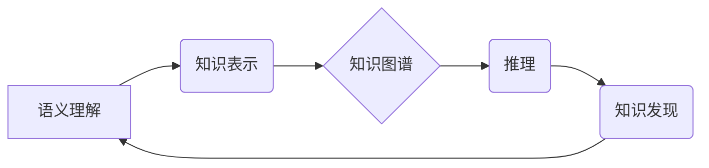

> 知识图谱、语义理解、知识表示、推理、机器学习、自然语言处理

## 1. 背景介绍

随着互联网信息爆炸式增长，海量数据蕴藏着丰富的知识和价值。然而，这些数据以文本、图像、音频等多种形式存在，难以直接理解和利用。知识图谱 (Knowledge Graph, KG) 作为一种新型的知识表示形式，能够将数据中的知识结构化，并通过语义推理等方式挖掘隐藏的知识关系，为人工智能 (AI) 应用提供更深层次的理解和决策支持。

语义理解 (Semantic Understanding) 是人工智能领域的核心任务之一，旨在使机器能够理解人类语言的深层含义，并从中提取知识和信息。知识图谱与语义理解相互促进，知识图谱为语义理解提供结构化知识基础，而语义理解则为知识图谱的构建和扩展提供数据源和推理能力。

## 2. 核心概念与联系

**2.1 知识图谱 (KG)**

知识图谱是一种基于知识表示的数据库，它以实体和关系为节点，通过连接关系构建知识网络。实体代表现实世界中的事物，关系描述实体之间的联系。

**2.2 语义理解 (SU)**

语义理解是指机器能够理解人类语言的深层含义，并将其转换为机器可理解的知识表示的过程。它包括以下几个关键子任务：

* **词义消歧:** 识别词语的不同含义，并根据上下文选择正确的含义。
* **依存句法分析:** 分析句子结构，识别词语之间的依存关系。
* **命名实体识别:** 识别句子中的实体，例如人名、地名、机构名等。
* **关系抽取:** 识别句子中的关系，例如“张三爱李四”中的“爱”关系。

**2.3 知识图谱与语义理解的联系**

知识图谱和语义理解是相互关联的两个概念。语义理解可以用于构建和扩展知识图谱，而知识图谱可以为语义理解提供知识背景和推理能力。



## 3. 核心算法原理 & 具体操作步骤

### 3.1  算法原理概述

知识图谱构建和语义理解算法通常基于机器学习和深度学习技术。常见的算法包括：

* **路径搜索算法:** 用于在知识图谱中寻找特定实体之间的路径。
* **图神经网络 (GNN):** 用于学习知识图谱中的节点和关系表示，并进行推理和预测。
* **Transformer:** 用于处理自然语言文本，并进行实体识别、关系抽取等语义理解任务。

### 3.2  算法步骤详解

**3.2.1 知识图谱构建**

1. **数据收集:** 从各种数据源收集相关信息，例如文本、数据库、API等。
2. **实体识别:** 使用命名实体识别算法识别文本中的实体。
3. **关系抽取:** 使用关系抽取算法识别实体之间的关系。
4. **知识表示:** 将实体和关系表示为知识图谱的节点和边。
5. **知识推理:** 使用路径搜索算法或图神经网络进行知识推理，发现隐藏的知识关系。

**3.2.2 语义理解**

1. **文本预处理:** 对文本进行清洗、分词、词性标注等预处理操作。
2. **词义消歧:** 使用词义消歧算法识别词语的不同含义。
3. **依存句法分析:** 使用依存句法分析算法分析句子结构。
4. **实体识别:** 使用命名实体识别算法识别句子中的实体。
5. **关系抽取:** 使用关系抽取算法识别句子中的关系。
6. **知识表示:** 将理解后的知识表示为知识图谱的节点和边。

### 3.3  算法优缺点

**3.3.1 知识图谱构建算法**

* **优点:** 可以构建规模庞大的知识图谱，并进行知识推理和发现。
* **缺点:** 需要大量的训练数据和计算资源，构建过程复杂。

**3.3.2 语义理解算法**

* **优点:** 可以理解人类语言的深层含义，并将其转换为机器可理解的知识表示。
* **缺点:** 对于复杂和模糊的文本理解能力有限，需要不断改进和完善。

### 3.4  算法应用领域

* **搜索引擎:** 提高搜索结果的准确性和相关性。
* **问答系统:** 理解用户问题并提供准确的答案。
* **推荐系统:** 根据用户的兴趣和偏好推荐相关商品或服务。
* **医疗诊断:** 辅助医生进行疾病诊断和治疗方案制定。
* **金融风险管理:** 识别和评估金融风险。

## 4. 数学模型和公式 & 详细讲解 & 举例说明

### 4.1  数学模型构建

知识图谱可以表示为一个三元组 (实体, 关系, 实体) 的集合。

* 实体 (Entity): 代表现实世界中的事物，例如人、地点、事件等。
* 关系 (Relation): 描述实体之间的联系，例如“爱”、“居住”、“工作”等。

**4.1.1 实体表示**

实体可以表示为一个向量，其中每个维度代表实体的特征。例如，一个人的实体向量可以包含年龄、性别、职业等特征。

**4.1.2 关系表示**

关系可以表示为一个矩阵，其中每一行代表一个实体，每一列代表一个关系。矩阵元素表示实体与关系的关联程度。

### 4.2  公式推导过程

**4.2.1 知识图谱嵌入**

知识图谱嵌入是指将实体和关系映射到低维向量空间的过程。常用的嵌入算法包括 TransE、TransR、RotatE 等。

**TransE:**

假设实体 e 和关系 r 的嵌入向量分别为 e 和 r，则实体 e 和关系 r 的组合嵌入向量为 e + r。

**4.2.2 知识图谱推理**

知识图谱推理是指根据已有的知识关系推断出新的知识关系的过程。常用的推理算法包括路径搜索算法和图神经网络。

**路径搜索算法:**

通过在知识图谱中寻找特定路径来推断新的知识关系。例如，如果知道“张三爱李四”和“李四是学生”，则可以推断出“张三爱学生”。

### 4.3  案例分析与讲解

**4.3.1 实体嵌入**

使用 TransE 算法将实体和关系嵌入到低维向量空间。

**4.3.2 关系推理**

使用路径搜索算法在知识图谱中寻找特定路径，推断出新的知识关系。

## 5. 项目实践：代码实例和详细解释说明

### 5.1  开发环境搭建

* Python 3.x
* TensorFlow 或 PyTorch
* NetworkX

### 5.2  源代码详细实现

```python
# 知识图谱构建示例代码

import networkx as nx

# 创建知识图谱
graph = nx.Graph()

# 添加实体和关系
graph.add_node("张三")
graph.add_node("李四")
graph.add_node("学生")
graph.add_edge("张三", "李四", relation="爱")
graph.add_edge("李四", "学生", relation="是")

# 打印知识图谱
print(graph.nodes())
print(graph.edges(data=True))
```

### 5.3  代码解读与分析

* 使用 NetworkX 库构建知识图谱。
* 添加实体和关系，并指定关系类型。
* 打印知识图谱中的节点和边信息。

### 5.4  运行结果展示

```
['张三', '李四', '学生']
[('张三', '李四', {'relation': '爱'}), ('李四', '学生', {'relation': '是'})]
```

## 6. 实际应用场景

### 6.1  搜索引擎

知识图谱可以帮助搜索引擎理解用户查询的意图，并提供更准确和相关的搜索结果。例如，如果用户查询“苹果公司”，搜索引擎可以利用知识图谱中的信息，返回苹果公司的相关信息，例如公司简介、产品列表、创始人等。

### 6.2  问答系统

知识图谱可以为问答系统提供知识背景和推理能力，帮助系统理解用户问题并提供准确的答案。例如，如果用户问“北京的市长是谁”，问答系统可以利用知识图谱中的信息，返回北京市长的姓名。

### 6.3  推荐系统

知识图谱可以帮助推荐系统理解用户的兴趣和偏好，并推荐相关商品或服务。例如，如果用户购买了苹果手机，推荐系统可以利用知识图谱中的信息，推荐其他苹果产品，例如苹果手表、苹果耳机等。

### 6.4  未来应用展望

知识图谱和语义理解技术在未来将有更广泛的应用场景，例如：

* **个性化教育:** 根据学生的学习情况和兴趣，提供个性化的学习内容和辅导。
* **智能医疗:** 辅助医生进行疾病诊断、治疗方案制定和患者管理。
* **自动驾驶:** 帮助自动驾驶汽车理解道路环境和交通规则。

## 7. 工具和资源推荐

### 7.1  学习资源推荐

* **书籍:**
    * 《知识图谱与语义Web》
    * 《深度学习》
* **在线课程:**
    * Coursera: 自然语言处理
    * edX: 深度学习

### 7.2  开发工具推荐

* **知识图谱构建工具:**
    * Neo4j
    * RDF4J
* **语义理解工具:**
    * spaCy
    * Stanford CoreNLP

### 7.3  相关论文推荐

* **知识图谱构建:**
    * “TransE: Embedding entities and relations for learning and inference in knowledge bases”
* **语义理解:**
    * “BERT: Pre-training of Deep Bidirectional Transformers for Language Understanding”

## 8. 总结：未来发展趋势与挑战

### 8.1  研究成果总结

知识图谱和语义理解技术取得了显著进展，在搜索引擎、问答系统、推荐系统等领域取得了广泛应用。

### 8.2  未来发展趋势

* **知识图谱规模和复杂度提升:** 未来知识图谱将更加庞大、复杂，需要开发更有效的构建和管理方法。
* **跨语言和跨模态知识图谱:** 构建跨语言和跨模态的知识图谱，能够更好地理解和表示现实世界。
* **知识图谱的动态更新和推理:** 开发能够动态更新和推理的知识图谱系统，能够更好地适应变化的知识世界。

### 8.3  面临的挑战

* **数据质量和可信度:** 知识图谱的数据质量和可信度是关键问题，需要开发更有效的验证和评估方法。
* **知识表示和推理:** 如何更好地表示和推理复杂知识关系是技术挑战。
* **知识图谱的可解释性和可信任性:** 知识图谱的推理结果需要更加可解释和可信任，才能被广泛应用。

### 8.4  研究展望

未来研究将重点关注以下几个方面:

* **自动知识图谱构建:** 开发能够自动从文本、图像、音频等数据中构建知识图谱的方法。
* **知识图谱的融合和共享:** 促进不同领域知识图谱的融合和共享，构建更完整的知识图谱。
* **知识图谱的应用场景拓展:** 将知识图谱应用到更多领域，例如教育、医疗、金融等。

## 9. 附录：常见问题与解答

**9.1  知识图谱和数据库有什么区别？**

知识图谱和数据库都是用于存储和管理数据的结构化方式，但它们在数据表示和应用场景上有所不同。数据库通常以表格形式存储数据，而知识图谱以实体和关系的形式表示数据，更适合于表示复杂知识关系。

**9.2  如何构建知识图谱？**

知识图谱