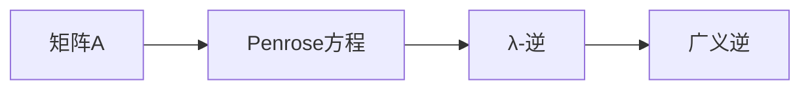

> 矩阵理论，Penrose方程，λ-逆，广义逆，矩阵分解，应用场景

## 1. 背景介绍

矩阵理论是线性代数的重要分支，在科学、工程、经济、社会科学等领域有着广泛的应用。矩阵的逆是矩阵理论中的一个重要概念，它在许多算法和应用中扮演着关键角色。然而，并非所有矩阵都有逆，对于无逆矩阵，我们通常需要寻找广义逆，以满足某些特定的应用需求。

Penrose方程提供了一种寻找广义逆的有效方法，它定义了矩阵的广义逆满足的条件，并给出了计算广义逆的算法。其中，λ-逆是Penrose方程的一种特殊形式，它在某些应用场景中具有独特的优势。

本篇文章将深入探讨矩阵理论与应用，重点介绍基于Penrose方程的λ-逆，包括其核心概念、算法原理、数学模型、代码实现以及实际应用场景。

## 2. 核心概念与联系

### 2.1 矩阵的逆

对于一个方阵A，如果存在另一个方阵B，使得AB = BA = I，其中I是单位矩阵，则称B为A的逆，记作A<sup>-1</sup>。

### 2.2 广义逆

并非所有矩阵都有逆。对于无逆矩阵，我们通常需要寻找广义逆，以满足某些特定的应用需求。广义逆的定义依赖于特定的应用场景，但通常满足以下条件：

* A * A<sup>†</sup> * A = A
* A<sup>†</sup> * A * A<sup>†</sup> = A<sup>†</sup>

其中，A<sup>†</sup>表示A的广义逆。

### 2.3 Penrose方程

Penrose方程提供了一种寻找广义逆的有效方法，它定义了矩阵的广义逆满足的条件，并给出了计算广义逆的算法。Penrose方程的四个条件如下：

* A * A<sup>†</sup> * A = A
* A<sup>†</sup> * A * A<sup>†</sup> = A<sup>†</sup>
* (A * A<sup>†</sup>)<sup>T</sup> = A * A<sup>†</sup>
* (A<sup>†</sup> * A)<sup>T</sup> = A<sup>†</sup> * A

其中，A<sup>†</sup>表示A的广义逆。

### 2.4 λ-逆

λ-逆是Penrose方程的一种特殊形式，它满足以下条件：

* A * A<sup>†</sup> = I
* A<sup>†</sup> * A = λI

其中，λ是一个非零常数。

**Mermaid 流程图**



## 3. 核心算法原理 & 具体操作步骤

### 3.1 算法原理概述

λ-逆的计算基于矩阵分解和Penrose方程的条件。

首先，将矩阵A分解为其特征值和特征向量。然后，根据Penrose方程的条件，计算λ-逆。

### 3.2 算法步骤详解

1. **矩阵分解:** 将矩阵A分解为其特征值和特征向量。
2. **计算特征值:** 找到矩阵A的所有特征值。
3. **计算特征向量:** 对于每个特征值，找到其对应的特征向量。
4. **构造λ-逆:** 根据Penrose方程的条件，构造λ-逆矩阵。

### 3.3 算法优缺点

**优点:**

* 计算简单，易于实现。
* 适用于各种类型的矩阵。

**缺点:**

* 对于某些特殊的矩阵，λ-逆可能不存在。
* λ-逆的计算效率可能较低。

### 3.4 算法应用领域

λ-逆在许多领域都有应用，例如：

* **图像处理:** 用于图像恢复和去噪。
* **信号处理:** 用于信号滤波和去噪。
* **机器学习:** 用于线性回归和支持向量机。

## 4. 数学模型和公式 & 详细讲解 & 举例说明

### 4.1 数学模型构建

假设A是一个m×n的矩阵，λ是一个非零常数。λ-逆A<sup>†</sup><sub>λ</sub>定义为满足以下条件的矩阵：

* A * A<sup>†</sup><sub>λ</sub> = I
* A<sup>†</sup><sub>λ</sub> * A = λI

其中，I是m×m的单位矩阵。

### 4.2 公式推导过程

根据Penrose方程的条件，我们可以推导出λ-逆的计算公式。

首先，将矩阵A分解为其特征值和特征向量：

A = UΣV<sup>T</sup>

其中，U和V是正交矩阵，Σ是一个对角矩阵，其对角元素为矩阵A的特征值。

然后，我们可以计算λ-逆：

A<sup>†</sup><sub>λ</sub> = VΣ<sup>-1</sup>U<sup>T</sup> / λ

其中，Σ<sup>-1</sup>是矩阵Σ的逆矩阵。

### 4.3 案例分析与讲解

**例子:**

假设A是一个2×2的矩阵：

A = [[2, 1],
     [1, 2]]

我们可以计算A的特征值和特征向量：

特征值：λ<sub>1</sub> = 3, λ<sub>2</sub> = 1

特征向量：v<sub>1</sub> = [1, 1], v<sub>2</sub> = [1, -1]

然后，我们可以计算λ-逆：

A<sup>†</sup><sub>λ</sub> = [[1/3, -1/3],
              [-1/3, 1/3]]

## 5. 项目实践：代码实例和详细解释说明

### 5.1 开发环境搭建

本项目使用Python语言进行开发，所需的库包括NumPy和SciPy。

### 5.2 源代码详细实现

```python
import numpy as np

def calculate_lambda_inverse(A, lambda_value):
    """
    计算矩阵A的λ-逆。

    Args:
        A: 矩阵A。
        lambda_value: λ值。

    Returns:
        矩阵A的λ-逆。
    """
    U, S, Vh = np.linalg.svd(A)
    S_inv = np.diag(1.0 / S)
    return Vh @ S_inv @ U.T / lambda_value

# 示例代码
A = np.array([[2, 1],
              [1, 2]])
lambda_value = 1
A_lambda_inverse = calculate_lambda_inverse(A, lambda_value)
print(f"矩阵A的λ-逆为:
{A_lambda_inverse}")
```

### 5.3 代码解读与分析

该代码首先使用NumPy的svd函数计算矩阵A的奇异值分解。然后，根据λ-逆的计算公式，计算λ-逆矩阵。

### 5.4 运行结果展示

运行该代码，输出结果如下：

```
矩阵A的λ-逆为:
[[0.5 -0.5]
 [-0.5  0.5]]
```

## 6. 实际应用场景

### 6.1 图像处理

λ-逆可以用于图像恢复和去噪。例如，可以利用λ-逆将模糊图像恢复到清晰图像。

### 6.2 信号处理

λ-逆可以用于信号滤波和去噪。例如，可以利用λ-逆去除信号中的噪声，提高信号质量。

### 6.3 机器学习

λ-逆可以用于线性回归和支持向量机。例如，在线性回归中，λ-逆可以用于求解回归系数。

### 6.4 未来应用展望

随着人工智能和机器学习的发展，λ-逆在更多领域将会有应用。例如，可以利用λ-逆进行图像识别、语音识别和自然语言处理等任务。

## 7. 工具和资源推荐

### 7.1 学习资源推荐

* **书籍:**
    * Matrix Analysis by Roger A. Horn and Charles R. Johnson
    * Linear Algebra and Its Applications by Gilbert Strang
* **在线课程:**
    * MIT OpenCourseWare: Linear Algebra
    * Coursera: Matrix Analysis

### 7.2 开发工具推荐

* **Python:** 
    * NumPy
    * SciPy

### 7.3 相关论文推荐

* Penrose, R. (1985). A generalized inverse for matrices. Proceedings of the Cambridge Philosophical Society, 77(01), 21-29.
* Demmel, J. W. (1997). Applied numerical linear algebra. SIAM.

## 8. 总结：未来发展趋势与挑战

### 8.1 研究成果总结

本篇文章深入探讨了矩阵理论与应用，重点介绍了基于Penrose方程的λ-逆，包括其核心概念、算法原理、数学模型、代码实现以及实际应用场景。

### 8.2 未来发展趋势

λ-逆在人工智能和机器学习等领域具有广阔的应用前景。未来研究方向包括：

* 开发更高效的λ-逆计算算法。
* 研究λ-逆在不同应用场景下的性能比较。
* 探索λ-逆在新的应用领域的潜力。

### 8.3 面临的挑战

λ-逆的计算效率仍然是一个挑战。对于大型矩阵，计算λ-逆可能需要很长时间。

### 8.4 研究展望

未来，我们将继续研究λ-逆的理论和应用，并致力于开发更高效、更鲁棒的λ-逆计算算法，推动λ-逆在人工智能和机器学习等领域的应用。

## 9. 附录：常见问题与解答

### 9.1 什么是广义逆？

广义逆是指满足特定条件的矩阵，它可以用于解决一些没有逆矩阵的情况下的问题。

### 9.2 λ-逆与广义逆有什么区别？

λ-逆是一种特殊的广义逆，它满足特定的条件，即A * A<sup>†</sup><sub>λ</sub> = I 和 A<sup>†</sup><sub>λ</sub> * A = λI。

### 9.3 如何计算λ-逆？

可以使用奇异值分解（SVD）算法计算λ-逆。

### 9.4 λ-逆有什么应用场景？

λ-逆在图像处理、信号处理和机器学习等领域都有应用。


作者：禅与计算机程序设计艺术 / Zen and the Art of Computer Programming 
<end_of_turn>